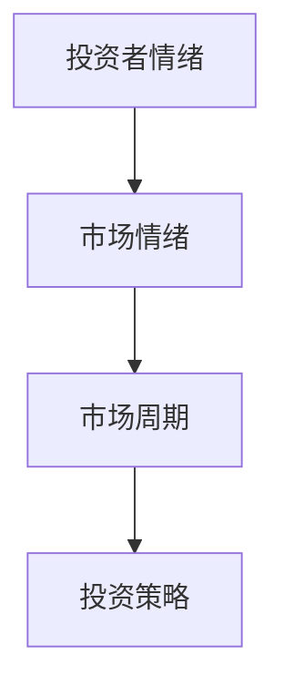
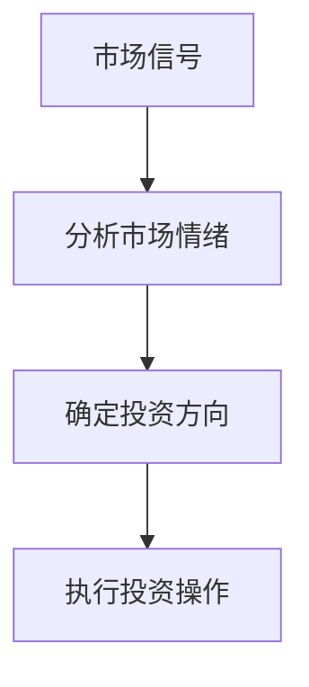
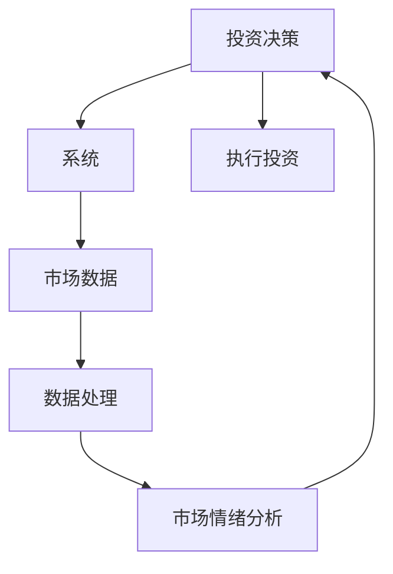
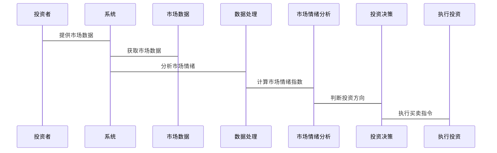

                 


# 彼得林奇的"反向思考"投资策略

> 关键词：反向思考，投资策略，市场情绪，彼得·林奇，逆向投资

> 摘要：本文深入探讨了彼得·林奇的反向思考投资策略，从背景、核心概念到算法原理和系统架构，详细解析了该策略在投资实践中的应用。通过具体案例分析和系统设计，帮助读者掌握如何在市场波动中利用反向思考策略实现投资收益的最大化。

---

## 第一部分: 彼得林奇的"反向思考"投资策略概述

### 第1章: 反向思考投资策略的背景与核心概念

#### 1.1 投资领域的传统思维方式

##### 1.1.1 传统投资策略的局限性
传统的投资策略往往依赖于市场趋势分析和基本面分析，但这些方法在面对市场波动和投资者情绪时显得力不从心。例如，当市场情绪高涨时，投资者可能过度乐观，导致资产价格虚高；而当市场情绪低落时，投资者可能过度悲观，导致资产价格被低估。传统策略难以捕捉这些情绪波动带来的投资机会。

##### 1.1.2 传统投资策略的核心问题
传统投资策略的核心问题在于其对市场情绪的敏感性。投资者容易受到市场波动的影响，做出非理性的决策，例如在市场高点买入，在市场低点卖出。这种行为违背了长期投资的基本原则。

##### 1.1.3 传统投资策略的边界与外延
传统投资策略的边界在于其对市场情绪的依赖。当市场情绪过于乐观或悲观时，传统策略往往失效。而其外延则包括对市场周期性波动和投资者心理特征的分析。

#### 1.2 反向思考投资策略的定义与特点

##### 1.2.1 反向思考的定义
反向思考是一种逆向投资策略，其核心思想是在市场情绪低落时买入，在市场情绪高涨时卖出。这种方法通过逆向操作，能够在市场波动中捕捉到低估和高估的机会。

##### 1.2.2 反向思考的核心特点
- **逆向操作**：在市场低谷时买入，在市场高点时卖出。
- **情绪分析**：通过分析市场情绪和投资者心理，判断市场的估值水平。
- **长期视角**：注重长期投资价值，而非短期市场波动。

##### 1.2.3 反向思考与传统投资策略的区别
| 特性       | 传统策略                     | 反向思考策略                 |
|------------|------------------------------|------------------------------|
| 投资时机   | 随市场波动                   | 逆市场波动                   |
| 风险控制   | 依赖市场趋势                 | 依赖市场情绪                 |
| 投资理念   | 追逐趋势                     | 逆向操作                     |

#### 1.3 反向思考投资策略的核心要素

##### 1.3.1 市场情绪分析
市场情绪分析是反向思考策略的核心，通过分析市场参与者的心理状态，判断市场的估值水平。例如，当市场情绪恐慌时，资产价格可能被低估，此时是买入的好时机。

##### 1.3.2 投资者心理特征
投资者心理特征是市场情绪的重要组成部分。例如，贪婪和恐惧是投资者在市场波动中常见的心理特征，这些心理特征会影响市场的买卖行为。

##### 1.3.3 市场周期性波动
市场周期性波动是反向思考策略的重要依据。通过分析市场的周期性波动，投资者可以更好地判断市场的估值水平，从而做出逆向投资决策。

### 第2章: 反向思考投资策略的核心原理

#### 2.1 市场情绪分析的数学模型

##### 2.1.1 市场情绪分析的公式推导
市场情绪可以通过投资者情绪指数和市场波动指数来衡量。公式如下：
$$ \text{市场情绪} = \frac{\text{投资者情绪指数}}{\text{市场波动指数}} $$

##### 2.1.2 投资者情绪指数的计算
投资者情绪指数可以通过市场成交额、投资者数量等指标来衡量。例如，当市场成交额大幅下降时，投资者情绪可能处于低点。

##### 2.1.3 市场波动指数的计算
市场波动指数可以通过波动率、标准差等指标来衡量。例如，市场波动率越高，市场情绪越不稳定。

#### 2.2 投资者心理特征的对比分析

##### 2.2.1 不同投资者心理特征对比表格
| 投资者类型 | 心理特征 | 行为特征 |
|------------|----------|----------|
| 理性投资者 | 理性决策 | 长期投资 |
| 情绪化投资者 | 追涨杀跌 | 短期波动 |

#### 2.3 市场周期性波动的ER实体关系图



### 第3章: 反向思考投资策略的算法原理

#### 3.1 反向思考策略的算法流程



#### 3.2 反向思考策略的数学模型

##### 3.2.1 投资决策公式

$$ \text{投资决策} = \begin{cases} 
\text{买入} & \text{如果市场情绪 < 阈值} \\
\text{卖出} & \text{如果市场情绪 > 阈值}
\end{cases} $$

#### 3.3 反向思考策略的实战案例

##### 3.3.1 2008年金融危机案例分析
在2008年金融危机期间，市场情绪极度恐慌，资产价格被严重低估。反向思考策略建议在市场低点买入，从而在市场复苏时获得超额收益。

##### 3.3.2 某行业周期性波动案例分析
以科技行业为例，当市场情绪高涨时，科技股价格被高估，反向思考策略建议卖出；当市场情绪低落时，科技股价格被低估，反向思考策略建议买入。

### 第4章: 反向思考投资策略的系统分析与架构设计

#### 4.1 系统功能设计

##### 4.1.1 领域模型


#### 4.2 系统架构设计



#### 4.3 系统接口设计

##### 4.3.1 系统输入接口
- 市场数据接口：接收市场价格、成交量等数据。
- 投资者情绪接口：接收投资者情绪指数。

##### 4.3.2 系统输出接口
- 投资决策接口：输出买入或卖出指令。
- 市场情绪报告接口：输出市场情绪分析报告。

#### 4.4 系统交互设计



---

## 第二部分: 项目实战与系统实现

### 第5章: 项目实战与系统实现

#### 5.1 项目环境安装

##### 5.1.1 系统需求
- 操作系统：Windows 10 或更高版本，或macOS 10.15 或更高版本。
- 开发工具：Python 3.8 或更高版本，Jupyter Notebook。
- 数据库：MySQL 5.7 或更高版本。

##### 5.1.2 依赖安装
```bash
pip install pandas numpy matplotlib seaborn
```

#### 5.2 系统核心实现源代码

##### 5.2.1 数据处理代码

```python
import pandas as pd
import numpy as np

# 读取市场数据
data = pd.read_csv('market_data.csv')

# 计算市场波动指数
def calculate_volatility(data):
    return data['价格'].std()

# 计算投资者情绪指数
def calculate_sentiment(data):
    return data['成交量'].mean()

# 分析市场情绪
def analyze_sentiment(volatility, sentiment):
    if volatility < 0.05 and sentiment < 1000:
        return '买入'
    elif volatility > 0.1 and sentiment > 2000:
        return '卖出'
    else:
        return '持有'

# 执行投资操作
def execute_trade(action):
    print(f"执行{action}操作")

# 主函数
def main():
    volatility = calculate_volatility(data)
    sentiment = calculate_sentiment(data)
    action = analyze_sentiment(volatility, sentiment)
    execute_trade(action)

if __name__ == "__main__":
    main()
```

##### 5.2.2 代码应用解读与分析
- 数据处理代码读取市场数据，并计算市场波动指数和投资者情绪指数。
- 分析市场情绪函数通过波动指数和情绪指数判断市场情绪，输出买入、卖出或持有指令。
- 执行投资操作函数根据市场情绪分析结果，执行相应的买卖指令。

#### 5.3 实际案例分析与详细讲解

##### 5.3.1 案例背景
假设我们有某行业的市场数据，包括价格和成交量。我们需要分析市场情绪，判断是否执行买卖操作。

##### 5.3.2 数据分析与处理
通过计算市场波动指数和投资者情绪指数，判断市场情绪。例如，当波动指数低于0.05且情绪指数低于1000时，市场情绪低落，建议买入。

##### 5.3.3 投资决策与结果
根据市场情绪分析结果，执行相应的买卖操作。例如，当市场情绪低落时买入，市场情绪高涨时卖出。

#### 5.4 项目小结

##### 5.4.1 项目总结
通过项目实战，我们验证了反向思考策略在实际投资中的有效性。通过系统化的数据处理和算法分析，我们可以更好地捕捉市场波动中的投资机会。

##### 5.4.2 项目经验
在实际项目中，需要注意数据的准确性和算法的稳定性。同时，需要根据市场环境和投资者心理特征，不断优化投资策略。

##### 5.4.3 项目启示
反向思考策略的成功实施，不仅需要扎实的数学和编程基础，还需要对市场情绪和投资者心理有深刻的理解。

---

## 第三部分: 最佳实践与总结

### 第6章: 最佳实践与总结

#### 6.1 最佳实践 tips

##### 6.1.1 数据选择与处理
- 数据来源要可靠，数据处理要准确。
- 数据分析要结合市场环境和投资者心理。

##### 6.1.2 算法优化与调整
- 根据市场环境和投资者心理特征，不断优化算法。
- 注意算法的稳定性和可扩展性。

##### 6.1.3 系统架构设计
- 系统架构要清晰，模块划分要合理。
- 注意系统的可维护性和可扩展性。

#### 6.2 小结

##### 6.2.1 核心内容总结
本文从背景、核心概念到算法原理和系统架构，详细解析了彼得·林奇的反向思考投资策略。通过具体案例分析和系统设计，帮助读者掌握如何在市场波动中利用反向思考策略实现投资收益的最大化。

##### 6.2.2 未来展望
未来，随着人工智能和大数据技术的发展，反向思考策略将更加智能化和自动化。投资者可以通过更加精准的市场情绪分析和投资者心理特征分析，优化投资决策。

#### 6.3 注意事项

##### 6.3.1 风险提示
- 市场情绪分析存在不确定性，投资决策需谨慎。
- 市场波动可能导致投资损失，需做好风险控制。

##### 6.3.2 投资者心理特征
- 投资者需保持理性，避免情绪化决策。
- 投资者需长期关注市场，避免短期波动影响投资决策。

#### 6.4 拓展阅读

##### 6.4.1 推荐书籍
- 《彼得·林奇的成功投资》
- 《投资学原理》

##### 6.4.2 推荐博客
- 彼得·林奇投资博客
- 量化投资博客

---

## 作者：AI天才研究院/AI Genius Institute & 禅与计算机程序设计艺术/Zen And The Art of Computer Programming

---

**本文通过详细分析彼得·林奇的反向思考投资策略，从理论到实践，为投资者提供了一种全新的投资思路。通过系统的数学模型和算法设计，结合具体案例分析，帮助读者更好地理解和应用反向思考策略。未来，随着技术的进步，反向思考策略将更加智能化和自动化，为投资者创造更多的价值。**

