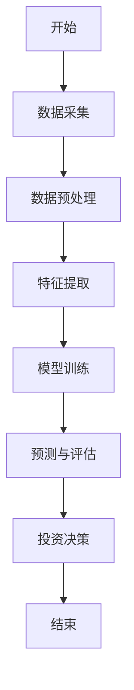
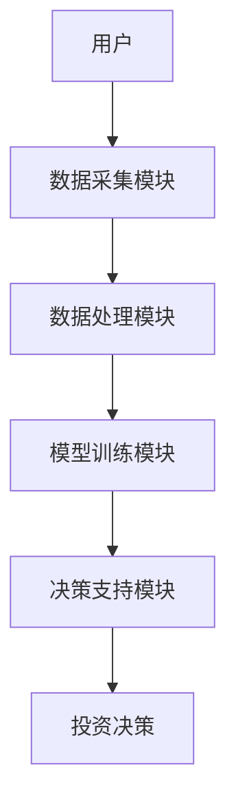

                 


# 彼得林奇的"反向投资"在传统行业数字化转型中的机会识别

> 关键词：反向投资、数字化转型、机会识别、彼得林奇、传统行业、投资策略、技术博客  
> 摘要：本文探讨了彼得林奇的反向投资策略在传统行业数字化转型中的应用，通过分析机会识别的核心概念、算法原理、系统架构设计以及实际案例，为读者提供一种新的视角来理解如何在数字化转型中寻找投资机会。

---

## 第一部分：引言

### 第1章：背景介绍

#### 1.1 反向投资的定义与特点
反向投资是一种投资策略，强调在市场低迷时买入，在市场繁荣时卖出。其核心理念是“逆市场而行”，通过识别市场非理性行为来捕捉投资机会。反向投资的成功关键在于对市场周期的深刻理解和对基本面的深入分析。

#### 1.2 数字化转型的定义与趋势
数字化转型是指利用数字技术（如人工智能、大数据、云计算等）对传统行业进行业务模式、运营流程和组织结构的变革，以提升效率、降低成本并创造新的价值。当前，数字化转型已成为企业生存和发展的关键能力，传统行业正在加速拥抱数字化。

#### 1.3 反向投资与数字化转型的结合
在数字化转型的背景下，反向投资策略可以帮助投资者识别那些在技术变革中被市场低估的传统行业机会。这些行业可能因数字化转型的初期阶段尚未被市场充分认知，从而为投资者提供了低位买入的良机。

---

## 第二部分：机会识别的核心概念与联系

### 第2章：机会识别的理论框架

#### 2.1 机会识别的核心概念
机会识别是反向投资中的关键步骤，它依赖于对市场趋势、行业动态和企业基本面的综合分析。通过识别市场低估的行业或企业，投资者可以在数字化转型中找到潜在的高增长机会。

#### 2.2 反向投资与数字化转型的关系
- **反向投资的周期性**：反向投资的成功依赖于市场周期的波动，而数字化转型带来的技术变革加剧了行业的波动性。
- **数字化转型的机会**：数字化转型为传统行业带来了新的增长点，但这些机会往往在市场初期阶段被低估，为反向投资者提供了介入的机会。

### 第3章：核心概念与联系

#### 3.1 核心概念对比
| 概念 | 反向投资 | 数字化转型 |
|------|----------|------------|
| 定义 | 在市场低迷时买入，市场繁荣时卖出 | 利用数字技术改变传统行业的业务模式和运营流程 |
| 目标 | 捕捉市场低估的机会 | 提升效率、降低成本、创造新价值 |
| 驱动因素 | 市场情绪、周期性波动 | 技术进步、政策支持、市场需求 |

#### 3.2 实体关系图
```mermaid
erd
    entity 反向投资机会识别 {
        id
        投资标的
        市场阶段
        企业基本面
        数字化转型程度
    }
    entity 市场周期 {
        阶段
        市场情绪
        投资者行为
    }
    entity 企业数字化能力 {
        技术应用
        数字化战略
        运营效率
    }
    反向投资机会识别 -[1..n]-> 市场周期
    反向投资机会识别 -[1..n]-> 企业数字化能力
```

---

## 第三部分：算法原理与系统设计

### 第4章：机会识别的算法原理

#### 4.1 算法选择
基于时间序列分析的反向投资机会识别模型，结合行业数字化转型的特征，通过预测市场波动和行业趋势来识别投资机会。

#### 4.2 算法流程


#### 4.3 数学模型
时间序列预测模型（ARIMA）：
$$ ARIMA(p, d, q) $$
其中，p为自回归阶数，d为差分阶数，q为移动平均阶数。

#### 4.4 代码实现
```python
from statsmodels.tsa.arima_model import ARIMA
import pandas as pd
import numpy as np

# 数据加载与预处理
data = pd.read_csv('market_data.csv')
data = data['close_price'].values

# 模型训练
model = ARIMA(data, order=(5, 1, 0))
model_fit = model.fit()

# 预测
forecast = model_fit.forecast(steps=10)
```

---

### 第5章：系统分析与架构设计

#### 5.1 系统功能设计
- 数据采集模块：采集市场数据和行业数字化转型数据。
- 数据处理模块：清洗、转换和存储数据。
- 模型训练模块：基于机器学习算法训练机会识别模型。
- 决策支持模块：提供投资决策支持。

#### 5.2 系统架构设计


---

## 第四部分：项目实战与案例分析

### 第6章：项目实战

#### 6.1 环境安装
```bash
pip install statsmodels pandas numpy
```

#### 6.2 核心代码实现
```python
import pandas as pd
from statsmodels.tsa.arima_model import ARIMA

# 数据加载
data = pd.read_csv('market_data.csv')

# 训练模型
model = ARIMA(data['close_price'], order=(5, 1, 0))
model_fit = model.fit()

# 预测
forecast = model_fit.forecast(steps=10)
print(forecast)
```

#### 6.3 实际案例分析
以制造业为例，分析数字化转型中的反向投资机会。通过模型预测，识别那些在数字化转型初期阶段被市场低估的制造业企业，作为反向投资的目标。

---

## 第五部分：最佳实践与结语

### 第7章：最佳实践

#### 7.1 投资策略 tips
- 关注行业数字化转型的初期阶段。
- 结合基本面分析和技术分析。
- 定期评估模型的准确性。

#### 7.2 小结
本文通过分析反向投资策略与数字化转型的结合，为投资者提供了一种新的机会识别方法。通过算法模型和系统设计，帮助投资者在传统行业中找到潜在的高增长机会。

#### 7.3 注意事项
- 数据质量：确保数据的准确性和完整性。
- 模型选择：根据实际情况选择合适的算法。
- 风险控制：合理分散投资风险。

#### 7.4 拓展阅读
- 彼得林奇的《聪明的投资者》
- 数字化转型相关的技术书籍

---

## 结语

彼得林奇的反向投资策略为传统行业数字化转型中的机会识别提供了新的视角。通过结合算法模型和系统设计，投资者可以在市场波动中找到潜在的投资机会，实现长期收益。

作者：AI天才研究院/AI Genius Institute & 禅与计算机程序设计艺术/Zen And The Art of Computer Programming

