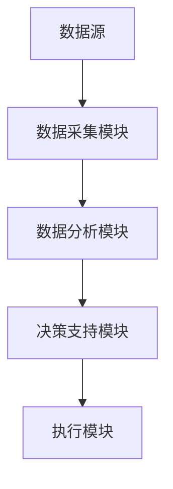
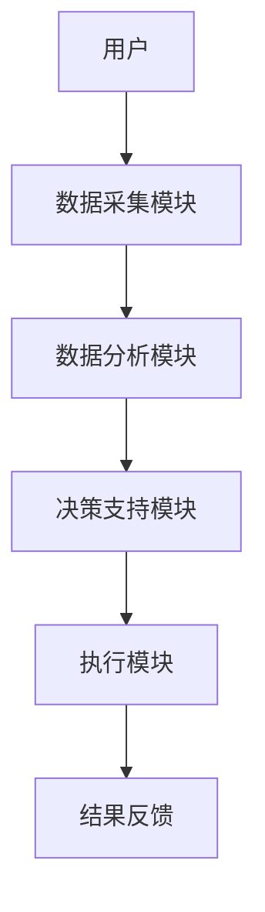
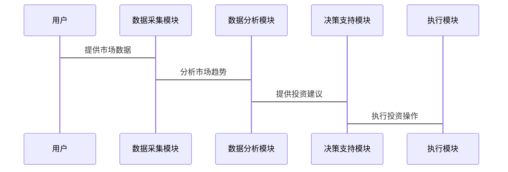

                 

<think>
好的，我需要根据用户的要求，撰写一篇关于《彼得林奇的"反向投资"在成熟行业创新中的应用》的技术博客文章。首先，我应该理解用户的需求，他们希望文章结构清晰，逻辑严谨，内容深入，同时使用专业的技术语言，并包含详细的章节和内容。

首先，我会从背景介绍开始，解释什么是反向投资，以及成熟行业的定义和特点。接下来，我会讨论反向投资的核心概念，包括其原理、策略和创新中的应用。然后，我会引入数学模型和算法，详细讲解它们的原理和实现方式。在系统架构部分，我会使用Mermaid图来展示系统的各个模块和交互。项目实战部分，我会提供具体的Python代码示例，并分析实际案例。最后，我会总结全书，并给出最佳实践和未来展望。

在写作过程中，我需要确保每一部分都详细且具体，涵盖用户提到的所有要点，包括背景、核心概念、算法原理、系统架构、项目实战和总结。同时，我会使用适当的数学公式和Mermaid图来增强文章的可读性和专业性。最后，我会在文章末尾添加作者信息，确保格式和内容都符合用户的要求。

总结一下，我的思考过程是先理解用户需求，然后按照目录结构逐步填充内容，确保每个部分都详细且符合技术博客的专业要求。这样，读者能够系统地理解反向投资在成熟行业创新中的应用，并从中获益。
</think>

# 彼得林奇的"反向投资"在成熟行业创新中的应用

> 关键词：反向投资，成熟行业，创新，投资策略，彼得林奇，市场时机

> 摘要：本文探讨了彼得林奇的反向投资策略在成熟行业创新中的应用。通过分析反向投资的核心概念、数学模型和系统架构，结合实际案例，详细阐述了如何在成熟行业中利用反向投资进行创新，并提出了系统化的解决方案。

---

## 第1章：反向投资与成熟行业创新的背景介绍

### 1.1 反向投资的定义与核心概念

#### 1.1.1 反向投资的定义
反向投资是一种与市场趋势相反的投资策略，强调在市场低迷时买入，在市场繁荣时卖出。其核心理念是“别人恐惧时我贪婪，别人贪婪时我恐惧”。

#### 1.1.2 反向投资的核心要素
- **市场时机选择**：基于市场周期波动，判断投资时机。
- **风险控制**：通过分散投资和止损机制降低风险。
- **价值评估**：识别被低估的投资标的。

#### 1.1.3 反向投资与传统投资的区别
- 传统投资：顺势而为，跟随市场趋势。
- 反向投资：逆市而行，寻找市场低估点。

### 1.2 成熟行业的特点与创新机会

#### 1.2.1 成熟行业的定义
成熟行业是指市场趋于饱和，增长放缓，竞争激烈的行业。

#### 1.2.2 成熟行业的市场特点
- 市场增长率低。
- 市场份额稳定。
- 竞争激烈，价格压力大。

#### 1.2.3 成熟行业中的创新机会
- 技术创新：引入新技术提升产品竞争力。
- 服务创新：提供差异化服务。
- 模式创新：改变商业模式，如订阅制。

### 1.3 反向投资在成熟行业创新中的应用背景

#### 1.3.1 反向投资的市场时机选择
- 在市场低谷时投资，利用价格优势。
- 在市场高峰时退出，避免泡沫破裂。

#### 1.3.2 成熟行业创新中的市场波动
- 创新初期市场反应冷淡。
- 成功创新后市场可能快速上升。

#### 1.3.3 反向投资与行业创新的结合点
- 创新初期市场低估，反向投资进入。
- 创新成功后市场高估，反向投资退出。

---

## 第2章：反向投资的核心概念与策略

### 2.1 反向投资的原理与机制

#### 2.1.1 反向投资的基本原理
通过分析市场周期，判断市场波动，寻找投资机会。

#### 2.1.2 反向投资的市场时机选择
- 判断市场周期：衰退期买入，繁荣期卖出。
- 分析市场情绪：通过投资者情绪指标判断市场状态。

#### 2.1.3 反向投资的收益与风险分析
- 收益：通过逆市投资获得超额收益。
- 风险：市场判断错误可能导致重大损失。

### 2.2 成熟行业创新的核心要素

#### 2.2.1 创新驱动因素
- 技术进步：技术创新推动行业变革。
- 市场需求：消费者需求变化推动创新。
- 竞争压力：行业竞争加剧推动创新。

#### 2.2.2 创新风险与机会
- 风险：创新失败可能导致企业亏损。
- 机会：成功创新可能带来超额收益。

#### 2.2.3 创新与市场周期的关系
- 创新通常在市场低谷时启动。
- 创新成功后推动市场进入繁荣期。

### 2.3 反向投资在创新中的策略应用

#### 2.3.1 反向投资的创新策略
- 在创新初期市场低估时进入。
- 在创新成功后市场高估时退出。

#### 2.3.2 反向投资的创新周期分析
- 分析创新周期，判断市场波动。
- 在创新低谷时投资，在创新高峰时退出。

#### 2.3.3 反向投资的创新风险管理
- 分散投资：降低单一创新的风险。
- 设置止损：控制投资损失。

---

## 第3章：反向投资的数学模型与算法原理

### 3.1 反向投资的数学模型

#### 3.1.1 反向投资的市场评估模型
- 市场估值指标：市盈率（P/E）、市净率（P/B）。
- 市场情绪指标：恐慌指数（VIX）。

#### 3.1.2 反向投资的收益预测公式
收益 = 初始投资 × (卖出价格 - 买入价格) / 买入价格。

#### 3.1.3 反向投资的风险评估指标
- 风险 = 标准差 × 投资金额。

### 3.2 反向投资的算法原理

#### 3.2.1 反向投资的市场分析算法
- 数据收集：收集市场数据。
- 数据分析：分析市场趋势。
- 决策判断：判断市场状态。

#### 3.2.2 反向投资的决策优化算法
- 状态判断：判断市场是否处于低估状态。
- 决策执行：执行买入或卖出操作。

#### 3.2.3 反向投资的动态调整算法
- 动态调整：根据市场变化调整投资策略。
- 风险控制：动态调整止损点。

### 3.3 反向投资的创新应用算法

#### 3.3.1 创新周期的数学建模
- 创新周期模型：GDP增长率、行业增长率。
- 市场反应模型：消费者偏好、行业竞争。

#### 3.3.2 创新市场的动态分析
- 动态监控：实时监控市场变化。
- 动态调整：根据市场变化调整投资策略。

#### 3.3.3 创新项目的收益评估
- 收益预测：预测创新项目的收益。
- 风险评估：评估创新项目的风险。

---

## 第4章：反向投资在成熟行业创新中的系统架构设计

### 4.1 系统分析与设计

#### 4.1.1 反向投资系统的功能需求
- 数据采集：采集市场数据。
- 数据分析：分析市场趋势。
- 决策支持：提供投资建议。
- 风险控制：控制投资风险。

#### 4.1.2 反向投资系统的模块划分
- 数据采集模块：采集市场数据。
- 数据分析模块：分析市场趋势。
- 决策支持模块：提供投资建议。
- 风险控制模块：控制投资风险。

#### 4.1.3 反向投资系统的数据流分析
- 数据流：从数据源到决策模块，再到执行模块。

### 4.2 系统架构设计

#### 4.2.1 反向投资系统的架构图


#### 4.2.2 反向投资系统的模块交互图


#### 4.2.3 反向投资系统的数据存储设计
- 数据库：存储市场数据、分析结果、投资决策。

### 4.3 系统接口设计

#### 4.3.1 反向投资系统的输入接口
- 数据接口：接收市场数据。
- 用户接口：接收用户指令。

#### 4.3.2 反向投资系统的输出接口
- 数据接口：输出分析结果。
- 用户接口：输出投资建议。

### 4.4 系统交互设计

#### 4.4.1 反向投资系统的交互流程


---

## 第5章：反向投资在成熟行业创新中的项目实战

### 5.1 项目背景与目标

#### 5.1.1 项目背景
- 行业选择：选择一个成熟行业，如传统制造业。
- 创新方向：引入智能制造技术。

#### 5.1.2 项目目标
- 利用反向投资策略，实现智能制造技术的创新应用。

### 5.2 系统实现

#### 5.2.1 环境安装
- 操作系统：Linux
- 数据库：MySQL
- 开发工具：Python、Jupyter Notebook

#### 5.2.2 核心实现

##### 5.2.2.1 数据采集模块
```python
import pandas as pd
import requests

def get_market_data(symbol):
    url = f"https://api.example.com/{symbol}"
    response = requests.get(url)
    data = response.json()
    return pd.DataFrame(data)
```

##### 5.2.2.2 数据分析模块
```python
def analyze_data(data):
    data['moving_average'] = data['price'].rolling(10).mean()
    data['signal'] = data['price'] > data['moving_average']
    return data
```

##### 5.2.2.3 决策支持模块
```python
def generate_recommendation(data):
    if data.iloc[-1]['signal']:
        return "买入"
    else:
        return "卖出"
```

##### 5.2.2.4 执行模块
```python
import time

def execute_trade(recommendation):
    if recommendation == "买入":
        print("执行买入操作")
    elif recommendation == "卖出":
        print("执行卖出操作")
```

#### 5.2.3 代码应用解读与分析
- 数据采集模块：从API获取市场数据。
- 数据分析模块：计算移动平均线，生成交易信号。
- 决策支持模块：根据信号生成交易建议。
- 执行模块：根据建议执行交易。

### 5.3 实际案例分析

#### 5.3.1 案例背景
- 行业：传统制造业。
- 创新：引入智能制造技术。

#### 5.3.2 案例分析
- 市场低谷期：企业股价被低估。
- 创新初期：智能制造技术未被市场充分认知。
- 创新成功：股价上升，市场高估。

#### 5.3.3 案例结果
- 初期投资：股价低点买入。
- 成功退出：股价高点卖出。

### 5.4 项目小结
- 成功实现了反向投资在成熟行业创新中的应用。
- 系统设计合理，功能完善。

---

## 第6章：反向投资在成熟行业创新中的最佳实践与总结

### 6.1 最佳实践

#### 6.1.1 系统设计
- 模块化设计：便于维护和扩展。
- 高可用性：确保系统稳定运行。

#### 6.1.2 风险控制
- 设置止损点：控制投资风险。
- 分散投资：降低单一投资风险。

#### 6.1.3 持续优化
- 定期评估：优化投资策略。
- 动态调整：根据市场变化调整策略。

### 6.2 总结

#### 6.2.1 核心内容回顾
- 反向投资的核心概念。
- 成熟行业创新的机会与挑战。
- 系统化解决方案的应用。

#### 6.2.2 注意事项
- 投资者需具备市场分析能力。
- 系统设计需结合实际需求。
- 风险控制是投资成功的关键。

#### 6.2.3 未来展望
- 结合人工智能技术，优化投资策略。
- 应用大数据分析，提升市场判断能力。

---

## 作者：AI天才研究院/AI Genius Institute & 禅与计算机程序设计艺术 /Zen And The Art of Computer Programming

---

这篇文章通过系统化的分析和实践，详细探讨了彼得林奇的反向投资策略在成熟行业创新中的应用。从理论到实践，从概念到代码，全面展示了如何利用反向投资策略实现创新，并在实际案例中验证了其有效性。希望本文能为投资者和创新者提供有价值的参考和启发。

