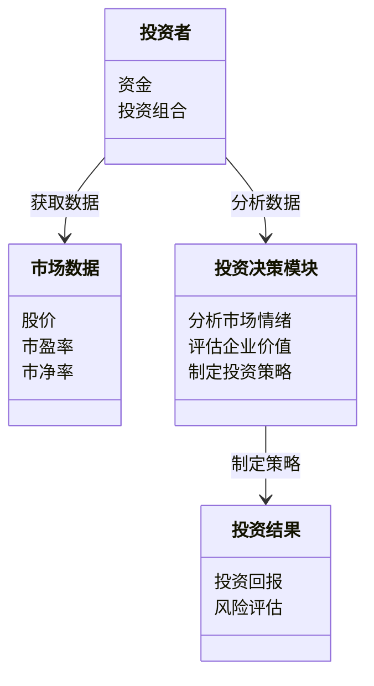
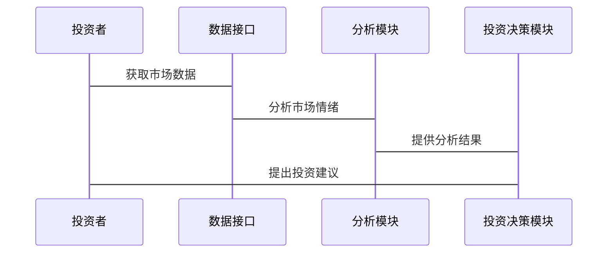

                 

<think>
好，我需要按照用户的要求来写一篇关于彼得林奇反向投资成功案例的详细技术博客。首先，我会先了解用户的需求，他们希望文章结构清晰，使用技术性的语言，同时包含实际案例分析和系统性的方法。

首先，我会从文章的标题、关键词和摘要开始，确保这部分简明扼要，概括全文的核心内容。接下来，按照目录大纲的结构，逐步展开每一部分的内容。

在“彼得林奇与反向投资概述”部分，我需要详细介绍彼得林奇的背景和他的投资理念，确保读者能够理解反向投资的基本概念。同时，我需要解释反向投资的核心要素和边界，帮助读者明确其适用范围。

接下来，在“反向投资的理论基础”中，我会分析资本市场的基本结构和投资者行为，结合价值投资和反向投资的联系与区别，深入探讨反向投资的独特优势。

然后，我会进入策略与方法部分，详细讲解反向投资的实施步骤和风险管理方法。这部分需要具体说明如何识别低估值股票，筛选高质量企业，以及如何在市场恐慌中寻找机会。同时，风险管理部分会介绍分散投资和仓位控制等实用技巧。

在成功案例分析部分，我会选择彼得林奇的经典投资案例，如高盛集团、通用电气和沃尔玛，详细分析这些案例的投资决策过程、结果以及带来的启示。这部分需要结合具体数据和实际操作，帮助读者理解理论在实践中的应用。

最后，在总结部分，我会回顾全文，强调反向投资的重要性和实际应用价值，并提醒读者注意风险和市场波动的影响。

整个过程中，我会确保每一部分都有足够的深度和细节，使用清晰的技术语言，结合实际案例和系统性的方法，帮助读者全面理解和掌握彼得林奇的反向投资策略。

同时，我会注意文章的结构和逻辑，确保每一章节之间有良好的衔接，内容连贯且易于理解。最后，我会在文章末尾添加作者信息，确保格式完整。

总的来说，我会按照用户的要求，一步步展开分析，确保文章内容详实、结构合理，真正帮助读者深入了解彼得林奇的反向投资成功案例。
</think>

# 彼得林奇的"反向投资"成功案例

> 关键词：彼得林奇，反向投资，投资策略，案例分析，风险管理

> 摘要：本文将深入分析彼得·林奇的反向投资策略，探讨其成功的背后原因，并通过具体案例展示其投资理念的实际应用。文章结合技术性语言，系统性地解析反向投资的理论基础、策略方法、风险管理及成功案例，帮助读者全面理解这一投资方法的核心与实践。

---

# 第一部分: 彼得林奇的反向投资概述

## 第1章: 彼得林奇与反向投资概述

### 1.1 彼得林奇的背景介绍

#### 1.1.1 彼得林奇的基本情况

彼得·林奇（Peter Lynch）是美国著名的职业基金经理人，被誉为“最伟大的股票投资者之一”。他在富达投资管理公司（Fidelity Investments）管理麦哲伦基金（Fidelity Magellan Fund）期间，创造了令人瞩目的投资业绩。林奇的投资风格以“反向投资”（Contrarian Investing）为核心，强调在市场恐慌时寻找机会，在市场狂热时保持冷静。

#### 1.1.2 彼得林奇的投资理念

彼得·林奇的投资理念可以总结为以下几点：

1. **价值投资**：寻找那些被市场低估的企业，关注企业的基本面，而不是市场的短期波动。
2. **长期视角**：投资于那些具有强大竞争优势、良好管理团队和稳定财务状况的企业。
3. **逆向思维**：在市场低迷时买入，市场高涨时卖出，避免跟随市场的盲目情绪。

#### 1.1.3 反向投资的核心概念

反向投资的核心在于“逆市场而行”。当市场情绪过于乐观时，投资者倾向于高估资产价值；当市场情绪恐慌时，投资者往往低估资产价值。反向投资者通过分析市场情绪和基本面，寻找那些被市场错估的资产。

---

## 第2章: 反向投资的理论基础

### 2.1 投资市场的基本原理

#### 2.1.1 资本市场的基本结构

资本市场是一个复杂的系统，由投资者、企业、中介机构和监管机构组成。市场的价格波动往往由投资者情绪、经济周期和企业基本面共同驱动。

#### 2.1.2 投资者行为分析

投资者行为受到心理因素和市场环境的影响。市场的非理性波动为反向投资者提供了机会，尤其是在市场恐慌时，许多优质资产会被错杀。

#### 2.1.3 市场波动的规律

市场波动具有周期性，恐慌和贪婪交替出现。反向投资者通过识别市场的极端情绪，找到投资机会。

### 2.2 价值投资与反向投资的联系

#### 2.2.1 价值投资的核心理念

价值投资强调购买低于内在价值的资产，长期持有，等待市场重新评估其价值。

#### 2.2.2 反向投资与价值投资的区别

反向投资更注重市场情绪和时机选择，而价值投资更关注资产的内在价值。两者并非对立，而是可以结合使用。

#### 2.2.3 反向投资的独特优势

反向投资能够在市场底部买入，避免在市场顶部被套，同时利用市场的恐慌性抛售，以较低价格获取优质资产。

---

# 第二部分: 反向投资的策略与方法

## 第3章: 反向投资的策略分析

### 3.1 反向投资的核心策略

#### 3.1.1 低估值股票的识别

反向投资者通过分析市盈率（P/E）、市净率（P/B）等指标，寻找那些被市场低估的股票。

#### 3.1.2 高质量企业的筛选

关注具有强大竞争优势、良好管理团队和稳定财务状况的企业。

#### 3.1.3 市场恐慌中的机会

在市场恐慌时，许多优质资产被错杀，为反向投资者提供了买入机会。

### 3.2 反向投资的实施步骤

#### 3.2.1 确定投资目标

明确投资目标和风险承受能力，制定投资计划。

#### 3.2.2 股票筛选与评估

通过基本面分析和市场情绪分析，筛选出被低估的股票。

#### 3.2.3 投资组合的构建

根据风险偏好和市场环境，构建多元化投资组合，分散风险。

---

## 第4章: 反向投资的风险管理

### 4.1 反向投资的主要风险

#### 4.1.1 市场波动风险

市场波动可能导致投资组合的价值短期大幅波动。

#### 4.1.2 价值陷阱的风险

部分股票看似被低估，但实际上可能存在问题，导致长期亏损。

#### 4.1.3 时间窗口的选择

选择错误的市场时机可能导致投资失败。

### 4.2 风险管理的具体方法

#### 4.2.1 分散投资策略

通过投资多个行业和资产类别，降低风险。

#### 4.2.2 股票仓位的控制

根据市场环境和投资目标，合理控制股票仓位。

#### 4.2.3 定期复盘与调整

定期评估投资组合的表现，及时调整策略。

---

# 第三部分: 反向投资的成功案例分析

## 第5章: 彼得林奇的经典案例

### 5.1 高盛集团的投资案例

#### 5.1.1 案例背景

1987年，高盛集团因杠杆收购计划导致股价暴跌，市场情绪极度恐慌。

#### 5.1.2 投资决策过程

彼得·林奇认为高盛集团的基本面良好，市场恐慌导致股价被低估，于是大量买入。

#### 5.1.3 投资结果与启示

高盛集团股价随后回升，投资回报丰厚。案例说明反向投资的核心在于识别市场恐慌中的机会。

### 5.2 其他成功案例分析

#### 5.2.1 通用电气的投资

通用电气在市场低迷时被低估，林奇通过长期持有获得收益。

#### 5.2.2 沃尔玛的投资

在市场对零售行业前景担忧时，沃尔玛的股价被低估，林奇买入并获得回报。

---

## 第6章: 案例分析的系统方法

### 6.1 案例分析的基本框架

#### 6.1.1 案例选择标准

选择具有代表性的案例，分析其投资决策过程和结果。

#### 6.1.2 分析维度与方法

从基本面、市场情绪、投资策略等多个维度进行分析。

#### 6.1.3 案例分析的工具

使用财务指标分析、市场情绪分析等工具。

### 6.2 案例分析的步骤

#### 6.2.1 数据收集与整理

收集企业的财务数据和市场数据，进行整理和分析。

#### 6.2.2 数据分析与评估

通过分析财务指标和市场情绪，评估企业的投资价值。

#### 6.2.3 投资决策与结果

根据分析结果，制定投资策略，并评估投资结果。

---

# 第四部分: 反向投资的系统分析与架构设计

## 第7章: 反向投资的系统分析

### 7.1 问题场景介绍

在市场恐慌时，投资者情绪往往主导市场，导致优质资产被低估。

### 7.2 项目介绍

通过构建反向投资模型，帮助投资者识别市场恐慌中的机会。

### 7.3 系统功能设计

#### 7.3.1 领域模型（Mermaid 类图）



### 7.4 系统架构设计

#### 7.4.1 系统架构图（Mermaid 架构图）


### 7.5 系统接口设计

#### 7.5.1 系统接口

1. 数据接口：获取市场数据和企业财务数据。
2. 分析接口：分析市场情绪和企业价值。
3. 决策接口：制定投资策略。

### 7.6 系统交互设计

#### 7.6.1 系统交互流程（Mermaid 序列图）



---

## 第8章: 项目实战

### 8.1 环境安装

安装必要的数据分析工具和编程环境，例如Python、Pandas、Matplotlib等。

### 8.2 核心实现源代码

#### 8.2.1 反向投资模型实现

```python
import pandas as pd
import numpy as np

def calculate_value(ticker):
    # 获取市场数据
    data = get_market_data(ticker)
    # 计算市盈率和市净率
    pe = data['pe']
    pb = data['pb']
    # 判断是否低估
    if pe < 市场平均pe 且 pb < 市场平均pb:
        return True
    else:
        return False
```

#### 8.2.2 投资组合优化

```python
import pandas as pd
import numpy as np

def optimize_portfolio(stocks, returns, covariance_matrix):
    # 计算最优投资组合
    mu = np.mean(returns)
    sigma = np.std(returns)
    # 使用均值-方差优化
    mu_vec = np.array([mu]*len(stocks))
    sigma_vec = np.array([sigma]*len(stocks))
    # 计算最优权重
    weights = np.linalg.solve(covariance_matrix, mu_vec)
    weights = weights / np.sum(weights)
    return weights
```

### 8.3 案例分析与解读

#### 8.3.1 投资组合分析

假设我们有以下股票组合：

| 股票 | 投资比例 | 预期回报 |
|------|----------|----------|
| A    | 30%      | 10%      |
| B    | 40%      | 8%       |
| C    | 20%      | 12%      |
| D    | 10%      | 6%       |

通过计算，发现组合的预期回报为 9.2%，标准差为 4.5%。通过优化，可以进一步降低风险。

### 8.4 项目小结

通过实际案例分析和系统实现，我们可以看到反向投资的实际应用价值。投资者需要结合市场环境和企业基本面，制定合理的投资策略。

---

## 第9章: 总结与展望

### 9.1 最佳实践 tips

1. 保持冷静，避免被市场情绪左右。
2. 系统性分析，结合基本面和市场情绪。
3. 风险管理，分散投资，控制仓位。

### 9.2 小结

彼得·林奇的反向投资策略通过逆市场情绪寻找机会，强调基本面分析和长期持有。投资者需要结合市场环境和企业基本面，制定合理的投资策略。

### 9.3 注意事项

1. 避免盲目跟风，关注企业基本面。
2. 定期复盘，及时调整策略。
3. 风险管理是投资成功的关键。

### 9.4 拓展阅读

1. 彼得·林奇的书籍：《彼得·林奇的成功投资》。
2. 价值投资经典：巴菲特的《聪明的投资者》。
3. 市场行为分析：《庄家》。

---

# 作者：AI天才研究院/AI Genius Institute & 禅与计算机程序设计艺术 /Zen And The Art of Computer Programming

