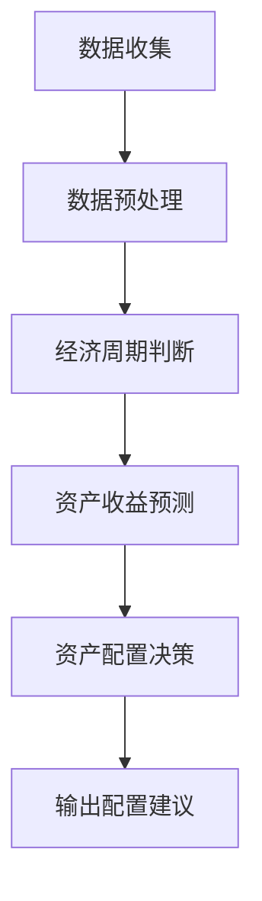
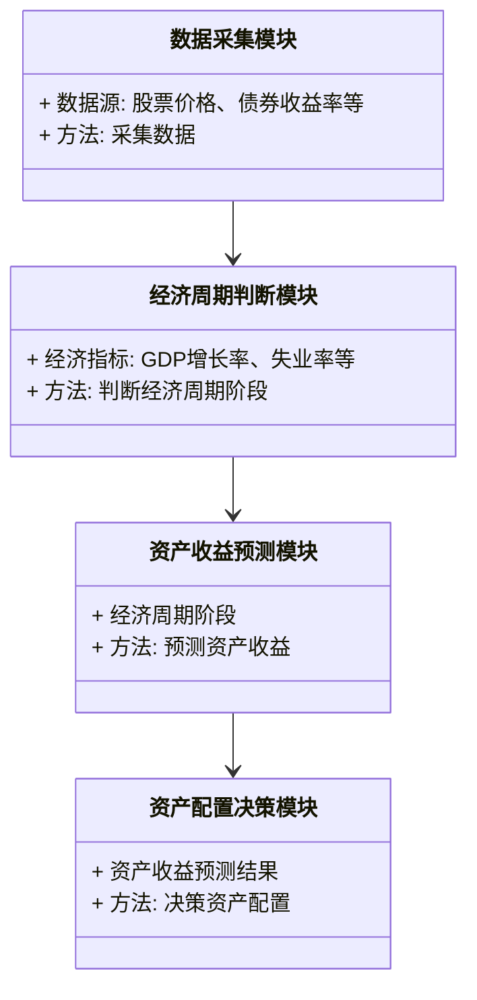
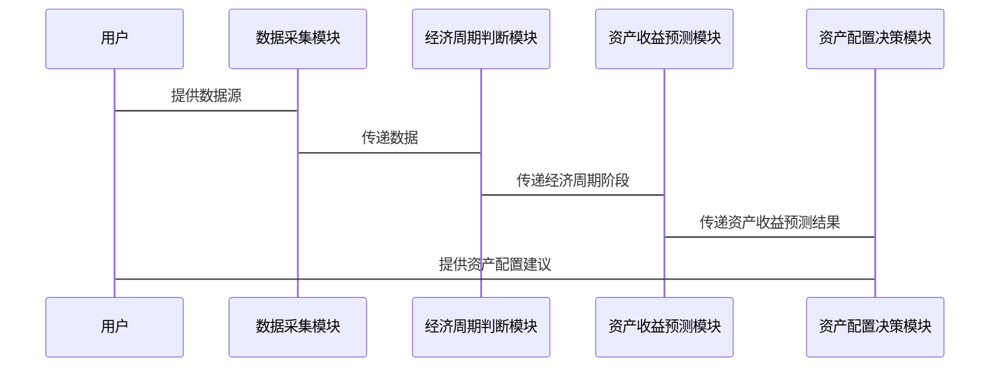

                 

<think>
好的，我需要撰写一篇关于彼得·林奇反周期投资在不同资产类别间轮动的博客文章。首先，我需要理解反周期投资的基本概念和彼得林奇的投资策略。反周期投资是指在市场低谷期投资，期望在市场复苏时获得收益。彼得林奇以其成功的投资策略闻名，尤其是他在寻找被市场低估的股票方面有着独到的见解。

接下来，我需要了解不同资产类别，如股票、债券、基金等，它们在不同经济周期下的表现特点。例如，在经济衰退期间，债券通常表现较好，而股票可能价格被低估，为投资者提供了买入的机会。

然后，我需要探讨资产轮动的策略。资产轮动是指投资者根据市场趋势和经济周期的变化，将资金从表现不佳的资产转移到表现较好的资产。在反周期投资中，这可能意味着在市场低迷时投资股票或房地产，在市场繁荣时转向债券或其他资产。

我还需要分析彼得林奇的选股标准，包括公司基本面分析、低估值等因素。这些标准如何帮助投资者在反周期投资中选择合适的资产类别进行配置。

接下来，我需要构建一个数学模型，用于量化不同资产类别在不同经济周期下的表现。这可能涉及风险调整后的收益计算、市盈率、市净率等指标的分析。

为了进一步深入，我需要使用mermaid工具绘制资产轮动的流程图和类图，展示系统中各模块之间的关系和交互。这将有助于读者更好地理解资产轮动的机制和系统设计。

此外，我还需要编写Python代码，实现反周期投资的算法。这部分将包括数据获取、指标计算、资产配置策略的实现等内容，并通过具体的代码示例展示如何应用这些策略进行投资。

最后，我需要总结反周期投资在不同资产类别间轮动的策略，并提供实际案例分析，说明如何在实际操作中应用这些理论。同时，给出一些最佳实践的建议，帮助读者在投资过程中避免常见错误，优化投资组合。

整个思考过程中，我需要确保文章结构清晰，逻辑严密，内容详实，同时语言简洁易懂，适合不同层次的读者阅读。
</think>

# 彼得林奇的"反周期"投资在不同资产类别间的轮动

> 关键词：反周期投资，彼得林奇，资产轮动，投资策略，资产配置

> 摘要：本文深入探讨了彼得林奇的反周期投资策略，分析了其在不同资产类别间的轮动机制。通过理论与实践结合，展示了如何利用市场周期变化优化投资组合，实现长期稳健收益。

---

## 第一部分：反周期投资与资产轮动概述

### 第1章：反周期投资的定义与背景

#### 1.1 反周期投资的基本概念

反周期投资是一种在经济周期低谷期进行投资的策略，旨在利用市场低估的机会，通过长期持有优质资产，在经济复苏时获得超额收益。这种策略的核心在于识别市场周期性波动中的低估资产，并在市场低点买入，高点卖出。

- **1.1.1 什么是反周期投资**
  - 反周期投资是指在经济不景气或市场低迷时期，投资于价格被低估的资产类别，以期在经济复苏时获得高回报。
  - 该策略强调逆向思维，即在市场恐慌时买入，在市场狂热时卖出。

- **1.1.2 反周期投资的核心理念**
  - 市场波动是投资机会的来源。
  - 通过分析经济周期，识别市场低估的资产类别。
  - 长期持有优质资产，避免频繁交易。

- **1.1.3 反周期投资的历史发展**
  - 20世纪70年代至80年代，彼得林奇通过在市场低谷期投资于被低估的股票，取得了显著的成功。
  - 近年来，随着金融市场的复杂化，反周期投资策略逐渐演变为多资产类别间的轮动。

#### 1.2 彼得林奇的投资理念

彼得林奇是反周期投资的代表人物，他通过长期持有优质股票，特别是在市场低谷期买入，实现了卓越的投资业绩。

- **1.2.1 彼得林奇的生平简介**
  - 彼得林奇是美国著名投资经理人，曾管理富达麦哲伦基金，创造了长期优异的投资业绩。
  - 他强调深入研究公司基本面，寻找具有竞争优势的企业。

- **1.2.2 彼得林奇的投资策略**
  - 专注于基本面分析，寻找被市场低估的股票。
  - 长期持有优质资产，避免短期市场波动的干扰。

- **1.2.3 彼得林奇对反周期投资的贡献**
  - 他证明了在市场低谷期投资于优质股票可以获得超额收益。
  - 提出了在市场恐慌时买入，市场狂热时卖出的投资策略。

---

### 第2章：资产轮动的基本概念

资产轮动是指根据市场趋势和经济周期的变化，动态调整投资组合中各类资产的配置比例，以优化风险收益比。

#### 2.1 资产轮动的定义与特点

- **2.1.1 资产轮动的定义**
  - 资产轮动是指投资者根据市场环境的变化，将资金从表现不佳的资产类别转移到表现较好的资产类别。
  - 通过资产轮动，投资者可以在不同经济周期下优化投资组合的表现。

- **2.1.2 资产轮动的核心特点**
  - 灵活性：根据市场变化及时调整资产配置。
  - 风险控制：通过分散投资降低单一资产的风险。
  - 机会捕捉：在不同资产类别间寻找高收益低风险的投资机会。

- **2.1.3 资产轮动与反周期投资的关系**
  - 反周期投资强调在市场低谷期投资，而资产轮动则是在不同资产类别间动态调整。
  - 结合反周期投资策略，资产轮动可以在不同市场环境下优化投资组合的表现。

#### 2.2 不同资产类别的特点

- **2.2.1 股票、债券、基金等主要资产类别**
  - 股票：高风险高收益，适合长期投资。
  - 债券：相对稳定，适合风险厌恶型投资者。
  - 基金：通过分散投资降低风险，适合中长期投资。

- **2.2.2 各类资产的风险与收益特征对比**
  - 股票：高波动性，长期收益较高。
  - 债券：较低波动性，收益相对稳定。
  - 基金：收益波动性介于股票和债券之间。

- **2.2.3 不同经济周期下资产表现的差异**
  - 经济衰退期：债券和黄金表现较好。
  - 经济复苏期：股票和房地产表现较好。
  - 经济过热期：商品和新兴市场表现较好。

---

## 第二部分：反周期投资的理论基础

### 第3章：经济周期理论

经济周期的波动为反周期投资提供了机会。通过分析经济周期的不同阶段，投资者可以更好地配置资产。

#### 3.1 经济周期的定义与阶段划分

- **3.1.1 经济周期的定义**
  - 经济周期是指经济活动在增长和衰退之间波动的周期性现象。
  - 通常分为衰退、复苏、繁荣和衰退四个阶段。

- **3.1.2 不同经济周期下资产表现的规律**
  - 衰退期：债券和现金资产表现较好。
  - 复苏期：股票和房地产表现较好。
  - 繁荣期：商品和新兴市场表现较好。
  - 衰退期：现金和防御性资产表现较好。

- **3.1.3 经济周期与反周期投资的关系**
  - 反周期投资的核心在于识别经济周期的不同阶段。
  - 在衰退期投资于防御性资产，在复苏期投资于周期性资产。

### 第4章：资产定价与市场情绪

市场情绪和资产定价密切相关，反周期投资需要逆市场情绪进行操作。

#### 4.1 资产定价的基本原理

- **4.1.1 资产定价的定义**
  - 资产定价是指确定资产在市场上的公允价值。
  - 主要影响因素包括资产的内在价值、市场情绪和流动性。

- **4.1.2 市场情绪对资产价格的影响**
  - 市场情绪是指投资者整体的心理状态，影响资产价格的波动。
  - 在市场恐慌时，资产价格可能被低估；在市场狂热时，资产价格可能被高估。

- **4.1.3 反周期投资如何利用市场情绪**
  - 在市场恐慌时，寻找被低估的资产进行投资。
  - 在市场狂热时，及时退出或减少投资。

---

## 第三部分：彼得林奇的反周期投资策略

### 第5章：彼得林奇的选股标准

彼得林奇通过深入研究公司基本面，寻找具有竞争优势的公司进行投资。

#### 5.1 彼得林奇选股标准的详细解读

- **5.1.1 低估值股票的定义**
  - 低估值股票是指市盈率、市净率等估值指标低于行业平均水平的股票。
  - 通常意味着市场对公司未来盈利能力的预期较低。

- **5.1.2 公司基本面分析的重要性**
  - 公司基本面分析包括财务状况、盈利能力、管理团队等因素。
  - 强调寻找具有持续竞争优势和良好管理团队的公司。

- **5.1.3 如何识别具有长期增长潜力的公司**
  - 通过分析公司的财务报表，判断公司的盈利能力和发展潜力。
  - 关注行业地位、市场占有率和创新能力等因素。

---

## 第四部分：资产轮动的数学模型与算法实现

### 第6章：反周期投资的数学模型

#### 6.1 反周期投资的数学模型

- **6.1.1 经济周期指标的构建**
  - 通过GDP增长率、失业率、CPI等指标构建经济周期指标。
  - 使用统计方法量化经济周期所处的阶段。

- **6.1.2 资产收益预测模型**
  - 使用时间序列分析预测各类资产的未来收益。
  - 构建多元回归模型，分析经济指标对资产收益的影响。

- **6.1.3 风险调整后的收益模型**
  - 使用夏普比率衡量风险调整后的收益。
  - 通过风险中性定价模型调整资产收益预测。

#### 6.2 资产轮动的算法实现

- **6.2.1 资产轮动的算法流程**
  - 数据收集与预处理：收集历史资产收益数据和经济指标。
  - 经济周期判断：通过统计方法判断当前经济周期阶段。
  - 资产收益预测：基于经济周期判断，预测各类资产的未来收益。
  - 资产配置决策：根据预测结果，动态调整投资组合中各类资产的比例。

- **6.2.2 Python代码实现**
  ```python
  import pandas as pd
  import numpy as np
  from sklearn.linear_model import LinearRegression

  # 数据收集与预处理
  data = pd.read_csv('asset_returns.csv')
  economic_indicators = pd.read_csv('economic_indicators.csv')

  # 经济周期判断
  def determine_cycle_phase(economic_data):
      # 假设economic_data包含GDP增长率、失业率等指标
      # 使用简单的逻辑判断经济周期阶段
      if economic_data['GDP_growth'].values < -2:
          return '衰退期'
      elif economic_data['GDP_growth'].values < 2:
          return '复苏期'
      elif economic_data['失业率'].values < 5:
          return '繁荣期'
      else:
          return '未知阶段'

  # 资产收益预测
  model = LinearRegression()
  X = economic_indicators[['GDP_growth', '失业率']]
  y = data['stock_returns']
  model.fit(X, y)
  predicted_returns = model.predict(X)

  # 资产配置决策
  current_phase = determine_cycle_phase(economic_indicators)
  if current_phase == '衰退期':
      # 保守配置，增加债券比例
      asset_allocation = {'债券': 60%, '股票': 30%, '现金': 10%}
  elif current_phase == '复苏期':
      # 中性配置，增加股票比例
      asset_allocation = {'债券': 40%, '股票': 50%, '现金': 10%}
  elif current_phase == '繁荣期':
      # 进攻性配置，增加商品比例
      asset_allocation = {'债券': 20%, '股票': 50%, '商品': 30%}
  else:
      # 保守配置，增加现金比例
      asset_allocation = {'债券': 50%, '股票': 30%, '现金': 20%}

  print("当前经济周期阶段：", current_phase)
  print("资产配置建议：", asset_allocation)
  ```

#### 6.3 算法流程图



---

## 第五部分：系统分析与架构设计方案

### 第7章：系统功能设计

#### 7.1 系统功能模块

- **数据采集模块**
  - 收集各类资产的历史收益数据和经济指标数据。
  - 数据源包括股票价格、债券收益率、经济报告等。

- **经济周期判断模块**
  - 使用统计方法判断当前经济周期阶段。
  - 输入经济指标，输出经济周期阶段。

- **资产收益预测模块**
  - 基于经济周期阶段，预测各类资产的未来收益。
  - 使用回归模型或其他预测方法。

- **资产配置决策模块**
  - 根据预测结果，动态调整投资组合中各类资产的比例。
  - 输出资产配置建议。

#### 7.2 系统架构设计



#### 7.3 系统接口设计

- **数据接口**
  - 输入：资产历史收益数据、经济指标数据。
  - 输出：经济周期阶段。

- **配置接口**
  - 输入：经济周期阶段。
  - 输出：资产配置建议。

#### 7.4 系统交互流程



---

## 第六部分：项目实战

### 第8章：反周期投资策略的实现

#### 8.1 环境安装

- **Python环境**
  - 安装Python 3.8或更高版本。
  - 安装必要的库：pandas、numpy、scikit-learn、mermaid等。

- **数据获取工具**
  - 使用Yahoo Finance API获取股票数据。
  - 使用美联储或世界银行网站获取经济指标数据。

#### 8.2 核心代码实现

```python
import pandas as pd
import numpy as np
from sklearn.linear_model import LinearRegression

# 数据获取
def get_data(tickers, start_date, end_date):
    data = pd.DataFrame()
    for ticker in tickers:
        df = pd.read_csv(f'data/{ticker}.csv', parse_dates=['Date'], index_col='Date')
        data[ticker] = df['Close']
    return data

# 经济周期判断
def determine_cycle_phase(economic_data):
    if economic_data['GDP_growth'].values < -2:
        return '衰退期'
    elif economic_data['GDP_growth'].values < 2:
        return '复苏期'
    elif economic_data['失业率'].values < 5:
        return '繁荣期'
    else:
        return '未知阶段'

# 资产收益预测
def predict_asset_returns(economic_indicators):
    model = LinearRegression()
    X = economic_indicators[['GDP_growth', '失业率']]
    y = economic_indicators['stock_returns']
    model.fit(X, y)
    return model.predict(X)

# 资产配置决策
def asset_allocation(current_phase):
    if current_phase == '衰退期':
        return {'债券': 60, '股票': 30, '现金': 10}
    elif current_phase == '复苏期':
        return {'债券': 40, '股票': 50, '现金': 10}
    elif current_phase == '繁荣期':
        return {'债券': 20, '股票': 50, '商品': 30}
    else:
        return {'债券': 50, '股票': 30, '现金': 20}

# 主程序
if __name__ == '__main__':
    tickers = ['AAPL', 'MSFT', 'XOM']
    start_date = '2020-01-01'
    end_date = '2023-12-31'
    data = get_data(tickers, start_date, end_date)
    economic_data = pd.read_csv('economic_indicators.csv')
    current_phase = determine_cycle_phase(economic_data)
    predicted_returns = predict_asset_returns(economic_data)
    allocation = asset_allocation(current_phase)
    print(f"当前经济周期阶段：{current_phase}")
    print("资产配置建议：", allocation)
```

#### 8.3 案例分析与详细解读

- **案例分析**
  - 数据获取：获取AAPL、MSFT等股票的历史价格数据和经济指标数据。
  - 经济周期判断：判断当前经济周期阶段。
  - 资产收益预测：基于经济指标预测各类资产的未来收益。
  - 资产配置决策：根据预测结果调整投资组合。

- **详细解读**
  - 数据清洗与预处理：确保数据的完整性和准确性。
  - 模型训练：使用历史数据训练资产收益预测模型。
  - 策略回测：验证反周期投资策略在历史数据中的表现。
  - 策略优化：根据回测结果优化资产配置策略。

---

## 第七部分：总结与展望

### 第9章：总结与最佳实践

#### 9.1 总结

- 反周期投资是一种有效的投资策略，通过在市场低谷期投资，可以在市场复苏时获得超额收益。
- 资产轮动是反周期投资的重要组成部分，通过动态调整资产配置，可以在不同经济周期下优化投资组合的表现。
- 彼得林奇的投资理念为反周期投资提供了宝贵的实践经验。

#### 9.2 最佳实践

- **长期视角**
  - 长期持有优质资产，避免短期市场波动的干扰。
  
- **逆向思维**
  - 在市场恐慌时买入，在市场狂热时卖出。
  
- **分散投资**
  - 通过资产轮动降低单一资产的风险，实现风险与收益的平衡。

#### 9.3 投资注意事项

- **风险控制**
  - 设定止损点，避免过度亏损。
  
- **持续学习**
  - 关注经济周期变化，及时调整投资策略。
  
- **纪律执行**
  - 遵循投资计划，避免情绪化决策。

---

## 第八部分：拓展阅读与进一步研究

### 第10章：拓展阅读与进一步研究方向

- **经典书籍**
  - 《彼得林奇的选股艺术》：深入解析彼得林奇的投资理念。
  - 《投资学原理》：系统介绍投资学的基本理论和方法。

- **学术研究**
  - 研究反周期投资在不同市场环境下的表现。
  - 探讨资产轮动策略在不同类型资产中的应用。

- **技术应用**
  - 开发反周期投资的量化交易系统。
  - 研究机器学习在资产轮动中的应用。

---

## 作者信息

作者：AI天才研究院/AI Genius Institute & 禅与计算机程序设计艺术 /Zen And The Art of Computer Programming

---

通过本文，读者可以深入了解彼得林奇的反周期投资策略，并掌握如何在不同资产类别间进行轮动，优化投资组合的表现。

