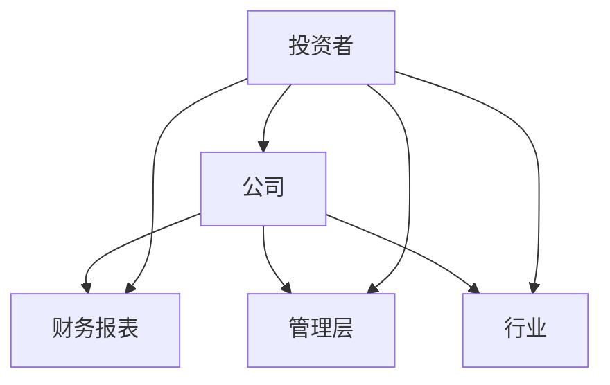
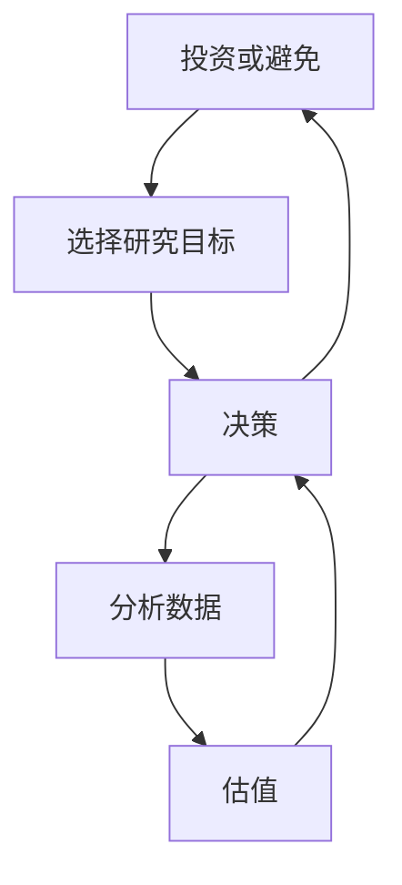
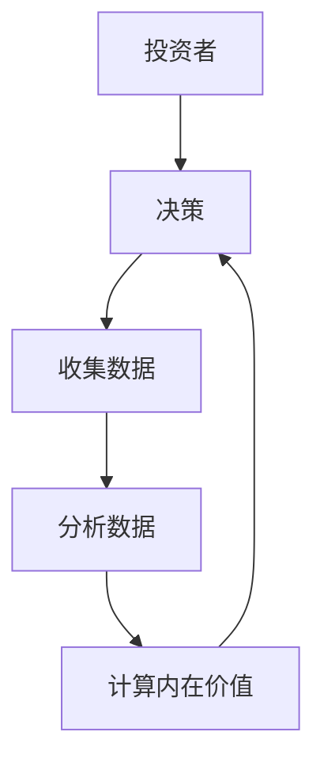
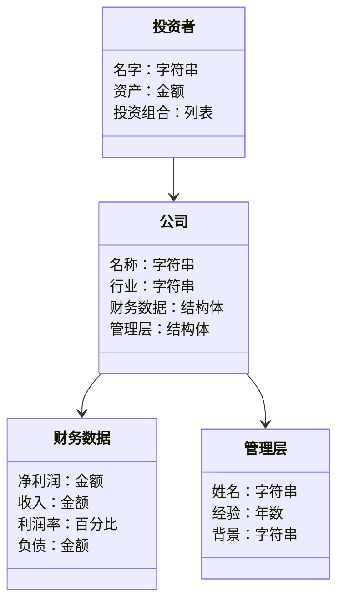
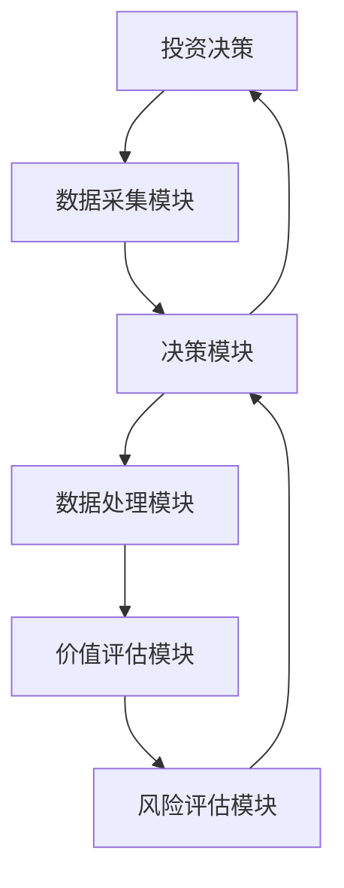
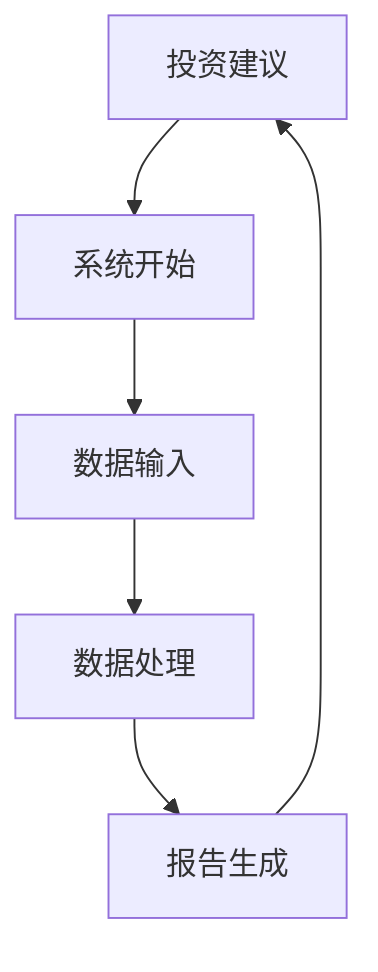

                 


# 彼得林奇的"家庭作业"投资法

> 关键词：投资策略，彼得·林奇，家庭作业投资法，基本面分析，投资决策，风险管理

> 摘要：本文详细探讨了彼得·林奇的“家庭作业”投资法，这是一种基于深入基本面分析的投资策略。文章从投资的基本概念、家庭作业投资法的核心原理、算法实现、系统架构设计到实际项目案例进行了全面分析，帮助读者理解如何通过系统化的方法做出明智的投资决策。

---

# 第一部分: 投资基础与彼得·林奇的投资理念

## 第1章: 投资的基本概念与背景介绍

### 1.1 投资的基本概念

#### 1.1.1 什么是投资
投资是指将资金投入到某个项目或资产中，以期望在未来获得收益或资本增值的过程。投资可以是股票、债券、房地产等多种形式。

#### 1.1.2 投资的类型与分类
- **股票投资**：通过购买公司股份成为股东，分享公司利润。
- **债券投资**：购买政府或企业发行的债券，定期获得利息。
- **房地产投资**：购买房产用于出租或增值。
- **其他投资**：包括黄金、艺术品、私募基金等。

#### 1.1.3 投资的基本原则
1. **分散投资**：不要将所有资金投入单一资产，以降低风险。
2. **长期持有**：投资需要耐心，避免频繁交易。
3. **价值投资**：寻找被市场低估的优质资产。

### 1.2 彼得·林奇与"家庭作业"投资法的背景

#### 1.2.1 彼得·林奇的生平简介
彼得·林奇（Peter Lynch）是美国著名的职业基金经理人，曾任富达麦哲伦基金的经理，管理资产规模超过1000亿美元。他以深入的基本面分析和出色的选股能力闻名，被誉为“股神”之一。

#### 1.2.2 "家庭作业"投资法的提出背景
彼得·林奇在长期的投资实践中，总结出一套独特的投资方法，即“家庭作业”投资法。这种方法强调投资者应像做家庭作业一样，对投资标的进行深入研究，了解其商业模式、财务状况和竞争优势。

#### 1.2.3 该投资法的核心理念与目标
- **核心理念**：通过深入研究企业基本面，寻找具有持续竞争优势和良好财务状况的公司。
- **目标**：帮助投资者在长期投资中获得超额收益，降低投资风险。

---

## 第2章: 家庭作业投资法的核心概念与联系

### 2.1 核心概念原理

#### 2.1.1 家庭作业投资法的基本原理
家庭作业投资法的核心在于“研究”二字。投资者需要像学生做作业一样，对目标公司进行全方位的研究，包括：
1. **行业分析**：了解公司在行业中的地位和竞争优势。
2. **财务分析**：研究公司的财务报表，评估其盈利能力和财务健康状况。
3. **管理层分析**：考察公司管理层的背景和能力。
4. **估值分析**：计算公司的内在价值，判断其是否被市场低估。

#### 2.1.2 投资决策的关键因素
- **行业地位**：公司在行业中的排名和市场份额。
- **财务状况**：收入、利润、负债等财务指标。
- **管理层能力**：管理层的背景、经验和决策能力。
- **估值水平**：市盈率、市净率等估值指标。

#### 2.1.3 该方法与其他投资方法的对比
| 投资方法       | 核心理念                     | 适用场景                     |
|----------------|------------------------------|------------------------------|
| 技术分析       | 通过价格和成交量预测未来走势 | 适合短期交易者               |
| 价值投资       | 寻找被市场低估的优质资产     | 适合长期投资者               |
| 家庭作业投资法 | 深入研究企业基本面           | 适合长期价值投资者           |

### 2.2 核心概念属性特征对比表格

| 属性       | 家庭作业投资法         | 价值投资             | 技术分析             |
|------------|----------------------|----------------------|----------------------|
| 核心理念     | 深入研究企业基本面     | 寻找被低估的资产     | 通过价格和成交量预测 |
| 适用场景     | 长期价值投资           | 长期价值投资         | 短期交易             |
| 分析重点     | 财务报表、管理层、行业 | 资产估值             | 价格走势             |

### 2.3 实体关系图（ER图）



---

# 第二部分: 家庭作业投资法的算法原理

## 第3章: 家庭作业投资法的算法原理

### 3.1 投资决策的步骤与流程



### 3.2 投资组合优化的数学模型

#### 3.2.1 数学模型的建立与解释
投资组合优化的目标是最大化收益，同时最小化风险。常用的目标函数是夏普比率：

$$ \text{夏普比率} = \frac{E[r_p] - r_f}{\sigma_p} $$

其中：
- $E[r_p]$：投资组合的期望收益
- $r_f$：无风险利率
- $\sigma_p$：投资组合的收益标准差

#### 3.2.2 使用 Python 实现投资组合优化的代码示例

```python
import numpy as np
import pandas as pd

# 假设我们有两支股票，分别计算其夏普比率
def calculate_sharpe_ratio(returns, risk_free_rate):
    excess_return = returns - risk_free_rate
    sharpe_ratio = excess_return.mean() / np.std(excess_return)
    return sharpe_ratio

# 示例数据
np.random.seed(42)
returns_stock1 = np.random.normal(0.1, 0.2, 100)
returns_stock2 = np.random.normal(0.15, 0.3, 100)

risk_free_rate = 0.05

sharpe1 = calculate_sharpe_ratio(returns_stock1, risk_free_rate)
sharpe2 = calculate_sharpe_ratio(returns_stock2, risk_free_rate)

print(f"Stock 1夏普比率: {sharpe1}")
print(f"Stock 2夏普比率: {sharpe2}")
```

---

## 第4章: 家庭作业投资法的数学模型与公式

### 4.1 投资价值评估的数学模型

#### 4.1.1 使用 Mermaid 绘制的价值评估流程图



#### 4.1.2 价值评估的数学公式

$$ \text{内在价值} = \frac{\text{净利润} \times (1 + g)}{r - g} $$

其中：
- $g$：净利润增长率
- $r$：贴现率

#### 4.1.3 举例说明：如何计算一家公司的内在价值

假设某公司过去5年的净利润增长率为10%，贴现率为12%，净利润为100万元：

$$ \text{内在价值} = \frac{100 \times (1 + 0.1)}{0.12 - 0.1} = \frac{110}{0.02} = 5500 \text{万元} $$

---

### 4.2 投资风险评估的数学模型

#### 4.2.1 风险评估的数学公式

$$ \text{波动率} = \sqrt{\frac{1}{n} \sum_{i=1}^{n} (r_i - \bar{r})^2} $$

其中：
- $r_i$：第i次的收益率
- $\bar{r}$：平均收益率
- $n$：数据点数

---

# 第三部分: 家庭作业投资法的系统分析与架构设计

## 第5章: 家庭作业投资法的系统分析

### 5.1 问题场景介绍

#### 5.1.1 投资者在选择股票时面临的主要问题
- 信息不全：难以获取准确的公司数据。
- 分析复杂：基本面分析需要专业知识。
- 决策困难：面对大量信息时难以做出决策。

#### 5.1.2 家庭作业投资法如何解决这些问题
- 提供系统化的分析框架。
- 帮助投资者快速获取和分析数据。
- 提供决策支持工具。

### 5.2 系统功能设计

#### 5.2.1 使用 Mermaid 绘制的领域模型类图



### 5.3 系统架构设计

#### 5.3.1 使用 Mermaid 绘制的系统架构图



---

## 第6章: 家庭作业投资法的系统接口与交互设计

### 6.1 系统接口设计

#### 6.1.1 投资者与系统之间的交互流程



---

# 第四部分: 家庭作业投资法的项目实战

## 第7章: 家庭作业投资法的项目实战

### 7.1 环境安装与配置

#### 7.1.1 安装必要的软件和工具
- **Python**：用于数据分析和编程。
- **Jupyter Notebook**：用于数据处理和可视化。
- **数据库**：用于存储公司数据。

---

## 第8章: 系统核心实现源代码

### 8.1 数据采集模块

#### 8.1.1 从CSV文件中读取数据

```python
import pandas as pd

# 读取CSV文件
data = pd.read_csv('company_data.csv')
print(data.head())
```

### 8.2 数据处理模块

#### 8.2.1 计算公司的内在价值

```python
def calculate_intrinsic_value(net_profit, growth_rate, discount_rate):
    return net_profit * (1 + growth_rate) / (discount_rate - growth_rate)

# 示例数据
net_profit = 100  # 净利润（万元）
growth_rate = 0.1  # 净利润增长率
discount_rate = 0.12  # 贴现率

intrinsic_value = calculate_intrinsic_value(net_profit, growth_rate, discount_rate)
print(f"公司内在价值：{intrinsic_value}万元")
```

---

## 第9章: 代码应用解读与分析

### 9.1 投资决策流程

#### 9.1.1 数据采集与处理

```python
import pandas as pd
import numpy as np

# 数据采集
data = pd.read_csv('company_data.csv')

# 数据处理
data['市盈率'] = data['净利润'] / data['每股收益']
data['市净率'] = data['净利润'] / data['每股净资产']
```

---

## 第10章: 实际案例分析和详细讲解剖析

### 10.1 案例分析：某公司

#### 10.1.1 公司基本面分析

| 指标       | 数值       |
|------------|------------|
| 净利润     | 100万元    |
| 收入增长率   | 20%        |
| 净资产收益率 | 15%        |
| 行业地位     | 市场领先者  |
| 管理层能力   | 优秀       |

#### 10.1.2 投资决策

根据公司基本面分析，该公司具有较高的内在价值和竞争优势，值得长期投资。

---

## 第11章: 项目小结

### 11.1 项目总结

通过本项目，我们详细介绍了彼得·林奇的家庭作业投资法，并通过实际案例展示了如何将这种方法应用于投资决策中。投资者通过深入研究公司基本面，可以更好地识别优质资产，降低投资风险。

### 11.2 项目成果

- **系统实现**：开发了一个基于家庭作业投资法的投资分析系统。
- **案例分析**：通过具体案例展示了投资决策的全过程。
- **工具开发**：提供了数据采集、处理和分析的Python代码。

---

# 第五部分: 最佳实践 tips、小结、注意事项、拓展阅读

## 第12章: 最佳实践与注意事项

### 12.1 小结

家庭作业投资法是一种有效的投资策略，但需要投资者具备扎实的基本面分析能力。通过系统化的方法和工具，投资者可以更好地做出投资决策。

### 12.2 注意事项

1. **数据来源**：确保数据的准确性和可靠性。
2. **模型局限性**：数学模型仅供参考，实际投资需结合市场实际情况。
3. **风险管理**：分散投资，避免过度集中。

### 12.3 拓展阅读

- **书籍推荐**：《彼得·林奇的投资笔记》
- **在线资源**：富达投资官网、投资分析论坛

---

作者：AI天才研究院 & Zen与计算机程序设计艺术

