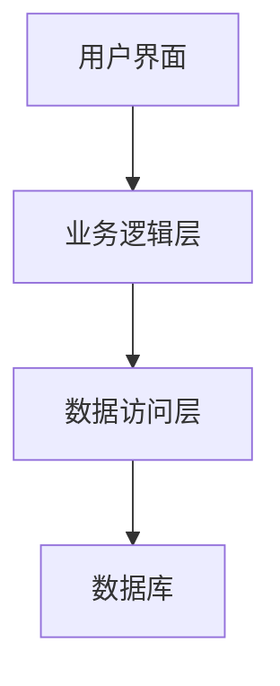

                 

# 彼得林奇的"家庭投资"在不同生命阶段的调整

> 关键词：彼得林奇，家庭投资，生命阶段，资产配置，风险管理，财务规划

> 摘要：本文深入分析了彼得·林奇的家庭投资理念在不同生命阶段的调整策略，探讨了如何根据个人和家庭的财务需求，在单身、结婚、有子女、中年、退休等不同阶段进行资产配置、风险管理及投资组合优化，为读者提供系统的家庭投资规划指南。

---

# 第一部分: 彼得·林奇的"家庭投资"概述

## #1章: 彼得·林奇与家庭投资的背景

### 1.1 彼得·林奇的生平与投资理念

彼得·林奇是美国著名的投资家、作家和教育家。他以在富达投资管理公司的长期任职中，创造了卓越的投资业绩而闻名。林奇的投资理念强调“价值投资”，即寻找那些被市场低估的公司进行长期投资。他的家庭投资理念注重在不同生命阶段进行合理的资产配置和风险管理，以确保家庭财务的稳健增长。

#### 1.1.1 彼得·林奇的早期经历

彼得·林奇出生于美国波士顿的一个普通家庭。他在麻省理工学院（MIT）获得化学工程学士学位后，进入哈佛商学院攻读MBA。在职业生涯中，他加入了富达投资管理公司，并逐渐成长为该公司历史上最成功的基金经理之一。林奇的职业生涯和投资理念深受本杰明·格雷厄姆的影响，他强调基本面分析和长期投资。

#### 1.1.2 彼得·林奇的投资哲学

林奇的投资哲学可以总结为以下几点：

1. **价值投资**：寻找那些市场价格低于内在价值的公司。
2. **长期投资**：避免短期市场的波动，关注企业的长期价值。
3. **分散投资**：通过分散投资降低风险。
4. **持续学习**：不断研究市场和企业，保持对投资的理解和洞察力。

#### 1.1.3 家庭投资的核心理念

林奇的家庭投资理念强调在不同生命阶段进行合理的资产配置和风险管理。他认为，家庭投资的目标不仅是财富的积累，更是通过合理的财务规划确保家庭在不同阶段的财务安全和生活质量的提升。

---

## #2章: 不同生命阶段的财务需求分析

### 2.1 单身阶段的财务规划

#### 2.1.1 单身阶段的投资目标

单身阶段的投资目标主要是实现资产的快速增长，同时为未来的重要支出（如结婚、购房等）做好准备。在这一阶段，投资者可以承担较高的风险，但需要注重资产的流动性。

#### 2.1.2 资产配置的基本原则

在单身阶段，资产配置应以股票和成长型基金为主，辅以少量的债券和现金。推荐的资产配置比例为：

- 股票：60%
- 债券：20%
- 现金及短期投资：20%

#### 2.1.3 风险管理与应急储备

单身阶段应预留3-6个月的生活费用作为应急储备，以应对突发事件（如失业、疾病等）。这部分资金应以流动性高、风险低的资产形式存在，如活期存款或货币市场基金。

---

### 2.2 结婚后成家阶段的财务规划

#### 2.2.1 结婚后的财务整合

结婚后，夫妻双方需要整合各自的财务资源，制定共同的财务目标。建议将资产分为共同账户和个体账户，以平衡个人财务独立性和家庭财务整合。

#### 2.2.2 房地产投资的考量

在成家阶段，房地产投资通常是家庭的重要决策之一。林奇建议根据家庭的经济能力选择合适的城市和区域进行投资，同时避免过度杠杆（即避免高比例的贷款）。

#### 2.2.3 家庭保险的配置

在成家阶段，家庭保险的配置至关重要。建议购买以下保险：

- 房屋保险：覆盖房屋及室内财产的风险。
- 健康保险：覆盖家庭成员的医疗费用。
- 意外保险：覆盖因意外事故导致的身故、残疾或医疗费用。

---

### 2.3 有子女阶段的财务规划

#### 2.3.1 子女教育资金的筹备

在有子女阶段，家庭需要为子女的教育费用做好准备。建议设立专门的教育基金，采用定投的方式进行长期投资。

#### 2.3.2 子女课外兴趣与培训费用的管理

子女的兴趣班和课外培训费用可能会显著增加家庭的支出。建议在家庭预算中提前预留这部分费用，并优先选择性价比高的培训机构。

#### 2.3.3 子女未来的财务独立性培养

林奇建议在子女成年之前，逐步培养他们的财务独立性。可以通过让他们管理一部分零花钱，学习基础的财务管理知识。

---

## #3章: 子女独立后的财务调整

### 3.1 子女独立对家庭财务的影响

#### 3.1.1 家庭支出的减少与增加

子女独立后，家庭的教育支出和生活支出可能会减少，但可能增加旅行、健康保健等其他支出。

#### 3.1.2 投资组合的再平衡

在子女独立后，家庭的投资组合需要进行再平衡。建议增加债券和现金的比例，减少股票的比例，以降低整体投资组合的风险。

#### 3.1.3 遗产规划的启动

子女独立后，家庭需要启动遗产规划，确保未来财产的合法继承和分配。

---

## #4章: 退休前的财务准备

### 4.1 退休前的资产配置策略

#### 4.1.1 退休资金的测算与储备

在退休前，家庭需要测算退休后的基本生活支出，并通过定投等方式储备足够的退休资金。

#### 4.1.2 风险投资的逐步降低

随着退休的临近，家庭需要逐步减少高风险资产（如股票）的比例，增加债券和现金的比例。

#### 4.1.3 养老保险与个人储蓄的结合

建议将养老保险和个人储蓄相结合，确保退休后有足够的收入来源。

---

## #5章: 退休后的财务安排

### 5.1 退休后的资产保值与增值

#### 5.1.1 资产配置的优化

在退休后，资产配置应以债券和现金为主，辅以少量的股票和房地产信托基金（REITs）。

#### 5.1.2 资产的长期保值策略

退休后，家庭需要注重资产的长期保值，避免过度冒险。

#### 5.1.3 退休收入的多元化来源

建议通过多种渠道获取退休收入，如养老保险、投资收益、房租收入等。

---

## #6章: 遗产规划与家庭投资的延续

### 6.1 遗产规划的重要性

#### 6.1.1 遗产分配的公平性与合法性

遗产规划需要确保分配的公平性，同时符合法律要求。

#### 6.1.2 遗产规划对家庭投资的影响

遗产规划可以减少遗产税和家庭纠纷，确保家庭投资的延续性。

#### 6.1.3 遗产执行的法律与税务优化

建议在遗产规划中引入专业律师和税务顾问，确保遗产的合法性和税务优化。

---

## #7章: 家庭投资策略的动态调整与风险管理

### 7.1 不同生命阶段的投资策略调整

#### 7.1.1 动态调整的核心原则

家庭投资需要根据生命阶段的变化进行动态调整，注重风险与收益的平衡。

#### 7.1.2 再平衡的实施步骤

定期对投资组合进行再平衡，确保资产配置符合当前的财务目标和风险承受能力。

#### 7.1.3 风险管理的具体措施

通过分散投资、购买保险和预留应急资金等方式降低投资风险。

---

## #8章: 数学模型与算法解析

### 8.1 投资组合优化的数学模型

在家庭投资中，投资组合优化可以通过数学模型实现。以下是一个简单的投资组合优化模型：

$$
\text{最大化 } \mu^T w - \lambda w^T \Sigma w
$$

其中：
- \( \mu \) 是资产的期望收益率向量。
- \( w \) 是资产配置权重向量。
- \( \Sigma \) 是资产收益的协方差矩阵。
- \( \lambda \) 是风险厌恶系数。

### 8.2 投资组合优化的实现步骤

1. **确定财务目标和风险承受能力**。
2. **选择可投资的资产类别**。
3. **计算各资产的期望收益率和协方差矩阵**。
4. **优化投资组合权重，以最大化期望收益或最小化风险**。

---

## #9章: 系统架构与项目实战

### 9.1 系统功能设计

家庭投资管理系统需要具备以下功能：
- 资产配置建议。
- 投资组合优化。
- 风险管理与预警。
- 财务报告与分析。

### 9.2 系统架构设计

以下是家庭投资管理系统的架构图：

### 9.3 系统接口设计

系统接口主要包含以下部分：
- 用户登录与注册。
- 资产信息录入与查询。
- 投资组合优化建议。

---

## #10章: 最佳实践与小结

### 10.1 最佳实践 tips

- 定期审视和调整投资组合。
- 注重资产配置的多样性。
- 合理预留应急资金。

### 10.2 注意事项

- 避免过度杠杆。
- 定期评估风险承受能力。
- 寻求专业财务顾问的帮助。

### 10.3 拓展阅读

推荐以下书籍和网站，供读者深入学习：
- 《彼得·林奇的成功投资》
- 富达投资管理公司官网

---

# 作者：AI天才研究院/AI Genius Institute & 禅与计算机程序设计艺术 /Zen And The Art of Computer Programming

---

通过以上分析，我们可以看到，彼得·林奇的家庭投资理念在不同生命阶段的调整策略是系统且科学的。从单身阶段的快速增长到退休后的资产保值，每一步都需要根据家庭的财务需求和风险承受能力进行动态调整。通过合理的资产配置、风险管理

