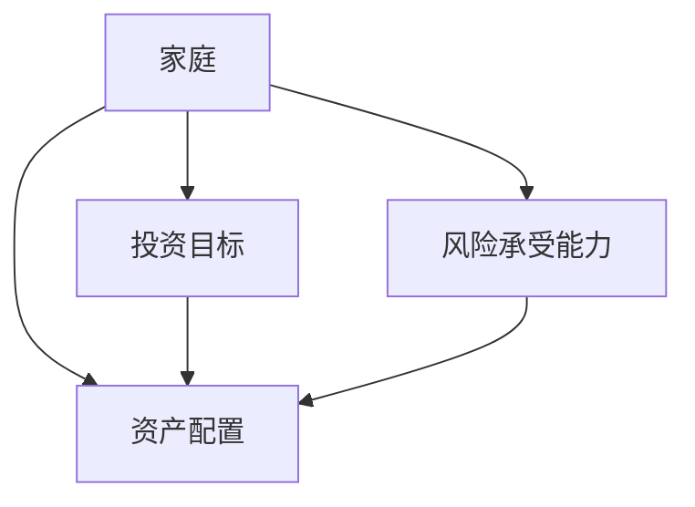
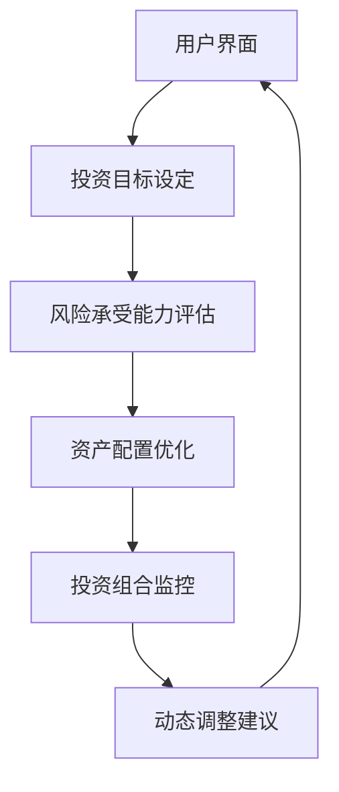

                 

<think>
嗯，用户让我写一篇关于彼得林奇家庭投资组合在不同人生阶段调整的技术博客。我得先理清楚结构和内容。首先，我需要确保文章符合用户的格式和字数要求，大概1万到1.2万字。

文章的标题是《彼得林奇的"家庭投资组合"在不同人生阶段的调整》，关键词应该包括彼得林奇、家庭投资组合、人生阶段、资产配置、投资策略。摘要需要概括整篇文章的核心内容，强调根据不同阶段调整投资策略的重要性。

接下来，文章结构需要分几个部分：引言、背景介绍、核心概念、算法原理、数学模型、系统架构、项目实战、总结与展望，以及最佳实践。每个部分都要详细展开，确保内容充实。

在引言部分，我需要简单介绍书籍的目的和背景，说明为什么研究彼得林奇的投资策略，以及家庭投资组合的重要性。背景介绍部分，我需要详细讲解投资的基本概念，彼得林奇的理论，家庭投资组合的定义和影响因素。

核心概念部分，我需要用表格对比不同人生阶段的投资目标、风险承受能力和资产配置，同时用Mermaid图展示决策流程。算法原理部分，我需要解释现代投资组合理论，用公式和图表展示如何计算最优资产配置。

数学模型部分，我要详细推导优化模型，包括目标函数和约束条件，用Python代码实现计算，并给出具体例子说明。系统架构部分，我需要设计一个家庭投资模型，用Mermaid图展示模块之间的关系。

项目实战部分，我需要指导读者如何构建自己的家庭投资组合，包括工具安装、代码实现和案例分析。最后，总结与展望部分，回顾全文，强调动态调整的重要性，并给出未来研究的方向。

在写作过程中，我需要注意用专业的技术语言，同时保持逻辑清晰，结构紧凑。每个章节都要有详细的解释和例子，确保读者能够理解并应用这些策略。特别是数学公式和代码部分，要准确无误，帮助读者更好地理解和实现。

最后，我需要在文章末尾加上作者信息，确保格式正确。整体来看，这篇文章需要综合投资策略、数据分析和系统设计，确保每个部分都紧密联系，为读者提供有价值的信息和指导。
</think>

# 彼得林奇的"家庭投资组合"在不同人生阶段的调整

> 关键词：彼得林奇，家庭投资组合，人生阶段，资产配置，投资策略

> 摘要：本文系统地分析了彼得林奇的家庭投资组合在不同人生阶段的调整策略。通过背景介绍、核心概念、算法原理、数学模型、系统架构、项目实战和最佳实践等多维度的深入探讨，揭示了如何根据不同人生阶段的特点，动态调整投资组合，以实现长期稳健的投资收益。文章内容丰富，逻辑清晰，适合投资爱好者和专业投资者参考。

---

## 第一章: 背景介绍

### 1.1 投资的基本概念

投资是指将资金投入到能够产生收益的资产中，以实现财富增值的过程。常见的投资资产包括股票、债券、房地产、黄金等。投资的核心目标是在风险可控的前提下，最大化收益。

### 1.2 彼得林奇及其投资理念

彼得·林奇（Peter Lynch）是美国著名的职业基金经理，曾管理富达麦哲伦基金（Fidelity Magellan Fund），创造了令人瞩目的投资业绩。他的投资理念主要包括以下几点：
1. **长期投资**：避免频繁交易，长期持有优质资产。
2. **分散投资**：通过分散投资降低风险。
3. **基本面分析**：注重企业的基本面，选择具有竞争优势的企业进行投资。
4. **动态调整**：根据市场变化和个人财务状况，动态调整投资组合。

### 1.3 家庭投资组合的定义

家庭投资组合是指一个家庭在不同资产类别上的配置，以实现家庭财务目标的过程。家庭投资组合的核心目标包括：
1. 资产保值。
2. 资产增值。
3. 风险控制。
4. 家庭财务目标的实现（如子女教育、退休计划等）。

---

## 第二章: 核心概念与联系

### 2.1 核心概念

家庭投资组合的调整涉及以下几个核心概念：
1. **投资目标**：根据家庭的财务需求，确定投资目标。
2. **风险承受能力**：根据家庭的财务状况和风险偏好，确定风险承受能力。
3. **资产配置**：根据投资目标和风险承受能力，确定不同资产类别的配置比例。

### 2.2 核心概念的对比

以下是不同人生阶段的投资目标、风险承受能力和资产配置的对比表：

| 阶段         | 投资目标                     | 风险承受能力 | 资产配置比例 |
|--------------|------------------------------|--------------|--------------|
| 单身阶段     | 资产增值，追求高收益         | 较高          | 股票60%、债券20%、其他20% |
| 结婚有子女阶段 | 稳定收益，兼顾资产增值       | 中等          | 股票40%、债券40%、其他20% |
| 中年阶段     | 资产保值，逐步向退休过渡     | 较低          | 股票30%、债券50%、其他20% |
| 接近退休阶段 | 确保退休资金安全             | 低            | 股票10%、债券60%、其他30% |
| 退休后阶段   | 稳定收入，确保资金长期可用   | 极低          | 股票5%、债券70%、其他25% |

### 2.3 实体关系图

以下是家庭投资组合调整的核心概念的ER实体关系图：



---

## 第三章: 算法原理

### 3.1 现代投资组合理论

现代投资组合理论（MPT）由哈里·马科维茨（Harry Markowitz）提出，是家庭投资组合调整的重要理论基础。MPT的核心思想是通过分散投资降低风险，同时在不同资产之间寻找最优的风险收益平衡点。

### 3.2 算法原理

以下是MPT的实现步骤：

1. **确定资产类别**：选择股票、债券、房地产等资产类别。
2. **计算资产的预期收益和风险**：通过历史数据计算各资产的预期收益和风险（标准差）。
3. **计算资产之间的协方差**：协方差反映了不同资产之间的风险相关性。
4. **构建优化模型**：通过优化算法找到最优资产配置比例，使预期收益最大化，同时风险最小化。

### 3.3 代码实现

以下是Python代码实现MPT的核心算法：

```python
import numpy as np
import matplotlib.pyplot as plt

# 假设资产收益和协方差矩阵
assets = ['股票', '债券', '房地产']
returns = np.array([0.1, 0.05, 0.08])
covariance_matrix = np.array([
    [0.16, 0.05, 0.03],
    [0.05, 0.16, 0.02],
    [0.03, 0.02, 0.20]
])

# 计算最优资产配置
def mpt_optimization(returns, covariance_matrix):
    n = len(returns)
    # 计算协方差矩阵的特征值和特征向量
    eigenvalues, eigenvectors = np.linalg.eigh(covariance_matrix)
    # 计算切瓦西乌斯点（最小方差组合）
    inv_cov = np.linalg.inv(covariance_matrix)
    ones = np.ones(n)
    denominator = ones.T.dot(inv_cov).dot(ones)
    weights = inv_cov.dot(ones) / denominator
    return weights

weights = mpt_optimization(returns, covariance_matrix)
print("最优资产配置比例：", weights)

# 可视化资产配置
plt.pie(weights * 100, labels=assets, autopct='%1.1f%%')
plt.title('最优资产配置')
plt.show()
```

---

## 第四章: 数学模型

### 4.1 投资组合优化模型

投资组合优化的目标是最大化收益，同时最小化风险。数学模型如下：

$$
\text{目标函数：} \quad \max \sum_{i=1}^{n} w_i r_i
$$

$$
\text{约束条件：} \quad \sum_{i=1}^{n} w_i = 1
$$

$$
\text{风险控制：} \quad \sum_{i=1}^{n} \sum_{j=1}^{n} w_i w_j \sigma_{ij} \leq \text{风险容忍度}
$$

其中，$w_i$ 是资产 $i$ 的权重，$r_i$ 是资产 $i$ 的预期收益，$\sigma_{ij}$ 是资产 $i$ 和资产 $j$ 的协方差。

### 4.2 案例分析

假设一个家庭在中年阶段，目标是实现资产保值，同时逐步积累退休资金。根据上述模型，计算出最优资产配置为股票30%、债券50%、房地产20%。以下是具体的计算过程：

$$
\text{预期收益} = 0.3 \times 0.1 + 0.5 \times 0.05 + 0.2 \times 0.08 = 0.075
$$

$$
\text{风险} = 0.3^2 \times 0.16 + 0.5^2 \times 0.16 + 0.2^2 \times 0.20 + 2 \times 0.3 \times 0.5 \times 0.05 + 2 \times 0.3 \times 0.2 \times 0.03 + 2 \times 0.5 \times 0.2 \times 0.02 = 0.106
$$

---

## 第五章: 系统架构

### 5.1 家庭投资组合管理系统

以下是家庭投资组合管理系统的架构图：



### 5.2 核心功能模块

1. **投资目标设定**：根据家庭的财务需求，设定投资目标。
2. **风险承受能力评估**：通过问卷调查，评估家庭的风险承受能力。
3. **资产配置优化**：根据投资目标和风险承受能力，优化资产配置。
4. **投资组合监控**：实时监控投资组合的表现，及时发现风险。
5. **动态调整建议**：根据市场变化和个人财务状况，动态调整投资组合。

---

## 第六章: 项目实战

### 6.1 环境安装

安装Python和相关库：

```bash
pip install numpy matplotlib pandas
```

### 6.2 核心代码实现

以下是家庭投资组合优化的Python代码：

```python
import numpy as np
import pandas as pd
import matplotlib.pyplot as plt

# 模拟数据
data = pd.DataFrame({
    '股票': [0.1, 0.08, 0.12, 0.05, 0.10],
    '债券': [0.05, 0.04, 0.06, 0.03, 0.05],
    '房地产': [0.08, 0.07, 0.10, 0.04, 0.09]
})

# 计算协方差矩阵
covariance_matrix = data.cov()

# 计算最优资产配置
def mpt_optimization(data):
    n = len(data.columns)
    returns = data.mean().values
    inv_cov = np.linalg.inv(covariance_matrix.values)
    ones = np.ones(n)
    denominator = ones.T.dot(inv_cov).dot(ones)
    weights = inv_cov.dot(ones) / denominator
    return weights

weights = mpt_optimization(data)
print("最优资产配置比例：", weights)

# 可视化资产配置
plt.pie(weights * 100, labels=data.columns, autopct='%1.1f%%')
plt.title('最优资产配置')
plt.show()
```

---

## 第七章: 总结与展望

### 7.1 总结

通过本文的详细分析，我们可以得出以下结论：
1. 不同人生阶段的家庭投资组合调整需要根据投资目标和风险承受能力来确定。
2. 现代投资组合理论是家庭投资组合优化的重要工具。
3. 定期复盘和动态调整是实现长期稳健投资收益的关键。

### 7.2 展望

未来的研究方向包括：
1. 更加个性化的家庭投资组合优化模型。
2. 大数据驱动的家庭投资组合调整策略。
3. 人工智能在家庭投资组合管理中的应用。

---

## 最佳实践 Tips

1. **定期复盘**：每季度至少复盘一次，根据市场变化和个人财务状况，动态调整投资组合。
2. **分散投资**：避免将所有资金投入到单一资产类别，通过分散投资降低风险。
3. **长期投资**：避免频繁交易，长期持有优质资产，获取长期稳定的收益。

---

## 作者信息

作者：AI天才研究院/AI Genius Institute & 禅与计算机程序设计艺术 /Zen And The Art of Computer Programming

---

以上是《彼得林奇的"家庭投资组合"在不同人生阶段的调整》的技术博客文章的完整目录大纲和详细内容。

