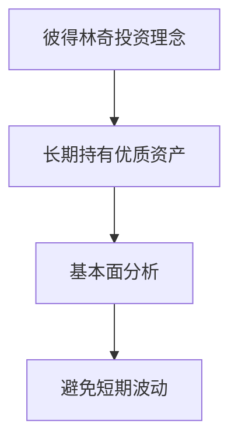
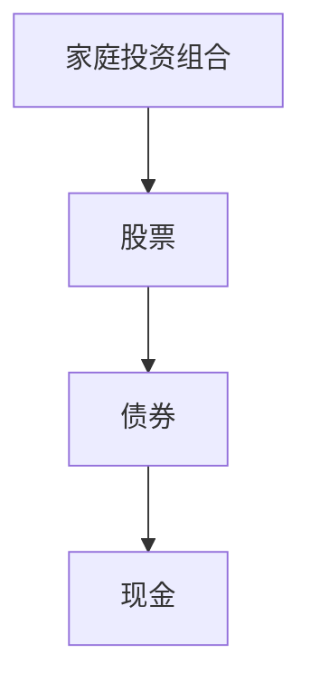
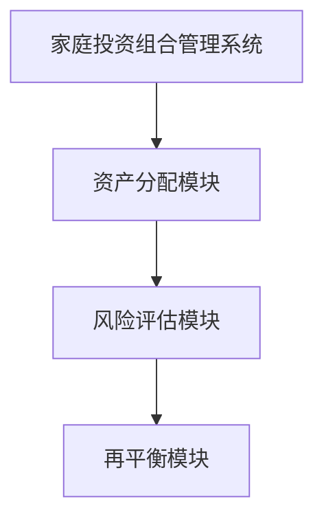

                 


# 彼得林奇的"家庭投资组合"在全球资产配置中的应用

---

## 关键词：
- 彼得林奇
- 家庭投资组合
- 全球资产配置
- 投资策略
- 风险管理

---

## 摘要：
彼得林奇作为投资领域的权威，提出了以家庭为单位的投资组合策略，强调分散投资和长期持有优质资产。本文将详细分析这一策略在全球化背景下的应用，探讨如何通过科学的资产配置和风险管理，实现家庭财富的保值与增值。文章结合实际案例和系统分析，为读者提供可操作的投资指导。

---

## 第一章：彼得林奇投资理念与家庭投资组合概述

### 1.1 彼得林奇投资理念的核心思想

#### 1.1.1 彼得林奇的投资者画像

彼得林奇是美国著名投资经理人，以其在富达麦哲伦基金的卓越表现闻名。他的投资理念强调长期持有优质资产，注重基本面分析，避免短期市场波动的干扰。他认为，成功的投资需要耐心和纪律，同时要选择那些具有持续竞争优势的企业。

**背景介绍：**
彼得林奇的投资理念基于价值投资，但更注重企业的成长性和管理能力。他反对频繁交易和过度分散投资，提倡集中投资于少数优质企业。

**核心概念：**
- 长期投资
- 优质资产选择
- 风险管理

**图表：**


#### 1.1.2 家庭投资组合的基本概念

家庭投资组合是指一个家庭在不同资产类别（如股票、债券、房地产等）中的资金分配。其目标是通过多样化投资来分散风险，同时实现财富的保值和增值。

**背景介绍：**
家庭投资组合的构建需要考虑家庭的财务状况、风险承受能力和投资目标。彼得林奇的家庭投资组合策略强调分散投资，避免过度集中于某一种资产。

**核心概念：**
- 投资目标
- 资产分配
- 风险承受能力

**图表：**


#### 1.1.3 家庭投资组合的应用价值

家庭投资组合在全球资产配置中的应用可以帮助家庭分散风险，优化收益。特别是在全球经济一体化的背景下，通过配置全球资产，可以更好地应对不同市场的波动。

---

### 1.2 家庭投资组合的核心要素

#### 1.2.1 投资目标的确定

家庭的投资目标需要根据家庭成员的需求、财务状况和风险偏好来确定。例如，年轻家庭可能更注重资本增值，而中老年家庭可能更关注本金安全。

**背景介绍：**
明确的投资目标是家庭投资组合构建的基础。不同的目标可能导致不同的资产配置策略。

**核心概念：**
- 资本增值
- 本金安全
- 现金流需求

#### 1.2.2 资产分配的基本原则

资产分配需要根据风险承受能力和预期收益来决定。通常，高风险承受能力的家庭可以配置更多股票，而风险承受能力较低的家庭则配置更多债券和现金。

**背景介绍：**
资产分配是家庭投资组合的核心，决定了投资的收益和风险。

**核心概念：**
- 风险与收益平衡
- 资产类别选择
- 再平衡策略

#### 1.2.3 风险承受能力的评估

风险承受能力是家庭在面对市场波动时的心理和财务承受能力。它影响着资产分配的决策。

**背景介绍：**
评估风险承受能力需要考虑家庭的财务状况、收入来源和紧急资金需求。

**核心概念：**
- 财务稳定性
- 心理承受能力
- 时间 horizon

---

## 第二章：家庭投资组合的构成与特点

### 2.1 家庭投资组合的构成要素

#### 2.1.1 股票资产

股票是家庭投资组合的重要组成部分。通过投资优质企业，可以获得资本增值和股息收益。

**背景介绍：**
股票资产的风险较高，但长期收益潜力大。彼得林奇建议选择具有持续增长潜力的企业。

**核心概念：**
- 股票选择标准
- 股票风险分析
- 股票收益模型

**数学公式：**
股票的预期收益可以表示为：
$$ E[R] = R_f + β(R_m - R_f) $$
其中，\( E[R] \) 是预期收益，\( R_f \) 是无风险利率，\( β \) 是贝塔系数，\( R_m \) 是市场预期收益。

#### 2.1.2 债券资产

债券是固定收益投资，可以提供稳定的现金流。适合风险承受能力较低的家庭。

**背景介绍：**
债券的风险较低，但收益相对有限。在家庭投资组合中，债券可以起到分散风险的作用。

**核心概念：**
- 债券收益率
- 利息支付
- 债券价格波动

#### 2.1.3 现金及货币市场工具

现金是流动性最强的资产，适合应对紧急资金需求。

**背景介绍：**
现金虽然流动性高，但收益较低。在家庭投资组合中，现金的比例需要根据流动性需求来决定。

**核心概念：**
- 现金管理
- 短期投资工具
- 现金储备

### 2.2 不同类型资产的风险与收益分析

#### 2.2.1 股票的风险与收益特征

股票的风险主要来自于市场波动和企业业绩变化。长期来看，股票收益较高。

**背景介绍：**
股票的风险可以用波动率和贝塔系数来衡量。贝塔系数反映了股票相对于市场的波动程度。

**核心概念：**
- 股票波动率
- 贝塔系数
- 市场风险溢价

#### 2.2.2 债券的风险与收益特征

债券的风险主要来自于利率变化和信用风险。收益相对稳定。

**背景介绍：**
债券的收益主要来自利息支付和本金偿还。利率上升会降低债券价格，反之亦然。

**核心概念：**
- 利率风险
- 信用风险
- 债券收益率曲线

#### 2.2.3 现金及货币市场工具的流动性与安全性

现金的流动性最强，但收益最低。货币市场工具的流动性较高，收益略高于现金。

**背景介绍：**
现金和货币市场工具适合短期资金需求，但无法抵御通货膨胀的影响。

**核心概念：**
- 现金流动性
- 货币市场工具
- 通货膨胀风险

### 2.3 家庭投资组合的再平衡策略

#### 2.3.1 再平衡的定义与目的

再平衡是指定期调整投资组合的资产比例，以保持目标资产分配。目的是应对市场波动和变化的家庭财务状况。

**背景介绍：**
再平衡可以帮助家庭投资组合维持预期的风险和收益水平。

**核心概念：**
- 资产比例调整
- 市场波动应对
- 财务状况变化

#### 2.3.2 不同市场环境下的再平衡操作

在牛市中，可能需要减少股票比例；在熊市中，可能需要增加股票比例。

**背景介绍：**
市场环境的变化会影响资产的风险和收益，再平衡策略需要根据市场情况灵活调整。

**核心概念：**
- 牛市策略
- 熊市策略
- 市场周期分析

---

## 第三章：全球化视角下的资产配置策略

### 3.1 全球化资产配置的必要性与挑战

#### 3.1.1 分散风险的重要性

通过配置全球资产，可以降低地区性风险，如经济衰退和政治动荡。

**背景介绍：**
全球化资产配置可以帮助家庭分散风险，提高投资组合的稳定性。

**核心概念：**
- 地区性风险
- 政治经济风险
- 市场流动性风险

#### 3.1.2 经济全球化趋势

全球经济一体化使得跨国投资成为可能，同时也带来了更多的机会和挑战。

**背景介绍：**
经济全球化促进了跨国公司的发展，也为家庭投资提供了更多选择。

**核心概念：**
- 经济一体化
- 跨国投资机会
- 全球市场波动

#### 3.1.3 全球化资产配置的策略选择

根据家庭的风险承受能力和投资目标，选择适合的全球化资产配置策略。

**背景介绍：**
全球化资产配置需要考虑不同国家的经济政策、市场环境和货币风险。

**核心概念：**
- 区域资产配置
- 跨国公司股票
- 货币风险对冲

---

## 第四章：彼得林奇的投资策略在全球资产配置中的应用

### 4.1 彼得林奇投资策略的核心要素

#### 4.1.1 选择优质企业的标准

彼得林奇强调选择具有持续竞争优势的企业，避免投资于问题企业。

**背景介绍：**
优质企业的选择是彼得林奇投资策略的核心，他注重企业的财务状况、管理能力和市场地位。

**核心概念：**
- 企业竞争优势
- 财务健康状况
- 管理团队能力

#### 4.1.2 长期投资与短期波动

彼得林奇认为，长期投资可以避免短期波动的影响，实现资本增值。

**背景介绍：**
长期投资需要耐心和纪律，避免被短期市场波动干扰。

**核心概念：**
- 长期投资策略
- 短期波动应对
- 资本增值目标

### 4.2 彼得林奇投资策略的实际应用

#### 4.2.1 全球化视角下的企业选择

在全球范围内选择具有竞争优势的企业，如跨国公司和行业龙头。

**背景介绍：**
全球化资产配置需要考虑企业的全球业务布局和市场影响力。

**核心概念：**
- 跨国企业选择
- 行业龙头分析
- 全球市场调研

#### 4.2.2 全球化资产配置的具体步骤

1. 确定投资目标和风险承受能力。
2. 分析全球市场的经济环境和投资机会。
3. 选择优质企业进行投资。
4. 定期进行投资组合的再平衡。

**背景介绍：**
全球化资产配置需要系统化的分析和决策过程。

**核心概念：**
- 投资目标确定
- 经济环境分析
- 优质企业选择

---

## 第五章：家庭投资组合的系统分析与架构设计

### 5.1 系统分析

#### 5.1.1 问题场景介绍

家庭投资组合的构建需要考虑多个因素，包括资产分配、风险管理、再平衡等。

**背景介绍：**
系统分析需要明确问题的目标、范围和约束条件。

**核心概念：**
- 系统目标
- 问题范围
- 约束条件

#### 5.1.2 系统功能设计

家庭投资组合管理系统需要具备资产分配、风险评估、再平衡等功能。

**背景介绍：**
系统功能设计需要满足家庭投资组合管理的需求。

**核心概念：**
- 资产分配模块
- 风险评估模块
- 再平衡模块

### 5.2 系统架构设计

#### 5.2.1 系统架构图



**背景介绍：**
系统架构设计需要考虑模块之间的交互和数据流。

**核心概念：**
- 模块化设计
- 数据流设计
- 系统交互

#### 5.2.2 系统接口设计

系统需要与外部数据源（如市场数据、经济指标）进行交互。

**背景介绍：**
系统接口设计需要考虑数据输入和输出的格式和方式。

**核心概念：**
- 数据接口
- API设计
- 数据处理

#### 5.2.3 系统交互设计

系统与用户之间的交互需要直观易用，如通过网页界面进行操作。

**背景介绍：**
系统交互设计需要考虑用户体验和操作流程。

**核心概念：**
- 用户界面设计
- 操作流程
- 用户体验优化

### 5.3 系统实现

#### 5.3.1 环境安装

需要安装Python、Jupyter Notebook、Pandas、Matplotlib等工具。

**背景介绍：**
系统实现需要依赖特定的开发环境和工具。

**核心概念：**
- 开发环境
- 工具安装
- 依赖管理

#### 5.3.2 核心实现代码

```python
import pandas as pd
import numpy as np

# 示例代码：计算投资组合的期望收益和风险
def calculate_portfolio_return(weights, returns):
    return np.dot(weights.T, returns)

def calculate_portfolio_risk(weights, returns):
    covariance_matrix = np.cov(returns)
    portfolio_variance = weights.T.dot(covariance_matrix).dot(weights)
    return np.sqrt(portfolio_variance)

# 示例数据：不同资产的预期收益和协方差矩阵
assets = ['股票', '债券', '现金']
returns = pd.Series([0.1, 0.05, 0.02], index=assets)
covariance_matrix = pd.DataFrame({
    '股票': [0.04, 0, 0],
    '债券': [0, 0.01, 0],
    '现金': [0, 0, 0.005]
})

# 示例权重：股票60%，债券30%，现金10%
weights = pd.Series([0.6, 0.3, 0.1], index=assets)

portfolio_return = calculate_portfolio_return(weights, returns)
portfolio_risk = calculate_portfolio_risk(weights, covariance_matrix)

print(f"投资组合的预期收益为：{portfolio_return}")
print(f"投资组合的风险为：{portfolio_risk}")
```

**背景介绍：**
代码示例展示了如何计算投资组合的预期收益和风险。

**核心概念：**
- 投资组合计算
- 预期收益计算
- 风险计算

---

## 第六章：项目实战

### 6.1 项目概述

#### 6.1.1 项目目标

构建一个家庭投资组合管理系统，实现资产分配、风险评估和再平衡等功能。

**背景介绍：**
项目目标需要明确，以便指导后续的开发工作。

**核心概念：**
- 项目目标
- 项目范围
- 项目计划

### 6.2 项目实现

#### 6.2.1 环境安装

安装必要的开发工具和库，如Python、Jupyter Notebook、Pandas、Matplotlib等。

**背景介绍：**
环境安装是项目实现的基础。

**核心概念：**
- 开发环境
- 工具安装
- 依赖管理

#### 6.2.2 核心代码实现

```python
import pandas as pd
import numpy as np
import matplotlib.pyplot as plt

# 示例代码：绘制资产分配的饼图
assets = ['股票', '债券', '现金']
weights = [0.6, 0.3, 0.1]

df = pd.DataFrame({'资产': assets, '权重': weights})
plt.figure(figsize=(10, 10))
plt.pie(weights, labels=assets, autopct='%1.1f%%')
plt.title('家庭投资组合资产分配')
plt.show()
```

**背景介绍：**
代码示例展示了如何使用Python绘制资产分配的饼图。

**核心概念：**
- 数据可视化
- 资产分配展示
- 图表分析

#### 6.2.3 实际案例分析

以一个典型家庭为例，分析其投资组合的构建和再平衡过程。

**背景介绍：**
实际案例分析需要结合具体的数据和情景。

**核心概念：**
- 投资组合构建
- 资产再平衡
- 案例分析

### 6.3 项目小结

项目实现了家庭投资组合管理系统的功能，验证了彼得林奇策略在实际中的应用。

---

## 第七章：总结与展望

### 7.1 本章总结

彼得林奇的家庭投资组合策略在全球资产配置中具有重要的应用价值，通过科学的资产分配和风险管理，可以实现财富的保值与增值。

**背景介绍：**
总结部分需要回顾全文，提炼核心观点。

**核心概念：**
- 投资策略总结
- 全球化资产配置
- 风险管理总结

### 7.2 未来展望

随着全球经济的发展和市场的变化，家庭投资组合的构建需要不断创新和优化。

**背景介绍：**
未来展望需要考虑技术进步和市场变化带来的新机会和挑战。

**核心概念：**
- 技术创新
- 市场变化
- 投资策略优化

---

## 作者信息

作者：AI天才研究院/AI Genius Institute & 禅与计算机程序设计艺术 /Zen And The Art of Computer Programming

