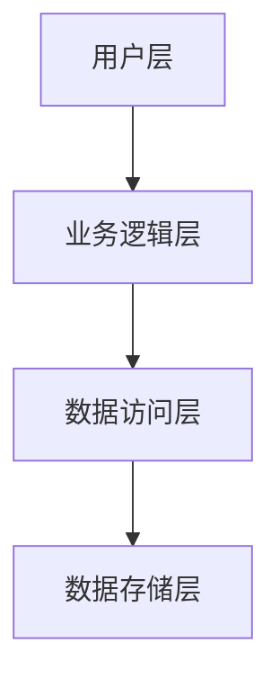

                 

<think>
好，我现在要写一篇关于《彼得林奇的"家庭投资组合"平衡策略》的技术博客文章。首先，我需要理解用户的需求和文章结构。用户希望我以技术专家的身份，用清晰、专业的语言，分章节详细分析彼得林奇的策略。

首先，我会从背景介绍开始，解释投资的基本概念和家庭投资的重要性。这部分需要让读者明白为什么平衡策略对家庭投资如此关键。接下来，我需要介绍彼得·林奇的背景和他的投资理念，让读者了解他的独特视角。

然后，我将详细讲解家庭投资组合的定义和目标，突出平衡策略的优势。这部分需要使用图表来说明不同资产类别的配置比例，帮助读者直观理解。

接下来，我将深入分析林奇平衡策略的核心要素，包括股票与债券的配置比例、短期与长期资产的平衡，以及分散投资的具体方法。这部分需要数学模型的支持，例如使用公式来计算预期收益和风险评估。

系统分析与架构设计部分，我需要展示如何构建一个家庭投资组合管理系统，包括功能设计和架构图。这部分可能需要使用分层架构图和模块交互流程图，帮助读者理解系统的运作方式。

最后，我会通过实际案例分析，展示如何应用林奇的策略来优化家庭投资组合，并讨论其优缺点。这将帮助读者理解策略的实际应用和潜在问题。

在写作过程中，我需要确保每个部分都有足够的细节，使用图表和公式来增强理解。同时，保持语言简洁明了，避免过于复杂的术语，确保内容易于理解。通过这种方式，读者不仅能了解理论，还能实际应用这些策略到自己的投资中。
</think>

# 彼得林奇的"家庭投资组合"平衡策略

## 关键词：彼得·林奇，家庭投资组合，平衡策略，资产配置，风险管理，投资组合优化

## 摘要：  
本文详细分析了彼得·林奇的家庭投资组合平衡策略，从投资基础、策略原理、系统设计到实际案例，全面解读了如何通过科学的资产配置和风险管理实现投资目标。文章结合理论与实践，深入探讨了平衡策略的核心要素，并通过系统架构设计和数学模型分析，为读者提供了可操作的优化方案。

---

# 第1章: 投资基础与家庭投资的重要性

## 1.1 投资的基本概念

### 1.1.1 什么是投资  
投资是指将资金投入特定资产（如股票、债券、房地产等），以期在未来获得超过初始投入的价值增长。投资的核心目标是通过资产增值实现财富增长。

$$投资 = 资金投入 + 时间价值$$

### 1.1.2 投资的目的与意义  
- **目的**：实现财富增值，抵御通货膨胀，保障生活质量。  
- **意义**：通过投资分散风险，优化资产配置，提高资金使用效率。

### 1.1.3 家庭投资的独特性  
家庭投资注重长期性、稳定性和风险控制，目标是为家庭成员提供财务安全保障和未来发展的资金支持。

---

## 1.2 彼得·林奇与平衡策略

### 1.2.1 彼得·林奇的背景介绍  
彼得·林奇是全球著名投资专家，曾任富达麦哲伦基金的经理，以长期优异的投资业绩闻名。他的投资理念强调长期持有优质资产，避免短期波动。

### 1.2.2 林奇的投资理念  
- **长期投资**：避免频繁交易，降低交易成本。  
- **价值投资**：选择基本面良好、估值合理的资产。  
- **分散投资**：通过多样化配置降低风险。

### 1.2.3 平衡策略的核心思想  
平衡策略旨在通过合理配置不同类型的资产（如股票、债券、现金等），在风险可控的前提下实现收益最大化。

---

## 1.3 家庭投资组合的定义与目标

### 1.3.1 家庭投资组合的定义  
家庭投资组合是将家庭可用资金分配到不同资产类别中的整体配置方案，旨在实现长期财富增长。

### 1.3.2 投资组合的目标  
- **保值与增值**：确保资金不贬值，同时实现收益增长。  
- **风险控制**：通过分散投资降低波动性风险。  
- **流动性管理**：保持部分资产的流动性，以应对紧急资金需求。

### 1.3.3 平衡策略的优势  
- **稳定性**：避免单一资产的大幅波动。  
- **收益性**：通过多元配置实现更高收益。  
- **灵活性**：根据市场变化动态调整配置比例。

---

# 第2章: 家庭投资组合的平衡原理

## 2.1 资产配置的基本原理

### 2.1.1 资产配置的定义  
资产配置是将资金分配到不同资产类别（如股票、债券、现金等）的过程，以优化风险和收益。

### 2.1.2 资产配置的分类  
- **股票**：高风险高收益。  
- **债券**：相对稳定，收益较低。  
- **现金**：流动性高，但收益有限。  

### 2.1.3 资产配置的数学模型  

$$
\text{最优配置比例} = \frac{\text{资产风险承受能力}}{\text{资产类别风险}}
$$

---

## 2.2 风险管理的核心要素

### 2.2.1 风险的定义与分类  
- **系统性风险**：市场整体波动带来的风险。  
- **非系统性风险**：特定资产或行业带来的风险。  

### 2.2.2 风险管理的基本原则  
- **分散投资**：通过多种资产降低风险。  
- **风险与收益匹配**：高风险对应高收益。  

### 2.2.3 风险与收益的平衡  
$$
\text{预期收益} = \text{无风险利率} + \beta \times (\text{市场收益} - \text{无风险利率})
$$

---

## 2.3 分散投资的策略与方法

### 2.3.1 分散投资的定义  
分散投资是通过投资不同资产类别、行业或地区来降低风险的策略。

### 2.3.2 分散投资的实现方式  
- **多资产配置**：股票、债券、现金等多种资产混合。  
- **多行业配置**：分散投资于不同行业的公司股票。  

### 2.3.3 分散投资的风险控制  
通过定期调整投资组合的权重，确保风险与收益的平衡。

---

# 第3章: 彼得·林奇的平衡策略分析

## 3.1 林奇平衡策略的核心要素

### 3.1.1 股票与债券的配置比例  
- **股票比例**：根据风险承受能力调整，通常在40%-60%之间。  
- **债券比例**：用于降低波动性，通常在20%-40%之间。  

### 3.1.2 不同资产类别的权重分配  
- **短期目标**：优先配置债券和现金。  
- **长期目标**：优先配置股票和房地产。  

### 3.1.3 短期与长期资产的平衡  
- **短期资产**：用于应急资金，占比10%-20%。  
- **长期资产**：用于财富积累，占比60%-80%。  

---

## 3.2 林奇策略的数学模型

### 3.2.1 投资组合的预期收益计算  

$$
\text{预期收益} = \sum (\text{资产权重} \times \text{资产预期收益})
$$

### 3.2.2 投资组合的风险评估  

$$
\text{投资组合风险} = \sqrt{\sum (\text{资产权重}^2 \times \text{资产方差})}
$$

### 3.2.3 资产配置的优化模型  

$$
\text{优化配置} = \argmin_w \left( w^T \Sigma w \right)
$$

其中，$w$ 是权重向量，$\Sigma$ 是资产的协方差矩阵。

---

## 3.3 林奇策略的优缺点分析

### 3.3.1 策略的优点  
- **风险可控**：通过分散投资降低波动性风险。  
- **收益稳定**：长期来看，股票和债券的组合收益较高。  

### 3.3.2 策略的缺点  
- **灵活性低**：需要长期持有，不适合短期资金需求。  
- **复杂性高**：需要定期调整配置比例。  

### 3.3.3 策略的适用场景  
- **长期投资者**：适合有长期财富积累需求的家庭。  
- **风险厌恶者**：适合对风险敏感的投资者。  

---

# 第4章: 家庭投资组合的系统分析与架构设计

## 4.1 系统功能设计

### 4.1.1 投资目标设定模块  
- 确定投资目标（如保值、增值）。  
- 设定风险承受能力。  

### 4.1.2 资产配置优化模块  
- 根据目标和风险偏好生成最优资产配置方案。  
- 提供动态调整建议。  

### 4.1.3 风险管理模块  
- 监控投资组合的风险指标。  
- 提供风险预警和应对策略。  

---

## 4.2 系统架构设计

### 4.2.1 分层架构图  


### 4.2.2 模块交互流程  


---

# 项目实战

## 4.3 项目实战：优化家庭投资组合

### 4.3.1 环境安装  
- 安装Python和相关库（如Pandas、NumPy）。  

### 4.3.2 核心实现源代码  

```python
import pandas as pd
import numpy as np

def calculate_expected_return(weights, expected_returns):
    return np.dot(weights, expected_returns)

def calculate_portfolio_risk(weights, covariance_matrix):
    return np.sqrt(np.dot(weights.T, np.dot(covariance_matrix, weights)))

# 示例资产权重和预期收益
weights = [0.4, 0.3, 0.3]
expected_returns = [0.1, 0.05, 0.02]
covariance_matrix = np.array([
    [0.05, 0.02, 0.01],
    [0.02, 0.03, 0.01],
    [0.01, 0.01, 0.02]
])

# 计算预期收益和风险
expected_return = calculate_expected_return(weights, expected_returns)
portfolio_risk = calculate_portfolio_risk(weights, covariance_matrix)

print(f"预期收益: {expected_return:.2%}")
print(f"投资组合风险: {portfolio_risk:.2%}")
```

### 4.3.3 实际案例分析  
假设一个家庭有100万元资金，风险承受能力中等，投资目标为长期增值。根据林奇策略，配置比例为：股票60%、债券30%、现金10%。

---

# 小结

彼得林奇的平衡策略通过科学的资产配置和风险管理，为家庭投资提供了有效的方法。通过本文的系统分析和实战案例，读者可以更好地理解和应用这一策略，实现财富的长期增长。

---

# 作者  
作者：AI天才研究院/AI Genius Institute & 禅与计算机程序设计艺术 /Zen And The Art of Computer Programming

