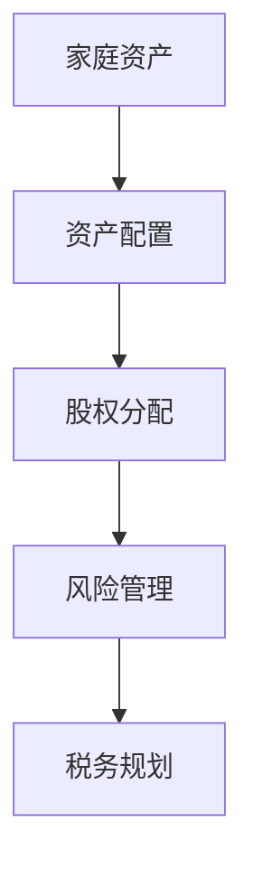
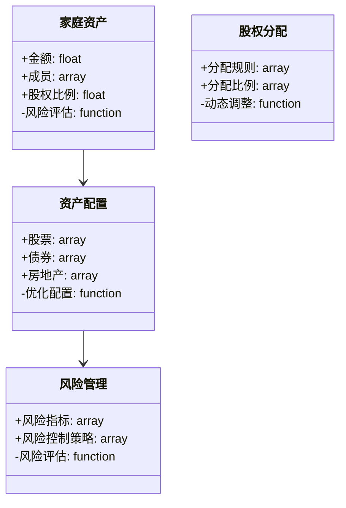
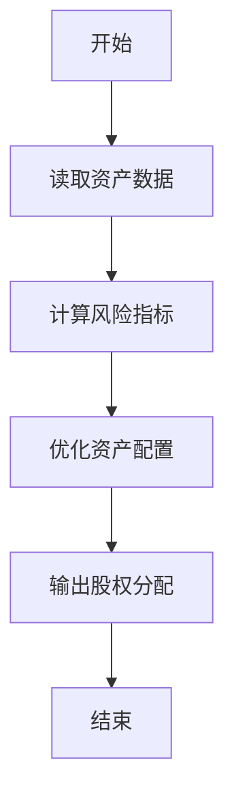

                 


```markdown
# 彼得林奇的"家庭股票"在跨代财富传承中的作用

> 关键词：彼得·林奇，家庭股票，财富传承，投资理念，系统架构，案例分析

> 摘要：本文深入探讨了彼得·林奇提出的“家庭股票”概念在跨代财富传承中的重要作用。通过分析其投资理念、系统架构及实际案例，展示了如何将家庭资产视为股票管理，以实现财富的保值与增值，同时平衡家庭成员利益。

---

## 第一部分: 背景介绍

### 第1章: 彼得·林奇的投资理念

#### 1.1 彼得·林奇的生平简介
彼得·林奇（Peter Lynch）是全球著名投资专家，以其在富达投资集团的卓越表现闻名。他的投资理念强调长期价值和分散投资，认为市场波动是投资机会。

#### 1.2 家庭股票的核心概念
家庭股票指将家庭资产视为股票管理，通过长期投资和分散配置实现财富增长。

#### 1.3 家庭股票与传统财富传承的区别
传统传承方式常面临分配不均和税务问题，而家庭股票通过股权结构优化，平衡各方利益。

### 第2章: 家庭股票的系统架构

#### 2.1 系统模块划分
系统包括资产配置、股权分配、风险管理等模块。

#### 2.2 系统功能概述
家庭股票系统通过模块化设计，实现资产的优化配置和风险控制。

#### 2.3 系统架构图


---

## 第二部分: 家庭股票的系统分析与架构设计

### 第3章: 系统分析与架构设计

#### 3.1 问题场景介绍
跨代传承中，财富分配不均和税务问题是主要挑战。

#### 3.2 系统功能设计
家庭股票系统通过模块化设计，实现资产的优化配置和风险控制。

#### 3.3 系统架构设计


### 第4章: 家庭股票的算法与数学模型

#### 4.1 算法流程图


#### 4.2 数学模型
风险评估模型：
$$
风险系数 = \sum_{i=1}^{n} (资产_i \times 风险权重_i)
$$

### 第5章: 案例分析

#### 5.1 案例背景介绍
一个富裕家庭计划将资产传承至下一代，需平衡分配与税务问题。

#### 5.2 案例分析
通过家庭股票系统，优化资产配置，平衡股权分配，降低税务负担。

---

## 第三部分: 结论与展望

### 第6章: 结论

#### 6.1 家庭股票的优势
家庭股票通过系统化管理，实现财富的保值与增值。

### 第7章: 未来展望

#### 7.1 技术发展
人工智能在财富管理中的应用将推动家庭股票系统进一步优化。

---

## 附录

### 附录A: 工具与资源

- Python代码示例
- 系统架构工具

### 附录B: 参考文献

- 彼得·林奇投资著作
- 相关学术文献

---

## 作者

作者：AI天才研究院 & 禅与计算机程序设计艺术
```

