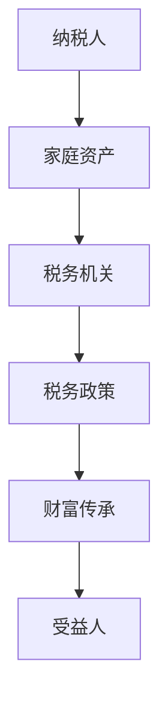
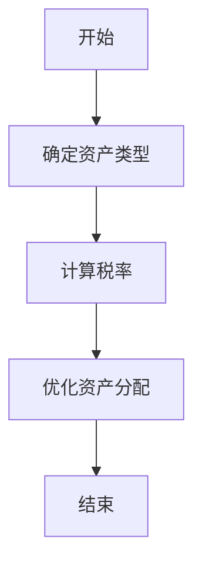
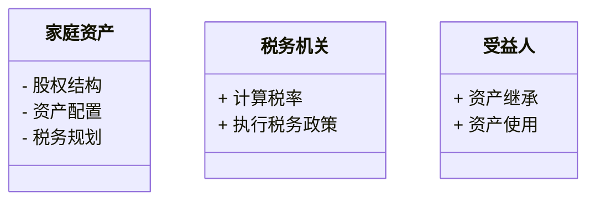
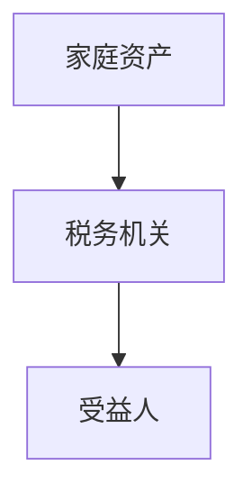
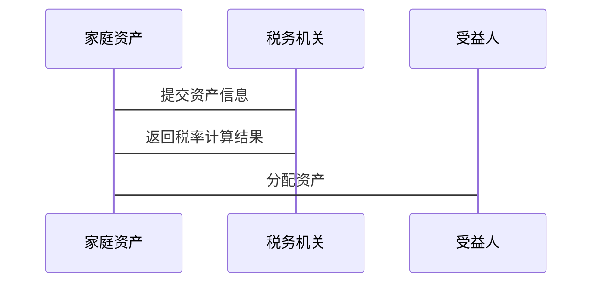

                 

<think>
好的，我需要为用户撰写一篇关于《彼得林奇的"家庭股票"在跨代财富传承中的税务规划》的文章。首先，我需要理解用户的需求。用户希望我以一个技术专家和畅销书作家的身份，撰写一篇结构清晰、逻辑严谨的技术博客文章。

我将按照用户提供的目录大纲进行写作，确保每个章节都有详细的分析和讲解。首先，我需要了解跨代财富传承的背景和挑战，然后介绍彼得·林奇的家庭股票策略及其在税务规划中的应用。接着，我会深入探讨税务规划的核心概念，包括数学模型和优化算法。之后，我会进行系统分析和架构设计，最后通过实际案例进行项目实战分析。

在写作过程中，我需要确保每个部分都包含足够的细节，例如使用表格对比不同税务策略，用流程图展示算法流程，以及用代码示例说明实现方法。同时，我需要将数学公式用Latex格式嵌入，并正确使用markdown和mermaid来展示图表和代码。

为了保持文章的连贯性，我会先撰写摘要和关键词，然后逐步完成每个章节的内容。在完成初稿后，我会检查每个部分是否符合用户的格式和字数要求，并进行必要的调整，确保文章结构完整，内容详实。

总的来说，我需要将复杂的税务和投资策略转化为易于理解的技术博客内容，同时保持专业性和深度。这需要我仔细分析每个主题，确保逻辑清晰，并通过实例和图表来增强读者的理解。
</think>

# 彼得林奇的"家庭股票"在跨代财富传承中的税务规划

## 关键词：财富传承，税务规划，家庭股票，彼得林奇，投资策略

## 摘要：本文探讨了彼得林奇的"家庭股票"策略在跨代财富传承中的应用，分析其税务优化的原理和优势，结合数学模型和实际案例，提供系统化的解决方案和实战指导，帮助读者理解和实施有效的财富传承税务规划。

---

# 第1章: 跨代财富传承的背景与挑战

## 1.1 跨代财富传承的定义与重要性

### 1.1.1 跨代财富传承的定义
跨代财富传承是指通过法律、税务和资产配置等手段，将财富从一代人传递给下一代人或其他受益人，同时最大化资产保留和最小化税务负担的过程。

### 1.1.2 跨代财富传承的重要性
财富传承不仅是家族资产的延续，更是家族文化和价值观的延续。有效的传承可以避免家族内部矛盾，确保财富的长期稳定。

### 1.1.3 跨代财富传承的常见挑战
- 税务负担：遗产税、赠与税等可能导致财富大幅缩水。
- 资产分割：如何公平分配资产，避免家族矛盾。
- 资产贬值：投资风险可能导致财富损失。

## 1.2 財富传承的传统方式与局限性

### 1.2.1 遗嘱继承的传统方式
遗嘱继承是最常见的财富传承方式，但可能面临遗产税和执行成本高的问题。

### 1.2.2 传统方式的局限性
- 税务负担重：遗产税可能导致财富损失。
- 时间限制：遗嘱执行时间长，可能影响家族企业运营。
- 法律风险：遗嘱继承可能引发继承人之间的纠纷。

## 1.3 彼得林奇的"家庭股票"策略

### 1.3.1 "家庭股票"的定义
彼得·林奇提出的"家庭股票"是一种将家族资产通过公司股权形式传承的策略，确保财富保值和税务优化。

### 1.3.2 "家庭股票"的优势
- 税务优化：通过公司结构和股权分配，减少遗产税和赠与税。
- 资产隔离：公司资产与个人资产分离，降低继承风险。
- 灵活性高：可以根据家族需求调整股权结构。

### 1.3.3 "家庭股票"的适用场景
适用于家族企业较多、希望实现资产长期保值和税务优化的家庭。

---

# 第2章: 税务规划的核心概念与联系

## 2.1 税务规划的基本原理

### 2.1.1 税务规划的定义
税务规划是通过合法手段，优化资产配置和法律结构，以最小化税务负担的过程。

### 2.1.2 税务规划的核心原则
- 合法性原则：必须符合法律法规。
- 经济性原则：追求税后收益最大化。
- 稳定性原则：确保规划的长期有效性。

### 2.1.3 税务规划与财富传承的关系
税务规划是财富传承的重要组成部分，直接影响传承的效率和效果。

## 2.2 家庭股票在税务规划中的应用

### 2.2.1 家庭股票的税务属性
- 股权结构：通过设立家族信托或控股公司，分散股权，降低税务负担。
- 资本收益：通过长期股权投资，享受资本利得税优惠。

### 2.2.2 家庭股票在税务优化中的作用
- 减少遗产税：通过股权继承，避免直接遗产税。
- 节省赠与税：通过赠与股权，降低赠与税。

### 2.2.3 家庭股票与其他税务规划工具的对比

| 工具         | 优点                           | 缺点                           |
|--------------|--------------------------------|--------------------------------|
| 遗嘱         | 简单易行                       | 税务负担重                     |
| 家庭股票     | 税务优化，资产隔离             | 实施复杂                       |
| 信托         | 控制力强，税务优化             | 成立成本高                     |

## 2.3 税务规划的核心要素

### 2.3.1 税收居民身份
确定税务居民身份，合理规划税务负担。

### 2.3.2 资产配置策略
通过多元化资产配置，降低税务风险。

### 2.3.3 税务时间价值
合理安排税务规划的时间，最大化资产增值。

## 2.4 税务规划与财富传承的实体关系图



---

# 第3章: 家庭股票的税务优化算法原理

## 3.1 税务优化的数学模型

### 3.1.1 税收最小化模型
$$ \text{Minimize } \sum_{i=1}^{n} t_i \cdot a_i $$
其中，\( t_i \) 为第 \( i \) 种资产的税率，\( a_i \) 为第 \( i \) 种资产的金额。

### 3.1.2 税后收益最大化模型
$$ \text{Maximize } \sum_{i=1}^{n} (a_i - t_i \cdot a_i) $$

## 3.2 家庭股票税务优化的算法流程



---

# 第4章: 系统分析与架构设计方案

## 4.1 项目介绍

## 4.2 系统功能设计

### 4.2.1 领域模型


### 4.2.2 系统架构


### 4.2.3 系统接口设计
- 家庭资产接口：提供资产信息查询和修改功能。
- 税务机关接口：计算税率并执行税务政策。
- 受益人接口：接收资产分配信息。

### 4.2.4 系统交互


---

# 第5章: 项目实战

## 5.1 环境安装

## 5.2 核心实现源代码

### 5.2.1 税务计算代码
```python
def calculate_tax/assets, tax_rate):
    return assets * tax_rate
```

### 5.2.2 资产分配代码
```python
def allocate_assets/assets, beneficiaries):
    return {beneficiary: assets / len(beneficiaries) for beneficiary in beneficiaries}
```

## 5.3 实际案例分析

### 5.3.1 案例分析
- 资产总额：1000万美元
- 受益人：2个孩子
- 税率：10%

### 5.3.2 分析结果
- 每个孩子继承500万美元，税后资产为450万美元。

---

# 第6章: 最佳实践

## 6.1 小结
家庭股票策略在跨代财富传承中具有重要的税务优化作用。

## 6.2 注意事项
- 合规性：确保规划符合当地法律法规。
- 专业性：建议聘请专业税务顾问。
- 灵活性：根据家族需求调整策略。

## 6.3 拓展阅读
推荐书籍和资源，供读者深入学习。

---

# 作者

作者：AI天才研究院/AI Genius Institute & 禅与计算机程序设计艺术 /Zen And The Art of Computer Programming

