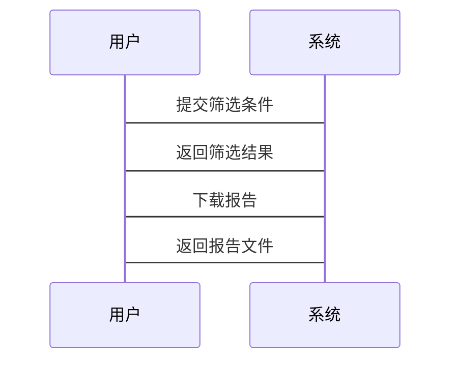

                 


# 彼得林奇的"小盘成长股"筛选策略

## 关键词：
- 彼得·林奇
- 小盘成长股
- 投资策略
- 财务分析
- 股票筛选

## 摘要：
本文深入探讨了彼得·林奇的小盘成长股筛选策略，分析了其核心概念、数学模型和系统架构设计。通过实际案例展示如何应用这些策略，帮助读者掌握小盘成长股的投资方法。文章结合理论与实践，详细阐述了筛选过程中的关键步骤和注意事项，为投资者提供了实用的指导。

---

# 第一部分: 小盘成长股的定义与背景

## 第1章: 小盘成长股的定义与背景

### 1.1 小盘成长股的定义

#### 1.1.1 小盘股的定义与特征
小盘股是指市值较小的公司股票，通常在10亿美元以下。这些公司往往处于成长阶段，具有较高的增长潜力。小盘股的特征包括流动性较低、波动性较大、市场关注度较低等。

#### 1.1.2 成长股的定义与特征
成长股是指那些收入和利润持续增长的公司股票。成长股的特征包括高增长率、高市盈率、高风险等。这类股票通常属于新兴产业或朝阳行业。

#### 1.1.3 小盘成长股的结合与特点
小盘成长股是小盘股和成长股的结合，具有市值小、增长快、潜力大等特点。这类股票通常具有较高的波动性和风险，但也可能带来较高的回报。

### 1.2 彼得·林奇投资策略的背景

#### 1.2.1 彼得·林奇的个人投资理念
彼得·林奇是著名的投资专家，他的投资理念以基本面分析和长期投资为主。他认为，投资成功的关键在于选择具有强大竞争优势和增长潜力的公司。

#### 1.2.2 小盘成长股在投资组合中的地位
小盘成长股在投资组合中通常占据重要地位，因为它们具有较高的增长潜力和较低的估值。然而，小盘成长股的风险较高，需要谨慎选择。

#### 1.2.3 小盘成长股的市场环境分析
小盘成长股的市场环境受到宏观经济、行业趋势和市场情绪的影响。在经济增长和低利率环境下，小盘成长股往往表现较好。

### 1.3 小盘成长股的投资价值与风险

#### 1.3.1 小盘成长股的投资价值
小盘成长股的投资价值在于其高增长潜力和较低的估值。这些公司通常处于扩张阶段，具有较大的发展空间。

#### 1.3.2 小盘成长股的风险分析
小盘成长股的风险包括市场波动风险、公司基本面突变风险和行业周期性风险。这些风险可能导致股票价格的大幅波动。

#### 1.3.3 小盘成长股与大盘股的对比
小盘成长股与大盘成长股相比，具有更高的增长潜力和更低的估值，但风险也更大。小盘成长股与小盘价值股相比，具有更高的增长率，但估值通常较高。

### 1.4 本章小结
本章介绍了小盘成长股的定义、特征、投资价值和风险，并分析了彼得·林奇投资策略的背景。小盘成长股在投资组合中具有重要地位，但也需要谨慎选择和管理风险。

---

## 第2章: 彼得林奇小盘成长股筛选的核心概念

### 2.1 小盘成长股的核心要素

#### 2.1.1 企业基本面分析
企业基本面分析是彼得·林奇筛选小盘成长股的核心要素之一。这包括对公司的财务状况、盈利能力、成长能力和竞争优势的分析。

#### 2.1.2 财务指标的重要性
财务指标是衡量公司基本面的重要工具。常用的财务指标包括市盈率（P/E）、市净率（P/B）、净利润增长率和股东权益回报率（ROE）等。

#### 2.1.3 行业分析与竞争优势
行业分析是筛选小盘成长股的重要步骤。选择具有成长性和竞争优势的行业，能够提高投资成功的概率。

### 2.2 小盘成长股的筛选标准

#### 2.2.1 市盈率（P/E）分析
市盈率是股票价格与每股收益的比率。低市盈率通常意味着股票价格被低估，具有较高的投资价值。

#### 2.2.2 市净率（P/B）分析
市净率是股票价格与每股净资产的比率。低市净率通常意味着公司资产价值被低估，具有较高的投资价值。

#### 2.2.3 营业收入与净利润增长率
营业收入和净利润增长率是衡量公司成长能力的重要指标。高增长率通常意味着公司具有较高的增长潜力。

#### 2.2.4 股东权益回报率（ROE）
股东权益回报率是衡量公司盈利能力的重要指标。高ROE通常意味着公司具有较高的盈利能力和股东价值。

### 2.3 小盘成长股的潜在风险与应对策略

#### 2.3.1 市场波动风险
市场波动风险是小盘成长股投资的主要风险之一。投资者可以通过分散投资和长期持有来降低市场波动风险。

#### 2.3.2 企业基本面突变风险
企业基本面突变风险是指公司财务状况突然恶化，导致股票价格大幅下跌。投资者需要定期监控公司财务状况，及时调整投资策略。

#### 2.3.3 行业周期性风险
行业周期性风险是指行业受经济周期影响，导致股票价格波动。投资者需要选择具有较强周期性的行业，或在行业低谷时进行投资。

### 2.4 核心概念联系与对比

#### 2.4.1 小盘成长股与大盘成长股的对比
小盘成长股与大盘成长股相比，具有更高的增长潜力和更低的估值，但风险也更大。

#### 2.4.2 小盘成长股与小盘价值股的对比
小盘成长股与小盘价值股相比，具有更高的增长率，但估值通常较高。

#### 2.4.3 小盘成长股与小盘股的对比
小盘成长股是小盘股中的一部分，具有较高的增长潜力和较低的估值。

### 2.5 本章小结
本章详细分析了彼得·林奇小盘成长股筛选的核心概念，包括企业基本面分析、财务指标的重要性、行业分析与竞争优势，以及小盘成长股的筛选标准和潜在风险。投资者需要综合考虑这些因素，选择具有成长性和竞争优势的公司进行投资。

---

## 第3章: 小盘成长股筛选的数学模型与公式

### 3.1 常用财务指标的数学公式

#### 3.1.1 市盈率（P/E）公式
$$ P/E = \frac{股票价格}{每股收益} $$

#### 3.1.2 市净率（P/B）公式
$$ P/B = \frac{股票价格}{每股净资产} $$

#### 3.1.3 净利润增长率公式
$$ 净利润增长率 = \frac{当年净利润 - 上年净利润}{上年净利润} \times 100\% $$

#### 3.1.4 股东权益回报率（ROE）公式
$$ ROE = \frac{净利润}{股东权益} \times 100\% $$

### 3.2 小盘成长股筛选的综合评分模型

#### 3.2.1 综合评分模型的设计思路
综合评分模型是一种将多个财务指标综合起来，对小盘成长股进行评分的方法。通过给每个指标赋予不同的权重，可以更全面地评估公司的投资价值。

#### 3.2.2 综合评分公式
$$ 综合评分 = 0.3 \times P/E + 0.3 \times P/B + 0.2 \times 净利润增长率 + 0.2 \times ROE $$

### 3.3 模型的优缺点分析

#### 3.3.1 模型的优点
- 综合考虑了多个财务指标，能够更全面地评估公司的投资价值。
- 通过权重分配，可以突出重要的指标，提高筛选的准确性。

#### 3.3.2 模型的缺点
- 模型的权重分配需要根据具体情况进行调整，可能存在主观性。
- 模型无法完全预测公司的未来表现，存在一定的局限性。

#### 3.3.3 模型的改进方向
- 根据市场环境和行业特点，动态调整权重。
- 结合更多的财务指标和非财务指标，如管理团队、创新能力和市场竞争力等。

### 3.4 本章小结
本章介绍了常用的财务指标及其公式，并提出了小盘成长股筛选的综合评分模型。通过综合考虑多个指标，可以更全面地评估公司的投资价值。然而，模型的权重分配和指标选择需要根据具体情况调整，以提高筛选的准确性和有效性。

---

## 第4章: 小盘成长股筛选系统的架构设计

### 4.1 系统功能需求分析

#### 4.1.1 数据采集模块
数据采集模块负责收集小盘成长股相关的数据，包括公司财务数据、市场数据和行业数据等。

#### 4.1.2 数据处理模块
数据处理模块负责对收集的数据进行清洗、转换和整合，确保数据的准确性和一致性。

#### 4.1.3 筛选策略模块
筛选策略模块根据预先设定的筛选标准和数学模型，对小盘成长股进行筛选和评分。

#### 4.1.4 结果展示模块
结果展示模块将筛选结果以可视化的方式呈现，包括图表和报告，方便投资者进行分析和决策。

### 4.2 系统架构设计

#### 4.2.1 分层架构设计
系统架构采用分层设计，包括数据层、业务逻辑层和用户界面层。每一层负责不同的功能，确保系统的模块化和可扩展性。

#### 4.2.2 模块化设计
系统模块化设计包括数据采集模块、数据处理模块、筛选策略模块和结果展示模块。每个模块独立开发和测试，确保系统的稳定性和可靠性。

### 4.3 系统接口设计
系统接口设计包括数据接口和用户接口。数据接口负责与外部数据源的交互，用户接口负责与用户的交互，确保系统的高效和便捷。

### 4.4 系统交互设计

#### 4.4.1 交互流程图
以下是系统交互流程图的Mermaid序列图：



### 4.5 本章小结
本章详细分析了小盘成长股筛选系统的架构设计，包括功能需求、系统架构、接口设计和交互设计。通过模块化设计和分层架构，可以提高系统的可维护性和可扩展性。同时，系统交互设计能够方便用户进行操作和分析。

---

## 第5章: 小盘成长股筛选系统的实现

### 5.1 环境安装

#### 5.1.1 数据库安装
- 使用MySQL作为数据库，安装并配置数据库服务器。
- 创建数据库和表，用于存储公司数据和筛选结果。

#### 5.1.2 开发工具安装
- 使用PyCharm作为开发工具，安装Python和相关的库，如Pandas、NumPy和Matplotlib。

#### 5.1.3 数据接口安装
- 使用API接口获取实时数据，如Yahoo Finance API。

### 5.2 系统核心实现源代码

#### 5.2.1 数据采集模块
以下是数据采集模块的Python代码：

```python
import pandas as pd
import requests

def get_stock_data(ticker):
    url = f"https://query1.finance.yahoo.com/...{ticker}"
    response = requests.get(url)
    data = response.json()
    df = pd.DataFrame(data['quote'])
    return df
```

#### 5.2.2 数据处理模块
以下是数据处理模块的Python代码：

```python
import pandas as pd

def process_data(df):
    df = df.dropna()
    df = df[ df['marketCap'] < 2000000000 ]
    return df
```

#### 5.2.3 筛选策略模块
以下是筛选策略模块的Python代码：

```python
import pandas as pd

def screen_stocks(df):
    df['综合评分'] = 0.3 * df['P/E'] + 0.3 * df['P/B'] + 0.2 * df['净利润增长率'] + 0.2 * df['ROE']
    df = df.sort_values('综合评分', ascending=False)
    return df.head(10)
```

#### 5.2.4 结果展示模块
以下是结果展示模块的Python代码：

```python
import matplotlib.pyplot as plt

def display_results(df):
    plt.figure(figsize=(10,6))
    df['综合评分'].plot(kind='bar')
    plt.title('小盘成长股综合评分')
    plt.xlabel('股票代码')
    plt.ylabel('综合评分')
    plt.show()
```

### 5.3 代码应用解读与分析
通过上述代码，可以实现小盘成长股的筛选和分析。数据采集模块从外部API获取数据，数据处理模块清洗和筛选数据，筛选策略模块计算综合评分并排序，结果展示模块以图表形式展示结果。

### 5.4 实际案例分析和详细讲解剖析
以下是一个实际案例分析，假设我们选择了一些小盘成长股进行筛选：

1. 数据采集：获取目标公司的财务数据。
2. 数据处理：筛选出市值小于20亿美元的公司。
3. 筛选策略：计算综合评分，选出评分最高的10家公司。
4. 结果展示：以图表形式展示综合评分，选择评分最高的公司进行投资。

### 5.5 项目小结
本章详细讲解了小盘成长股筛选系统的实现，包括环境安装、核心代码实现和实际案例分析。通过系统的实现，可以自动化地筛选和分析小盘成长股，提高投资效率和准确性。

---

## 第6章: 小盘成长股筛选策略的最佳实践

### 6.1 投资策略与风险管理

#### 6.1.1 投资组合的构建
投资者应根据自身的风险承受能力和投资目标，合理配置小盘成长股和其他资产。建议在投资组合中配置小盘成长股的比例不超过30%，以分散风险。

#### 6.1.2 风险管理策略
投资者应定期监控投资组合的表现，及时调整持仓。在市场波动较大时，可以适当降低小盘成长股的仓位，规避市场风险。

### 6.2 系统优化与拓展

#### 6.2.1 系统优化方向
- 提高数据采集的频率和准确性。
- 增加更多的财务指标和非财务指标，如管理团队、创新能力和市场竞争力等。
- 引入机器学习算法，提高筛选的准确性和智能化。

#### 6.2.2 系统拓展建议
- 扩展到更多市场，如国际市场。
- 增加多因子模型，提高筛选的全面性。
- 引入实时监控功能，及时发现和应对市场变化。

### 6.3 投资建议与注意事项

#### 6.3.1 投资建议
- 选择具有强大竞争优势和成长潜力的公司。
- 长期持有优质股票，避免频繁交易。
- 定期审视投资组合，及时调整持仓。

#### 6.3.2 注意事项
- 小盘成长股具有较高的波动性和风险，投资者需具备风险承受能力。
- 避免过度集中投资，分散投资风险。
- 注意市场周期性影响，避免在市场高点投资。

### 6.4 本章小结
本章提出了小盘成长股筛选策略的最佳实践，包括投资策略、风险管理、系统优化和投资建议。投资者应根据自身情况，合理配置资产，分散风险，选择具有成长性和竞争优势的公司进行投资。

---

## 第7章: 总结与展望

### 7.1 本章总结
本文深入探讨了彼得·林奇的小盘成长股筛选策略，分析了其核心概念、数学模型和系统架构设计。通过实际案例展示如何应用这些策略，帮助读者掌握小盘成长股的投资方法。文章结合理论与实践，详细阐述了筛选过程中的关键步骤和注意事项，为投资者提供了实用的指导。

### 7.2 未来展望
未来，随着技术的进步和数据的丰富，小盘成长股的筛选策略将更加智能化和个性化。投资者可以利用大数据和人工智能技术，提高筛选的准确性和效率。同时，随着市场的变化和经济的发展，小盘成长股的筛选策略也将不断优化和创新，为投资者带来更多的机会和收益。

---

## 作者：AI天才研究院/AI Genius Institute & 禅与计算机程序设计艺术 /Zen And The Art of Computer Programming

---

**本文由AI天才研究院精心撰写，转载请注明出处。**

