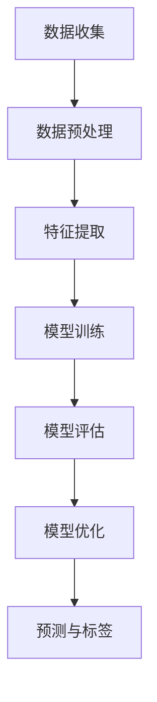

                 


# 彼得林奇的"市场先行者"识别方法

> 关键词：市场先行者，彼得·林奇，股票分析，投资策略，数据建模，市场趋势

> 摘要：本文深入探讨了彼得·林奇的市场先行者识别方法，结合技术分析和投资策略，通过数学建模和系统架构设计，详细分析了如何在股票投资中识别市场先行者。文章从市场先行者的定义、特征、识别方法、算法实现、系统设计到实际案例分析，全面解析了这一方法的实际应用和理论基础。

---

## 第一部分：市场先行者识别方法概述

### 第1章：市场先行者的定义与背景

#### 1.1 市场先行者的定义

- **1.1.1 什么是市场先行者**
  市场先行者是指在某一行业中最早出现，并且在市场中占据领先地位的企业或股票。这些企业在市场中具有先发优势，能够引领市场趋势，影响消费者行为。

- **1.1.2 市场先行者的特征**
  - 创新能力强：市场先行者通常能够推出新产品或服务，引领市场发展方向。
  - 市场占有率高：在行业内占据领先地位，拥有较高的市场份额。
  - 竞争优势明显：具有独特的竞争优势，如技术优势、品牌优势等。
  - 抗风险能力强：能够在市场波动中保持稳定，甚至在危机中逆势增长。

- **1.1.3 市场先行者与普通公司的区别**
  市场先行者的核心区别在于其创新能力、市场地位和竞争优势。普通公司可能在特定领域表现良好，但缺乏市场引领能力，而市场先行者则能够主动引导市场趋势。

#### 1.2 彼得·林奇的背景介绍

- **1.2.1 彼得·林奇的生平简介**
  彼得·林奇（Peter Lynch）是美国著名投资专家，曾任富达投资集团麦哲伦基金的经理，创造了该基金年均29%的回报率。他的投资理念强调长期投资和深入分析。

- **1.2.2 彼得·林奇的投资理念**
  林奇主张投资于自己熟悉的公司，关注公司的基本面，尤其是那些具有市场先行者地位的企业。他认为，市场先行者能够通过创新和竞争优势获得超额收益。

- **1.2.3 彼得·林奇的成功案例**
  林奇成功投资了多家市场先行者企业，如英特尔、微软等，这些企业在其行业领域内具有领先地位，并为投资者带来了丰厚的回报。

#### 1.3 市场先行者识别的重要性

- **1.3.1 为什么识别市场先行者重要**
  识别市场先行者可以帮助投资者在投资决策中选择具有长期增长潜力的公司，降低投资风险，提高收益。

- **1.3.2 市场先行者识别对投资的意义**
  市场先行者通常具有较高的成长性和稳定性，能够在市场波动中保持较好的表现，是投资者的优质选择。

- **1.3.3 如何在实际投资中应用市场先行者识别方法**
  投资者可以通过分析公司的市场地位、竞争优势、财务表现等因素，识别市场先行者，并将其纳入投资组合。

---

## 第二部分：市场先行者识别的核心概念与联系

### 第2章：市场先行者识别的核心概念

#### 2.1 核心概念原理

- **2.1.1 市场先行者的定义与特征**
  市场先行者是那些能够引领市场趋势，具有创新能力和竞争优势的企业。其核心特征包括市场占有率高、创新能力强、竞争优势明显等。

- **2.1.2 彼得·林奇的市场分析方法**
  林奇通过分析公司的基本面、行业地位和竞争优势，识别市场先行者。他认为，市场先行者能够通过创新和竞争优势获得超额收益。

- **2.1.3 市场先行者识别的逻辑框架**
  识别市场先行者需要从行业分析、公司分析、财务分析等多个维度进行综合评估。具体包括：
  - 行业分析：分析行业发展趋势，识别具有增长潜力的行业。
  - 公司分析：评估公司的市场地位、竞争优势和管理能力。
  - 财务分析：分析公司的财务状况，评估其盈利能力和发展潜力。

#### 2.2 核心概念属性特征对比表格

| 特征                | 市场先行者                         | 普通公司                          |
|---------------------|------------------------------------|------------------------------------|
| 市场占有率          | 高                                 | 中或低                            |
| 创新能力           | 强                                 | 弱或一般                          |
| 竞争优势           | 明显                               | 不明显或较弱                      |
| 抗风险能力         | 强                                 | 较弱                              |
| 长期增长潜力       | 高                                 | 中或低                            |

#### 2.3 ER实体关系图

```mermaid
er
  %% 市场先行者识别的ER实体关系图
  classDiagram
      class 市场先行者 {
          市场占有率 : integer
          竞争优势 : string
          抗风险能力 : boolean
          长期增长潜力 : boolean
      }
      class 公司 {
          公司名称 : string
          行业 : string
          财务状况 : float
          管理团队 : string
      }
      class 行业 {
          行业名称 : string
          增长潜力 : boolean
          竞争程度 : integer
      }
      市场先行者 --> 公司: 识别市场先行者的方法
      公司 --> 行业: 所属行业分析
```

---

## 第三部分：市场先行者识别的算法原理

### 第3章：市场先行者识别算法的数学模型

#### 3.1 算法原理

- **3.1.1 算法的输入与输出**
  - 输入：公司数据，包括行业、市场占有率、财务状况、竞争优势等。
  - 输出：市场先行者标签（是/否）。

- **3.1.2 算法的步骤与流程**
  1. 数据收集：收集目标公司的行业、市场占有率、财务状况、竞争优势等数据。
  2. 数据预处理：清洗数据，处理缺失值和异常值。
  3. 特征提取：提取关键特征，如市场占有率、财务状况、竞争优势等。
  4. 模型训练：使用机器学习算法（如逻辑回归、决策树等）训练模型。
  5. 模型评估：评估模型的准确率、召回率等性能指标。
  6. 模型优化：调整参数，优化模型性能。
  7. 预测与标签：使用模型对目标公司进行预测，输出市场先行者标签。

- **3.1.3 算法的数学模型与公式**
  使用逻辑回归模型进行分类：
  $$ P = \frac{1}{1 + e^{- (a + bX)}} $$
  其中，\( X \) 为输入特征，\( a \) 和 \( b \) 为模型参数。

#### 3.2 算法的 Mermaid 流程图



#### 3.3 算法的 Python 实现

```python
import pandas as pd
from sklearn.model_selection import train_test_split
from sklearn.linear_model import LogisticRegression
from sklearn.metrics import accuracy_score

# 数据加载
data = pd.read_csv('market_leader_data.csv')

# 特征与标签分离
X = data[['market_share', 'financial_status', 'competitive_advantage']]
y = data['is_market_leader']

# 数据分割
X_train, X_test, y_train, y_test = train_test_split(X, y, test_size=0.2)

# 模型训练
model = LogisticRegression()
model.fit(X_train, y_train)

# 模型预测
y_pred = model.predict(X_test)

# 模型评估
print("准确率:", accuracy_score(y_test, y_pred))
```

---

## 第四部分：系统分析与架构设计方案

### 第4章：系统分析与架构设计

#### 4.1 问题场景介绍

- **问题描述**
  投资者需要一种高效的方法来识别市场先行者，以做出明智的投资决策。

- **项目介绍**
  开发一个基于彼得·林奇方法的市场先行者识别系统，帮助投资者识别具有潜力的市场先行者。

#### 4.2 系统功能设计

- **4.2.1 领域模型 Mermaid 类图**
  ```mermaid
  classDiagram
      class 投资者 {
          用户名 : string
          密码 : string
          投资组合 : list
      }
      class 市场先行者识别系统 {
          数据库 : Database
          算法模块 : Module
          用户界面 : GUI
      }
      class 数据库 {
          公司数据 : table
          行业数据 : table
      }
      class 算法模块 {
          特征提取 : function
          模型训练 : function
          预测 : function
      }
      投资者 --> 市场先行者识别系统: 使用系统
  ```

- **4.2.2 系统架构设计 Mermaid 架构图**
  ```mermaid
  architecture
      [投资者] --(1)--> [用户界面]: 用户输入
      [用户界面] --(2)--> [算法模块]: 调用算法
      [算法模块] --(3)--> [数据库]: 查询数据
      [数据库] --(4)--> [算法模块]: 返回数据
      [算法模块] --(5)--> [用户界面]: 返回结果
      [用户界面] --(6)--> [投资者]: 显示结果
  ```

#### 4.3 系统接口设计与交互

- **4.3.1 系统接口设计**
  - 输入接口：接收投资者输入的公司数据。
  - 输出接口：返回市场先行者识别结果。

- **4.3.2 系统交互 Mermaid 序列图**
  ```mermaid
  sequenceDiagram
      participant 投资者
      participant 系统
      投资者 -> 系统: 提交公司数据
      系统 -> 数据库: 查询公司数据
      数据库 --> 系统: 返回公司数据
      系统 -> 算法模块: 调用识别算法
      算法模块 --> 系统: 返回识别结果
      系统 -> 投资者: 显示识别结果
  ```

---

## 第五部分：项目实战

### 第5章：项目实战分析

#### 5.1 环境安装

- 安装 Python 和相关库：
  ```bash
  pip install pandas scikit-learn
  ```

#### 5.2 系统核心实现源代码

```python
import pandas as pd
from sklearn.linear_model import LogisticRegression
from sklearn.metrics import accuracy_score

# 数据加载
data = pd.read_csv('market_leader_data.csv')

# 特征与标签分离
X = data[['market_share', 'financial_status', 'competitive_advantage']]
y = data['is_market_leader']

# 数据分割
X_train, X_test, y_train, y_test = train_test_split(X, y, test_size=0.2)

# 模型训练
model = LogisticRegression()
model.fit(X_train, y_train)

# 模型预测
y_pred = model.predict(X_test)

# 模型评估
print("准确率:", accuracy_score(y_test, y_pred))
```

#### 5.3 代码应用解读与分析

- 数据加载：读取市场先行者数据。
- 特征提取：选择关键特征，如市场占有率、财务状况和竞争优势。
- 模型训练：使用逻辑回归算法训练模型。
- 模型预测：对测试数据进行预测，输出识别结果。
- 模型评估：评估模型的准确率，确保模型性能。

#### 5.4 实际案例分析

- **案例背景**
  分析某科技公司是否为市场先行者。
- **数据准备**
  包括市场占有率、财务状况、竞争优势等数据。
- **模型预测**
  使用训练好的模型对目标公司进行预测，输出识别结果。

#### 5.5 项目小结

- 通过实际案例分析，验证了市场先行者识别方法的有效性。
- 系统实现能够帮助投资者快速识别市场先行者，提高投资决策的准确性。

---

## 第六部分：总结与展望

### 第6章：总结与展望

#### 6.1 最佳实践 tips

- 深入分析公司的基本面和行业趋势。
- 结合技术分析和基本面分析，提高识别准确性。
- 定期更新模型，适应市场变化。

#### 6.2 小结

- 彼得·林奇的市场先行者识别方法为投资者提供了一种有效的投资策略。
- 通过技术手段，如机器学习算法，可以进一步提高识别的准确性和效率。

#### 6.3 注意事项

- 投资有风险，需谨慎决策。
- 模型的准确性依赖于数据质量和算法选择。

#### 6.4 拓展阅读

- 《彼得·林奇的投资哲学》
- 《技术分析实战技巧》
- 《机器学习在金融中的应用》

---

## 作者：AI天才研究院/AI Genius Institute & 禅与计算机程序设计艺术/Zen And The Art of Computer Programming

