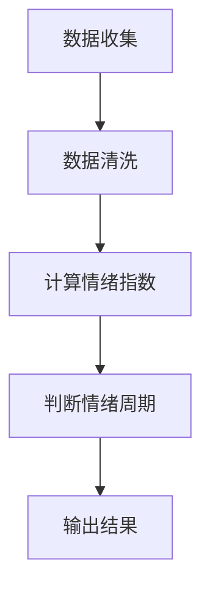
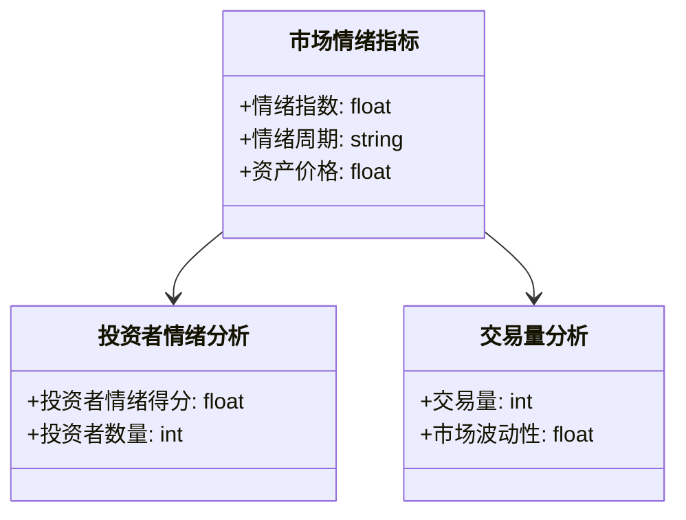
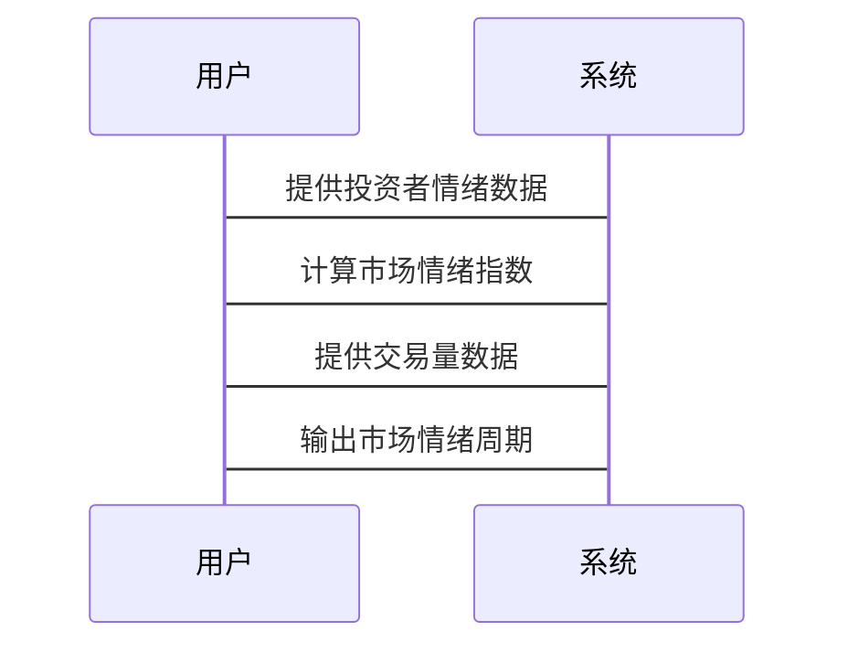

                 


# 彼得林奇的市场情绪指标分析

> 关键词：市场情绪，彼得林奇，投资决策，情绪指标，资产价格

> 摘要：本文详细分析了彼得林奇提出的市场情绪指标，探讨其在投资决策中的应用，结合数学模型和算法实现，展示了如何通过市场情绪分析来优化投资策略。

---

# 第一部分: 市场情绪的基本概念

## 第1章: 市场情绪的定义与特征

### 1.1 市场情绪的定义与特征

#### 1.1.1 市场情绪的定义
市场情绪（Market Sentiment）是指投资者对市场未来走势的总体看法和预期。它反映了投资者的心理状态，通常可以通过市场参与者的交易行为、媒体舆论、市场数据等多方面进行衡量。市场情绪是影响资产价格波动的重要因素之一，尤其是在股票、加密货币等高波动性资产中表现得尤为明显。

#### 1.1.2 市场情绪的特征
市场情绪具有以下几个关键特征：
1. **波动性**：市场情绪会随着市场环境的变化而迅速波动。
2. **周期性**：市场情绪通常会经历周期性变化，如乐观→怀疑→悲观→乐观。
3. **传染性**：市场情绪往往会在投资者之间传播，形成群体性行为。
4. **滞后性**：市场情绪的变化通常会滞后于市场实际走势。

#### 1.1.3 市场情绪与投资决策的关系
市场情绪与投资决策密切相关。当市场情绪过于乐观时，资产价格可能会被高估，此时投资者可能会选择卖出；而当市场情绪过于悲观时，资产价格可能被低估，投资者可能会选择买入。彼得林奇认为，市场情绪是衡量市场风险的重要指标之一，可以通过分析市场情绪来寻找投资机会。

### 1.2 彼得林奇与市场情绪分析

#### 1.2.1 彼得林奇的背景介绍
彼得·林奇（Peter Lynch）是美国著名的职业基金经理，被誉为“共同基金之父”。他在任职波士顿基金期间，创造了年均29%的收益率，成为投资界的传奇人物。彼得林奇的成功部分归功于他对市场情绪的深刻理解，他认为市场情绪是影响投资决策的重要因素。

#### 1.2.2 彼得林奇对市场情绪的研究
彼得林奇在其职业生涯中，通过分析市场情绪的变化，寻找那些被市场情绪低估的投资机会。他认为，市场情绪的变化往往会导致市场定价的偏差，从而为投资者提供获利的机会。

#### 1.2.3 彼得林奇市场情绪指标的核心思想
彼得林奇的市场情绪指标的核心思想是：通过分析市场情绪的变化，找到那些市场情绪与实际市场价值相背离的资产，从而进行投资决策。

---

## 第2章: 市场情绪指标的构成与分类

### 2.1 市场情绪指标的主要构成

#### 2.1.1 投资者情绪指数
投资者情绪指数（Investor Sentiment Index）是衡量市场情绪的重要指标之一，通常通过调查投资者对市场的看法来计算。例如，可以通过对投资者进行问卷调查，统计看多、看空和中立的比例，进而计算出投资者情绪指数。

#### 2.1.2 市场恐慌指数
市场恐慌指数（Market Panic Index）是衡量市场恐慌程度的指标，通常通过分析市场的波动性和交易量来计算。市场恐慌指数越高，表示市场的恐慌情绪越浓，反之则表示市场的乐观情绪越浓。

#### 2.1.3 市场情绪周期
市场情绪周期（Market Sentiment Cycle）是指市场情绪从乐观到悲观再到乐观的周期性变化。通过分析市场情绪周期，投资者可以更好地把握市场的波动规律，从而做出更明智的投资决策。

### 2.2 市场情绪指标的分类

#### 2.2.1 短期市场情绪指标
短期市场情绪指标主要用于衡量短期内的市场情绪变化，通常适用于高频交易和短线投资。例如，通过分析分钟级别的交易数据，可以计算出短期市场情绪指数。

#### 2.2.2 中长期市场情绪指标
中长期市场情绪指标用于衡量中长期的市场情绪变化，通常适用于长线投资和资产配置。例如，通过分析月度或季度的市场数据，可以计算出中长期市场情绪指数。

#### 2.2.3 综合市场情绪指标
综合市场情绪指标是将短期、中长期市场情绪指标综合起来，形成一个全面的市场情绪评估体系。通过综合市场情绪指标，投资者可以更好地把握市场的整体情绪变化。

---

## 第3章: 彼得林奇市场情绪指标的数学模型

### 3.1 市场情绪指标的数学定义

#### 3.1.1 市场情绪指数的计算公式
市场情绪指数（E）的计算公式如下：
$$E = \frac{S}{N}$$
其中，S为投资者情绪得分，N为投资者数量。

#### 3.1.2 市场情绪周期的数学模型
市场情绪周期（C）的数学模型如下：
$$C = \sum_{i=1}^{n} (E_i \times T_i)$$
其中，E_i为第i阶段的情绪指数，T_i为第i阶段的时间权重。

### 3.2 市场情绪与资产价格的关系模型

#### 3.2.1 市场情绪与资产价格的正相关关系
市场情绪与资产价格通常呈正相关关系，即市场情绪越高，资产价格越高。其数学关系式为：
$$P = aE + b$$
其中，P为资产价格，E为市场情绪指数，a为相关系数，b为常数项。

---

## 第4章: 彼得林奇市场情绪指标的算法实现

### 4.1 市场情绪指标的计算步骤

#### 4.1.1 数据收集与处理
首先，需要收集市场情绪相关数据，包括投资者情绪得分、交易量、市场波动性等。然后，对数据进行清洗和预处理，确保数据的准确性和完整性。

#### 4.1.2 情绪指数计算
根据收集到的数据，计算市场情绪指数。例如，使用投资者情绪得分和投资者数量计算情绪指数：
$$E = \frac{S}{N}$$

#### 4.1.3 市场情绪周期判定
根据计算出的情绪指数，判断市场情绪周期。例如，将市场情绪周期分为乐观、中性、悲观三个阶段，并根据情绪指数的变化趋势进行周期判定。

### 4.2 市场情绪指标的算法流程图



### 4.3 市场情绪指标的Python实现

```python
import pandas as pd

def calculate_emotion_index(data):
    emotion_scores = data['情绪得分']
    n = len(emotion_scores)
    emotion_index = emotion_scores.sum() / n
    return emotion_index

# 示例数据
data = pd.DataFrame({
    '情绪得分': [0.7, 0.8, 0.6, 0.9, 0.5],
    '交易量': [1000, 1200, 900, 1500, 800]
})

emotion_index = calculate_emotion_index(data)
print("市场情绪指数:", emotion_index)
```

---

## 第5章: 市场情绪指标的系统分析与设计

### 5.1 项目应用场景

#### 5.1.1 投资者情绪分析
通过市场情绪指标，投资者可以更好地了解市场的整体情绪，从而做出更明智的投资决策。

#### 5.1.2 资产配置优化
市场情绪指标可以帮助投资者优化资产配置，例如在市场情绪乐观时增加风险资产的配置，在市场情绪悲观时增加防御性资产的配置。

### 5.2 系统功能设计

#### 5.2.1 领域模型设计



#### 5.2.2 系统架构设计


### 5.3 系统接口设计

#### 5.3.1 输入接口
- 投资者情绪得分
- 投资者数量
- 交易量
- 市场波动性

#### 5.3.2 输出接口
- 市场情绪指数
- 市场情绪周期

### 5.4 系统交互设计



---

## 第6章: 项目实战

### 6.1 环境安装与配置

#### 6.1.1 安装Python环境
需要安装Python 3.8及以上版本，并安装pandas库：
```bash
pip install pandas
```

### 6.2 核心代码实现

#### 6.2.1 情绪指数计算代码

```python
import pandas as pd

def calculate_emotion_index(data):
    emotion_scores = data['情绪得分']
    n = len(emotion_scores)
    emotion_index = emotion_scores.sum() / n
    return emotion_index

# 示例数据
data = pd.DataFrame({
    '情绪得分': [0.7, 0.8, 0.6, 0.9, 0.5],
    '交易量': [1000, 1200, 900, 1500, 800]
})

emotion_index = calculate_emotion_index(data)
print("市场情绪指数:", emotion_index)
```

#### 6.2.2 情绪周期判断代码

```python
def determine_emotion_cycle(emotion_index):
    if emotion_index > 0.8:
        return "乐观"
    elif emotion_index < 0.2:
        return "悲观"
    else:
        return "中性"

cycle = determine_emotion_cycle(emotion_index)
print("市场情绪周期:", cycle)
```

### 6.3 实际案例分析

#### 6.3.1 数据分析
假设我们有以下数据：
- 投资者情绪得分：[0.7, 0.8, 0.6, 0.9, 0.5]
- 交易量：[1000, 1200, 900, 1500, 800]

计算得到的市场情绪指数为：
$$E = \frac{0.7 + 0.8 + 0.6 + 0.9 + 0.5}{5} = 0.7$$

根据情绪周期判断函数，市场情绪周期为“中性”。

#### 6.3.2 结果解读
市场情绪指数为0.7，属于中性水平，说明当前市场情绪较为平稳，没有明显的乐观或悲观情绪。投资者可以根据市场情绪周期的判断，选择合适的资产配置策略。

---

## 第7章: 最佳实践与小结

### 7.1 最佳实践

#### 7.1.1 定期更新数据
市场情绪指标需要定期更新，以反映最新的市场情况。

#### 7.1.2 结合其他指标
市场情绪指标可以与其他指标（如技术指标、基本面指标）结合使用，以提高投资决策的准确性。

### 7.2 小结
本文详细分析了彼得林奇的市场情绪指标，探讨了其在投资决策中的应用。通过数学模型和算法实现，展示了如何通过市场情绪分析来优化投资策略。市场情绪指标是一种 powerful工具，可以帮助投资者更好地理解市场走势，做出更明智的投资决策。

---

## 作者信息

作者：AI天才研究院/AI Genius Institute & 禅与计算机程序设计艺术 /Zen And The Art of Computer Programming

---

# 感谢您的阅读！

