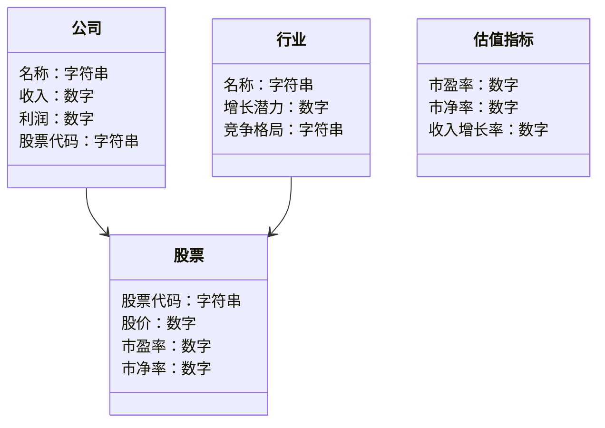

                 

<think>
嗯，我现在要帮用户写一篇关于彼得林奇的市场机会识别技巧的技术博客。用户给了我一个详细的目录大纲，看起来内容很全面。我需要按照这个大纲一步步来写，确保每个部分都详细且符合用户的要求。

首先，我得先理解彼得·林奇是谁，为什么他能识别市场机会。他是个著名的基金经理，以长期投资和深入研究著称。他的方法主要是基本面分析，寻找被低估的公司。好的，那我需要把这些信息整理到“彼得·林奇与市场机会概述”部分。

接下来是算法与数学模型部分。我需要解释林奇的基本面分析方法，比如市盈率、市净率等。这些可以用数学公式来表达，比如市盈率是股价除以每股收益。我应该用LaTeX把这些公式写出来，比如$$市盈率 = \frac{股价}{每股收益}$$。

然后是系统架构设计。我需要画个图，展示从数据收集到投资决策的流程。可以用Mermaid流程图，这样读者能直观理解。同时，还要写代码部分，用Python来计算这些指标，比如如何获取股价数据和财务数据，计算市盈率和市净率。

在项目实战部分，我需要选一个具体的案例，比如科技行业，分析苹果和亚马逊。展示如何应用林奇的方法，计算它们的市盈率和市净率，对比行业平均值，判断是否低估。然后写代码，展示如何获取数据和计算这些指标。

最后是总结与最佳实践，强调彼得·林奇的核心理念，如长期投资、深入研究和价值评估。还要给读者一些注意事项和扩展阅读的内容，帮助他们进一步学习。

现在，我需要确保每个部分都详细展开，使用技术语言但又不失清晰。同时，检查每个部分是否符合用户的格式要求，比如使用markdown，插入mermaid图和LaTeX公式。我需要一步步来，先写背景，再讲解方法，然后是算法和系统设计，接着是实战案例，最后总结。

可能我还需要补充一些细节，比如在基本面分析中，除了市盈率和市净率，还要考虑收入增长、利润 margins 和负债情况。这些都可以用表格和图表来展示，帮助读者更好地理解。

总之，我要确保整篇文章结构清晰，内容详实，每个部分都紧扣主题，帮助读者理解彼得·林奇的市场机会识别技巧，并能够实际应用这些方法。现在开始按照大纲一步步撰写内容。
</think>

# 彼得林奇的"市场机会"识别技巧

---

## 关键词：
- 彼得·林奇
- 市场机会识别
- 投资策略
- 基本面分析
- 股票投资

---

## 摘要：
本文深入探讨了彼得·林奇的市场机会识别技巧，结合其投资理念、分析方法和实际案例，详细分析了如何通过基本面分析、相对估值法和行业趋势分析来识别市场机会。文章从理论到实践，系统地讲解了彼得·林奇的投资策略，并通过代码实现和案例分析，帮助读者掌握市场机会识别的核心技巧。

---

## 第一部分：引言与背景

### 第1章：彼得·林奇与市场机会概述

#### 1.1 彼得·林奇的背景与投资理念
- **彼得·林奇的生平简介**  
  彼得·林奇（Peter Lynch）是美国著名的股票投资人，曾任富达麦哲伦基金（Fidelity Magellen Fund）的经理，管理该基金超过10年，创造了年均29%的回报率。他以深入的基本面分析和长期投资策略闻名，被誉为“股票投资的常胜将军”。

- **林奇的投资哲学与核心理念**  
  彼得·林奇认为，投资的最终目标是找到那些被市场低估的公司，并长期持有，等待其价值回归。他强调，市场机会的核心在于发现那些具有强大竞争优势、良好财务状况和持续增长潜力的公司。

- **市场机会识别的重要性**  
  在金融市场中，识别市场机会是投资者获取超额收益的关键。彼得·林奇的方法不仅帮助投资者找到低估的股票，还能在市场波动中保持稳定的投资回报。

#### 1.2 市场机会的基本概念
- **市场机会的定义与特征**  
  市场机会是指在特定市场条件下，某些股票或行业因价格低估、行业趋势或公司基本面改善而产生的投资机会。这些机会通常具有较高的增长潜力和较低的估值水平。

- **市场机会的类型与分类**  
  市场机会可以分为成长型机会、价值型机会和周期性机会。成长型机会关注高增长公司的股票，价值型机会关注被市场低估的股票，周期性机会则关注受经济周期影响较大的行业。

- **市场机会与投资决策的关系**  
  市场机会是投资决策的核心依据。通过识别市场机会，投资者可以在不同市场环境下调整投资组合，优化收益并降低风险。

---

## 第二部分：彼得·林奇的市场机会识别方法

### 第2章：彼得·林奇的投资理念

#### 2.1 林奇的市场机会识别框架
- **市场机会识别的核心要素**  
  彼得·林奇的市场机会识别框架包括以下几个核心要素：
  1. 公司基本面：包括收入、利润、负债和现金流等财务指标。
  2. 市场估值：包括市盈率（P/E）、市净率（P/B）等估值指标。
  3. 行业趋势：包括行业增长潜力和竞争格局。

- **林奇的“三好公司”标准**  
  彼得·林奇提出的“三好公司”标准是：
  1. 好行业：选择具有持续增长潜力的行业。
  2. 好公司：选择具有强大竞争优势和良好财务状况的公司。
  3. 好价格：选择被市场低估的股票。

- **市场机会的周期性分析**  
  彼得·林奇强调，市场机会具有周期性。在市场下跌时，许多优质股票会被低估，此时是买入的好时机。而在市场上涨时，投资者需要警惕高估的风险。

#### 2.2 林奇的投资策略与工具
- **基本面分析法**  
  基本面分析法是彼得·林奇的核心投资策略之一。他通过分析公司的财务报表，重点关注收入、利润、负债和现金流等指标，评估公司的财务健康状况和增长潜力。

- **相对估值法**  
  相对估值法是通过比较股票的估值指标（如市盈率、市净率）与行业平均水平或竞争对手的估值水平，识别被低估的股票。

- **行业趋势分析法**  
  彼得·林奇非常重视行业趋势分析。他通过研究行业的增长潜力、竞争格局和政策环境，选择具有长期增长潜力的行业。

---

## 第三部分：市场机会识别的算法与数学模型

### 第3章：市场机会识别的算法原理

#### 3.1 基本面分析法的数学模型
- **市盈率（P/E）计算公式**  
  $$\text{市盈率} = \frac{\text{股价}}{\text{每股收益}}$$  
  例如，某公司股价为50元，每股收益为5元，则市盈率为10倍。

- **市净率（P/B）计算公式**  
  $$\text{市净率} = \frac{\text{股价}}{\text{每股净资产}}$$  
  例如，某公司股价为50元，每股净资产为10元，则市净率为5倍。

- **收入增长率计算公式**  
  $$\text{收入增长率} = \frac{\text{本年收入} - \text{上年收入}}{\text{上年收入}} \times 100\%$$

#### 3.2 相对估值法的算法流程
- **步骤1：选择行业基准**  
  根据目标公司的行业，选择行业平均市盈率和市净率作为基准。

- **步骤2：计算目标公司与行业基准的差异**  
  比较目标公司的市盈率和市净率与行业基准的差异，判断其是否被低估。

- **步骤3：调整投资策略**  
  如果目标公司的估值低于行业基准，则考虑买入；如果高于行业基准，则考虑卖出。

---

## 第四部分：系统分析与架构设计

### 第4章：系统架构设计

#### 4.1 系统功能设计
- **领域模型设计**  
  使用Mermaid类图描述市场机会识别系统的领域模型，包括公司、行业、股票、估值指标等核心实体。



#### 4.2 系统架构设计
- **系统架构图**  
  使用Mermaid架构图描述市场机会识别系统的整体架构，包括数据采集、估值计算、策略分析和结果输出四大模块。


---

## 第五部分：项目实战

### 第5章：项目实战

#### 5.1 项目环境安装
- **安装Python环境**  
  使用Anaconda安装Python 3.9及以上版本，并安装以下库：
  - pandas
  - numpy
  - matplotlib
  - yfinance

#### 5.2 核心代码实现
- **获取股票数据**  
  使用yfinance库获取目标公司的股价和财务数据。

```python
import yfinance as yf
import pandas as pd

# 下载苹果公司（AAPL）的股价数据
apple = yf.download('AAPL', start='2020-01-01', end='2023-12-31')
# 下载亚马逊公司（AMZN）的股价数据
amazon = yf.download('AMZN', start='2020-01-01', end='2023-12-31')
```

- **计算估值指标**  
  计算目标公司的市盈率和市净率，并与行业基准进行比较。

```python
def calculate_valuation(ticker):
    # 获取公司信息
    data = yf.Ticker(ticker).info
    # 计算市盈率
    pe_ratio = data['currentPrice'] / data['forwardEarnings']
    # 计算市净率
    pb_ratio = data['currentPrice'] / data['bookValue']
    return pe_ratio, pb_ratio

# 计算苹果和亚马逊的市盈率和市净率
apple_pe, apple_pb = calculate_valuation('AAPL')
amazon_pe, amazon_pb = calculate_valuation('AMZN')
```

- **比较与分析**  
  将目标公司的估值指标与行业基准进行比较，判断其是否被低估。

---

## 第六部分：总结与最佳实践

### 第6章：总结与最佳实践

#### 6.1 小结
- 彼得·林奇的市场机会识别技巧以基本面分析为核心，通过深入研究公司财务状况和行业趋势，识别被低估的投资机会。

#### 6.2 注意事项
- 投资者在实际操作中应结合市场环境和自身风险承受能力，谨慎决策。
- 市场机会识别需要持续学习和实践，不断优化分析方法和投资策略。

#### 6.3 拓展阅读
- 《彼得·林奇的成功投资》
- 《股票投资实战策略》

---

## 作者：AI天才研究院 & 禅与计算机程序设计艺术

---

通过以上详细分析和实战案例，我们可以看到彼得·林奇的市场机会识别技巧不仅是一种投资策略，更是一种系统化的分析方法。通过结合基本面分析、相对估值法和行业趋势分析，投资者可以更精准地识别市场机会，实现长期稳定的投资收益。

