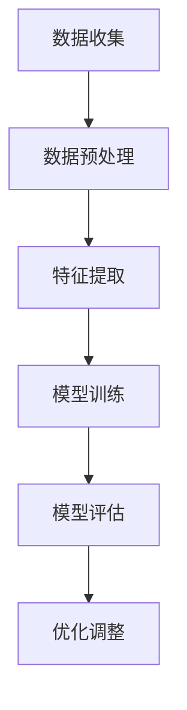
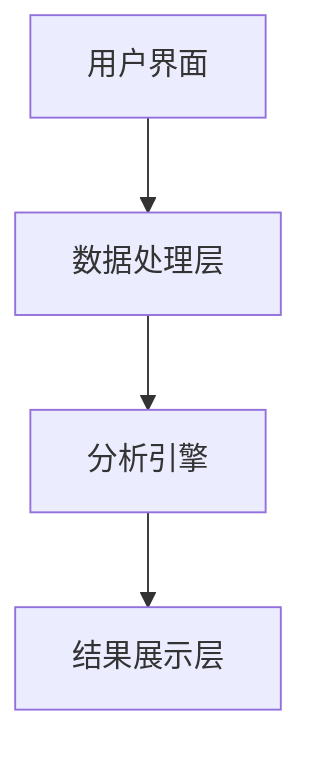
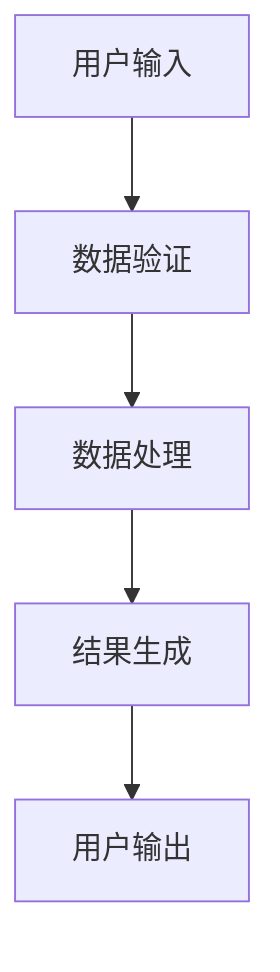

                 

<think>
嗯，用户希望我帮他设计一本名为《彼得林奇的"市场机会"识别训练方法》的目录大纲。他特别指出要结构清晰，符合技术博客的风格，而且是分章节的。首先，我得明确这本书的核心内容应该是围绕彼得·林奇的投资策略，特别是如何识别市场机会。

我需要先分析用户的需求，他可能是一位对投资分析和系统设计感兴趣的人，或者是一位技术人士，希望将彼得·林奇的方法转化为技术性的分析工具。因此，目录需要涵盖背景介绍、核心概念、算法原理、系统架构设计、项目实战以及最佳实践。

接下来，我会考虑每一部分的内容。背景介绍部分需要先介绍彼得·林奇的生平和成就，这样读者可以了解他的投资哲学。然后是市场机会识别的基本概念，确保读者明白这是什么以及为什么重要。

核心概念部分需要详细讲解市场趋势、竞争优势和财务指标，使用对比表格和ER图来帮助理解。算法原理部分需要用Mermaid流程图展示投资决策的流程，并用Python代码实现模型，这样技术读者可以实际操作。

系统分析与架构设计部分，可能需要构建一个投资分析系统，用类图和序列图展示系统设计。项目实战部分通过具体案例，比如科技行业和公司财务分析，展示方法的实际应用。

最后，最佳实践部分总结彼得·林奇的方法，并给出实用建议。整个目录需要逻辑连贯，每部分细化到三级目录，确保内容全面且易于理解。同时，要保持语言简洁专业，适合技术博客的读者。

现在，我需要将这些思考转化为具体的目录结构，确保每个部分都有详细的内容，同时符合用户的要求，比如使用markdown格式，包含代码示例和图表。这样，读者不仅能理解理论，还能实际应用这些方法进行投资分析。
</think>

# 彼得林奇的"市场机会"识别训练方法

> 关键词：彼得·林奇，市场机会，投资策略，系统设计，算法模型

> 摘要：本文深入探讨了彼得·林奇的市场机会识别方法，从其投资哲学到具体的投资策略，结合技术分析和系统设计，详细阐述了如何将这些方法应用于实际投资分析中。通过案例分析和系统设计，本文为读者提供了从理论到实践的完整指南。

---

## 第一部分：背景介绍

### 第1章：彼得·林奇及其投资理念

#### 1.1 彼得·林奇的生平与成就

- **1.1.1 早期经历**  
  彼得·林奇的职业生涯始于1960年代，他的投资天赋使他在早期就崭露头角。

- **1.1.2 投资成就**  
  作为富达麦哲伦基金的经理，彼得·林奇创造了令人瞩目的投资成绩，其管理的基金年收益率超过29%。

- **1.1.3 投资哲学**  
  彼得·林奇强调长期投资、深入研究和避免短期波动。

#### 1.2 市场机会识别的基本概念

- **1.2.1 市场机会的定义**  
  市场机会是指在特定市场中，由于某种趋势或变化，某类资产或公司的价值被低估，从而为投资者带来超额收益的机会。

- **1.2.2 识别市场机会的重要性**  
  正确识别市场机会是投资成功的关键，它能够帮助投资者在市场波动中抓住潜在收益。

- **1.2.3 市场机会的特征**  
  包括低估值、行业趋势、竞争优势等。

---

## 第二部分：核心概念与联系

### 第2章：市场机会识别的关键要素

#### 2.1 市场趋势分析

- **2.1.1 行业发展趋势**  
  通过分析行业周期、技术创新和市场需求，识别行业的增长潜力。

- **2.1.2 宏观经济环境**  
  考虑GDP增长、利率水平、通货膨胀等因素对市场的影响。

- **2.1.3 市场周期分析**  
  识别市场的牛市、熊市和震荡市，制定相应的投资策略。

#### 2.2 企业竞争优势

- **2.2.1 核心竞争力**  
  分析企业的技术优势、成本优势和市场地位。

- **2.2.2 财务状况分析**  
  通过财务报表评估企业的盈利能力、资产负债情况和现金流健康状况。

- **2.2.3 管理团队能力**  
  调查管理层的背景、经验和战略规划能力。

#### 2.3 财务指标分析

- **2.3.1 收益能力**  
  股息率、市盈率、市净率等指标的分析。

- **2.3.2 资产质量**  
  资产负债表的健康状况，包括应收账款、存货和固定资产。

- **2.3.3 负债情况**  
  评估企业的债务水平和偿债能力。

#### 2.4 核心概念对比分析

```mermaid
table
| 要素       | 定义                                                                 |
|------------|----------------------------------------------------------------------|
| 市场趋势   | 行业和技术的发展方向，影响市场的整体走势。                           |
| 企业优势   | 企业的核心竞争力，包括技术、成本和市场地位。                     |
| 财务指标   | 反映企业财务健康状况的关键数据，如利润、负债和现金流。           |
```

---

## 第三部分：算法原理讲解

### 第3章：市场机会识别的算法模型

#### 3.1 算法原理概述

- **数据收集与处理**  
  收集市场数据，包括价格、成交量、财务指标等。

- **特征提取**  
  从数据中提取有助于识别市场机会的关键特征。

- **模型构建**  
  使用机器学习算法（如回归分析、支持向量机）构建预测模型。

- **模型验证与优化**  
  通过回测和交叉验证优化模型性能。

#### 3.2 算法流程图



#### 3.3 投资决策模型的数学公式

- **收益预测模型**  
  使用线性回归模型预测股票收益：
  $$ R = \beta_0 + \beta_1 x_1 + \beta_2 x_2 + \epsilon $$
  其中，$x_1$ 和 $x_2$ 是关键特征，$\beta$ 是回归系数。

- **风险评估模型**  
  使用波动率衡量投资风险：
  $$ \sigma = \sqrt{\frac{1}{n}\sum_{i=1}^{n}(R_i - \mu)^2} $$
  其中，$\mu$ 是平均收益，$R_i$ 是单个时间点的收益。

---

## 第四部分：系统分析与架构设计

### 第4章：投资分析系统的构建

#### 4.1 系统功能设计

- **数据采集模块**  
  实时采集股票价格、财务数据等。

- **分析模块**  
  包括趋势分析、财务分析和风险评估。

- **投资决策模块**  
  根据分析结果生成投资建议。

#### 4.2 系统架构设计



#### 4.3 接口设计与交互流程图



---

## 第五部分：项目实战

### 第5章：实际案例分析

#### 5.1 案例一：科技行业市场机会识别

- **数据收集**  
  收集科技行业的历史价格、财务数据和行业新闻。

- **模型应用**  
  使用线性回归模型预测科技股的未来收益。

- **投资建议**  
  根据模型结果，建议投资具有高成长潜力的公司。

#### 5.2 案例二：公司财务状况分析

- **财务数据收集**  
  收集某公司的收入、利润和负债数据。

- **模型应用**  
  使用财务指标分析模型评估公司的财务健康状况。

- **投资建议**  
  建议关注具有高收益和低负债的公司。

---

## 第六部分：最佳实践与总结

### 第6章：彼得林奇方法的总结与展望

#### 6.1 投资策略总结

- 长期投资的重要性。
- 深入研究企业的必要性。
- 识别市场趋势和竞争优势的关键性。

#### 6.2 投资系统的优化建议

- 持续优化数据采集和分析模块。
- 定期更新模型和算法。
- 增强系统的实时性和交互性。

#### 6.3 小结与注意事项

- 投资需谨慎，市场机会识别需结合多种因素。
- 系统设计需考虑数据的实时性和准确性。
- 持续学习和优化是保持投资优势的关键。

---

## 作者：AI天才研究院/AI Genius Institute & 禅与计算机程序设计艺术 /Zen And The Art of Computer Programming

---

通过以上目录，我们系统地介绍了彼得·林奇的市场机会识别方法，并结合技术分析和系统设计，为读者提供了从理论到实践的完整指南。希望读者能够通过本文，掌握如何在实际投资中识别和利用市场机会。

