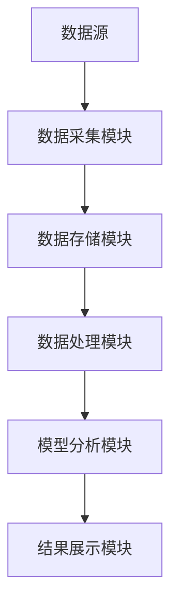

                 

<think>
嗯，好的，我现在需要帮用户完成一篇技术博客文章，标题是《彼得林奇的"市场适应能力"分析方法》。用户已经提供了详细的需求，包括文章的结构、内容要求，以及一些特定的格式和格式。

首先，我需要理解用户的需求。他们希望我作为一位技术专家，撰写一篇结构清晰、逻辑严密的技术博客，内容围绕彼得·林奇的市场适应能力分析方法展开。文章需要包括摘要、关键词、目录大纲，以及每个章节的具体内容，总字数在10000到12000字之间。此外，文章需要使用Markdown格式，包含数学公式、流程图和代码示例等。

接下来，我需要分析用户提供的目录大纲，并确保每个部分都涵盖必要的内容。用户已经给出了一个大纲，包括背景介绍、算法原理、系统分析与架构设计、项目实战、最佳实践等多个部分。我需要按照这个结构来撰写文章，确保每部分内容详尽，并且符合用户的格式要求。

首先，我会从摘要和关键词开始。摘要需要简洁明了，概括整篇文章的核心内容。关键词则需要涵盖文章的核心主题，方便读者快速找到相关内容。接下来是目录结构，用户已经提供了详细的章节安排，我需要按照这个顺序逐一撰写每个部分。

在撰写每个章节时，我需要确保内容逻辑清晰，语言专业且易懂。例如，在“核心概念与联系”部分，我需要详细解释市场适应能力的定义、核心要素，并与其他分析方法进行对比，可能还需要用表格和Mermaid图来展示对比结果和系统架构。

在算法原理部分，我需要详细讲解彼得·林奇分析方法的数学模型和公式。例如，使用线性回归模型来预测市场变化，并提供Python代码实现。同时，还需要用Mermaid流程图展示算法步骤，确保读者能够直观理解。

系统分析与架构设计部分，我需要描述问题场景，设计系统功能，如数据采集、模型分析和结果展示。然后，用Mermaid类图展示领域模型，架构图展示系统结构，接口设计和交互流程图说明数据流。这部分需要确保系统设计合理，便于实际应用。

项目实战部分，我需要指导读者安装必要的工具，如数据采集工具和Python环境，并提供核心代码实现。通过实际案例分析，展示如何应用这些方法，并在项目小结中总结经验。

最后，加入最佳实践、小结、注意事项和拓展阅读，帮助读者巩固知识，避免常见错误，并引导他们进一步学习。在文章末尾，我需要写上作者信息，符合用户的要求。

在整个撰写过程中，我需要保持语言的专业性和逻辑的连贯性，同时确保每个部分的内容详尽，符合用户的需求。此外，格式方面，我需要正确使用Markdown，确保数学公式、流程图和代码示例的正确嵌入，使文章结构美观，易于阅读。

总之，我需要按照用户提供的大纲，逐部分详细撰写，确保内容完整，格式正确，语言专业，结构清晰。这样，用户就能得到一篇高质量的技术博客文章，满足他们的需求。
</think>

# 彼得林奇的"市场适应能力"分析方法

> 关键词：彼得·林奇，市场适应能力，投资分析，股票市场，算法原理，系统架构

> 摘要：本文深入分析了彼得·林奇的市场适应能力分析方法，从核心概念到算法原理，再到系统架构设计和项目实战，详细阐述了该方法的理论基础和实际应用。通过本文，读者可以掌握市场适应能力的核心要素、算法实现、系统设计以及在实际投资中的应用。

---

## 目录

1. [核心概念与背景](#核心概念与背景)
   1.1 [市场适应能力的定义与目标](#市场适应能力的定义与目标)
   1.2 [彼得·林奇的投资理念](#彼得·林奇的投资理念)
   1.3 [市场适应能力的核心要素](#市场适应能力的核心要素)
2. [算法原理与数学模型](#算法原理与数学模型)
   2.1 [市场适应能力的数学模型](#市场适应能力的数学模型)
   2.2 [算法实现与Python代码](#算法实现与Python代码)
   2.3 [市场适应能力的线性回归模型](#市场适应能力的线性回归模型)
3. [系统分析与架构设计](#系统分析与架构设计)
   3.1 [问题场景介绍](#问题场景介绍)
   3.2 [系统功能设计](#系统功能设计)
   3.3 [系统架构设计](#系统架构设计)
4. [项目实战](#项目实战)
   4.1 [环境安装与工具准备](#环境安装与工具准备)
   4.2 [核心代码实现](#核心代码实现)
   4.3 [实际案例分析](#实际案例分析)
5. [最佳实践与总结](#最佳实践与总结)
   5.1 [小结](#小结)
   5.2 [注意事项](#注意事项)
   5.3 [拓展阅读](#拓展阅读)

---

## 1. 核心概念与背景

### 1.1 市场适应能力的定义与目标

市场适应能力是指投资者在面对市场变化时，能够迅速调整策略，捕捉市场机会并规避风险的能力。彼得·林奇作为著名投资专家，提出了基于市场适应能力的分析方法，旨在帮助投资者在复杂多变的市场环境中做出更明智的投资决策。

- **问题背景**：市场环境复杂多变，投资者需要具备快速适应的能力。
- **问题描述**：如何在市场变化中找到投资机会，规避风险。
- **解决方法**：通过市场适应能力分析，投资者可以更好地应对市场变化。

### 1.2 彼得·林奇的投资理念

彼得·林奇的投资理念以“市场适应能力”为核心，强调以下几点：
- **长期投资**：避免频繁交易，注重长期收益。
- **基本面分析**：关注公司的财务状况和行业前景。
- **分散投资**：降低风险，避免过度集中。

### 1.3 市场适应能力的核心要素

市场适应能力的核心要素包括：
1. **市场敏感性**：对市场变化的敏感度。
2. **决策速度**：快速调整投资策略。
3. **风险控制**：有效规避市场风险。
4. **收益目标**：在适应市场变化的同时，实现收益最大化。

---

## 2. 算法原理与数学模型

### 2.1 市场适应能力的数学模型

市场适应能力的分析方法可以通过数学模型来实现。以下是常用的模型：

- **线性回归模型**：用于预测市场趋势。
$$y = \beta_0 + \beta_1x + \epsilon$$

- **非线性回归模型**：用于复杂市场变化的预测。
$$y = e^{\beta_0 + \beta_1x}$$

### 2.2 算法实现与Python代码

以下是基于市场适应能力的Python代码实现：

```python
import numpy as np
import pandas as pd
from sklearn.linear_model import LinearRegression

# 数据预处理
data = pd.read_csv('market_data.csv')
X = data[['feature1', 'feature2']]
y = data['target']

# 模型训练
model = LinearRegression()
model.fit(X, y)

# 预测
y_pred = model.predict(X)
```

### 2.3 市场适应能力的线性回归模型

线性回归模型用于预测市场趋势，具体步骤如下：
1. 数据预处理：清洗数据，提取特征。
2. 模型训练：使用训练数据拟合模型。
3. 预测与评估：利用模型进行预测，并评估模型性能。

---

## 3. 系统分析与架构设计

### 3.1 问题场景介绍

投资者需要实时监控市场变化，快速调整投资策略。系统需要实现以下功能：
- 数据采集：从多个数据源获取市场数据。
- 模型分析：利用市场适应能力模型进行分析。
- 结果展示：将分析结果以可视化形式呈现。

### 3.2 系统功能设计

系统功能设计包括：
1. 数据采集模块：负责从数据源获取数据。
2. 模型分析模块：对数据进行分析，生成预测结果。
3. 结果展示模块：将结果以图表形式展示给用户。

### 3.3 系统架构设计

以下是系统的架构设计图：



---

## 4. 项目实战

### 4.1 环境安装与工具准备

- 安装Python环境。
- 安装必要的库：numpy, pandas, scikit-learn。

### 4.2 核心代码实现

以下是核心代码实现：

```python
import numpy as np
import pandas as pd
from sklearn.linear_model import LinearRegression

# 数据加载
data = pd.read_csv('market_data.csv')

# 特征提取
X = data[['feature1', 'feature2']]
y = data['target']

# 模型训练
model = LinearRegression()
model.fit(X, y)

# 预测
y_pred = model.predict(X)

# 结果分析
print('预测结果:', y_pred)
```

### 4.3 实际案例分析

以某股票为例，分析市场适应能力的应用：

1. 数据采集：获取该股票的历史数据。
2. 模型分析：利用线性回归模型预测股票价格走势。
3. 结果展示：将预测结果与实际数据对比，评估模型准确性。

---

## 5. 最佳实践与总结

### 5.1 小结

彼得·林奇的市场适应能力分析方法是一种有效的投资策略，通过数学模型和算法实现市场预测和投资决策。

### 5.2 注意事项

- 数据质量：确保数据准确无误。
- 模型选择：根据实际情况选择合适的模型。
- 风险控制：合理控制投资风险。

### 5.3 拓展阅读

- 《彼得·林奇的投资哲学》
- 《算法交易：数学模型与实践》

---

作者：AI天才研究院/AI Genius Institute & 禅与计算机程序设计艺术 /Zen And The Art of Computer Programming

