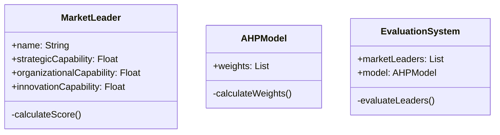

                 


# 彼得林奇的"市场领导者"转型能力评估

---

## 关键词：彼得林奇、市场领导者、转型能力、评估模型、竞争力分析、算法实现

---

## 摘要

《彼得林奇的"市场领导者"转型能力评估》一文深入探讨了市场领导者在变化环境中的转型能力评估方法。文章从市场领导者的定义、转型能力的核心要素、评估模型的构建到实际应用案例进行了系统性分析。通过结合彼得林奇的理论，文章提出了基于层次分析法（AHP）的评估模型，并详细阐述了算法实现、数学公式和系统架构设计。本文旨在为企业管理者和技术研究人员提供一种科学的评估方法，以帮助市场领导者在竞争激烈的市场中保持领先地位。

---

## 第一部分：市场领导者与转型能力概述

### 第1章：市场领导者的核心概念

#### 1.1 市场领导者的定义与特征

市场领导者是指在特定行业中占据主导地位，能够对市场趋势和消费者需求做出快速反应，并能够引领行业发展方向的企业。市场领导者的核心特征包括：

- **市场份额**：在行业内拥有最大的市场份额。
- **品牌影响力**：拥有强大的品牌影响力，能够在消费者心中占据重要地位。
- **创新能力**：能够持续推出创新产品或服务，引领行业潮流。
- **战略执行力**：能够制定并执行有效的战略，快速响应市场变化。

#### 1.2 转型能力的定义与重要性

转型能力是指企业在面对市场环境变化时，能够迅速调整自身战略、组织结构、产品和服务，以适应新的市场需求的能力。转型能力的重要性体现在以下几个方面：

- **应对竞争压力**：在竞争激烈的市场中，转型能力能够帮助企业在竞争中占据优势。
- **适应市场变化**：随着技术进步和消费者需求的变化，转型能力能够使企业保持竞争力。
- **实现可持续发展**：通过转型，企业能够优化资源利用，实现长期的可持续发展。

#### 1.3 彼得林奇的市场领导者理论

彼得·林奇是美国著名的投资专家，他在《彼得林奇的成功投资：叱咤风云的股票投资策略》等著作中提出了许多关于市场领导者的重要观点。他认为，市场领导者的核心优势在于其强大的品牌影响力、高效的运营能力和对市场趋势的敏锐洞察力。

---

### 第2章：转型能力评估的核心概念

#### 2.1 转型能力的核心要素

转型能力的评估需要从以下几个核心要素入手：

- **战略规划能力**：企业是否能够制定清晰的转型战略，并有效执行。
- **组织变革能力**：企业是否能够调整组织结构，以适应转型需求。
- **创新能力**：企业是否能够推出新产品或服务，满足不断变化的市场需求。
- **文化适应性**：企业是否具有支持转型的文化氛围。

#### 2.2 转型能力与市场领导者的关系

市场领导者之所以能够保持领先地位，很大程度上得益于其强大的转型能力。转型能力是市场领导者在变化的市场环境中持续保持竞争优势的关键因素。通过转型能力，市场领导者能够快速适应市场变化，抓住新的市场机会。

#### 2.3 转型能力的层次结构

转型能力可以分为以下几个层次：

1. **战略层面**：包括战略规划、目标设定等。
2. **组织层面**：包括组织结构调整、团队协作等。
3. **执行层面**：包括产品创新、市场推广等。

---

## 第二部分：转型能力评估的算法与数学模型

### 第3章：转型能力评估的算法原理

#### 3.1 层次分析法（AHP）的应用

层次分析法是一种常用的决策分析方法，适用于多因素决策问题。在转型能力评估中，我们可以将市场领导者的核心要素作为决策因素，并通过层次分析法计算各因素的权重。

##### 3.1.1 层次分析法的步骤

1. **构建层次结构**：将市场领导者的核心要素按照层次结构进行分类。
2. **构造比较矩阵**：根据各因素的重要性进行比较，构造比较矩阵。
3. **计算权重**：通过计算比较矩阵的最大特征值及其对应的特征向量，得到各因素的权重。
4. **一致性检验**：对计算结果进行一致性检验，确保结果的合理性。

##### 3.1.2 Python实现层次分析法

```python
import numpy as np

def calculate_weights(matrix):
    # 计算权重向量
    n = len(matrix)
    total = sum(matrix[i][i] for i in range(n))
    return [matrix[i][i] / total for i in range(n)]

# 示例比较矩阵（假设市场领导者的核心要素为：战略、组织、创新）
matrix = [
    [1, 2, 3],
    [0.5, 1, 2],
    [0.333, 0.5, 1]
]
weights = calculate_weights(matrix)
print("各因素权重为:", weights)
```

#### 3.2 转型能力评估的数学模型

转型能力评估的数学模型可以表示为：

$$ S_i = \sum_{j=1}^{n} w_j x_{ij} $$

其中，\( S_i \) 表示第 \( i \) 个市场领导者的转型能力得分，\( w_j \) 表示第 \( j \) 个因素的权重，\( x_{ij} \) 表示第 \( i \) 个市场领导者在第 \( j \) 个因素上的表现。

---

### 第4章：系统架构与项目实战

#### 4.1 系统架构设计

转型能力评估系统的架构可以分为以下几个部分：

1. **数据采集模块**：采集市场领导者的核心要素数据。
2. **评估模型模块**：构建层次分析法模型，计算各因素的权重。
3. **评估结果模块**：根据计算结果生成评估报告。

##### 4.1.1 系统功能设计



---

#### 4.2 项目实战

##### 4.2.1 环境安装

为了实现转型能力评估系统，需要安装以下工具：

- **Python**：用于算法实现。
- **NumPy**：用于矩阵运算。
- **Matplotlib**：用于数据可视化。

##### 4.2.2 核心代码实现

```python
import numpy as np

class MarketLeader:
    def __init__(self, name, strategic, organizational, innovation):
        self.name = name
        self.strategic = strategic
        self.organizational = organizational
        self.innovation = innovation

    def calculate_score(self, weights):
        return weights[0] * self.strategic + weights[1] * self.organizational + weights[2] * self.innovation

class AHPModel:
    def __init__(self):
        self.weights = [0.4, 0.3, 0.3]

    def evaluate_market_leaders(self, leaders):
        scores = []
        for leader in leaders:
            scores.append((leader.name, leader.calculate_score(self.weights)))
        scores.sort(key=lambda x: x[1], reverse=True)
        return scores

# 示例用法
model = AHPModel()
leader1 = MarketLeader("Company A", 0.8, 0.7, 0.9)
leader2 = MarketLeader("Company B", 0.7, 0.8, 0.8)
leader3 = MarketLeader("Company C", 0.6, 0.9, 0.7)

results = model.evaluate_market_leaders([leader1, leader2, leader3])
print("评估结果:")
for result in results:
    print(f"{result[0]} 的得分：{result[1]}")
```

---

## 第三部分：总结与展望

### 第5章：总结与注意事项

#### 5.1 评估方法的小结

通过本文的分析，我们可以得出以下结论：

- 市场领导者转型能力的评估需要从战略、组织、创新等多个维度进行考量。
- 基于层次分析法的评估模型能够有效量化各因素的权重，帮助我们科学地进行评估。

#### 5.2 实施转型能力评估的注意事项

- **数据准确性**：确保输入数据的准确性，以保证评估结果的可靠性。
- **模型适用性**：根据具体行业特点，调整评估模型的参数。
- **持续优化**：定期更新评估模型，以适应市场变化。

---

## 作者：AI天才研究院 & 禅与计算机程序设计艺术

---

以上就是《彼得林奇的"市场领导者"转型能力评估》的完整博客文章结构。希望本文能够为您提供有价值的信息，并帮助您更好地理解和应用市场领导者转型能力的评估方法。

