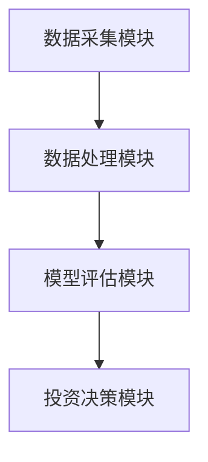

                 


# 彼得林奇的"市场颠覆者"在新兴行业中的识别技巧

## 关键词：市场颠覆者、彼得林奇、新兴行业、投资策略、识别技巧

## 摘要：本文基于彼得林奇的市场颠覆者理论，结合新兴行业的特点，系统地阐述了如何识别和分析市场颠覆者。通过构建市场颠覆者识别模型、详细讲解算法原理、设计系统架构方案，并通过项目实战，为读者提供一套完整的识别方法和工具。文章还结合实际案例，总结了最佳实践和投资策略，为投资者提供了切实可行的操作指南。

---

## 第1章：市场颠覆者的定义与特征

### 1.1 市场颠覆者的定义

#### 1.1.1 什么是市场颠覆者

市场颠覆者是指那些通过创新的商业模式、技术或产品，打破传统市场格局的企业。它们通常以更低的成本、更高的效率或更好的用户体验，重新定义市场规则。

#### 1.1.2 市场颠覆者的特征

市场颠覆者具有以下核心特征：

- **低成本优势**：通过技术创新或商业模式优化，显著降低运营成本。
- **差异化竞争**：提供独特的价值主张，区别于传统竞争对手。
- **快速扩张能力**：能够在新兴市场中迅速扩大市场份额。
- **持续创新能力**：能够不断推出颠覆性产品或服务。

#### 1.1.3 彼得林奇对市场颠覆者的定义

彼得林奇认为，市场颠覆者通常是那些被市场低估，但具有强大竞争优势的企业。这些企业往往在新兴行业中处于领先地位，能够通过技术创新或商业模式创新，迅速改变市场格局。

---

### 1.2 新兴行业的特点与机会

#### 1.2.1 新兴行业的定义与分类

新兴行业是指那些基于新技术、新需求或新商业模式而快速发展的行业。常见的新兴行业包括人工智能、区块链、新能源、生物科技等。

#### 1.2.2 新兴行业的市场机会

在新兴行业中，市场颠覆者更容易成功，因为这些行业的市场规则尚未完全形成，颠覆者可以通过技术创新或商业模式创新，快速占据市场主导地位。

#### 1.2.3 新兴行业中的颠覆者案例

例如，特斯拉在新能源汽车行业的成功，就是通过技术创新和商业模式创新，颠覆了传统汽车行业的格局。

---

## 第2章：市场颠覆者的识别技巧

### 2.1 宏观分析法

#### 2.1.1 宏观经济环境分析

通过分析宏观经济环境，如GDP增长率、通货膨胀率等，判断新兴行业的发展潜力。

#### 2.1.2 行业发展趋势分析

研究行业的技术发展、市场需求、竞争格局等，找出潜在的市场颠覆者。

#### 2.1.3 市场结构变化分析

分析行业市场结构的变化趋势，判断颠覆者可能出现的领域。

---

### 2.2 微观分析法

#### 2.2.1 企业基本面分析

通过分析企业的财务状况、盈利能力、成长性等，筛选出具有潜力的颠覆者。

#### 2.2.2 企业竞争优势分析

研究企业的核心竞争力，如技术优势、成本优势、品牌优势等。

#### 2.2.3 企业管理团队分析

评估企业的管理团队能力，优秀团队更有可能成为颠覆者。

---

## 第3章：市场颠覆者识别模型

### 3.1 市场颠覆者识别模型的构建

#### 3.1.1 模型构建的背景

基于彼得林奇的市场颠覆者理论，结合新兴行业特点，构建一个综合评估模型。

#### 3.1.2 模型构建的步骤

- 确定评估指标：市场规模、增长率、竞争程度等。
- 设定权重：根据行业特点，赋予各指标权重。
- 数据采集与处理：收集相关数据，进行标准化处理。
- 评估与筛选：根据模型评分，筛选出潜在的市场颠覆者。

#### 3.1.3 模型构建的工具

使用Python中的pandas和scikit-learn库进行数据分析和建模。

---

### 3.2 市场颠覆者识别模型的应用

#### 3.2.1 模型的应用场景

在新兴行业投资决策中，该模型可以帮助投资者快速识别潜在的市场颠覆者。

#### 3.2.2 模型的应用步骤

- 数据采集：收集目标行业的市场数据。
- 模型评估：根据模型评分，筛选出潜在颠覆者。
- 投资决策：结合其他因素，做出最终投资决策。

#### 3.2.3 模型的应用案例

以人工智能行业为例，通过模型评估，筛选出具有潜力的市场颠覆者。

---

## 第4章：市场颠覆者的投资策略

### 4.1 投资策略的制定

#### 4.1.1 投资目标的确定

明确投资目标，如长期收益、风险控制等。

#### 4.1.2 投资计划的制定

制定详细的投资计划，包括资金分配、时间安排等。

#### 4.1.3 投资风险的控制

通过分散投资、设置止损等方法，控制投资风险。

---

### 4.2 投资策略的实施

#### 4.2.1 投资组合的构建

根据模型评估结果，构建投资组合，包括多个潜在的市场颠覆者。

#### 4.2.2 投资时机的选择

结合市场趋势和企业基本面，选择合适的投资时机。

#### 4.2.3 投资金额的分配

根据企业的潜力和风险，合理分配投资金额。

---

## 第5章：项目实战

### 5.1 环境安装

安装Python、pandas、numpy、scikit-learn等必要的库。

```bash
pip install pandas numpy scikit-learn
```

### 5.2 系统功能设计

#### 5.2.1 数据收集模块

收集目标行业的市场数据，包括市场规模、增长率、竞争企业信息等。

#### 5.2.2 数据分析模块

使用Python代码对数据进行处理和建模，评估潜在的市场颠覆者。

#### 5.2.3 预警模块

根据模型结果，设置预警机制，提醒投资者潜在风险。

### 5.3 系统架构设计

#### 5.3.1 系统架构图

使用Mermaid绘制系统架构图：



#### 5.3.2 接口设计

设计RESTful API接口，实现数据采集、分析和预警功能。

---

## 第6章：总结与展望

### 6.1 最佳实践

- 理解市场颠覆者的定义和特征。
- 熟练掌握市场颠覆者识别模型。
- 灵活运用投资策略，控制风险。

### 6.2 小结

通过本文的系统分析和实战指导，读者可以掌握彼得林奇的市场颠覆者识别技巧，并在新兴行业中成功应用。

### 6.3 注意事项

- 投资有风险，需谨慎决策。
- 数据来源需可靠，避免偏差。

### 6.4 拓展阅读

- 彼得林奇的《投资最重要的事情》。
- 克里斯托弗·阿克曼的《颠覆者》。

---

## 作者：AI天才研究院 & 禅与计算机程序设计艺术

