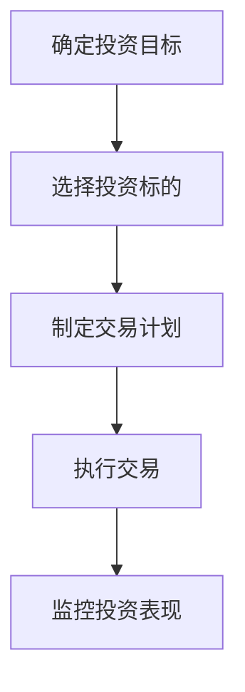
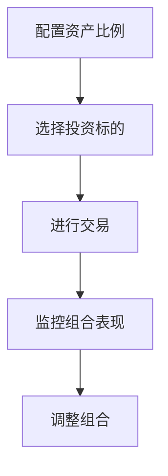

                 


# 彼得林奇的"常识投资"在不同市场的应用

## 关键词：彼得林奇、常识投资、股票投资、投资策略、风险管理、市场分析、投资组合优化

## 摘要：  
本文系统地探讨了彼得林奇的"常识投资"理念在不同市场环境下的应用。通过分析美国市场、新兴市场和中国市场的特点，结合风险管理策略和投资组合优化方法，本文提出了适用于不同市场条件的投资者策略。文章从投资的基本概念出发，逐步深入到具体的投资策略和系统架构设计，旨在为投资者提供实践指导。

---

# 第1章: 投资的基本概念

## 1.1 投资的基本定义

### 1.1.1 投资的定义与分类  
投资是指将资金投入某一标的（如股票、债券、房地产等）以期获得收益的行为。根据投资标的的不同，可以将投资分为以下几类：  
- **股票投资**：购买公司股份，分享公司成长收益。  
- **债券投资**：购买政府或企业发行的债券，获得固定利息收入。  
- **房地产投资**：通过购买房地产资产获得租金收入或资本增值。  
- **金融衍生品投资**：利用期权、期货等工具进行杠杆或对冲操作。  

### 1.1.2 金融市场的基本构成  
金融市场由以下几个主要部分构成：  
- **交易所**：如纽约证券交易所（NYSE）、纳斯达克（NASDAQ）等。  
- **参与者**：包括投资者、券商、基金公司、上市公司等。  
- **金融工具**：如股票、债券、基金、期货等。  
- **价格机制**：由市场供需决定资产价格。  

### 1.1.3 投资者的角色与类型  
投资者可以分为以下几种类型：  
- **个人投资者**：以个人资金进行投资，通常投资金额较小。  
- **机构投资者**：如基金公司、保险公司、养老基金等，资金规模较大。  
- **短期投资者**：追求短期收益，如日内交易者。  
- **长期投资者**：注重长期价值，如巴菲特、彼得林奇等价值投资者。  

---

## 1.2 彼得林奇的生平简介

### 1.2.1 彼得林奇的早期经历  
彼得·林奇（Peter Lynch）是美国著名投资家，1949年出生于美国波士顿。他在中学时期就对股票投资产生了浓厚兴趣，19岁时开始进行股票交易。

### 1.2.2 成为富达投资掌门人  
彼得林奇于1977年加入富达投资管理公司（Fidelity Management），担任麦哲伦基金（Fidelity Magellan Fund）的基金经理，管理资金规模超过100亿美元。

### 1.2.3 彼得林奇的投资哲学  
彼得林奇的投资哲学可以概括为：  
1. **长期投资**：买入并持有优质股票，分享公司成长的成果。  
2. **基本面分析**：通过研究公司的财务报表和行业地位，选择具有竞争优势的公司。  
3. **分散投资**：避免将所有资金投入单一标的，降低风险。  
4. **避免短期波动**：忽略短期市场波动，专注于长期价值。  

---

## 1.3 常识投资的核心理念

### 1.3.1 什么是常识投资  
常识投资是指基于基本常识和逻辑，选择那些具有持续竞争优势和良好财务状况的公司进行投资。

### 1.3.2 常识投资的核心要素  
- **公司基本面**：包括收入、利润、负债、现金流等财务指标。  
- **行业地位**：公司在行业中的竞争优势和市场占有率。  
- **管理团队**：公司管理层的能力和诚信。  
- **估值**：通过市盈率、市净率等指标判断股票是否被低估。  

### 1.3.3 常识投资与非理性投资的对比  
| 对比维度 | 常识投资 | 非理性投资 |
|----------|----------|------------|
| 投资策略 | 长期价值导向 | 短期波动导向 |
| 分析方法 | 基本面分析 | 市场情绪驱动 |
| 风险控制 | 严格风险管理 | 重仓押注，忽视风险 |

---

# 第2章: 常识投资的核心概念

## 2.1 价值投资与成长投资

### 2.1.1 价值投资的定义与特点  
价值投资是寻找市场价格低于其内在价值的股票进行投资。其特点是：  
- 低市盈率、低市净率。  
- 公司具有稳定的盈利能力。  

### 2.1.2 成长投资的定义与特点  
成长投资是投资于那些收入和利润快速增长的公司。其特点是：  
- 高市盈率、高市净率。  
- 公司具有较高的成长潜力。  

### 2.1.3 价值投资与成长投资的对比  
| 对比维度 | 价值投资 | 成长投资 |
|----------|----------|----------|
| 投资目标 | 低估股票 | 高成长股票 |
| 风险水平 | 中低风险 | 高风险 |
| 适用场景 | 市场低迷时 | 市场高速增长时 |

---

## 2.2 常识投资中的股息投资

### 2.2.1 股息投资的定义与特点  
股息投资是指投资于那些能够稳定派发股息的公司，以获取稳定的现金流。

### 2.2.2 股息率的计算与分析  
股息率公式为：  
$$ \text{股息率} = \frac{\text{每股股息}}{\text{股价}} \times 100\% $$  

### 2.2.3 股息投资的风险与收益  
- **收益**：稳定的股息收入和资本增值。  
- **风险**：市场波动可能导致股价下跌，且股息支付公司可能面临业绩下滑。

---

## 2.3 公司基本面分析

### 2.3.1 公司基本面的定义  
公司基本面是指影响公司财务状况和经营业绩的各种因素，包括收入、利润、负债、现金流等。

### 2.3.2 财务报表分析的关键指标  
- **收入**：公司营业收入。  
- **净利润**：公司实现的最终利润。  
- **资产负债率**：$$ \text{资产负债率} = \frac{\text{总负债}}{\text{总资产}} \times 100\% $$  
- **现金流**：公司经营活动产生的现金流量。

### 2.3.3 行业分析与竞争地位  
- **行业分析**：分析行业发展趋势、市场规模、竞争格局。  
- **竞争地位**：公司是否是行业龙头，是否具有竞争优势。

---

## 2.4 本章小结  
本章介绍了常识投资的核心概念，包括价值投资、成长投资和股息投资的特点，以及公司基本面分析的关键指标。

---

# 第3章: 不同市场的特点与投资策略

## 3.1 美国市场的特点与投资策略

### 3.1.1 美国市场的基本特点  
- 美国市场是全球最大的股票市场，流动性强。  
- 市场参与者多元化，机构投资者占主导地位。  
- 市场波动性较低，适合长期投资。  

### 3.1.2 美国市场的投资策略  
- **长期投资**：买入并持有优质股票。  
- **分散投资**：配置不同行业和公司的股票。  
- **关注龙头公司**：如苹果、微软等具有全球影响力的企业。  

### 3.1.3 美国市场的经典案例分析  
- 苹果公司：通过技术创新和市场拓展，成为全球市值最高的公司。  

---

## 3.2 新兴市场的特点与投资策略

### 3.2.1 新兴市场的基本特点  
- 市场波动性大，风险较高。  
- 市场参与者以个人投资者为主。  
- 经济增长快，投资机会多。  

### 3.2.2 新兴市场的投资策略  
- **关注高成长行业**：如科技、消费、金融等。  
- **选择龙头企业**：如阿里巴巴、腾讯等。  
- **分散投资**：避免集中投资于单一行业或公司。  

### 3.2.3 新兴市场的风险与机会  
- **风险**：市场波动大，政策风险高。  
- **机会**：新兴市场增长潜力大，优质公司估值较低。  

---

## 3.3 中国市场的特点与投资策略

### 3.3.1 中国市场的基本特点  
- 市场规模大，流动性强。  
- 政策对市场影响较大。  
- 估值差异显著，存在低估和高估现象。  

### 3.3.2 中国市场的投资策略  
- **关注消费行业**：如茅台、五粮液等。  
- **选择低估值股票**：如金融、能源等行业。  
- **分散投资**：配置不同行业和地区的股票。  

### 3.3.3 中国市场的经典案例分析  
- 茅台：作为中国白酒行业的龙头，具有强大的品牌优势和盈利能力。  

---

## 3.4 本章小结  
本章分析了不同市场的特点和投资策略，强调根据市场环境调整投资策略。

---

# 第4章: 常识投资中的风险管理

## 4.1 风险管理的基本概念

### 4.1.1 风险的定义与分类  
- **市场风险**：市场波动导致的资产价格下跌。  
- **流动性风险**：资产难以快速变现。  
- **信用风险**：债券发行人违约的风险。  

### 4.1.2 风险管理的重要性  
- 降低投资组合的波动性。  
- 保护投资本金的安全。  

---

## 4.2 常识投资中的风险控制

### 4.2.1 投资组合的风险分散  
- 通过配置不同类型的资产（股票、债券、现金）降低风险。  

### 4.2.2 个股的风险评估  
- 选择财务健康、估值合理的公司。  

### 4.2.3 市场波动的应对策略  
- 避免频繁交易，减少交易成本。  

---

## 4.3 常识投资中的止损策略

### 4.3.1 什么是止损  
- 止损是指在投资标的下跌到一定程度后，立即卖出以避免更大的损失。  

### 4.3.2 止损的重要性  
- 保护投资本金。  
- 避免情绪化交易。  

### 4.3.3 止损的实施方法  
- 设置止损位：如股票价格下跌5%即卖出。  
- 使用止损订单：通过券商系统设置止损点。  

---

## 4.4 本章小结  
本章介绍了风险管理的基本概念和策略，强调在投资过程中要注重风险控制。

---

# 第5章: 系统分析与架构设计方案

## 5.1 投资策略的设计

### 5.1.1 投资目标的设定  
- **短期目标**：如季度收益目标。  
- **长期目标**：如资产翻倍目标。  

### 5.1.2 投资策略的制定  
- 根据市场环境和个人风险承受能力制定策略。  

### 5.1.3 投资策略的优化  
- 定期回顾投资表现，调整策略。  

---

## 5.2 投资组合的管理

### 5.2.1 投资组合的构建  
- 根据资产配置比例选择股票、债券、现金等资产。  

### 5.2.2 投资组合的调整  
- 定期检查投资组合，根据市场变化进行调整。  

### 5.2.3 投资组合的监控  
- 监控投资组合的波动性和收益情况。  

---

## 5.3 交易执行的策略

### 5.3.1 交易计划的制定  
- 确定买入和卖出的价格点。  

### 5.3.2 交易成本的控制  
- 选择低佣金的券商。  

### 5.3.3 交易纪律的执行  
- 遵循交易计划，避免情绪化交易。  

---

## 5.4 系统架构设计

### 5.4.1 投资策略的设计流程图  


### 5.4.2 投资组合的管理流程图  


---

## 5.5 本章小结  
本章通过系统架构设计，展示了投资策略的制定和执行流程。

---

# 第6章: 项目实战

## 6.1 环境安装与数据准备

### 6.1.1 环境安装  
- 安装Python编程环境。  
- 安装数据处理库（如Pandas、NumPy）。  

### 6.1.2 数据准备  
- 获取股票历史数据（如Yahoo Finance）。  

---

## 6.2 核心实现源代码

### 6.2.1 基本数据处理代码  
```python
import pandas as pd
import numpy as np

# 读取股票数据
data = pd.read_csv('stock_data.csv')
# 计算均线
data['MA_50'] = data['Close'].rolling(50).mean()
# 计算均线差值
data['MA_diff'] = data['Close'] - data['MA_50']
```

### 6.2.2 风险管理策略代码  
```python
def stop_loss(price, stop_loss_pct):
    stop_loss_price = price * (1 - stop_loss_pct/100)
    return stop_loss_price

# 示例：买入价为100，止损比例为5%
stop_loss_price = stop_loss(100, 5)
print(stop_loss_price)  # 输出：95.0
```

---

## 6.3 代码应用解读与分析

### 6.3.1 数据处理代码解读  
- 使用Pandas库读取股票数据。  
- 计算50天均线，并与收盘价进行对比。  

### 6.3.2 风险管理代码解读  
- 定义止损价格计算函数，当股价下跌达到止损比例时，立即卖出。  

---

## 6.4 实际案例分析

### 6.4.1 美国市场案例  
- 股票：苹果（AAPL）  
- 入场点：股价低于均线，买入。  
- 止损点：股价下跌5%。  

### 6.4.2 中国市场案例  
- 股票：茅台（AAPL）  
- 入场点：估值低估，买入。  
- 止损点：股价下跌10%。  

---

## 6.5 本章小结  
本章通过实际案例分析，展示了如何在不同市场中应用常识投资策略。

---

# 第7章: 总结与展望

## 7.1 本章总结  
- 彼得林奇的常识投资理念强调长期投资和基本面分析。  
- 不同市场的特点决定了投资策略的差异。  
- 风险管理是投资过程中不可忽视的重要环节。  

## 7.2 未来展望  
- 进一步研究人工智能在投资决策中的应用。  
- 探讨全球化背景下的跨市场投资策略。  

---

# 作者：AI天才研究院/AI Genius Institute & 禅与计算机程序设计艺术 /Zen And The Art of Computer Programming

