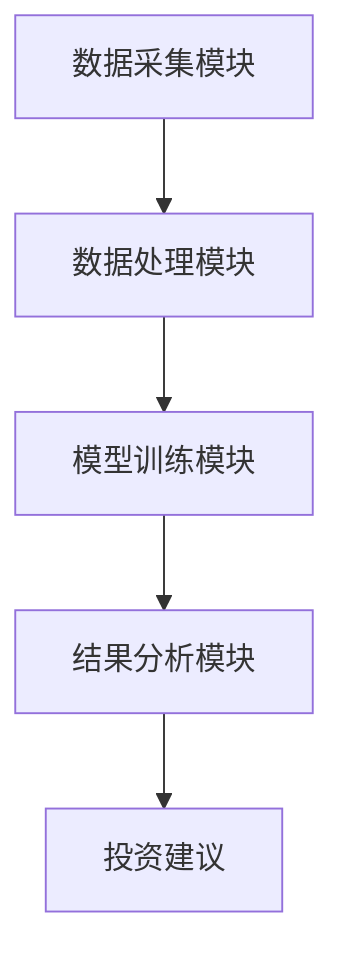

                 


# 彼得林奇的"常识投资"在人工智能时代的调整

## 关键词：常识投资，人工智能，投资策略，机器学习，深度学习，风险管理

## 摘要：本文探讨了彼得·林奇的常识投资方法在人工智能时代的调整与优化。通过分析传统投资方法与现代技术的结合，提出了基于机器学习和深度学习的新型投资策略，详细阐述了算法原理、系统设计和项目实战，为投资者提供了在人工智能时代如何调整投资策略的深度见解。

---

# 第1章 背景介绍

## 1.1 常识投资的核心概念

### 1.1.1 常识投资的定义与背景

常识投资是由彼得·林奇提出的一种投资策略，强调基于对公司基本面的深入分析，寻找具有长期增长潜力的公司进行投资。这种方法依赖于对市场、行业和公司的深刻理解，以及对财务数据的细致分析。其核心理念是通过研究和分析，找到那些被市场低估但具有良好发展前景的公司。

### 1.1.2 常识投资的核心要素

- **基本面分析**：通过对公司的财务报表、行业地位、竞争优势等因素进行分析，评估其投资价值。
- **长期视角**：关注公司的长期增长潜力，而非短期价格波动。
- **分散投资**：通过投资于多个具有潜力的公司来降低风险。
- **持续学习**：不断更新知识，适应市场变化。

### 1.1.3 常识投资的边界与外延

常识投资的边界在于其依赖的传统分析方法，如财务报表分析和行业研究。随着市场环境的变化，特别是技术的进步，其外延需要扩展，引入新的数据分析方法和技术工具，如人工智能和大数据分析，以增强其预测能力和决策效率。

---

## 1.2 人工智能时代的投资新趋势

### 1.2.1 人工智能在金融领域的应用

人工智能技术在金融领域的应用日益广泛，包括股票预测、风险评估、投资组合优化、市场情绪分析等方面。通过机器学习算法，投资者可以更高效地处理大量数据，发现传统方法难以察觉的市场趋势和投资机会。

### 1.2.2 人工智能对投资方式的改变

人工智能不仅提高了数据分析的效率，还使得投资策略更加个性化和动态化。通过实时数据处理和模型调整，投资者可以更快地响应市场变化，优化投资组合，降低风险。

### 1.2.3 人工智能时代投资的核心问题

- 如何将传统投资方法与人工智能技术相结合，发挥各自的优势。
- 如何选择和优化人工智能算法，提高投资决策的准确性。
- 如何解决人工智能在投资中的局限性，如数据过拟合和黑箱问题。

---

# 第2章 人工智能在投资中的算法原理

## 2.1 机器学习在投资中的应用

### 2.1.1 机器学习的基本原理

机器学习是一种通过数据训练模型，使其能够从经验中学习并做出预测或决策的技术。在投资中，常用算法包括线性回归、决策树、随机森林、支持向量机（SVM）和朴素贝叶斯等。

### 2.1.2 常见的机器学习算法

#### 1. 线性回归

线性回归是一种简单而强大的回归算法，用于预测连续型变量。在投资中，可以用于预测股票价格的变化趋势。

- **数学模型**：
  $$ y = \beta_0 + \beta_1x + \epsilon $$
  其中，$y$ 是目标变量（股票价格），$x$ 是自变量（如市盈率），$\beta_0$ 和 $\beta_1$ 是回归系数，$\epsilon$ 是误差项。

#### 2. 决策树

决策树是一种树状结构，用于分类和回归问题。在投资中，可以用于判断股票的涨跌趋势。

- **优势**：易于解释，适合处理非线性关系。
- **劣势**：容易过拟合。

### 2.1.3 机器学习在投资中的数学模型

- **线性回归模型**：用于股票价格预测。
- **随机森林模型**：用于多因素分析和投资组合优化。

---

## 2.2 深度学习在投资中的应用

### 2.2.1 深度学习的基本原理

深度学习是一种基于人工神经网络的机器学习技术，能够处理复杂的数据模式。在投资中，常用算法包括卷积神经网络（CNN）、循环神经网络（RNN）和长短期记忆网络（LSTM）。

### 2.2.2 常见的深度学习算法

#### 1. 卷积神经网络（CNN）

CNN用于处理图像数据，但在金融时间序列分析中也有应用。

- **优势**：适合处理空间数据和时间序列数据。
- **劣势**：需要大量计算资源。

#### 2. 长短期记忆网络（LSTM）

LSTM用于处理时间序列数据，能够捕捉长期依赖关系，适合用于股票价格预测。

- **数学模型**：
  $$ f_t = \sigma(g_t) $$
  $$ g_t = W_{g}x_t + U_{g}h_{t-1} + b_g $$
  $$ h_t = f_t \cdot \text{cell}_t + (1 - f_t) \cdot \text{cell}_{t-1} $$
  其中，$\sigma$ 是sigmoid函数，$g_t$ 是门控向量，$h_t$ 是隐藏状态，$\text{cell}_t$ 是细胞状态。

---

## 2.3 算法原理的对比与选择

### 2.3.1 机器学习与深度学习的对比

- **计算复杂度**：深度学习需要更多的计算资源。
- **数据需求**：深度学习需要更多的数据来训练模型。
- **解释性**：机器学习模型通常更易于解释。

### 2.3.2 不同算法的适用场景

- **线性回归**：适合简单线性关系的预测。
- **随机森林**：适合多因素分析和分类问题。
- **LSTM**：适合时间序列数据分析。

### 2.3.3 算法选择的策略

- **数据类型**：根据数据类型选择合适的算法。
- **计算资源**：考虑计算能力和数据量。
- **解释性需求**：根据是否需要解释性选择模型。

---

# 第3章 基于人工智能的常识投资策略调整

## 3.1 数据驱动的投资策略

### 3.1.1 数据采集与处理

在人工智能时代，数据是投资决策的核心。投资者需要收集包括财务数据、市场数据、新闻数据等多种数据源，并进行清洗和预处理。

- **数据清洗**：去除缺失值、异常值。
- **数据预处理**：标准化、归一化。

### 3.1.2 数据分析与建模

使用机器学习和深度学习算法对数据进行建模，预测股票价格走势或判断公司财务状况。

### 3.1.3 数据驱动的决策支持

通过数据模型生成投资建议，优化投资组合。

---

## 3.2 人工智能辅助的决策优化

### 3.2.1 基于AI的市场预测

利用机器学习和深度学习模型预测市场趋势，识别投资机会。

### 3.2.2 基于AI的风险评估

通过AI技术评估投资组合的风险，如VaR（在险值）和CVaR（条件在险值）。

### 3.2.3 基于AI的投资组合优化

使用AI技术优化投资组合，平衡风险与收益。

---

## 3.3 策略调整的实施步骤

### 3.3.1 确定投资目标

明确投资目标和风险承受能力。

### 3.3.2 数据准备与模型选择

根据目标选择合适的数据和算法。

### 3.3.3 模型训练与优化

通过数据训练模型，并进行调优。

### 3.3.4 结果分析与策略调整

根据模型预测结果调整投资策略。

---

# 第4章 系统架构与实现方案

## 4.1 系统架构设计

### 4.1.1 系统功能模块划分

- **数据采集模块**：负责收集各种数据源。
- **数据处理模块**：进行数据清洗和预处理。
- **模型训练模块**：训练机器学习和深度学习模型。
- **结果分析模块**：生成投资建议和风险评估。

### 4.1.2 系统架构的Mermaid图



---

## 4.2 项目实战

### 4.2.1 环境安装

- **Python**：安装Python 3.8以上版本。
- **库的安装**：安装NumPy、Pandas、Scikit-learn、Keras、TensorFlow等库。

### 4.2.2 核心实现源代码

#### 1. 数据预处理

```python
import pandas as pd
import numpy as np

# 加载数据
data = pd.read_csv('stock_data.csv')

# 数据清洗
data = data.dropna()
data = data.replace([np.inf, -np.inf, np.nan], 0)

# 数据标准化
from sklearn.preprocessing import StandardScaler

scaler = StandardScaler()
data_scaled = scaler.fit_transform(data)
```

#### 2. 模型训练

```python
from sklearn.ensemble import RandomForestClassifier
from sklearn.metrics import accuracy_score

# 训练随机森林模型
model = RandomForestClassifier(n_estimators=100, max_depth=2, random_state=42)
model.fit(X_train, y_train)

# 预测和评估
y_pred = model.predict(X_test)
print("Accuracy:", accuracy_score(y_test, y_pred))
```

#### 3. 案例分析

假设我们有一个包含股票历史价格、财务数据和市场情绪的数据集，我们可以通过随机森林模型预测股票价格的上涨或下跌趋势。

---

## 4.2.3 项目小结

通过实战项目，我们可以看到人工智能技术在投资中的强大能力。然而，模型的准确性和稳定性需要进一步优化，同时需要考虑数据质量和市场环境的变化。

---

# 第5章 总结与展望

## 5.1 总结

人工智能技术为常识投资带来了新的可能性。通过机器学习和深度学习算法，投资者可以更高效地分析数据，优化投资策略。然而，技术的应用需要结合实际，避免过拟合和黑箱问题。

## 5.2 展望

未来，随着技术的进步，人工智能在投资中的应用将更加广泛和深入。投资者需要不断学习新技术，适应市场变化，以在人工智能时代保持竞争优势。

---

# 作者

作者：AI天才研究院 & 禅与计算机程序设计艺术

---

通过以上思考和分析，我们系统性地探讨了彼得·林奇的常识投资在人工智能时代的调整与优化，详细讲解了算法原理和项目实战，为投资者提供了在人工智能时代调整投资策略的深度见解。

