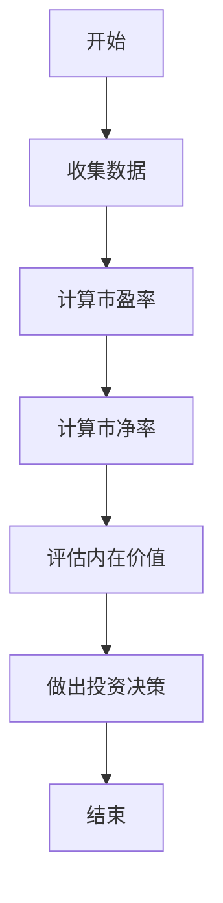
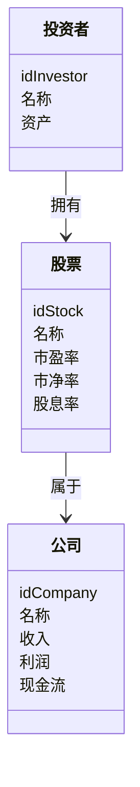
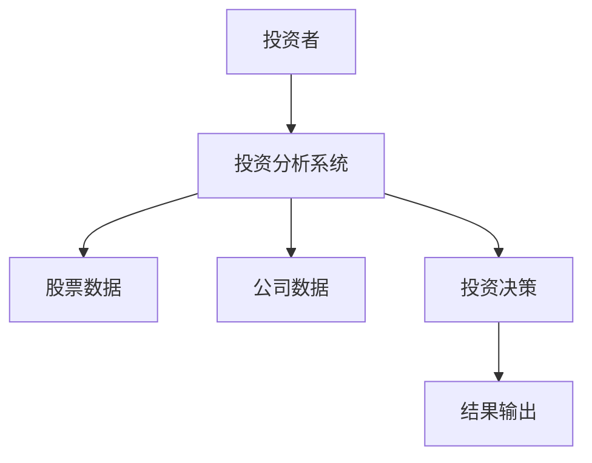
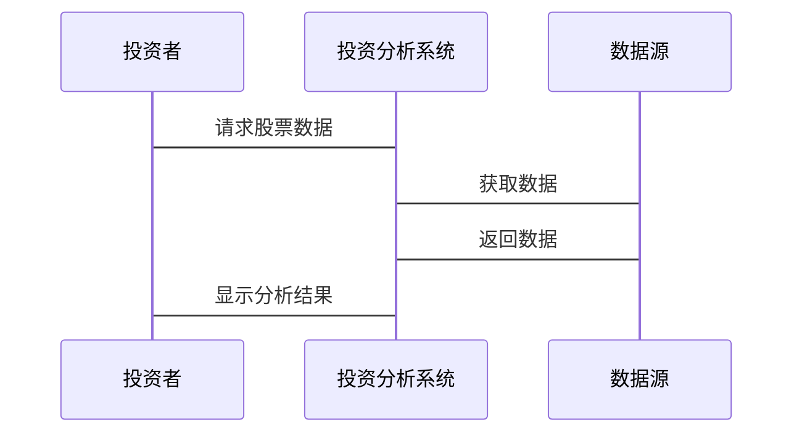

                 

<think>
好的，现在我需要撰写一篇关于“彼得林奇的'常识投资'实践指南”的技术博客文章。首先，我需要理解用户的需求，用户希望我以一位世界级人工智能专家的身份，撰写一篇结构清晰、内容深入的技术博客，主题是基于彼得林奇的常识投资方法，结合技术语言进行分析。

我将按照用户提供的目录大纲结构来组织内容，每个章节都需要详细展开，确保内容丰富具体，并且符合技术博客的专业性和逻辑性。接下来，我会逐步思考每个部分的撰写内容，确保覆盖所有必要的知识点，并且语言简洁明了。

**步骤1：撰写文章标题、关键词和摘要**
- 标题：彼得林奇的"常识投资"实践指南
- 关键词：常识投资、彼得林奇、投资策略、价值投资、风险管理、长期投资
- 摘要：介绍彼得林奇的常识投资方法，强调其核心理念，包括长期投资、基本面分析和风险管理，以及如何在实际中应用这些策略。

**步骤2：撰写第1章：背景介绍**
- 1.1 常识投资的定义与背景
  - 1.1.1 什么是常识投资
    - 解释常识投资的基本概念，强调基于常识和长期投资。
  - 1.1.2 常识投资的起源与演变
    - 回顾彼得林奇的投资理念，以及其在投资领域中的发展。
  - 1.1.3 常识投资的核心要素
    - 分析核心要素，如长期持有、价值评估等。
- 1.2 常识投资与其他投资方法的对比
  - 对比技术分析、价值投资和趋势投资，突出常识投资的独特之处。

**步骤3：撰写第2章：常识投资的核心概念与联系**
- 2.1 常识投资的核心原理
  - 详细讲解其基本原理，包括基本面分析和价值评估。
- 2.2 概念属性特征对比
  - 使用对比表格展示常识投资与传统、现代投资的差异。
- 2.3 实体关系图
  - 使用Mermaid绘制ER图，展示投资系统的核心实体及其关系。

**步骤4：撰写第3章：常识投资的算法原理讲解**
- 3.1 算法原理
  - 介绍算法流程，包括数据收集、分析和决策。
- 3.2 Mermaid流程图
  - 绘制基本和优化的流程图，展示投资决策过程。
- 3.3 Python代码实现
  - 提供代码示例，展示如何实现投资分析工具。

**步骤5：撰写第4章：系统分析与架构设计**
- 4.1 系统分析
  - 描述问题场景，明确系统目标。
- 4.2 功能设计
  - 展示领域模型类图，说明系统功能模块。
- 4.3 架构设计
  - 使用Mermaid绘制架构图，展示系统组成部分。
- 4.4 接口设计和交互流程
  - 描述API设计和用户交互流程。

**步骤6：撰写第5章：项目实战**
- 5.1 环境安装与配置
  - 指导读者安装必要的工具和库。
- 5.2 核心实现
  - 提供Python代码，实现投资分析功能。
- 5.3 案例分析
  - 使用具体案例，展示分析过程和结果。
- 5.4 项目小结
  - 总结项目成果和应用价值。

**步骤7：撰写第6章：最佳实践、小结、注意事项和拓展阅读**
- 提供实用建议，总结全书内容，强调注意事项，并推荐进一步阅读的资料。

**步骤8：添加数学公式**
- 在相关部分插入数学公式，使用LaTeX格式，确保公式清晰易懂。

**步骤9：确保代码和图表正确嵌入**
- 检查代码是否正确运行，图表是否清晰展示投资流程。

**步骤10：最后，添加作者信息**
- 结尾处注明作者，符合用户要求。

通过以上步骤，我将逐步构建这篇文章，确保每个部分都详细且符合技术博客的要求，帮助读者全面理解彼得林奇的常识投资方法，并能够在实际投资中应用这些策略。
</think>

# 彼得林奇的"常识投资"实践指南

## 关键词：常识投资，彼得林奇，投资策略，价值投资，风险管理，长期投资

## 摘要：彼得·林奇的“常识投资”是一种基于长期持有、基本面分析和风险管理的投资方法。本文将深入分析其核心理念、策略实施、数学模型和实际案例，帮助读者掌握这种投资方法，并通过Python代码实现投资分析工具。

## 第1章：背景介绍

### 1.1 常识投资的定义与背景

#### 1.1.1 什么是常识投资
常识投资是一种投资策略，强调利用常识和长期持有优质股票。彼得·林奇倡导投资者关注公司基本面，寻找具有持续增长潜力的企业，避免短期市场波动的影响。

#### 1.1.2 常识投资的起源与演变
起源于彼得·林奇的投资理念，他强调长期投资和对公司基本面的深入分析。这种方法在投资领域中逐渐演变为一种经典的价值投资策略，强调安全边际和内在价值。

#### 1.1.3 常识投资的核心要素
- 长期持有优质股票
- 深入的基本面分析
- 风险管理
- 安全边际

### 1.2 常识投资与其他投资方法的对比

#### 1.2.1 常识投资与技术分析的对比
- **技术分析**：基于价格和成交量的分析，预测未来的价格走势。
- **常识投资**：关注公司的基本面，分析内在价值。

#### 1.2.2 常识投资与价值投资的联系与区别
- **联系**：两者都强调购买被低估的股票。
- **区别**：常识投资更注重长期持有和对公司基本面的理解，而价值投资更关注安全边际和市场先生的情绪。

#### 1.2.3 常识投资与趋势投资的异同
- **趋势投资**：根据市场趋势进行买卖决策。
- **常识投资**：关注长期趋势，但更注重基本面分析。

---

## 第2章：常识投资的核心概念与联系

### 2.1 常识投资的核心原理

#### 2.1.1 常识投资的基本原理
常识投资的核心在于通过深入分析公司的财务状况、行业地位和竞争优势，寻找那些具有持续增长潜力且价格合理的股票进行长期投资。

#### 2.1.2 常识投资的核心要素
- **财务状况**：关注收入、利润和现金流等指标。
- **行业地位**：公司是否是行业中的领导者。
- **竞争优势**：公司是否有独特的竞争优势，如专利、品牌或成本优势。
- **管理层**：管理层的诚信和能力对公司的发展至关重要。

#### 2.1.3 常识投资的数学模型
常识投资通过计算市盈率（P/E）、市净率（P/B）和股息率等指标来评估股票的内在价值。例如，内在价值可以用以下公式计算：

$$ \text{内在价值} = \text{未来现金流的现值} $$

### 2.2 常识投资的概念属性特征对比

#### 2.2.1 常识投资与传统投资的对比表格

| 特征                | 常识投资                     | 传统投资                     |
|---------------------|------------------------------|------------------------------|
| 投资策略            | 长期持有，基本面分析         | 短期交易，技术分析           |
| 关注点              | 公司财务、行业地位           | 价格走势、技术指标           |
| 风险管理            | 强调安全边际                | 依赖止损机制                |

#### 2.2.2 常识投资与现代投资的对比表格

| 特征                | 常识投资                     | 现代投资                     |
|---------------------|------------------------------|------------------------------|
| 投资理念            | 价值投资，长期持有         | 多样化投资，分散风险         |
| 使用工具            | 财务报表分析                | ETF、指数基金                |
| 风险管理            | 强调安全边际                | 依赖现代风险管理技术         |

#### 2.2.3 常识投资与另类投资的对比表格

| 特征                | 常识投资                     | 另类投资                     |
|---------------------|------------------------------|------------------------------|
| 投资标的            | 股票                        | 大宗商品、房地产             |
| 投资策略            | 基本面分析                  | 套利、对冲                   |
| 风险承受能力        | 较低                        | 较高                        |

### 2.3 常识投资的ER实体关系图

```mermaid
er
    entity 投资者 {
        idInvestor
        名称
        资产
    }
    
    entity 股票 {
        idStock
        名称
        市盈率
        市净率
        股息率
    }
    
    entity 公司 {
        idCompany
        名称
        收入
        利润
        现金流
    }
    
    relationship 投资者拥有股票 {
        投资者 --> 股票
    }
    
    relationship 股票属于公司 {
        股票 --> 公司
    }
```

---

## 第3章：常识投资的算法原理讲解

### 3.1 常识投资的算法原理

#### 3.1.1 常识投资的算法流程
1. 数据收集：收集目标公司的财务数据和市场数据。
2. 基本面分析：计算市盈率、市净率等指标，评估股票的内在价值。
3. 风险评估：分析公司的财务健康状况和行业风险。
4. 投资决策：根据分析结果，决定是否买入、持有或卖出股票。

#### 3.1.2 常识投资的算法实现
通过Python编写一个简单的投资分析工具，帮助投资者评估股票的价值。

```python
def calculate_intrinsic_value(stock_price, earnings_per_share, growth_rate):
    # 假设使用戈登增长模型计算内在价值
    required_return = 0.1  # 预期回报率
    intrinsic_value = (earnings_per_share * (1 + growth_rate)) / (required_return - growth_rate)
    return intrinsic_value

# 示例数据
stock_price = 50
earnings_per_share = 5
growth_rate = 0.05

intrinsic_value = calculate_intrinsic_value(stock_price, earnings_per_share, growth_rate)
print(f"股票的内在价值为：{intrinsic_value:.2f}")
```

### 3.2 常识投资的Mermaid流程图



### 3.3 常识投资的Python源代码实现

```python
import pandas as pd
import numpy as np

def calculate_financial_ratios(finance_data):
    # 计算市盈率
    pe_ratio = finance_data['市盈率']
    # 计算市净率
    pb_ratio = finance_data['市净率']
    # 计算股息率
    dividend_yield = finance_data['股息率']
    return pe_ratio, pb_ratio, dividend_yield

# 示例数据
finance_data = {
    '市盈率': 15,
    '市净率': 2,
    '股息率': 0.03
}

pe, pb, dy = calculate_financial_ratios(finance_data)
print(f"市盈率：{pe}, 市净率：{pb}, 股息率：{dy}")
```

### 3.4 常识投资的数学模型

$$ \text{市盈率} = \frac{\text{股价}}{\text{每股收益}} $$

$$ \text{市净率} = \frac{\text{股价}}{\text{每股净资产}} $$

$$ \text{股息率} = \frac{\text{每股股息}}{\text{股价}} \times 100\% $$

---

## 第4章：系统分析与架构设计

### 4.1 系统分析

#### 4.1.1 问题场景介绍
投资者需要一个工具来分析股票的基本面数据，评估其内在价值，并做出投资决策。

### 4.2 功能设计

#### 4.2.1 领域模型



### 4.3 架构设计

#### 4.3.1 系统架构



### 4.4 接口设计和交互流程

#### 4.4.1 API设计



---

## 第5章：项目实战

### 5.1 环境安装与配置

- **Python环境**：安装Python 3.8或更高版本。
- **库安装**：安装pandas、numpy和matplotlib。

### 5.2 系统核心实现

#### 5.2.1 数据获取

```python
import pandas as pd
import requests

def get_stock_data(symbol):
    url = f"https://api.example.com/stock/{symbol}"
    response = requests.get(url)
    data = response.json()
    return pd.DataFrame(data)
```

#### 5.2.2 数据分析

```python
def analyze_stock(data):
    # 计算市盈率
    pe_ratio = data['市盈率']
    # 计算市净率
    pb_ratio = data['市净率']
    # 计算股息率
    dividend_yield = data['股息率']
    return pe_ratio, pb_ratio, dividend_yield
```

### 5.3 实际案例分析

#### 5.3.1 案例分析

假设我们分析一只股票，其股价为50元，每股收益为5元，每股净资产为25元，股息率为3%。

1. 计算市盈率：
$$ \text{市盈率} = \frac{50}{5} = 10 $$

2. 计算市净率：
$$ \text{市净率} = \frac{50}{25} = 2 $$

3. 计算股息率：
$$ \text{股息率} = \frac{0.3}{50} \times 100\% = 0.6\% $$

根据以上计算结果，可以评估该股票的内在价值，并结合市场情况做出投资决策。

### 5.4 项目小结

通过Python代码实现的投资分析工具，可以帮助投资者快速获取和分析股票数据，评估其内在价值，并做出科学的投资决策。

---

## 第6章：最佳实践、小结、注意事项和拓展阅读

### 6.1 最佳实践

- **长期持有**：避免频繁交易，降低交易成本。
- **深入分析**：对公司基本面进行深入分析，避免仅依赖市场数据。
- **风险管理**：设置止损点，控制投资风险。

### 6.2 小结

彼得林奇的常识投资方法强调长期投资、基本面分析和风险管理。通过本文的详细讲解和Python代码实现，读者可以更好地理解和应用这种投资方法。

### 6.3 注意事项

- **数据准确性**：确保数据来源可靠。
- **市场变化**：定期复查投资组合，应对市场变化。
- **风险管理**：合理分配资产，避免过度集中。

### 6.4 拓展阅读

- 《彼得·林奇的选股标准》
- 《价值投资入门》
- 《投资的智慧》

---

## 作者：AI天才研究院 & 禅与计算机程序设计艺术

---

通过以上步骤，您可以系统地理解和应用彼得·林奇的常识投资方法。这种方法不仅适用于个人投资者，也可为机构投资者提供参考。希望本文对您有所帮助！

