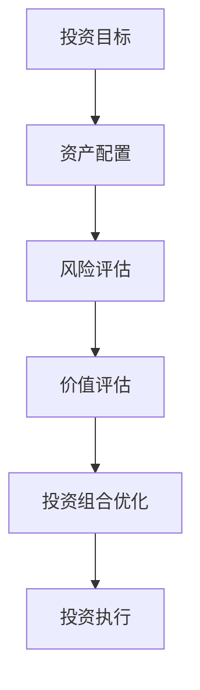
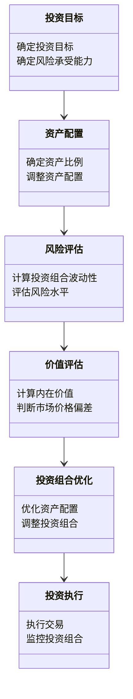
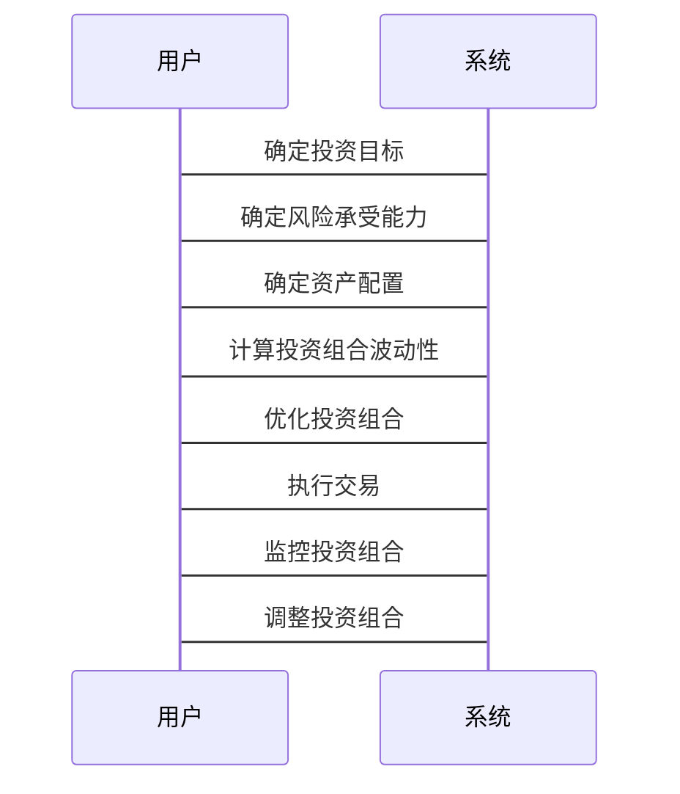

                 


# 彼得林奇的"慢牛"投资哲学

## 关键词：彼得林奇、慢牛、投资哲学、长期投资、风险管理、优质企业、价值投资

## 摘要：本文深入探讨了彼得·林奇的“慢牛”投资哲学，分析其核心理念、策略和实施方法，帮助投资者理解和应用这一投资哲学，实现稳健的投资回报。

---

# 第一部分: 投资哲学的基础

## 第1章: 投资的基本概念

### 1.1 投资的定义与分类

- **投资的定义**：投资是指将资金投入到某个项目或资产中，以期在未来获得收益或资本增值。投资的本质是通过时间和资源的投入，实现财富的增长。

- **投资的分类**：
  - **短期投资**：指持有时间较短的投资，通常在几个月内完成。这类投资风险较高，适合有较强市场敏感性和风险承受能力的投资者。
  - **长期投资**：指持有时间较长的投资，通常超过一年。这类投资注重资产的长期增值，强调价值投资和风险管理。
  - **股票投资**：通过购买公司股份，成为股东，分享公司利润。
  - **债券投资**：通过购买债务工具，获得固定的利息收入。
  - **房地产投资**：通过购买房地产，获得租金收入和资本增值。

- **投资的基本原则**：
  - **分散投资**：不要将所有资金投入到单一资产或行业中，以降低风险。
  - **长期视角**：耐心持有优质资产，避免频繁交易。
  - **价值导向**：寻找被市场低估的资产，长期持有，等待其价值回归。

### 1.2 彼得·林奇的生平简介

- **林奇的投资经历**：彼得·林奇是美国著名的投资专家，曾任富达麦哲伦基金经理，管理规模高达140亿美元。他以长期投资和价值投资闻名，强调选择优质企业，长期持有，实现稳健回报。

- **林奇的投资理念**：林奇认为，投资的核心在于选择优质企业，关注公司的基本面，如财务状况、管理团队和行业地位。他反对短期投机，倡导长期投资，强调耐心和纪律。

- **林奇的著作与影响**：林奇的代表作《彼得·林奇的成功投资》详细阐述了他的投资理念和方法，影响了无数投资者，成为投资领域的经典之作。

### 1.3 "慢牛"投资哲学的背景

- **传统投资理念的局限性**：传统投资方法往往注重短期收益，忽视长期价值，容易受到市场波动的影响，导致投资者在市场下跌时恐慌抛售，错失长期增值的机会。

- **"慢牛"投资哲学的提出**：林奇提出的“慢牛”投资哲学强调长期、稳健的投资策略，选择优质企业，耐心持有，追求稳定的长期收益，而非短期暴利。

- **"慢牛"与传统投资的对比**：
  - **传统投资**：注重短期收益，风险较高，容易受到市场波动影响。
  - **"慢牛"投资**：注重长期价值，风险较低，注重资产的稳健增长。

---

# 第二部分: "慢牛"投资哲学的核心概念

## 第2章: 优质企业的定义与特征

### 2.1 什么是优质企业

- **优质企业的定义**：优质企业是指在行业中具有竞争优势，财务健康，管理团队优秀，且具有长期增长潜力的企业。

- **优质企业的核心特征**：
  - **行业地位**：企业在行业中占据领先地位，具有竞争优势。
  - **财务状况**：公司财务健康，盈利稳定，负债低，现金流充足。
  - **管理团队**：管理团队经验丰富，能力强，具有良好的道德和职业操守。
  - **增长潜力**：公司具有持续增长的潜力，能够在未来实现价值增值。

### 2.2 选择优质企业的标准

- **行业分析**：
  - 选择具有增长潜力的行业，如科技、医疗等。
  - 分析行业竞争格局，选择具有竞争优势的企业。

- **财务指标分析**：
  - **市盈率（P/E）**：衡量股票价格是否合理，市盈率过低可能被低估，过高可能被高估。
  - **市净率（P/B）**：衡量股票价格与账面价值的关系，市净率过低可能被低估。
  - **ROE（净资产收益率）**：衡量公司盈利能力，ROE越高，盈利能力越强。
  - **现金流**：公司现金流健康，能够支持持续经营和增长。

- **管理团队评估**：
  - 评估管理团队的背景和经验，选择具有优秀领导能力和良好声誉的团队。
  - 关注管理层的决策和公司治理，确保管理透明和规范。

## 第3章: 长期投资的重要性

### 3.1 长期投资的优势

- **长期投资的优势**：
  - **复利效应**：长期投资能够充分利用复利效应，实现财富的指数增长。
  - **风险分散**：长期投资能够分散短期市场波动的风险，降低投资的波动性。
  - **价值发现**：长期投资能够发现并持有优质资产，实现长期价值增值。

### 3.2 长期投资的风险

- **长期投资的风险**：
  - **市场波动**：长期投资仍需面对市场波动的风险，如经济衰退、市场崩盘等。
  - **通货膨胀**：长期投资可能受到通货膨胀的影响，实际回报可能下降。
  - **企业风险**：所投资的企业可能出现经营问题，影响投资回报。

### 3.3 长期投资的策略

- **分批投资**：通过分批投资，降低市场波动的影响，分散投资风险。
- **定期定额投资**：定期定额投资能够平滑市场波动，降低择时风险，适合长期投资。
- **价值投资**：选择优质企业，长期持有，等待其价值回归。

## 第4章: 风险管理与投资组合

### 4.1 风险管理的重要性

- **风险管理的重要性**：
  - **降低投资风险**：通过有效的风险管理，降低投资组合的整体风险。
  - **提高投资回报**：通过风险管理，优化投资组合，提高整体回报。
  - **长期稳健投资**：有效的风险管理是实现长期稳健投资的基础。

### 4.2 投资组合的构建

- **投资组合的构建**：
  - **资产配置**：根据个人风险承受能力和投资目标，合理配置股票、债券、现金等资产。
  - **分散投资**：将资金分散投资于不同资产类别、行业和区域，降低投资风险。
  - **定期调整**：根据市场变化和投资目标，定期调整投资组合，优化资产配置。

### 4.3 风险与收益的平衡

- **风险与收益的平衡**：
  - **风险厌恶者**：适合选择低风险、稳定收益的投资方式，如债券、货币市场基金等。
  - **风险中性者**：适合选择平衡型投资组合，兼顾风险和收益。
  - **风险偏好者**：适合选择高风险、高收益的投资方式，如股票、创业投资等。

---

# 第三部分: "慢牛"投资哲学的算法与数学模型

## 第5章: 价值评估模型

### 5.1 价值评估模型的定义

- **价值评估模型**：通过分析企业的财务数据和市场情况，评估企业的内在价值，判断其是否被市场低估或高估。

### 5.2 价值评估模型的流程

- **步骤1：收集数据**：收集企业的财务报表、行业数据和市场信息。
- **步骤2：计算关键指标**：计算市盈率、市净率、ROE等关键指标。
- **步骤3：分析企业基本面**：评估企业的行业地位、财务状况和管理团队。
- **步骤4：判断价值是否低估**：根据模型计算出的内在价值与市场价格进行比较，判断是否低估或高估。

### 5.3 价值评估模型的数学公式

- **市盈率（P/E）**：
  $$ P/E = \frac{股价}{每股收益} $$
- **市净率（P/B）**：
  $$ P/B = \frac{股价}{每股净资产} $$
- **ROE（净资产收益率）**：
  $$ ROE = \frac{净利润}{净资产} $$

## 第6章: 风险评估模型

### 6.1 风险评估模型的定义

- **风险评估模型**：通过分析投资组合的波动性和潜在风险，评估投资组合的风险水平。

### 6.2 风险评估模型的流程

- **步骤1：确定投资组合**：明确投资组合的资产配置和权重。
- **步骤2：计算资产波动性**：分析每种资产的历史波动性。
- **步骤3：计算投资组合波动性**：根据资产权重和相关性，计算投资组合的整体波动性。
- **步骤4：评估风险水平**：根据波动性判断投资组合的风险水平。

### 6.3 风险评估模型的数学公式

- **投资组合波动性计算**：
  $$ \sigma_p = \sqrt{w_1^2 \sigma_1^2 + w_2^2 \sigma_2^2 + 2w_1w_2\sigma_1\sigma_2\rho_{12}} $$
  其中，\( w \) 是资产权重，\( \sigma \) 是资产波动性，\( \rho \) 是资产的相关性。

---

# 第四部分: 系统分析与架构设计

## 第7章: 投资决策的系统化方法

### 7.1 系统分析的定义

- **系统分析**：通过系统的方法，分析投资过程中的各个因素，优化投资决策。

### 7.2 系统架构设计

- **系统架构图**：展示投资决策系统的各个模块及其关系。



### 7.3 系统功能设计

- **领域模型**：展示投资决策系统的各个功能模块。



### 7.4 系统交互设计

- **系统交互序列图**：展示投资决策系统的交互流程。



---

# 第五部分: 项目实战

## 第8章: 实际应用案例

### 8.1 环境安装

- **环境要求**：
  - Python 3.8及以上版本
  - 安装必要的库，如pandas、numpy、matplotlib

### 8.2 核心实现源代码

- **价值评估模型代码**：

```python
import pandas as pd
import numpy as np

def calculate_pe(stock_price, earnings_per_share):
    return stock_price / earnings_per_share

def calculate_pb(stock_price, book_value_per_share):
    return stock_price / book_value_per_share

def calculate_roe(net_income, book_value):
    return net_income / book_value

# 示例数据
stock_price = 50
earnings_per_share = 5
book_value_per_share = 10
net_income = 100
book_value = 500

pe = calculate_pe(stock_price, earnings_per_share)
pb = calculate_pb(stock_price, book_value_per_share)
roe = calculate_roe(net_income, book_value)

print(f"市盈率: {pe}")
print(f"市净率: {pb}")
print(f"ROE: {roe}")
```

- **风险评估模型代码**：

```python
import numpy as np

def calculate_portfolio_variance(weights, covariance_matrix):
    return np.dot(weights.T, np.dot(covariance_matrix, weights))

# 示例数据
weights = [0.6, 0.4]
covariance_matrix = np.array([[0.1, 0.05], [0.05, 0.2]])

portfolio_variance = calculate_portfolio_variance(weights, covariance_matrix)
print(f"投资组合波动性: {portfolio_variance}")
```

### 8.3 案例分析

- **案例分析**：
  - **选择优质企业**：通过分析企业的财务数据和市场情况，选择具有竞争优势、财务健康、管理团队优秀的优质企业。
  - **构建投资组合**：根据风险承受能力和投资目标，合理配置资产，分散投资风险。
  - **长期监控**：定期监控投资组合的表现，根据市场变化和企业情况，调整投资策略。

### 8.4 项目小结

- **项目总结**：通过实际案例分析，验证了“慢牛”投资哲学的有效性，证明了选择优质企业、长期持有、分散投资的风险控制方法能够在实际投资中实现稳健的收益。

---

# 第六部分: 最佳实践

## 第9章: 小结与注意事项

### 9.1 小结

- **总结**：彼得·林奇的“慢牛”投资哲学强调选择优质企业，长期持有，注重风险管理，实现稳健的投资回报。通过系统的投资分析和科学的投资决策，投资者可以在复杂多变的市场中找到优质资产，实现长期稳健的投资收益。

### 9.2 注意事项

- **风险管理**：投资者在进行长期投资时，必须注重风险管理，避免过度集中在单一资产或行业，分散投资风险。
- **持续学习**：市场环境不断变化，投资者需要持续学习，关注经济动态和企业情况，及时调整投资策略。
- **耐心与纪律**：长期投资需要耐心和纪律，避免被短期市场波动所影响，坚持投资策略，实现长期价值。

## 第10章: 拓展阅读

### 10.1 推荐书籍

- 《彼得·林奇的成功投资》：彼得·林奇的经典著作，详细阐述了他的投资理念和方法。
- 《价值投资入门》：介绍价值投资的基本原理和实践方法。
- 《投资之道》：巴菲特的传记，介绍他的投资理念和人生哲学。

### 10.2 推荐博客与资源

- **博客推荐**：
  - [Investment Philosophy](https://www.investors.com)
  - [Value Investing](https://www.valueinvesting.com)
- **工具与资源**：
  - **Financial Modeling**：学习财务建模的在线资源。
  - **Data Analysis Tools**：用于数据分析的工具，如Excel、Python、R。

---

# 作者：AI天才研究院/AI Genius Institute & 禅与计算机程序设计艺术 /Zen And The Art of Computer Programming

