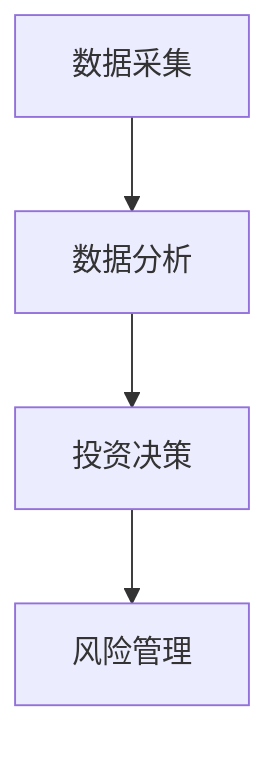

                 


# 彼得林奇的"慢牛"投资在高波动市场中的优势

## 关键词：
彼得林奇、慢牛投资、高波动市场、价值投资、风险管理

## 摘要：
彼得林奇的“慢牛”投资策略以其长期持有优质股票、追求稳定收益的特点，在高波动市场中展现出了显著的优势。本文将深入分析“慢牛”投资的核心理念、策略优化、数学模型、系统架构以及实际应用，为投资者提供全面的指导。

---

# 第1章: "慢牛"投资的核心理念

## 1.1 "慢牛"投资的定义与特点

### 1.1.1 什么是"慢牛"投资
“慢牛”投资是一种以长期持有的价值投资策略为核心的投资方式。其核心理念是通过精选优质股票，耐心等待其内在价值的逐步显现，从而实现稳定的长期收益。这种策略强调低风险、高回报，注重长期价值而非短期波动。

### 1.1.2 "慢牛"投资的核心特点
- **长期持有**：避免频繁交易，降低交易成本和税务负担。
- **价值导向**：以企业的基本面分析为基础，选择具有竞争优势的公司。
- **风险控制**：通过分散投资和严格选股，降低投资组合的整体风险。
- **耐心等待**：接受市场的短期波动，等待优质企业的价值回归。

### 1.1.3 "慢牛"投资与传统投资的区别

| 特性 | 慢牛投资 | 传统投资 |
|------|----------|----------|
| 时间框架 | 长期持有 | 短期交易 |
| 风险偏好 | 低风险 | 高风险 |
| 收益来源 | 价值回归 | 价格波动 |

---

## 1.2 高波动市场的特点

### 1.2.1 高波动市场的定义
高波动市场是指证券价格在短时间内出现大幅波动的市场环境。这种市场通常伴随着市场参与者的恐慌情绪和信息不对称，投资者面临更高的不确定性和风险。

### 1.2.2 高波动市场的常见特征
- 市场情绪波动剧烈，投资者情绪化交易增多。
- 股票价格与公司基本面脱节，出现大幅波动。
- 市场流动性波动大，买卖价差显著。

### 1.2.3 高波动市场对投资者的影响
- 投资者可能面临更大的心理压力和决策困难。
- 短期波动可能掩盖公司的长期价值，导致投资者误判。
- 高波动市场中，优质股票往往被低估，为长期投资者提供了机会。

---

# 第2章: 彼得林奇投资策略的背景

## 2.1 彼得林奇的个人投资理念

### 2.1.1 彼得林奇的投资哲学
彼得林奇是美国著名的职业基金经理，管理着富达麦哲伦基金，创造了长期稳定的超额收益。他的投资哲学主要包括以下几点：
- **价值投资**：寻找具有强大竞争优势、良好财务状况和管理团队的公司。
- **长期持有**：避免频繁交易，降低交易成本。
- **分散投资**：通过投资不同行业的股票降低风险。

### 2.1.2 彼得林奇的投资方法论
彼得林奇的选股标准包括以下几点：
- 公司具有强大的竞争优势。
- 公司财务状况健康，盈利稳定。
- 管理团队具备良好的声誉和能力。
- 公司估值合理，具有长期增值潜力。

### 2.1.3 彼得林奇的成功案例
彼得林奇在其职业生涯中成功投资了包括可口可乐、IBM、苹果等在内的多家知名企业。这些投资的成功主要得益于他对公司基本面的深入研究和长期持有的策略。

---

## 2.2 "慢牛"投资在高波动市场的优势

### 2.2.1 高波动市场中的投资机会
高波动市场中，许多优质股票可能因为市场的恐慌情绪而被低估，为长期投资者提供了买入的机会。此外，高波动市场中的短期波动为投资者提供了低位买入、高位卖出的套利机会。

### 2.2.2 "慢牛"投资在高波动市场的稳定性
“慢牛”投资通过长期持有优质股票，能够有效规避市场的短期波动风险。在高波动市场中，优质股票的内在价值往往能够经受住市场的考验，为投资者提供稳定的收益。

### 2.2.3 "慢牛"投资的风险控制
通过分散投资和严格选股，“慢牛”投资能够在高波动市场中有效控制风险。投资者可以通过选择多个行业的优质股票，降低单一行业波动对整体投资组合的影响。

---

# 第3章: "慢牛"投资的数学模型与算法

## 3.1 投资回报率的计算

### 3.1.1 投资回报率的定义
投资回报率（ROI）是衡量投资收益的重要指标，计算公式为：
$$ ROI = \frac{\text{净收益}}{\text{初始投资}} $$

### 3.1.2 投资回报率的实际应用
假设投资者以每股10元的价格买入某公司股票，持有两年后以每股15元卖出。期间没有分红，计算投资回报率：
$$ ROI = \frac{15 - 10}{10} = 50\% $$

---

## 3.2 股票估值模型

### 3.2.1 市盈率模型
市盈率（P/E）是衡量股票估值的重要指标，计算公式为：
$$ P/E = \frac{\text{股票价格}}{\text{每股收益}} $$

### 3.2.2 市盈率模型的实际应用
假设某公司股票价格为20元，每股收益为2元，计算市盈率：
$$ P/E = \frac{20}{2} = 10 $$

---

## 3.3 价值投资模型

### 3.3.1 价值投资模型的定义
价值投资模型通过分析公司的基本面数据，评估其内在价值。核心公式为：
$$ \text{内在价值} = \frac{\text{净利润}}{\text{资本成本}} $$

### 3.3.2 价值投资模型的实际应用
假设某公司净利润为1000万元，资本成本为8%，计算内在价值：
$$ \text{内在价值} = \frac{1000}{0.08} = 12500 \text{万元} $$

---

# 第4章: 高波动市场的投资策略

## 4.1 高波动市场中的选股策略

### 4.1.1 高波动市场中的选股标准
在高波动市场中，投资者应选择具有以下特点的股票：
- 公司基本面良好，财务状况健康。
- 公司具有强大的竞争优势，能够在市场波动中保持稳定的业绩。
- 公司估值合理，具有长期增值潜力。

### 4.1.2 高波动市场中的行业选择
在高波动市场中，投资者应关注以下行业：
- 防御性行业：如公用事业、医疗保健等。
- 周期性行业：如科技、能源等，这些行业在市场波动中可能有更大的波动空间。

---

## 4.2 高波动市场中的风险管理

### 4.2.1 风险管理的基本原则
在高波动市场中，投资者应遵循以下风险管理原则：
- 分散投资：通过投资不同行业和不同公司的股票，降低单一投资的风险。
- 设定止损：在投资组合中设定止损点，避免亏损过大。
- 保持耐心：在市场波动中保持冷静，避免情绪化交易。

### 4.2.2 风险管理的具体措施
- 定期调整投资组合：根据市场变化和公司基本面，定期调整投资组合。
- 严格遵守投资纪律：在市场波动中，避免盲目跟风，坚持自己的投资策略。

---

# 第5章: "慢牛"投资的系统架构与实现

## 5.1 系统架构设计

### 5.1.1 系统功能设计
- 数据采集模块：采集市场数据，包括股票价格、财务数据等。
- 数据分析模块：对数据进行分析，评估公司的基本面和估值。
- 投资决策模块：根据分析结果，制定投资策略。
- 风险管理模块：监控投资组合的风险，进行风险控制。

### 5.1.2 系统架构图


---

## 5.2 投资决策流程

### 5.2.1 数据采集
通过API接口或其他数据源，获取股票的实时数据和历史数据。

### 5.2.2 数据分析
对股票的财务数据和市场数据进行分析，评估公司的基本面和估值。

### 5.2.3 投资决策
根据分析结果，制定买入、卖出或持有策略。

---

## 5.3 系统实现

### 5.3.1 数据采集代码
```python
import pandas as pd
import requests

url = "https://api.example.com/stock_data"
response = requests.get(url)
data = response.json()
df = pd.DataFrame(data)
```

### 5.3.2 数据分析代码
```python
def calculate_return(prices):
    returns = []
    for i in range(1, len(prices)):
        returns.append((prices[i] - prices[i-1])/prices[i-1])
    return returns

prices = [10, 12, 15, 13, 18]
returns = calculate_return(prices)
print(returns)
```

---

# 第6章: 项目实战

## 6.1 环境安装
- 安装Python和相关库（如pandas、numpy、requests）。

## 6.2 核心实现代码
```python
import pandas as pd
import numpy as np

def calculate_value_stock(prices):
    value = np.mean(prices)
    return value

prices = [10, 12, 15, 13, 18]
value = calculate_value_stock(prices)
print(value)
```

---

## 6.3 实际案例分析
假设我们选择了一家公司的股票进行投资，分析其在高波动市场中的表现。

---

# 第7章: 最佳实践与小结

## 7.1 最佳实践
- 保持耐心，长期持有优质股票。
- 分散投资，降低风险。
- 定期评估投资组合，进行必要的调整。

## 7.2 小结
彼得林奇的“慢牛”投资策略在高波动市场中展现出了显著的优势。通过长期持有优质股票，投资者能够在市场波动中实现稳定的收益。同时，合理的风险管理策略也是确保投资成功的重要因素。

---

# 作者：AI天才研究院 & 禅与计算机程序设计艺术

