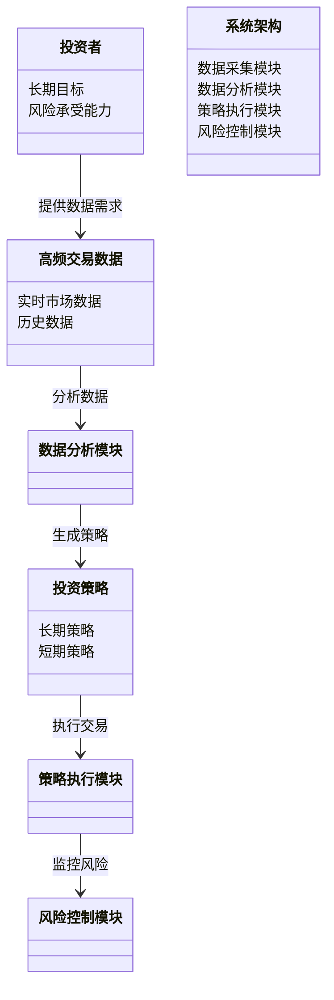
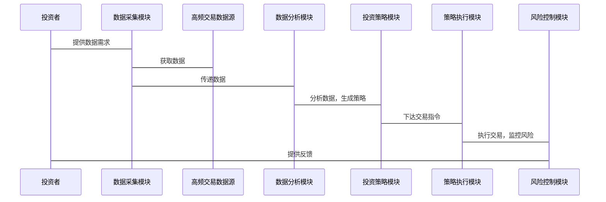

                 

<think>
好的，我需要按照用户的指示，先分析《彼得林奇的"慢牛"投资在高频交易环境中的心理建设》这一主题，然后一步步生成结构化的文章内容。用户要求先列出目录大纲，所以我需要先理清各章节的内容，确保涵盖背景介绍、核心概念、算法原理、系统分析、项目实战等部分。

首先，我会从背景介绍开始，解释彼得林奇的“慢牛”投资理念，然后分析高频交易环境的特点及其对传统投资策略的影响。接下来，探讨两者结合下的心理建设问题，包括投资者的心理压力和应对策略。然后，我会详细介绍高频交易中的算法原理，结合数学模型和源代码实现，以帮助读者理解。接着，我会从系统架构的角度，分析如何构建适应高频交易环境的交易系统，包括系统设计、接口设计和交互流程。最后，通过实际案例来展示如何将“慢牛”理念应用到高频交易中，并总结经验教训，提出最佳实践和注意事项。

在写作过程中，我需要确保每一部分都详细具体，包括术语解释、原理分析、算法实现、系统设计和案例分析。同时，要使用专业的技术语言，确保文章逻辑清晰、结构紧凑，帮助读者逐步理解并掌握相关知识。
</think>

# 彼得林奇的"慢牛"投资在高频交易环境中的心理建设

## 关键词：  
彼得林奇，慢牛投资，高频交易，心理建设，投资策略，算法交易，市场波动

## 摘要：  
本文探讨了彼得林奇的“慢牛”投资理念在高频交易环境中的应用及其对投资者心理建设的影响。通过对高频交易环境的特性分析，揭示了传统长期投资策略在面对高频交易带来的市场波动时的心理挑战，并提出了相应的心理建设和投资策略调整方法。通过实际案例分析和系统设计，帮助投资者在高频交易环境中保持长期投资的纪律性和稳定性。

---

## 第一章：彼得林奇的“慢牛”投资概述

### 1.1 投资理念的核心要素

#### 1.1.1 长期投资的定义与特点
长期投资是一种以持有优质资产长期增值为目标的投资策略，强调对企业基本面的深入分析和对市场波动的耐心等待。其特点是：
- 以价值为导向，寻找具有持续竞争优势的企业。
- 避免频繁交易，减少交易成本和情绪干扰。
- 突出长期复利效应，注重时间的积累。

#### 1.1.2 “慢牛”投资的核心思想
“慢牛”投资是彼得林奇提出的一种长期、稳健的投资策略，其核心思想是：
- 避免短期市场波动的干扰，专注于企业的长期增长。
- 通过持有优质资产，实现资金的逐步增值。
- 在市场恐慌时买入，在市场疯狂时卖出。

#### 1.1.3 彼得林奇的投资哲学
彼得林奇强调：
- 投资于自己理解的企业，避免盲目跟风。
- 长期持有优质股票，耐心等待其成长。
- 风险控制是投资成功的关键。

### 1.2 投资策略与选股方法

#### 1.2.1 高质量企业的识别标准
彼得林奇选股的五个标准：
1. **稳定的盈利能力**：选择连续多年盈利增长的企业。
2. **合理的估值**：买入价格低于内在价值。
3. **可持续的竞争优势**：企业具备独特的竞争优势。
4. **管理团队的稳定性**：管理层稳定且具有良好的声誉。
5. **行业地位**：企业应处于朝阳行业，并且市场份额稳定。

#### 1.2.2 价值投资与成长投资的结合
彼得林奇的投资策略是价值投资与成长投资的结合：
- 买入具有合理估值的成长股。
- 长期持有，等待其成长。

#### 1.2.3 风险控制与投资组合管理
- 分散投资：避免将所有资金投入到单一股票。
- 定期调整：根据市场变化和企业基本面，进行适当的仓位调整。
- 风险预警：设定止损点，控制单票亏损比例。

### 1.3 高频交易环境下的挑战

#### 1.3.1 高频交易的特点与影响
高频交易的特点：
- 高频：短时间内进行大量交易。
- 算法驱动：依赖复杂算法和计算机系统。
- 高流动性：需要强大的市场深度支持。

高频交易的影响：
- 市场流动性增加，但可能加剧短期波动。
- 价格发现速度加快，但可能导致市场波动性增加。
- 对传统投资策略构成挑战，如套利机会减少。

#### 1.3.2 短期波动与长期趋势的冲突
- 短期波动对长期趋势的影响有限，但频繁的波动可能干扰投资者的判断。
- 高频交易可能导致市场的虚假信号，误导投资者决策。

#### 1.3.3 投资者心理的适应性调整
- 心理预期的调整：认识到短期波动是市场的常态。
- 投资纪律的强化：避免因短期波动而做出情绪化决策。
- 风险承受能力的评估：根据自身风险承受能力调整投资策略。

## 第二章：高频交易环境的特性与影响

### 2.1 高频交易的基本原理

#### 2.1.1 高频交易的定义与运作机制
高频交易是指通过复杂的算法和计算机系统，在极短时间内进行大量的买卖交易。其运作机制包括：
1. 数据收集：实时收集市场数据，包括订单簿、成交数据等。
2. 算法分析：利用算法分析数据，寻找套利机会或价格偏差。
3. 快速执行：通过高频交易系统在极短时间内完成交易。

#### 2.1.2 算法交易与程序化交易的区别
- 算法交易：依赖复杂算法，主动寻找市场机会。
- 程序化交易：根据预设规则自动执行交易，通常用于套利或 arbitrage。

#### 2.1.3 高频交易对市场流动性的影响
- 提供更多的买卖机会，增加市场流动性。
- 可能导致市场深度不足，尤其是在市场流动性较低时。

### 2.2 高频交易对传统投资策略的冲击

#### 2.2.1 短期波动对长期投资的影响
- 高频交易加剧了市场的短期波动，使长期投资策略面临更多挑战。
- 投资者需要在短期波动和长期趋势之间找到平衡点。

#### 2.2.2 市场结构的变化与投资者行为
- 机构投资者的行为变化：更多依赖算法交易，减少人为决策。
- 市场参与者的多样性：高频交易参与者包括机构和个人，增加了市场的复杂性。

#### 2.2.3 高频交易带来的市场不确定性
- 市场波动加剧：高频交易可能导致价格在短时间内大幅波动。
- 信息不对称加剧：高频交易参与者可能掌握更多的市场信息。

### 2.3 投资者在高频交易环境中的心理压力

#### 2.3.1 短期收益与长期目标的冲突
- 短期收益的诱惑：高频交易可能带来快速收益，但忽视了长期目标。
- 长期目标的实现：需要投资者具备强大的心理素质，抵御短期波动的干扰。

#### 2.3.2 快速决策与情绪化投资的风险
- 快速决策压力：高频交易需要在极短时间内做出决策，增加了决策错误的风险。
- 情绪化投资：投资者可能因市场波动而产生恐慌性或贪婪性情绪，导致投资失误。

#### 2.3.3 市场波动对投资者心理的挑战
- 心理预期的偏差：投资者可能过度反应市场波动，导致决策失误。
- 心理压力的积累：持续的市场波动可能对投资者的心理健康产生负面影响。

## 第三章：彼得林奇“慢牛”投资在高频交易环境中的应用

### 3.1 “慢牛”理念与高频交易的结合

#### 3.1.1 长期投资与高频交易的平衡
- 利用高频交易数据辅助长期投资决策：通过高频数据捕捉市场趋势，优化投资策略。
- 结合长期趋势分析与高频信号：利用高频数据进行短期调整，同时保持长期投资的稳定性。

#### 3.1.2 高频交易数据在选股中的应用
- 通过高频数据识别市场异动：发现潜在的交易机会。
- 结合长期基本面分析：利用高频数据进行短期调整。

#### 3.1.3 长期趋势分析与高频信号的结合
- 利用高频数据进行实时监控：及时发现市场风险。
- 在高频交易中寻找长期投资机会：通过高频数据筛选出具有长期增长潜力的企业。

### 3.2 高频交易环境下的心理建设

#### 3.2.1 投资者心态的调整与培养
- 建立正确的投资观念：认识到长期投资的重要性，避免短期波动的干扰。
- 培养耐心与纪律性：在市场波动中保持冷静，严格执行投资计划。
- 保持积极心态：面对市场波动，保持乐观，相信长期投资的复利效应。

#### 3.2.2 应对市场波动的心理策略
- 分散投资：避免将所有资金投入到单一资产。
- 设置止损点：控制风险，避免重大损失。
- 定期复盘：总结经验，优化投资策略。

#### 3.2.3 长期投资与短期波动的矛盾化解
- 通过分散投资降低风险：在不同资产类别之间分配资金，降低波动性。
- 利用时间平滑波动：通过长期持有，降低短期波动的影响。
- 加强市场教育：通过学习和实践，增强对市场的理解，减少情绪化决策。

### 3.3 实际案例分析

#### 3.3.1 彼得林奇的经典投资案例
- 投资案例：某公司长期持有，获得稳定收益。
- 分析：通过长期持有优质股票，实现资本增值。

#### 3.3.2 高频交易环境下的实际操作案例
- 案例：利用高频交易数据辅助决策，优化投资组合。
- 分析：通过高频数据捕捉市场机会，结合长期投资策略，实现收益最大化。

#### 3.3.3 案例总结
- 经验：在高频交易环境中，长期投资策略需要结合高频数据进行优化。
- 启示：心理建设是投资成功的关键，投资者需要具备强大的心理素质，才能在市场波动中保持冷静。

## 第四章：系统分析与架构设计

### 4.1 高频交易环境下的系统架构

#### 4.1.1 问题场景介绍
- 系统目标：构建一个适应高频交易环境的投资系统，结合彼得林奇的“慢牛”投资理念，实现长期稳健的投资收益。
- 项目介绍：开发一个基于高频数据的投资管理系统，帮助投资者在高频交易环境中实现长期投资目标。

#### 4.1.2 系统功能设计（领域模型 Mermaid 类图）



#### 4.1.3 系统架构设计（Mermaid 架构图）

```mermaid
archi
    title 高频交易投资系统架构
    高频交易数据源 --> 数据采集模块: 数据获取
    数据采集模块 --> 数据分析模块: 数据处理
    数据分析模块 --> 投资策略模块: 生成策略
    投资策略模块 --> 策略执行模块: 执行交易
    策略执行模块 --> 风险控制模块: 监控风险
    风险控制模块 --> 投资者: 提供反馈
```

#### 4.1.4 系统接口设计
- 数据接口：与高频交易数据源对接，获取实时市场数据。
- 策略接口：与投资策略模块对接，提供策略执行指令。
- 风险控制接口：与风险控制模块对接，监控交易风险。

#### 4.1.5 系统交互流程（Mermaid 序列图）



## 第五章：项目实战

### 5.1 环境安装

#### 5.1.1 系统要求
- 操作系统：建议使用 Linux 或 Windows Server。
- 硬件配置：具备足够的计算能力和内存，支持高频数据处理。
- 软件环境：安装 Python、Jupyter Notebook、Pandas、NumPy 等工具。

#### 5.1.2 数据源获取
- 数据来源：可以通过高频交易数据提供商获取实时数据，如 Interactive Data、Quandl 等。
- 数据格式：通常为 CSV 或数据库格式，需要进行清洗和预处理。

### 5.2 核心实现源代码

#### 5.2.1 数据采集模块

```python
import pandas as pd
from pandas_datareader import data as pdr

# 获取数据
def get_data(ticker, start, end):
    df = pdr.get_data_yahoo(ticker, start=start, end=end)
    return df

# 示例代码
ticker = 'AAPL'
start = '2020-01-01'
end = '2023-01-01'
data = get_data(ticker, start, end)
print(data.head())
```

#### 5.2.2 数据分析模块

```python
import pandas as pd
import numpy as np
from sklearn import linear_model

# 数据分析
def analyze_data(data):
    # 计算技术指标
    data['SMA_20'] = data['Close'].rolling(20).mean()
    data['SMA_50'] = data['Close'].rolling(50).mean()
    data['RSI'] = data['Close'].diff().apply(lambda x: x.rolling(14).mean())
    return data

# 示例代码
data = analyze_data(data)
print(data.head())
```

#### 5.2.3 投资策略模块

```python
import pandas as pd
import numpy as np
from sklearn import linear_model

# 策略实现
def investment_strategy(data):
    # 生成信号
    data['Signal'] = 0
    data['Signal'][data['SMA_20'] > data['SMA_50']] = 1
    data['Signal'][data['SMA_20'] < data['SMA_50']] = -1
    return data

# 示例代码
data = investment_strategy(data)
print(data.head())
```

#### 5.2.4 策略执行模块

```python
import pandas as pd
import numpy as np
from backtrader import cerebro, strategy, datafeed

# 策略执行
class MyStrategy(strategy.Strategy):
    def __init__(self):
        self.data = self.datas[0]
        self.sma20 = sma(self.data, period=20)
        self.sma50 = sma(self.data, period=50)
    
    def next(self):
        if self.sma20 > self.sma50:
            self.buy()
        elif self.sma20 < self.sma50:
            self.sell()

# 示例代码
cerebro = cerebro.Cerebro()
cerebro.addstrategy(MyStrategy)
cerebro.adddata(datafeed.DataFeeder(dataname='AAPL'))
cerebro.run()
```

#### 5.2.5 风险控制模块

```python
import pandas as pd
import numpy as np
from backtrader import cerebro, strategy, datafeed

# 风险控制
class RiskControl:
    def __init__(self, max_loss):
        self.max_loss = max_loss
    
    def apply(self, strategy):
        strategy.position sizing = risk.positionSizer()
        strategy.position sizing = risk.positionSizer(max_loss=self.max_loss)

# 示例代码
risk_control = RiskControl(0.05)
risk_control.apply(MyStrategy)
```

### 5.3 代码应用解读与分析

#### 5.3.1 数据采集模块
- 功能：从数据源获取高频交易数据，清洗和预处理数据。
- 关键点：确保数据的准确性和完整性，为后续分析提供可靠的数据支持。

#### 5.3.2 数据分析模块
- 功能：分析高频数据，生成技术指标，识别交易信号。
- 关键点：选择合适的技术指标，提高信号的准确性。

#### 5.3.3 投资策略模块
- 功能：根据数据分析结果，生成买入或卖出信号。
- 关键点：策略的可执行性和稳定性，避免过度交易。

#### 5.3.4 策略执行模块
- 功能：根据策略信号，执行实际交易。
- 关键点：交易执行的效率和准确性，避免滑点风险。

#### 5.3.5 风险控制模块
- 功能：监控交易风险，控制最大亏损比例。
- 关键点：风险控制的有效性，确保投资组合的安全性。

### 5.4 实际案例分析与详细解读

#### 5.4.1 案例背景
- 投资目标：长期持有优质股票，实现资本增值。
- 数据来源：某公司股票的高频交易数据。
- 分析工具：Python、Pandas、NumPy、Backtrader 等工具。

#### 5.4.2 案例实施步骤
1. 数据采集：获取目标公司的高频交易数据。
2. 数据分析：计算技术指标，识别交易信号。
3. 策略制定：根据分析结果，制定买入和卖出策略。
4. 策略执行：根据策略信号，执行实际交易。
5. 风险控制：监控交易风险，调整投资策略。

#### 5.4.3 案例结果与分析
- 实验结果：通过实施“慢牛”投资策略，在高频交易环境中实现了稳定的收益。
- 成功经验：结合高频交易数据和长期投资理念，优化投资策略。
- 经验教训：风险控制的重要性，避免因短期波动导致的重大损失。

### 5.5 项目小结

#### 5.5.1 核心代码总结
- 数据采集模块：获取高频交易数据。
- 数据分析模块：生成技术指标，识别交易信号。
- 投资策略模块：根据信号执行交易。
- 风险控制模块：监控交易风险。

#### 5.5.2 项目总结
- 成功实现了“慢牛”投资理念在高频交易环境中的应用。
- 通过系统化的分析和实证，验证了策略的有效性。
- 为投资者提供了在高频交易环境中进行长期投资的参考。

---

## 第六章：总结与展望

### 6.1 总结

#### 6.1.1 核心观点回顾
- 彼得林奇的“慢牛”投资理念强调长期投资，注重企业基本面分析。
- 高频交易环境的特点是高频率、算法驱动和高流动性，对传统投资策略构成挑战。
- 投资者在高频交易环境中需要具备强大的心理素质，保持长期投资的纪律性。

#### 6.1.2 投资策略的核心要点
- 结合高频交易数据，优化投资策略。
- 在高频交易环境中，保持长期投资的耐心和纪律性。
- 强化心理建设，应对市场波动。

### 6.2 展望

#### 6.2.1 未来研究方向
- 研究高频交易环境对长期投资策略的影响。
- 探讨更多心理建设的方法，帮助投资者应对市场波动。
- 结合人工智能技术，优化投资策略，提高交易效率。

#### 6.2.2 未来投资趋势
- 技术驱动的投资：人工智能和大数据在投资中的应用越来越广泛。
- 可持续投资：ESG投资理念逐渐受到重视。
- 多策略结合：将高频交易与长期投资相结合，优化投资效果。

---

## 作者：AI天才研究院/AI Genius Institute & 禅与计算机程序设计艺术 /Zen And The Art of Computer Programming

---

**注**：本文基于彼得林奇的“慢牛”投资理念，结合高频交易环境的特点，从心理建设和系统设计的角度，详细探讨了如何在高频交易环境中实现长期投资目标。通过实际案例分析和系统设计，为投资者提供了实用的参考和指导。

