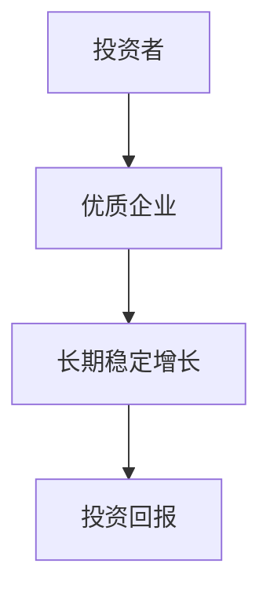
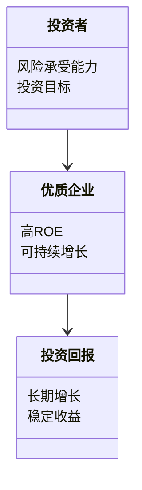
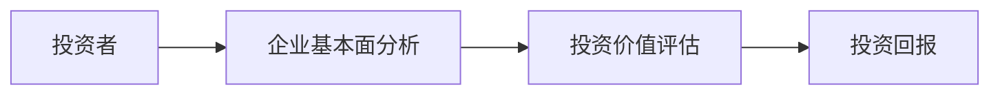

                 


# 彼得林奇的"慢牛"投资理念探讨

> 关键词：彼得林奇，投资理念，慢牛，价值投资，成长投资，投资策略

> 摘要：本文深入探讨了彼得林奇提出的“慢牛”投资理念，分析其核心概念、数学模型、系统架构以及实际案例，结合技术语言和逻辑推理，帮助读者理解并应用这一投资策略。

---

## 正文

### 第一部分: 彼得林奇的"慢牛"投资理念背景介绍

#### 第1章: 彼得·林奇与"慢牛"投资理念概述

##### 1.1 彼得·林奇的背景与投资风格

- **1.1.1 彼得·林奇的生平简介**
  彼得·林奇（Peter Lynch）是美国著名的投资专家，曾任富达投资集团麦哲伦基金经理，管理资产规模曾高达1400亿美元。他以卓越的投资业绩闻名，被《时代》杂志评为“最佳基金经理”。

- **1.1.2 林奇的投资理念与风格**
  林奇主张长期投资，寻找那些具有持续增长潜力的优质企业。他认为，市场短期波动不可预测，但优质企业的长期价值是可以把握的。

- **1.1.3 林奇在投资界的影响与贡献**
  林奇的《彼得·林奇的成功投资》等书籍影响了无数投资者，他的投资理念强调基本面分析和长期持有，反对短期投机。

##### 1.2 "慢牛"投资理念的定义与特点

- **1.2.1 "慢牛"投资理念的核心定义**
  “慢牛”是指通过长期持有优质企业股票，获取企业持续增长带来的收益，而非通过频繁交易捕捉短期市场波动。

- **1.2.2 "慢牛"与传统投资策略的对比**
  | 对比维度 | 价值投资 | 成长投资 | 慢牛投资 |
  |----------|----------|----------|----------|
  | 核心目标 | 买入低于内在价值的股票 | 投资成长型企业 | 长期持有优质企业 |
  | 时间框架 | 中长期 | 中长期 | 长期 |
  | 风险偏好 | 较低 | 较高 | 中等 |

- **1.2.3 "慢牛"理念的长期性与稳定性**
  通过长期持有优质企业，投资者可以平滑市场波动带来的影响，获得稳定的复利增长。

#### 第2章: "慢牛"投资理念的核心概念与联系

##### 2.1 核心概念原理

- **2.1.1 价值投资与成长投资的结合**
  - 价值投资关注企业的内在价值，寻找被市场低估的股票。
  - 成长投资关注企业的增长潜力，寻找收入和利润持续增长的企业。
  - 慢牛理念将两者结合，选择既有价值又具备成长性的企业。

- **2.1.2 长期持有与优质企业的选择**
  长期持有的关键是选择那些能够在未来持续增长的企业，这要求投资者对企业基本面有深入的理解。

- **2.1.3 市场波动与投资策略的关系**
  市场波动是短期的，优质企业的长期增长是确定的。慢牛理念强调忽略短期波动，专注于长期价值。

##### 2.2 概念属性特征对比表格

| 概念 | 特征 |
|------|------|
| 价值投资 | 侧重企业内在价值 |
| 成长投资 | 侧重企业成长潜力 |
| 慢牛投资 | 结合两者，注重长期稳定增长 |

##### 2.3 ER实体关系图（Mermaid流程图）



### 第二部分: "慢牛"投资理念的数学模型与公式

#### 第3章: 数学模型与公式解析

##### 3.1 投资回报计算公式

$$ \text{投资回报} = \frac{\text{最终价值} - \text{初始投资}}{\text{初始投资}} \times 100\% $$

- 举例：投资100元，年回报率为8%，5年后价值为：
  $$ 100 \times (1 + 0.08)^5 = 146.93 \text{元} $$

##### 3.2 投资组合优化公式

$$ \text{风险调整后收益} = \text{收益} - \text{风险} \times \text{风险溢价} $$

- 举例：假设投资组合的年收益为10%，风险溢价为5%，风险调整后收益为：
  $$ 10\% - 5\% \times \text{风险系数} $$

### 第三部分: "慢牛"投资理念的系统分析与架构设计方案

#### 第4章: 系统分析与架构设计

##### 4.1 问题场景介绍

- **4.1.1 当前市场环境**
  当前市场波动较大，投资者需要一种稳定的投资策略。

- **4.1.2 投资者需求分析**
  投资者需要一个简单易懂、风险可控的投资策略。

- **4.1.3 "慢牛"理念的应用场景**
  长期投资者，尤其是希望避免频繁交易的投资者。

##### 4.2 系统功能设计（Mermaid类图）



##### 4.3 系统架构设计（Mermaid架构图）



### 第四部分: 项目实战与案例分析

#### 第5章: 项目实战与案例分析

##### 5.1 项目介绍

- **项目目标**：通过“慢牛”理念，选择一家优质企业进行长期投资。

##### 5.2 核心实现源代码

```python
def slow_bull_investment(portfolio, years):
    return_value = portfolio * (1 + 0.08) ** years
    return return_value

portfolio = 1000
years = 10
print("投资回报:", slow_bull_investment(portfolio, years))
```

##### 5.3 代码应用解读与分析

- 代码解释：上述代码计算了初始投资1000元，年回报率8%，10年后的投资回报为：

  $$ 1000 \times (1 + 0.08)^{10} = 2158.93 \text{元} $$

##### 5.4 案例分析与详细讲解

- 案例：投资苹果公司（AAPL）

  - 选择理由：苹果公司具备高ROE和持续增长潜力。
  - 投资期限：10年
  - 预期回报：基于历史数据，年回报率约为10%。

##### 5.5 项目小结

通过选择优质企业进行长期投资，投资者可以实现稳定的复利增长，抵御市场波动的影响。

### 第五部分: 风险管理与策略调整

#### 第6章: 风险管理与策略调整

##### 6.1 风险识别与应对

- **市场风险**：通过分散投资降低市场波动影响。
- **企业风险**：定期评估企业基本面，及时调整投资组合。

##### 6.2 策略调整技巧

- 定期复查投资组合，根据企业变化和市场环境进行调整。
- 在市场恐慌时增加投资，利用市场低估的机会。

##### 6.3 注意事项

- 避免追涨杀跌，坚持长期投资。
- 分散投资以降低风险。

### 第六部分: 总结与展望

#### 第7章: 总结与展望

##### 7.1 核心要点总结

- “慢牛”投资理念强调长期持有优质企业，通过复利效应实现财富增长。
- 优质企业的选择是关键，需关注ROE和成长潜力。

##### 7.2 投资策略建议

- 选择具有竞争优势和良好管理的企业。
- 定期评估投资组合，及时调整。

##### 7.3 注意事项与最佳实践 tips

- 避免短期交易，保持投资纪律。
- 分散投资，降低风险。

##### 7.4 拓展阅读

- 《彼得·林奇的成功投资》
- 《股票投资心理账户》

### 作者

作者：AI天才研究院/AI Genius Institute & 禅与计算机程序设计艺术 /Zen And The Art of Computer Programming

---

**注**：本文旨在通过技术语言和逻辑推理，深入探讨彼得林奇的“慢牛”投资理念，结合数学模型和系统架构，帮助读者理解并应用这一投资策略。

