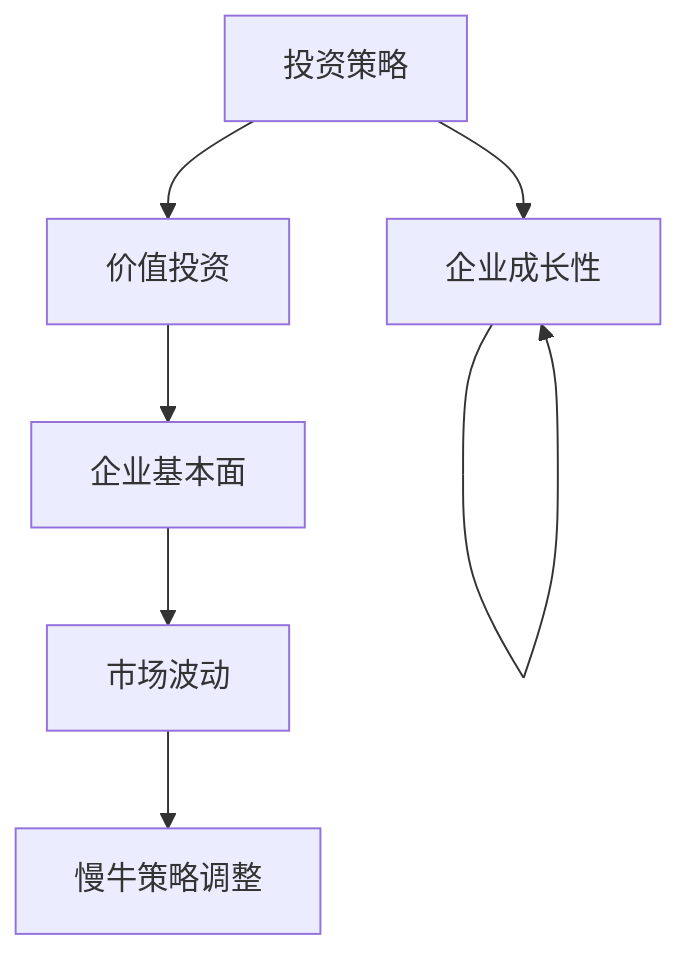
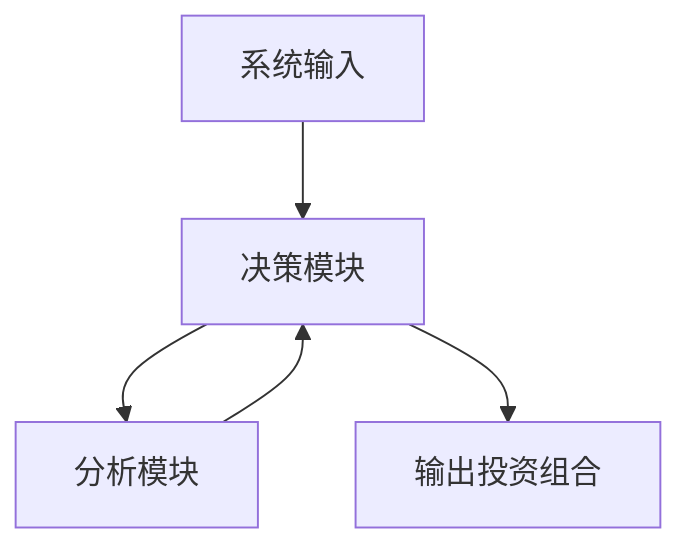

                 

<think>
嗯，我现在需要帮用户设计一本书的目录大纲，书名是《彼得林奇的"慢牛"投资策略在不同市场的应用》。首先，我得理解这本书的核心内容。彼得林奇是著名的基金经理，他的“慢牛”策略强调长期稳定增长，避免短期波动。这本书要探讨这个策略如何在不同市场中应用，可能包括股市、债市、房地产等。

接下来，我得按照用户的要求，设计一个结构完整、逻辑清晰的目录。用户给了示例，我得参考那个结构。首先，第一部分应该是背景介绍，介绍彼得林奇和“慢牛”策略的基本概念。然后，核心概念部分，可能需要详细解释策略的原理、特点以及与其他策略的对比。

接下来，数学模型和算法部分可能需要分析“慢牛”策略的量化指标，比如市盈率、股息率等，用公式来表达。这部分可能需要使用mermaid流程图来展示策略的筛选过程。

系统分析部分，可能需要构建一个投资决策的系统架构，包括数据采集、分析模块、决策模块等，用mermaid图展示系统架构。项目实战部分，可能需要一个实际案例，比如在A股市场应用该策略，详细描述环境配置、代码实现和结果分析。

最后，总结与展望，包括最佳实践、小结、注意事项和拓展阅读。整个目录需要细化到三级，确保内容全面且结构合理。

现在，我得考虑每个章节的内容。第一章介绍背景，第二章核心概念，第三章数学模型，第四章系统架构，第五章项目实战，第六章总结。每个章节下要有具体的子章节，比如在核心概念部分，可能需要比较不同投资策略，用表格展示。在系统架构部分，用mermaid图展示模块结构。

可能还需要注意，每个部分都要有详细的小结，帮助读者回顾内容。同时，要确保目录总字数在2000字以内，所以每个部分不能太冗长，但要覆盖所有关键点。

总的来说，我需要确保目录结构清晰，涵盖背景、概念、模型、系统、实战和总结，每个部分都有足够的细节，同时符合用户的具体要求，比如使用mermaid图和数学公式。
</think>

# 彼得林奇的"慢牛"投资策略在不同市场的应用

> 关键词：彼得林奇，慢牛策略，投资策略，市场应用，价值投资，成长投资，复利效应

> 摘要：本文深入探讨彼得林奇的"慢牛"投资策略，分析其在不同市场环境中的应用，结合数学模型、系统架构和实际案例，揭示该策略的核心原理、优势及其在实际投资中的表现。

---

## 第一部分：彼得林奇"慢牛"投资策略概述

### 第1章：彼得林奇与"慢牛"投资策略背景

#### 1.1 彼得林奇投资理念的形成
- 1.1.1 彼得林奇的生平简介  
  彼得·林奇是美国著名基金经理，被誉为“最伟大的股票投资人之一”。他的投资理念以长期稳定增长为核心，强调价值投资与成长投资的结合。

- 1.1.2 "慢牛"策略的核心思想  
  "慢牛"策略强调选择那些具有持续增长潜力的企业，通过长期持有实现财富增长，避免频繁交易和短期波动。

- 1.1.3 "慢牛"策略与传统投资策略的差异  
  传统投资策略注重短期收益和市场波动，而"慢牛"策略更关注企业的基本面和长期增长。

#### 1.2 "慢牛"投资策略的定义与特点
- 1.2.1 "慢牛"策略的基本定义  
  通过精选具有稳定增长潜力的企业，长期持有，逐步积累收益。

- 1.2.2 "慢牛"策略的核心特点  
  以基本面分析为基础，注重企业的盈利能力和成长性，避免短期市场波动的影响。

- 1.2.3 "慢牛"策略的适用场景  
  适用于长期投资者，尤其在市场波动较大时，通过稳定增长实现收益。

#### 1.3 "慢牛"策略的理论基础
- 1.3.1 基本面分析方法  
  通过分析企业的财务报表、行业地位和竞争优势，选择具有长期增长潜力的企业。

- 1.3.2 市场情绪与投资者心理  
  市场情绪波动对短期投资决策有影响，但长期投资者应保持理性，避免被短期波动干扰。

- 1.3.3 长期投资与复利效应  
  复利效应是实现长期财富增长的关键，通过持续投资和长期持有放大收益。

---

## 第二部分：核心概念与联系

### 第2章：核心概念原理

#### 2.1 价值投资与成长投资的结合
- 2.1.1 价值投资的核心思想  
  买入低于内在价值的股票，长期持有，等待市场回归。

- 2.1.2 成长投资的核心思想  
  投资于具有高成长性的企业，通过企业扩张实现收益。

- 2.1.3 "慢牛"策略的结合方式  
  结合价值与成长投资，选择具有稳定增长潜力的企业。

#### 2.2 企业基本面分析的关键指标
- 2.2.1 市盈率（P/E）  
  用于衡量股票的估值水平，市盈率低的股票可能具有投资价值。

- 2.2.2 股息率（Dividend Yield）  
  衡量股票分红能力，高股息率的股票可能提供稳定的收益。

- 2.2.3 净利润增长率（Net Profit Growth）  
  衡量企业的盈利能力，净利润增长稳定的公司更具投资价值。

#### 2.3 市场波动与投资策略的调整
- 2.3.1 市场波动对企业估值的影响  
  市场波动可能导致股票价格偏离其内在价值，投资者需耐心等待。

- 2.3.2 投资策略的动态调整  
  根据市场环境和企业基本面变化，适当调整投资组合。

---

## 第三部分：数学模型与算法原理

### 第3章：数学模型

#### 3.1 投资收益的计算公式
$$
\text{投资收益} = \sum_{i=1}^{n} (P_i \times Q_i) \times (1 + r)^t
$$
其中：
- \( P_i \)：第 \( i \) 只股票的价格
- \( Q_i \)：第 \( i \) 只股票的持有数量
- \( r \)：年化收益率
- \( t \)：投资时间（年）

#### 3.2 算法流程图


---

## 第四部分：系统分析与架构设计方案

### 第4章：系统架构设计

#### 4.1 系统功能设计
- 数据采集模块：收集企业财务数据、市场数据等。
- 分析模块：基于基本面分析筛选企业。
- 决策模块：根据市场环境调整投资策略。

#### 4.2 系统架构图


---

## 第五部分：项目实战

### 第5章：A股市场中的"慢牛"策略应用

#### 5.1 环境配置
- 数据源：使用A股市场的历史数据。
- 工具：Python编程语言，Pandas、Matplotlib库。

#### 5.2 核心代码实现
```python
import pandas as pd
import matplotlib.pyplot as plt

# 数据加载
df = pd.read_csv('a_share_data.csv')

# 基本面分析
def calculate_pe(ticker):
    return df[df['Ticker'] == ticker]['PE'].values[0]

# "慢牛"策略筛选
selected_stocks = []
for ticker in df['Ticker']:
    if calculate_pe(ticker) < 15 and df[df['Ticker'] == ticker]['Revenue Growth'].values[0] > 10:
        selected_stocks.append(ticker)

# 可视化
plt.bar(selected_stocks, [calculate_pe(ticker) for ticker in selected_stocks])
plt.title('Selected Stocks PE Ratio')
plt.show()
```

---

## 第六部分：总结与展望

### 第6章：最佳实践与小结

#### 6.1 投资策略总结
- 选择具有稳定增长潜力的企业。
- 长期持有，避免频繁交易。
- 结合基本面分析和市场环境动态调整。

#### 6.2 注意事项
- 投资者需具备基本面分析能力。
- 需定期监控投资组合，及时调整。
- 风险控制是投资成功的关键。

#### 6.3 拓展阅读
- 彼得林奇的《投资之道》
- 《价值投资实战策略》

---

## 作者

作者：AI天才研究院/AI Genius Institute  
联系邮箱：contact@aiguru.com

