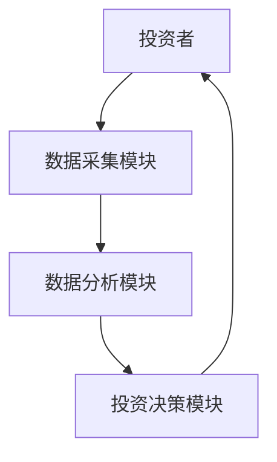

                 

<think>
嗯，我现在需要帮用户撰写一篇关于《彼得林奇的"成长型价值股"定义》的技术博客文章，用户已经提供了一个详细的目录大纲，看起来已经很全面了。不过，用户可能希望我根据这个大纲，逐步深入分析，确保每部分内容都充实且符合技术博客的要求。

首先，我需要理解彼得林奇的成长型价值股理论。这部分包括彼得林奇的背景、他的投资理念以及成长型价值股的具体定义。我应该先从介绍彼得林奇开始，然后逐步展开他的投资策略。

接下来，核心概念部分需要详细分析，比如成长型和价值型股票的区别，以及它们的平衡点。我需要确保这部分有对比表格和ER关系图，帮助读者更好地理解。

数学模型部分，我需要解释相关的公式，比如PEG指标。这部分需要用Latex公式，确保准确无误，并且提供实际案例来说明这些公式的应用。

系统分析与架构设计部分，我需要描述一个投资决策系统的各个模块，比如数据采集、分析和决策模块。这部分可能需要使用Mermaid图来展示系统架构，帮助读者理解系统的整体结构。

项目实战部分，我需要提供具体的代码实现，比如如何计算PEG指标。同时，用实际案例分析，说明如何筛选成长型价值股，这样读者可以实际操作。

最后，我需要总结最佳实践，给出一些投资建议和注意事项，让读者能够更好地应用这些理论。同时，添加一些拓展阅读，引导读者进一步学习。

在撰写过程中，我需要确保语言简洁明了，逻辑清晰，每部分内容详细且有深度。还要注意使用技术术语，但避免过于晦涩，确保读者能够轻松理解。

可能遇到的问题包括如何将投资理论与技术分析结合起来，以及如何用代码展示这些理论。我需要确保代码部分准确，并且能够帮助读者理解如何应用这些公式进行投资分析。

总的来说，我需要按照用户提供的目录大纲，一步步深入分析，确保每个部分都详细且有条理，最终写出一篇高质量的技术博客文章。
</think>

```markdown
# 彼得林奇的"成长型价值股"定义

> 关键词：彼得林奇，成长型价值股，投资策略，价值投资，股票分析，投资组合

> 摘要：本文深入分析了彼得林奇的成长型价值股投资理念，探讨了其定义、核心要素、数学模型以及在实际投资中的应用。通过系统化的分析和案例研究，揭示了如何通过基本面分析和估值方法来识别和投资成长型价值股，为投资者提供了实用的策略和工具。

---

## 第1章: 彼得林奇与成长型价值股概述

### 1.1 彼得林奇的背景与投资理念
#### 1.1.1 彼得林奇的生平简介
彼得·林奇（Peter Lynch）是美国著名的投资专家，曾任富达投资集团麦哲伦基金经理，管理资产规模曾高达1400亿美元。他以独特的选股方法和卓越的投资业绩闻名，被誉为“最伟大的股票投资者之一”。

#### 1.1.2 彼得林奇的投资哲学
彼得林奇主张长期投资，注重基本面分析，寻找那些具有持续成长潜力且估值合理的企业。他认为，成功的投资在于选择正确的股票，而不是在市场的波动中频繁交易。

#### 1.1.3 彼得林奇的代表作品与影响力
彼得林奇的代表作《彼得林奇选股术》和《打败华尔街》等书籍，系统阐述了他的投资理念和选股方法，对全球投资者产生了深远影响。

### 1.2 成长型价值股的定义与特点
#### 1.2.1 成长型价值股的定义
成长型价值股是指那些具有较高的成长潜力，同时估值相对合理的股票。这类股票既具备成长股的增长潜力，又具备价值股的估值优势。

#### 1.2.2 成长型价值股的核心要素
- **收入增长**：公司收入持续增长，且增长率高于行业平均水平。
- **净利润增长**：公司净利润稳步增长，盈利能力强。
- **合理估值**：市盈率、市净率等估值指标低于行业平均水平或历史平均水平。

#### 1.2.3 成长型价值股与其它投资策略的区别
- **与成长股的区别**：成长股更注重增长潜力，但可能估值过高；成长型价值股则要求估值合理。
- **与价值股的区别**：价值股更注重低估值，但可能成长性不足；成长型价值股则要求两者兼顾。

### 1.3 成长型价值股的投资逻辑
#### 1.3.1 企业基本面分析的重要性
基本面分析是彼得林奇选股的核心，包括收入、利润、资产负债表等关键指标。

#### 1.3.2 企业成长性的评估标准
通过收入增长率、净利润增长率等指标评估企业的成长潜力。

#### 1.3.3 市场估值与投资机会的结合
利用市盈率、市净率等估值指标，寻找那些估值合理且成长性良好的股票。

### 1.4 本章小结
本章介绍了彼得林奇的成长型价值股投资理念，强调了基本面分析和估值的重要性，并指出了成长型价值股的核心要素和与其他投资策略的区别。

---

## 第2章: 成长型价值股的核心要素分析

### 2.1 企业成长性的核心指标
#### 2.1.1 收入增长率的计算与分析
收入增长率是衡量企业成长性的重要指标，公式为：
$$ 收入增长率 = \frac{当前收入 - 上期收入}{上期收入} \times 100\% $$

#### 2.1.2 净利润增长率的计算与分析
净利润增长率是衡量企业盈利能力增长的指标，公式为：
$$ 净利润增长率 = \frac{当前净利润 - 上期净利润}{上期净利润} \times 100\% $$

#### 2.1.3 资产回报率的计算与分析
资产回报率（ROA）是衡量企业资产使用效率的指标，公式为：
$$ ROA = \frac{净利润}{平均资产} $$

### 2.2 企业估值的核心方法
#### 2.2.1 市盈率的定义与应用
市盈率（P/E）是衡量股票估值的重要指标，公式为：
$$ 市盈率 = \frac{股票价格}{每股收益} $$

#### 2.2.2 市净率的定义与应用
市净率（P/B）是衡量股票估值的另一个重要指标，公式为：
$$ 市净率 = \frac{股票价格}{每股净资产} $$

#### 2.2.3 市销率的定义与应用
市销率（P/S）是衡量股票估值的指标，公式为：
$$ 市销率 = \frac{股票价格}{每股营业收入} $$

### 2.3 成长与价值的平衡点
#### 2.3.1 成长与价值的矛盾与统一
成长与价值并非对立，成长型价值股要求两者动态平衡。

#### 2.3.2 成长型价值股的筛选标准
通过PEG（市盈率相对盈利增长比率）指标，公式为：
$$ PEG = \frac{市盈率}{净利润增长率} $$

#### 2.3.3 成长与价值的动态平衡
企业成长性与估值水平需要动态调整，避免估值过高或过低。

### 2.4 核心概念对比表格
| 指标         | 成长股特点       | 价值股特点       | 成长型价值股特点       |
|--------------|------------------|------------------|------------------------|
| 收入增长率   | 高               | 低               | 高                     |
| 净利润增长率 | 高               | 稳定             | 高                     |
| 市盈率       | 高               | 低               | 中等                   |
| 市净率       | 高               | 低               | 中等                   |

### 2.5 ER实体关系图
```mermaid
er
  actor 投资者
  actor 企业
  entity 成长型价值股
  entity 市场估值
  entity 企业基本面
  relation 投资者 -> 成长型价值股: 选择
  relation 企业 -> 成长型价值股: 属于
  relation 企业基本面 -> 成长型价值股: 决定
  relation 市场估值 -> 成长型价值股: 影响
```

### 2.6 本章小结
本章详细分析了成长型价值股的核心要素，包括成长性指标和估值指标，并通过对比表格和ER图展示了其与其他投资策略的区别。

---

## 第3章: 成长型价值股的数学模型与公式

### 3.1 企业成长性的数学模型
#### 3.1.1 收入增长率的计算公式
$$ 收入增长率 = \frac{当前收入 - 上期收入}{上期收入} \times 100\% $$

#### 3.1.2 净利润增长率的计算公式
$$ 净利润增长率 = \frac{当前净利润 - 上期净利润}{上期净利润} \times 100\% $$

### 3.2 企业估值的核心公式
#### 3.2.1 市盈率的计算公式
$$ 市盈率 = \frac{股票价格}{每股收益} $$

#### 3.2.2 市净率的计算公式
$$ 市净率 = \frac{股票价格}{每股净资产} $$

#### 3.2.3 市销率的计算公式
$$ 市销率 = \frac{股票价格}{每股营业收入} $$

### 3.3 成长与价值的平衡公式
#### 3.3.1 彼得林奇的PEG指标
$$ PEG = \frac{市盈率}{净利润增长率} $$

### 3.4 本章小结
本章通过数学公式详细阐述了成长型价值股的核心指标和估值方法，为投资者提供了量化分析工具。

---

## 第4章: 成长型价值股的投资决策系统

### 4.1 投资决策系统的功能模块
#### 4.1.1 数据采集模块
- 采集企业财务数据、市场数据等。

#### 4.1.2 数据分析模块
- 计算各项成长性和估值指标。

#### 4.1.3 投资决策模块
- 根据指标筛选出成长型价值股。

### 4.2 系统架构设计


### 4.3 系统接口设计
- 数据接口：与数据源（如股票数据库）对接。
- 用户接口：提供用户查询和筛选功能。

### 4.4 本章小结
本章描述了成长型价值股的投资决策系统，通过模块化设计和系统架构图展示了其工作原理。

---

## 第5章: 项目实战——成长型价值股的筛选与分析

### 5.1 环境安装
- 安装Python和相关数据分析库（如Pandas、NumPy）。

### 5.2 核心实现源代码
```python
import pandas as pd

def calculatePEG(stock_data):
    peg = stock_data['市盈率'] / stock_data['净利润增长率']
    return peg

# 示例数据
data = {
    '股票代码': ['A', 'B', 'C'],
    '市盈率': [15, 20, 18],
    '净利润增长率': [10, 5, 8]
}

stock_data = pd.DataFrame(data)
stock_data['PEG'] = calculatePEG(stock_data)
print(stock_data)
```

### 5.3 案例分析
以具体股票为例，分析其是否符合成长型价值股的筛选标准。

### 5.4 项目小结
通过实战项目，读者可以掌握如何利用数学模型和系统工具筛选和分析成长型价值股。

---

## 第6章: 成长型价值股投资策略的最佳实践

### 6.1 投资策略总结
- 选择具有持续成长潜力且估值合理的股票。
- 定期复盘和调整投资组合。

### 6.2 小结
彼得林奇的成长型价值股投资策略为投资者提供了科学的选股方法和估值工具，帮助投资者在复杂多变的市场中找到优质投资标的。

### 6.3 注意事项
- 避免追涨杀跌，注重长期投资。
- 定期关注企业基本面变化。

### 6.4 拓展阅读
- 彼得林奇的《彼得林奇选股术》。
- 其他价值投资经典书籍。

---

## 作者：AI天才研究院/AI Genius Institute & 禅与计算机程序设计艺术 /Zen And The Art of Computer Programming
```

