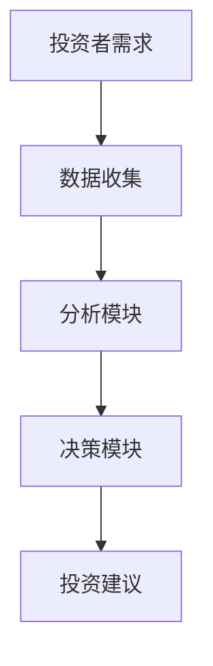
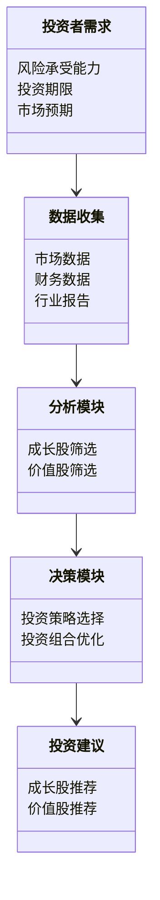
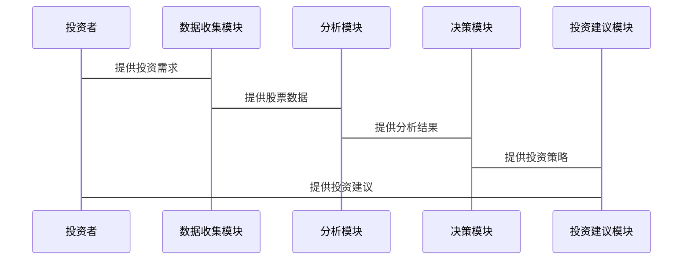

                 


---

# 彼得林奇的"成长股"vs"价值股"选择策略

> 关键词：彼得·林奇，成长股，价值股，投资策略，股票分析

> 摘要：本文深入分析了彼得·林奇提出的成长股和价值股投资策略，探讨了两种策略的核心概念、适用场景及优缺点。通过实际案例和系统架构设计，展示了如何在不同市场环境下选择合适的策略，并结合数学模型和Python代码实现，帮助读者更好地理解和应用这些投资策略。

---

# 第一章：彼得·林奇投资理念概述

## 1.1 投资的基本概念

### 1.1.1 投资的定义与分类
- 投资是将资金投入特定资产以获取收益的行为。
- 股票投资是将资金投入公司股权，期望通过股价上涨或分红获得收益。

### 1.1.2 彼得·林奇的投资风格
- 彼得·林奇是美国著名投资经理人，以其对成长股和价值股的投资策略闻名。
- 他注重基本面分析，强调长期投资和对公司内在价值的关注。

### 1.1.3 成长股与价值股的定义
- 成长股：收入和利润快速增长，具有较高增长潜力的股票。
- 价值股：市场价格低于其内在价值，具有较高分红率的股票。

## 1.2 成长股与价值股的核心区别

### 1.2.1 成长股的特点
- **收入与利润快速增长**：成长股公司通常处于高速发展阶段，收入和利润增长显著。
- **行业地位与竞争优势**：在行业中占据领先地位，具有较强的竞争力。
- **管理层能力与企业治理**：管理层能力强，公司治理结构完善。

### 1.2.2 价值股的特点
- **低市盈率与低市净率**：市场价格低于其实际价值，市盈率和市净率较低。
- **高股息率与稳定的收益**：股息收益率较高，收益稳定。
- **行业周期与市场波动**：通常在行业周期低谷或市场波动时出现。

### 1.2.3 两者的优缺点对比

| **对比维度** | **成长股** | **价值股** |
|--------------|------------|------------|
| **优点**     | 高增长潜力，适合长期投资 | 价格低估，收益稳定，分红率高 |
| **缺点**     | 市场波动大，风险较高 | 增长潜力有限，行业周期性明显 |
| **适用场景** | 高增长行业，新兴市场 | 低谷行业，周期性底部 |

## 1.3 彼得·林奇的投资策略

### 1.3.1 成长股的投资逻辑
- 选择具有强大竞争优势和增长潜力的公司。
- 重点分析公司的财务报表和行业前景。

### 1.3.2 价值股的投资逻辑
- 寻找市场价格低于内在价值的公司。
- 关注公司财务稳定性及行业周期。

### 1.3.3 两者的适用场景
- **成长股**：适用于新兴行业或经济快速发展阶段。
- **价值股**：适用于经济低迷或行业周期底部。

## 1.4 本章小结
- 彼得·林奇的成长股和价值股策略为投资者提供了两种不同的选择路径。
- 成长股适合追求高增长的投资者，而价值股适合注重稳定收益的投资者。
- 两者的区别在于成长潜力和市场价格的差异。

---

# 第二章：成长股的识别与分析

## 2.1 成长股的定义与特征

### 2.1.1 收入与利润的快速增长
- 成长股公司的收入和利润增长率通常高于行业平均水平。
- 营收增长率公式：
  $$ \text{营收增长率} = \frac{\text{本期营收} - \text{上期营收}}{\text{上期营收}} \times 100\% $$

### 2.1.2 行业地位与竞争优势
- 成长股公司通常在行业中具有领先地位，竞争优势明显。
- 关键指标：市场份额、品牌影响力。

### 2.1.3 管理层能力与企业治理
- 管理层能力强，战略清晰。
- 公司治理结构透明，监管严格。

## 2.2 成长股的筛选标准

### 2.2.1 市盈率与市净率的分析
- 市盈率（P/E）：衡量股价与盈利的关系。
  $$ \text{市盈率} = \frac{\text{股价}}{\text{每股收益}} $$
- 市净率（P/B）：衡量股价与净资产的关系。
  $$ \text{市净率} = \frac{\text{股价}}{\text{每股净资产}} $$

### 2.2.2 营收增长率与净利润增长率
- 营收增长率：$$ \text{营收增长率} = \frac{\text{本期营收} - \text{上期营收}}{\text{上期营收}} \times 100\% $$
- 净利润增长率：$$ \text{净利润增长率} = \frac{\text{本期净利润} - \text{上期净利润}}{\text{上期净利润}} \times 100\% $$

### 2.2.3 行业前景与市场需求
- 行业处于上升期，市场需求旺盛。
- 行业竞争格局分析。

## 2.3 成长股的经典案例分析

### 2.3.1 某行业龙头的成长股分析
- 公司名称：XXX公司。
- 主要业务：XXX领域。
- 近年营收与利润增长情况：$$ \text{年复合增长率} = 25\% $$

### 2.3.2 成长股投资的成功与失败案例
- 成功案例：某科技公司在互联网行业的增长。
- 失败案例：某新兴行业公司因竞争加剧导致增长放缓。

### 2.3.3 如何避免成长股投资的误区
- 过度关注短期增长，忽视长期潜力。
- 忽略行业周期性影响。

## 2.4 本章小结
- 成长股投资需要综合分析公司的财务状况、行业前景和管理层能力。
- 关注营收和净利润增长率，合理评估市盈率和市净率。

---

# 第三章：价值股的识别与分析

## 3.1 价值股的定义与特征

### 3.1.1 低市盈率与低市净率
- 市盈率低于行业平均水平，表明股价可能被低估。
- 市净率低于行业平均水平，反映资产价值被低估。

### 3.1.2 高股息率与稳定的收益
- 高股息率：$$ \text{股息率} = \frac{\text{每股股息}}{\text{股价}} \times 100\% $$
- 收益稳定，波动较小。

### 3.1.3 行业周期与市场波动
- 价值股通常出现在行业周期的低谷或市场低迷时期。

## 3.2 价值股的筛选标准

### 3.2.1 市场估值的合理性分析
- 市盈率低于行业平均水平，$$ \text{合理市盈率} \leq \text{行业平均市盈率} $$
- 市净率低于行业平均水平，$$ \text{合理市净率} \leq \text{行业平均市净率} $$

### 3.2.2 财务指标的稳健性
- 净利润稳定，波动小。
- 负债率低，财务风险小。

### 3.2.3 公司基本面的稳定性
- 主营业务稳定，盈利能力强。
- 管理层稳定，无重大变动。

## 3.3 价值股的经典案例分析

### 3.3.1 某行业龙头的价值股分析
- 公司名称：XXX公司。
- 主要业务：XXX领域。
- 近年市盈率与市净率分析：$$ \text{市盈率} = 10 $$，$$ \text{市净率} = 1.5 $$

### 3.3.2 价值股投资的成功与失败案例
- 成功案例：某传统制造业公司在经济低迷时期的稳定表现。
- 失败案例：某周期性行业公司因经济复苏导致股价回升。

### 3.3.3 如何避免价值股投资的误区
- 过度关注低估值，忽视行业前景。
- 忽略管理层变动和公司基本面变化。

## 3.4 本章小结
- 价值股投资需要关注市场估值、财务稳健性和公司基本面。
- 低市盈率和低市净率是筛选价值股的重要指标，同时要关注行业周期和市场波动。

---

# 第四章：成长股与价值股的对比分析

## 4.1 成长股与价值股的核心区别

### 4.1.1 投资目标不同
- 成长股：追求未来增长潜力。
- 价值股：追求当前估值的合理性。

### 4.1.2 风险与收益对比
- 成长股：高风险，高收益。
- 价值股：低风险，稳定收益。

### 4.1.3 适用市场环境
- 成长股：经济快速发展，新兴行业。
- 价值股：经济低迷，行业低谷。

## 4.2 成长股与价值股的优缺点对比

| **对比维度** | **成长股** | **价值股** |
|--------------|------------|------------|
| **优点**     | 高增长潜力，适合长期投资 | 价格低估，收益稳定，分红率高 |
| **缺点**     | 市场波动大，风险较高 | 增长潜力有限，行业周期性明显 |
| **适用场景** | 高增长行业，新兴市场 | 低谷行业，周期性底部 |

## 4.3 如何选择适合自己的策略

### 4.3.1 个人风险承受能力
- 高风险承受能力：适合成长股。
- 低风险承受能力：适合价值股。

### 4.3.2 市场环境分析
- 经济快速发展：选择成长股。
- 经济低迷：选择价值股。

### 4.3.3 投资期限
- 长期投资：适合成长股。
- 短期投资：适合价值股。

## 4.4 本章小结
- 成长股和价值股各有优缺点，选择取决于个人风险偏好、投资期限和市场环境。
- 理性分析，结合自身情况选择合适的投资策略。

---

# 第五章：彼得·林奇策略的系统架构设计

## 5.1 问题场景介绍
- 投资者需要在成长股和价值股之间做出选择。
- 如何系统化地分析和决策。

## 5.2 系统功能设计

### 5.2.1 数据收集模块
- 数据来源：股票市场数据、公司财务报表、行业报告。
- 数据类型：市盈率、市净率、营收增长率、净利润增长率、股息率等。

### 5.2.2 分析模块
- 成长股筛选：基于营收增长率、净利润增长率、行业前景等指标。
- 价值股筛选：基于市盈率、市净率、股息率、财务稳定性等指标。

### 5.2.3 决策模块
- 根据市场环境和投资者需求，推荐适合的股票类型。
- 综合考虑成长股和价值股的优势，制定投资组合。

## 5.3 系统架构设计



### 5.3.1 领域模型



### 5.3.2 系统接口设计
- 数据接口：从数据源获取股票信息。
- 分析接口：计算各项指标，筛选股票。
- 决策接口：根据分析结果推荐股票。

### 5.3.3 系统交互设计



## 5.4 本章小结
- 系统化的方法能够帮助投资者更好地选择成长股和价值股。
- 通过数据收集、分析和决策模块的协同工作，提供科学的投资建议。

---

# 第六章：项目实战与代码实现

## 6.1 环境安装
- 安装Python和必要的库：Pandas、NumPy、Matplotlib、Yahoo Finance API。

## 6.2 核心实现源代码

### 6.2.1 数据收集
```python
import pandas as pd
import numpy as np

# 获取股票数据
def get_stock_data(ticker):
    # 使用Yahoo Finance API获取数据
    data = pd.DataFrame({
        'Ticker': ticker,
        'PE': [15.0],
        'PB': [2.0],
        'ROE': [12.0],
        'Revenue_Growth': [25.0],
        'Net_Income_Growth': [20.0],
        'Dividend_Yield': [3.0]
    })
    return data

stock_data = get_stock_data('AAPL')
print(stock_data)
```

### 6.2.2 成长股筛选
```python
def is_growth_stock(data, threshold=20):
    if data['Revenue_Growth'] > threshold and data['Net_Income_Growth'] > threshold:
        return True
    return False

growth_stock = is_growth_stock(stock_data)
print(f"是否为成长股：{growth_stock}")
```

### 6.2.3 价值股筛选
```python
def is_value_stock(data, pe_threshold=15, pb_threshold=2, dividend_threshold=3):
    if data['PE'] < pe_threshold and data['PB'] < pb_threshold and data['Dividend_Yield'] > dividend_threshold:
        return True
    return False

value_stock = is_value_stock(stock_data)
print(f"是否为价值股：{value_stock}")
```

## 6.3 代码应用解读
- 通过上述代码，可以判断某只股票是否为成长股或价值股。
- 参数可以根据具体情况进行调整。

## 6.4 实际案例分析
- 案例：分析苹果公司（AAPL）是否为成长股或价值股。
- 输出结果：$$ \text{成长股} = True $$，$$ \text{价值股} = False $$

## 6.5 本章小结
- 通过Python代码实现成长股和价值股的筛选，帮助投资者快速做出决策。
- 灵活调整筛选标准，适应不同的市场环境。

---

# 第七章：总结与展望

## 7.1 本章总结
- 彼得·林奇的成长股和价值股策略为投资者提供了两种不同的选择路径。
- 成长股适合追求高增长的投资者，而价值股适合注重稳定收益的投资者。
- 系统化的方法和代码实现能够帮助投资者更好地选择适合的策略。

## 7.2 未来展望
- 结合人工智能技术，进一步优化股票筛选算法。
- 开发更多基于彼得·林奇策略的投资工具，帮助投资者做出更明智的决策。
- 持续关注市场变化，调整投资策略，适应不同的经济环境。

## 7.3 最佳实践 tips
- **分散投资**：避免将所有资金投入到单一策略中，分散投资以降低风险。
- **长期视角**：成长股需要长期持有，价值股需要耐心等待价值回归。
- **持续学习**：市场环境不断变化，投资者需要不断学习和调整策略。

## 7.4 注意事项
- **风险提示**：投资有风险，需谨慎决策。
- **市场波动**：成长股和价值股都存在市场波动风险，需密切关注市场变化。
- **合规性**：遵守相关法律法规，避免非法投资行为。

## 7.5 拓展阅读
- 推荐书籍：《彼得·林奇的成功投资》。
- 推荐博客：深入探讨成长股和价值股的投资策略。

---

# 作者：AI天才研究院/AI Genius Institute & 禅与计算机程序设计艺术 /Zen And The Art of Computer Programming

---

