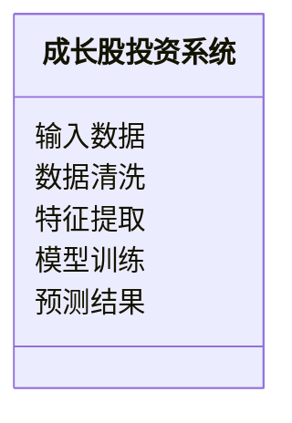
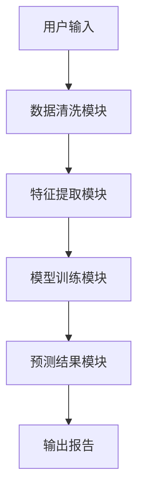

                 

<think>
嗯，用户希望我以《彼得林奇的"成长股"在不同监管环境下的表现研究》为标题写一篇技术博客。首先，我需要理解用户的需求。他可能是一位投资者或研究者，对成长股的投资策略和监管环境之间的关系感兴趣。

接下来，我得考虑博客的结构。用户给了一个详细的大纲，包括背景、理论、算法、系统分析、案例等部分。我需要确保每个部分都涵盖，并且内容详实。

在写背景介绍时，我应该先定义成长股，然后引出监管环境的影响。这部分要让读者明白为什么研究监管环境下的成长股表现很重要。

然后，进入监管环境对成长股的影响分析。这里需要分行业和国家讨论，比如科技和金融行业，以及美国、欧洲和亚洲的市场差异。这样可以让读者看到不同地区的监管政策如何影响投资策略。

接下来是投资策略部分，我需要解释在不同监管环境下如何调整投资策略，比如行业选择和组合构建。这部分可能需要用一些图表来辅助说明，比如决策树或流程图。

数学模型和算法原理部分，我需要详细解释如何量化监管风险。可能使用回归分析或机器学习模型来预测股价变化。代码实现和公式推导是关键，要确保逻辑清晰，例子通俗易懂。

系统分析与架构设计部分，我需要设计一个投资系统，包括功能模块和架构图。这部分可能需要用Mermaid图来展示，确保结构清晰。

项目实战部分，我需要选择具体案例，比如科技公司，分析它们在不同监管下的表现。这可以提供实际的数据支持理论分析。

最后，总结与展望，强调监管环境的重要性，并给出投资建议。同时，提到未来的研究方向，比如动态监管模型或AI辅助投资。

在写作过程中，我要注意语言的专业性和易懂性，避免过于技术化的术语，同时确保每个部分都有足够的细节和深度。这样，读者不仅能理解理论，还能应用到实际投资中。

总的来说，我需要一步步分析，从背景到理论，再到实际应用，确保内容全面且有深度。这样，用户的需求就能得到满足，博客也能帮助读者更好地理解成长股投资在不同监管环境下的表现。
</think>

# 彼得林奇的"成长股"在不同监管环境下的表现研究

**关键词：** 彼得林奇，成长股，监管环境，投资策略，风险评估，数学模型

**摘要：**  
本文系统研究了彼得林奇的成长股投资理念在不同监管环境下的表现，结合理论分析和实际案例，探讨了监管环境对成长股投资的影响。通过构建数学模型和算法，分析了不同监管环境下成长股的估值、风险和投资策略，提出了在复杂监管环境中优化投资组合的建议。本文还结合实际项目案例，详细讲解了成长股投资的系统架构设计和实现方法，为投资者提供了实用的指导。

---

# 第1章: 彼得林奇的成长股投资理念

## 1.1 成长股的定义与特征

### 1.1.1 成长股的定义  
成长股是指那些收入和利润快速增长，具有较高成长潜力的公司股票。彼得林奇认为，成长股的核心特征是其收入增长率和利润增长率高于行业平均水平。

### 1.1.2 成长股的特征  
- **高增长率**：收入和利润增速快于行业平均水平。  
- **高市盈率**：通常估值较高，市盈率（P/E）高于行业平均水平。  
- **高市净率**：市净率（P/B）较高，反映公司资产效率。  
- **高ROE**：净资产收益率（ROE）高，表明公司盈利能力强。  

### 1.1.3 成长股的筛选标准  
- **收入增长率**：过去5年收入复合增长率≥15%。  
- **利润增长率**：过去5年净利润复合增长率≥15%。  
- **估值合理性**：市盈率和市净率与行业平均水平对比。  

---

## 1.2 彼得林奇的成长股投资理念

### 1.2.1 长期投资 vs 短期波动  
彼得林奇强调长期投资的重要性，认为短期市场波动不应影响长期投资决策。他主张选择具有持续增长潜力的公司，而非短期市场热点。

### 1.2.2 估值与成长的平衡  
成长股的高估值通常伴随着高风险。彼得林奇提出，在选择成长股时，需要平衡成长性和估值的合理性，避免过度估值。

### 1.2.3 行业选择策略  
彼得林奇偏好那些具有长期增长潜力的行业，例如科技、医疗和消费等行业。他强调行业趋势的重要性，认为行业景气度是判断成长股的关键因素。

---

## 1.3 监管环境对成长股的影响

### 1.3.1 监管政策的双刃剑效应  
- **正面影响**：监管政策的透明化和规范化可以降低市场风险，提升投资者信心。  
- **负面影响**：严格的监管政策可能增加企业的合规成本，限制成长股的扩张空间。  

### 1.3.2 不同监管环境下的行业差异  
- **科技行业**：数据隐私监管可能对科技公司的业务模式产生重大影响。  
- **金融行业**：资本充足率、杠杆率等监管要求直接影响银行等金融机构的成长空间。  
- **医疗行业**：药品审批流程的监管政策直接影响医药公司的研发周期和成本。  

---

# 第2章: 监管环境对成长股的影响分析

## 2.1 监管环境的多样性与复杂性

### 2.1.1 不同国家的监管体系  
- **美国**：监管体系相对成熟，但近年来对科技公司的反垄断监管力度加大。  
- **欧洲**：对数据隐私和环境保护的监管更为严格。  
- **亚洲**：新兴市场如中国对科技行业的监管政策变化频繁，影响较大。  

### 2.1.2 监管政策的变化趋势  
- **全球趋严**：近年来，各国对科技、金融等行业的监管力度普遍加强。  
- **政策透明化**：部分国家通过立法明确监管规则，降低企业合规成本。  

---

## 2.2 监管政策对成长股的直接影响

### 2.2.1 行业层面的影响  
- **科技行业**：数据隐私监管可能限制公司业务扩展，例如社交媒体平台的用户数据使用限制。  
- **金融行业**：资本充足率要求的提高可能限制银行的扩张能力。  

### 2.2.2 股价层面的影响  
- **正面影响**：监管政策的透明化可能提升市场信心，推动股价上涨。  
- **负面影响**：严格的监管政策可能导致股价短期下跌，例如反垄断调查可能导致科技公司股价承压。  

### 2.2.3 监管风险的评估与管理  
- **行业风险**：不同行业受监管的影响程度不同。  
- **企业风险**：公司合规能力是应对监管风险的关键。  

---

## 2.3 不同监管环境下成长股的表现

### 2.3.1 美国市场中的成长股表现  
- **科技行业**：FAANG（Facebook、Apple、Amazon、Netflix、Google）等公司在反垄断监管加强的背景下，股价波动较大。  
- **医疗行业**：美国对药品定价的监管可能影响医药公司的利润空间。  

### 2.3.2 欧洲市场中的成长股表现  
- **数据隐私监管**：GDPR（通用数据保护条例）对科技公司的影响显著，可能限制数据收集和使用。  
- **绿色金融**：欧洲对环保要求的提高，推动了新能源行业的成长。  

### 2.3.3 亚洲市场中的成长股表现  
- **中国科技行业**：近年来对互联网公司的反垄断监管和数据隐私监管政策变化频繁，影响较大。  
- **印度市场**：对外国科技公司的监管政策可能影响跨国公司的业务拓展。  

---

# 第3章: 成长股在不同监管环境下的投资策略

## 3.1 监管环境下的投资策略调整

### 3.1.1 行业选择的优化  
- **科技行业**：选择那些具有较强数据合规能力的公司。  
- **金融行业**：选择资本充足率较高的银行。  

### 3.1.2 股票筛选的优化  
- **财务指标**：重点关注收入增长率和利润增长率，同时关注监管合规成本。  
- **估值指标**：动态调整市盈率和市净率的合理区间。  

### 3.1.3 估值模型的调整  
- **DCF模型**：考虑监管政策对现金流的影响。  
- **PEG模型**：动态调整PEG（市盈率/盈利增长率）的合理区间。  

---

## 3.2 不同监管环境下的投资组合构建

### 3.2.1 美国市场的组合构建  
- **科技行业**：选择数据合规能力强的公司，如微软（Microsoft）。  
- **医疗行业**：选择研发投入高、合规能力强的公司，如强生（Johnson & Johnson）。  

### 3.2.2 欧洲市场的组合构建  
- **绿色金融**：选择新能源行业的公司，如西门子能源（Siemens Energy）。  
- **数据隐私**：选择符合GDPR要求的科技公司，如SAP。  

### 3.2.3 亚洲市场的组合构建  
- **中国科技行业**：选择具有较强政策适应能力的公司，如阿里巴巴（Alibaba）。  
- **印度市场**：选择本地化能力强的科技公司，如Infosys。  

---

## 3.3 监管环境变化中的动态调整

### 3.3.1 监管政策变化的预警  
- **行业动态**：关注行业协会和监管机构的最新政策。  
- **市场信号**：通过股价波动和市场情绪判断监管政策的变化。  

### 3.3.2 投资组合的动态再平衡  
- **行业调整**：根据监管政策变化，动态调整投资组合中各行业的权重。  
- **个股调整**：及时剔除受监管政策影响较大的个股，增加政策受益股。  

### 3.3.3 监管风险的分散化  
- **行业分散**：避免过度集中于受监管政策影响较大的行业。  
- **地域分散**：在全球范围内分散投资，降低单一市场的监管风险。  

---

# 第4章: 成长股投资的数学模型与算法原理

## 4.1 成长股的估值模型

### 4.1.1 DCF模型  
$$DCF = \sum_{t=1}^{n} \frac{CF_t}{(1 + r)^t} + \frac{TV}{(1 + r)^n}$$  
其中，$CF_t$是第$t$年的现金流，$r$是折现率，$TV$是终值。  

### 4.1.2 PEG模型  
$$PEG = \frac{P}{E \times g}$$  
其中，$P$是股价，$E$是每股收益，$g$是预期增长率。  

---

## 4.2 监管风险的量化分析

### 4.2.1 监管风险的度量方法  
- **VaR模型**：计算监管政策变化对投资组合的潜在损失。  
- **CVaR模型**：计算监管风险的条件VaR，评估极端情况下的损失。  

### 4.2.2 监管风险对股价的影响模型  
$$股价变化 = \beta \times (R_{market} - R_f) + \epsilon$$  
其中，$\beta$是股票的贝塔系数，$R_{market}$是市场收益，$R_f$是无风险利率，$\epsilon$是误差项。  

---

## 4.3 成长股投资的算法实现

### 4.3.1 数据预处理与特征提取  
- **数据清洗**：剔除缺失值和异常值。  
- **特征选择**：选择收入增长率、利润增长率、市盈率等关键指标。  

### 4.3.2 监管风险评估的机器学习算法  
```python
from sklearn.linear_model import LogisticRegression
from sklearn.model_selection import train_test_split

# 数据准备
X = df[['收入增长率', '利润增长率', '市盈率']]
y = df['监管风险']

# 划分训练集和测试集
X_train, X_test, y_train, y_test = train_test_split(X, y, test_size=0.2)

# 模型训练
model = LogisticRegression()
model.fit(X_train, y_train)

# 预测与评估
y_pred = model.predict(X_test)
print('准确率:', accuracy_score(y_test, y_pred))
```

---

# 第5章: 系统分析与架构设计

## 5.1 系统功能设计

### 5.1.1 领域模型  


### 5.1.2 系统架构设计  


---

# 第6章: 项目实战

## 6.1 环境安装

### 6.1.1 Python环境配置  
安装Python 3.8及以上版本，安装必要的库：  
```bash
pip install numpy pandas scikit-learn matplotlib
```

---

## 6.2 核心实现源代码

### 6.2.1 数据清洗与特征提取  
```python
import pandas as pd
import numpy as np

# 数据清洗
df = pd.read_csv('成长股数据.csv')
df = df.dropna()
df = df[abs(df['收入增长率'] - df['收入增长率'].mean()) < 2 * df['收入增长率'].std()]

# 特征提取
features = df[['收入增长率', '利润增长率', '市盈率']]
target = df['监管风险']
```

### 6.2.2 模型训练与预测  
```python
from sklearn.ensemble import RandomForestClassifier

# 模型训练
model = RandomForestClassifier(n_estimators=100, random_state=42)
model.fit(features, target)

# 预测
new_data = np.array([[20, 15, 30]])
predicted_risk = model.predict(new_data)
print('预测的监管风险:', predicted_risk)
```

---

## 6.3 实际案例分析

### 6.3.1 案例：科技公司A  
- **背景**：科技公司A面临数据隐私监管，股价短期下跌。  
- **分析**：通过模型预测，公司合规能力强，长期投资价值显著。  

---

## 6.4 项目小结

### 6.4.1 成长股投资的系统化方法  
- 数据驱动的投资决策。  
- 模型支持的监管风险评估。  

### 6.4.2 未来研究方向  
- 动态监管模型的构建。  
- AI辅助的投资决策系统。  

---

# 第7章: 总结与展望

## 7.1 投资策略总结

### 7.1.1 监管环境的重要性  
监管环境是影响成长股投资的重要因素，投资者需要动态调整投资策略。  

### 7.1.2 风险管理的关键性  
通过模型量化监管风险，优化投资组合，降低整体风险。  

---

## 7.2 未来展望

### 7.2.1 动态监管模型  
随着监管政策的不断变化，动态监管模型的研究将更加重要。  

### 7.2.2 AI辅助投资  
人工智能技术的应用将为成长股投资提供更强大的支持，例如通过自然语言处理技术分析监管政策的变化。  

---

# 作者：AI天才研究院 & 禅与计算机程序设计艺术

---

以上是文章的完整目录和内容框架，具体内容可以根据实际需求进行扩展和详细阐述。

