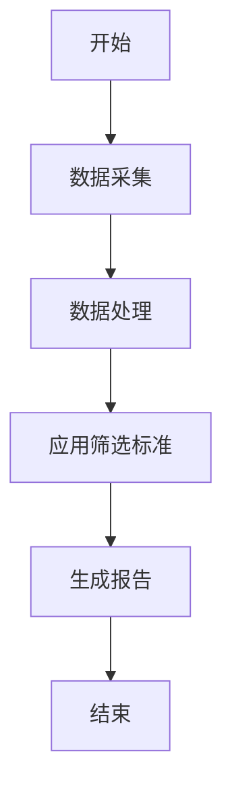
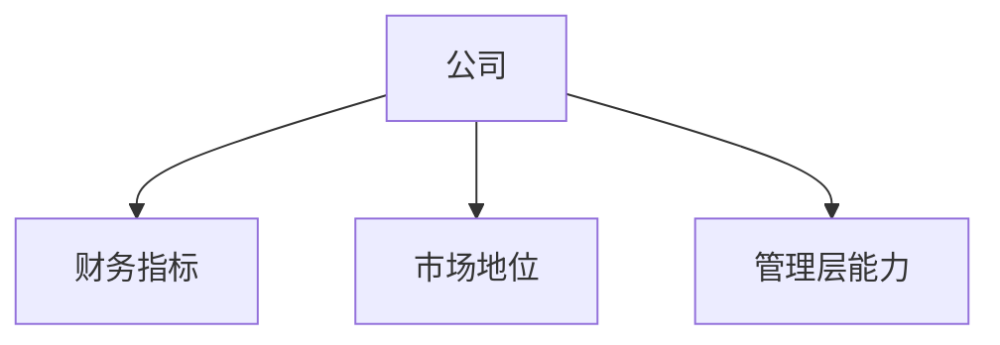
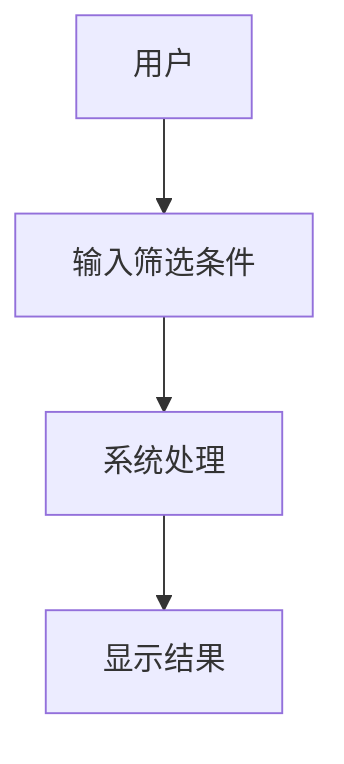

                 

<think>
好的，让我一步一步地分析并撰写这篇文章。

### 第1步：理解任务

用户要求撰写一篇关于“彼得林奇的‘成长股’筛选标准”的技术博客文章。需要按照指定的目录结构，使用逻辑清晰、结构紧凑、简单易懂的技术语言，并结合实际案例和代码示例进行详细讲解。

### 第2步：确定文章结构

根据用户提供的目录结构，我需要确保文章包含以下部分：

1. **背景介绍**：成长股的定义、彼得林奇的投资理念、筛选标准的背景与意义。
2. **核心要素**：市场地位与竞争优势、财务健康状况、管理层能力。
3. **详细分析**：财务指标筛选、收入与利润增长、现金流状况。
4. **系统分析**：构建筛选系统，包括需求分析、架构设计、数据库设计、接口设计。
5. **项目实战**：编写代码实现筛选标准，分析实际案例。
6. **最佳实践**：小结、注意事项、拓展阅读。

### 第3步：撰写每个部分

#### 1. 背景介绍

在背景介绍部分，我需要先定义什么是成长股，然后介绍彼得林奇的投资理念，最后说明筛选标准的意义和应用范围。

- **1.1 成长股的定义与背景**：明确成长股的定义，强调其与价值股的区别，说明成长股的投资价值。
- **1.2 彼得林奇的投资理念**：介绍彼得林奇的投资风格，说明成长股在他投资体系中的重要性。
- **1.3 成长股筛选标准的背景与意义**：说明为什么需要筛选标准，其在投资中的实际应用。

#### 2. 核心要素

在核心要素部分，详细分析成长股的筛选标准，包括市场地位、财务状况和管理层能力。

- **2.1 市场地位与竞争优势**：分析公司在市场中的地位，竞争优势的来源，以及这些因素如何影响成长性。
- **2.2 财务健康状况**：介绍关键财务指标，如ROE、ROA、毛利率等，并分析这些指标如何反映公司的健康状况。
- **2.3 管理层能力**：评估管理层的能力和决策，说明其对企业发展的影响。

#### 3. 详细分析

在详细分析部分，深入探讨财务指标、收入与利润增长、现金流状况等具体筛选标准。

- **3.1 收入与利润增长**：分析收入和利润的增长趋势，解释其对成长股的重要性。
- **3.2 财务健康状况的量化指标**：详细计算并分析关键财务指标，如净利润率、营业利润率、资产负债率。
- **3.3 现金流状况**：分析现金流的重要性，计算自由现金流，并说明其与成长性的关系。

#### 4. 系统分析

构建一个基于筛选标准的系统，包括需求分析、架构设计、数据库设计、接口设计。

- **4.1 系统需求分析**：明确系统目标和功能需求。
- **4.2 系统架构设计**：划分系统模块，设计系统流程图。
- **4.3 数据库设计**：设计数据库表结构和数据关系图。
- **4.4 系统接口设计**：定义数据接口和用户接口。

#### 5. 项目实战

通过编写代码实现筛选标准，分析实际案例。

- **5.1 环境安装**：说明需要安装的工具和库。
- **5.2 核心代码实现**：编写Python代码，计算关键指标。
- **5.3 案例分析**：选择具体公司，应用筛选标准进行分析。

#### 6. 最佳实践

总结筛选标准的应用，提出注意事项和拓展阅读。

- **小结**：回顾筛选标准的核心内容。
- **注意事项**：提醒投资者注意风险和市场变化。
- **拓展阅读**：推荐相关书籍和资源。

### 第4步：撰写草稿

根据以上结构，逐步撰写每个部分的内容，确保逻辑清晰，语言简洁。

### 第5步：检查与修正

检查文章是否符合字数要求，各部分内容是否详细具体，是否符合用户的所有要求，包括格式、数学公式、代码示例等。

### 第6步：最终校对

确保文章没有语法错误，格式正确，所有内容都已准确传达。

### 第7步：添加作者信息

在文章末尾添加作者信息，符合格式要求。

### 总结

通过以上步骤，我将撰写一篇结构清晰、内容详实的技术博客文章，详细介绍彼得林奇的“成长股”筛选标准，并结合实际案例和系统分析，帮助读者深入理解这一投资策略。
</think>

# 彼得林奇的"成长股"筛选标准

## 关键词：成长股，彼得林奇，投资筛选标准，财务指标，股票分析

## 摘要：本文深入探讨彼得林奇的“成长股”筛选标准，从市场地位、财务状况、管理层能力等多维度分析成长股的特征，并结合实际案例和系统设计，提供一套完整的筛选方法。

---

# 第1章: 成长股的定义与背景

## 1.1 成长股的定义与背景

### 1.1.1 成长股的定义与特征
成长股是指那些收入和利润持续增长的公司股票，通常具有较高的市盈率和较大的市场潜力。其核心特征包括收入增长、利润增长和市场份额的扩大。

### 1.1.2 成长股与价值股的区别
价值股通常是指市场价格低于其内在价值的股票，而成长股则强调未来增长潜力。两者在估值方法和投资策略上有显著不同。

### 1.1.3 成长股的投资价值
成长股的投资价值体现在其未来的增长潜力上，适合长期投资者。

## 1.2 彼得林奇的投资理念

### 1.2.1 彼得林奇的投资风格
彼得林奇以其对成长股的深入研究和长期投资闻名，强调基本面分析和对公司管理层的信任。

### 1.2.2 成长股在彼得林奇投资体系中的地位
成长股是彼得林奇投资组合的核心部分，他通过长期持有优质成长股实现资本增值。

### 1.2.3 彼得林奇对成长股的长期看好
彼得林奇认为，具备强大竞争优势和良好管理的公司能够持续增长，从而为投资者带来丰厚回报。

## 1.3 成长股筛选标准的背景与意义

### 1.3.1 成长股筛选标准的背景
随着市场的发展，投资者需要一套系统的方法来筛选出真正的成长股。

### 1.3.2 成长股筛选标准的意义
通过筛选标准，投资者可以更有效地识别具有潜力的公司，降低投资风险。

### 1.3.3 成长股筛选标准的应用范围
这套标准不仅适用于个人投资者，也适合机构投资者和投资组合经理。

---

# 第2章: 成长股的基本筛选标准

## 2.1 市场地位与竞争优势

### 2.1.1 市场地位的定义与评估
市场地位反映了公司在行业中的影响力，通常通过市场份额和品牌知名度来衡量。

### 2.1.2 竞争优势的来源与分析
竞争优势可能来源于技术、成本、商业模式或管理能力。

### 2.1.3 市场地位与竞争优势的关系
强大的市场地位和竞争优势是公司持续增长的基石。

## 2.2 财务健康状况

### 2.2.1 财务健康状况的定义
财务健康状况是指公司在财务报表中的表现，包括收入、利润和现金流。

### 2.2.2 财务指标分析
- 净利润率：$$\text{净利润率} = \frac{\text{净利润}}{\text{收入}}$$
- 营业利润率：$$\text{营业利润率} = \frac{\text{营业收入}}{\text{收入}}$$
- 资产负债率：$$\text{资产负债率} = \frac{\text{总负债}}{\text{总资产}}$$

### 2.2.3 财务健康状况与成长性的关系
健康的财务状况是公司持续增长的基础。

## 2.3 管理层能力

### 2.3.1 管理层能力的定义
管理层能力包括战略决策、执行力和创新能力。

### 2.3.2 管理层能力的评估标准
通过公司历史表现和管理层的背景来评估。

### 2.3.3 管理层能力与公司成长性的关系
优秀的管理层能够带领公司实现持续增长。

---

# 第3章: 成长股筛选标准的详细分析

## 3.1 收入与利润增长

### 3.1.1 收入增长的定义与评估
收入增长是公司业务扩展的直接体现，通常通过年复合增长率来衡量。

### 3.1.2 利润增长的定义与评估
利润增长反映公司在成本控制和盈利能力上的提升。

### 3.1.3 收入与利润增长的关系
收入增长是利润增长的基础，而利润增长是公司价值的核心驱动力。

## 3.2 财务健康状况的量化指标

### 3.2.1 净利润率的计算与分析
净利润率越高，公司盈利能力越强。

### 3.2.2 营业利润率的计算与分析
营业利润率衡量公司主营业绩。

### 3.2.3 资产负债率的计算与分析
较低的资产负债率意味着公司财务风险较小。

## 3.3 现金流状况

### 3.3.1 现金流的定义与重要性
现金流是公司运营和投资的主要资金来源。

### 3.3.2 自由现金流的计算与分析
$$\text{自由现金流} = \text{净利润} - \text{资本支出}$$

### 3.3.3 现金流状况与成长性的关系
充足的现金流支持公司进一步投资和扩张。

---

# 第4章: 成长股筛选系统的构建

## 4.1 系统需求分析

### 4.1.1 系统目标
构建一个自动化的成长股筛选系统，帮助投资者快速识别潜在投资标的。

### 4.1.2 系统功能需求
- 数据采集：从财务报表中提取关键指标。
- 筛选标准：应用彼得林奇的筛选标准进行评估。
- 结果展示：生成筛选报告。

### 4.1.3 系统性能需求
确保系统高效运行，支持大规模数据处理。

## 4.2 系统架构设计

### 4.2.1 系统模块划分
- 数据采集模块
- 数据处理模块
- 筛选模块
- 报告生成模块

### 4.2.2 系统流程图（Mermaid）



## 4.3 数据库设计

### 4.3.1 数据库表结构设计

| 字段名      | 数据类型   | 备注           |
|-------------|------------|----------------|
| 公司代码    | VARCHAR    | 公司唯一标识   |
| 公司名称    | VARCHAR    | 公司名称       |
| 收入        | DECIMAL    | 年收入         |
| 净利润      | DECIMAL    | 年净利润       |
| 资产负债率   | DECIMAL    | %             |
| 营业利润率   | DECIMAL    | %             |

### 4.3.2 数据关系图（Mermaid）



## 4.4 系统接口设计

### 4.4.1 数据接口设计
通过API接口从财务数据库中获取数据。

### 4.4.2 用户接口设计
提供友好的用户界面，方便用户输入筛选条件并查看结果。

## 4.5 系统交互设计

### 4.5.1 系统交互流程图（Mermaid）



---

# 第5章: 项目实战

## 5.1 环境安装

- Python 3.8及以上
- pandas、numpy库

## 5.2 核心代码实现

```python
import pandas as pd

# 数据加载
df = pd.read_csv('companies.csv')

# 计算净利润率
df['net_profit_margin'] = df['净利润'] / df['收入']

# 计算营业利润率
df['operating_profit_margin'] = df['营业收入'] / df['收入']

# 计算资产负债率
df['debt_to_asset_ratio'] = df['总负债'] / df['总资产']

# 应用筛选标准
df = df[df['net_profit_margin'] > 0.1]
df = df[df['operating_profit_margin'] > 0.2]
df = df[df['debt_to_asset_ratio'] < 0.5]
```

## 5.3 案例分析

以科技公司为例，计算其财务指标并应用筛选标准，判断其是否符合成长股的条件。

---

# 第6章: 最佳实践

## 6.1 小结

彼得林奇的成长股筛选标准为我们提供了一套系统的方法，帮助投资者识别具有潜力的公司。

## 6.2 注意事项

- 投资有风险，需谨慎决策。
- 定期复盘和调整投资组合。

## 6.3 拓展阅读

- 彼得林奇的书籍：《彼得林奇的投资之道》
- 相关研究：成长股投资策略的研究进展

---

# 作者

作者：AI天才研究院/AI Genius Institute  
联系邮箱：[contact@ai-genius-institute.com](mailto:contact@ai-genius-institute.com)  
文章标题：彼得林奇的"成长股"筛选标准  
关键词：成长股，彼得林奇，投资筛选标准，财务指标，股票分析  
摘要：本文深入探讨彼得林奇的“成长股”筛选标准，从市场地位、财务状况、管理层能力等多维度分析成长股的特征，并结合实际案例和系统分析，提供一套完整的筛选方法。

