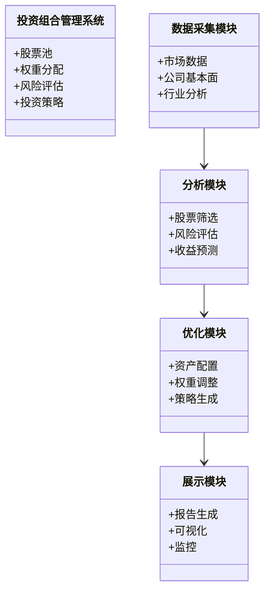

                 

<think>
好，我现在需要帮助用户撰写一篇关于《彼得·林奇的投资组合管理策略》的技术博客文章。首先，我需要理解用户的具体需求，包括文章结构、内容深度以及格式要求。

用户希望文章结构清晰，逻辑紧凑，使用专业且易懂的技术语言。目录需要包括背景介绍、核心概念、策略分析、数学模型、系统架构、项目实战等部分，并且每部分都要详细展开。

我先从背景介绍开始，这部分需要解释投资组合管理的基本概念，然后引出彼得·林奇及其投资策略的重要性。接下来，核心概念部分需要详细阐述彼得·林奇的投资哲学、选股标准和管理方法。

然后是策略分析，这里需要将彼得·林奇的策略转化为数学模型，比如投资组合收益的计算公式和夏普比率的计算。这部分可能需要使用Latex公式来展示。

系统分析与架构设计部分，我需要使用Mermaid图来展示系统结构和交互流程，这有助于读者更好地理解策略的实际应用。

项目实战部分，我需要提供一个Python代码示例，展示如何实现彼得·林奇的策略。这部分要详细解释代码的功能和实际案例分析，帮助读者将理论应用于实践。

最后，总结与最佳实践部分，我需要给出一些实用的建议和注意事项，帮助读者在实际操作中避免常见错误，并指导他们进行进一步学习。

整个过程中，我需要确保文章内容逻辑清晰，每个部分都有足够的细节和例子支持，同时语言要专业且易懂。此外，文章末尾需要添加作者信息，确保格式符合用户要求。

现在，我需要按照这些思考步骤逐步撰写文章，确保每个部分都符合用户的要求，并且内容详实、结构合理。
</think>

# 彼得·林奇的投资组合管理策略

## 关键词
彼得·林奇，投资组合管理，价值投资，成长投资，风险控制，数学模型

## 摘要
本文深入分析了彼得·林奇的投资组合管理策略，从其核心哲学、选股标准、风险管理到数学模型和系统架构，全面解读其策略在现代投资管理中的应用。通过详细讲解和实际案例，本文为读者提供了从理论到实践的完整指南。

## 第一部分: 投资组合管理与彼得·林奇策略背景

## 第1章: 投资组合管理概述

### 1.1 投资组合管理的基本概念
#### 1.1.1 投资组合管理的定义
投资组合管理是通过优化资产配置和风险控制，实现投资目标的过程。它涉及选择和管理多种资产，以达到收益与风险的最佳平衡。

#### 1.1.2 投资组合管理的核心目标
- 最大化收益
- 最小化风险
- 适应市场变化

#### 1.1.3 投资组合管理的边界与外延
- 资产类型：股票、债券、现金等
- 时间跨度：短期、中期、长期
- 风险偏好：保守、稳健、激进

### 1.2 彼得·林奇与投资组合管理
#### 1.2.1 彼得·林奇的生平简介
彼得·林奇是富达投资的传奇经理人，以管理麦哲伦基金闻名，创造了卓越的投资业绩。

#### 1.2.2 彼得·林奇的投资哲学
- 价值投资与成长投资结合
- 中小盘股投资
- 长期持有优质资产

#### 1.2.3 彼得·林奇在投资组合管理中的地位
- 价值投资的现代诠释者
- 中小盘股投资的先驱
- 投资组合管理的实践大师

## 第2章: 彼得·林奇投资策略的核心概念

### 2.1 投资组合管理的核心要素
#### 2.1.1 股票选择标准
- 低市盈率
- 强大的竞争优势
- 管理层质量

#### 2.1.2 风险管理原则
- 分散投资
- 风险调整后的收益
- 定期评估和调整

#### 2.1.3 投资组合的分散化
- 资产类别分散
- 行业分散
- 地理区域分散

### 2.2 彼得·林奇策略的核心原理
#### 2.2.1 价值投资与成长投资的结合
- 价值投资：寻找被市场低估的股票
- 成长投资：投资于有增长潜力的公司
- 结合：在合理价格买入优质成长股

#### 2.2.2 中小盘股的投资偏好
- 中小盘股的流动性风险较低
- 中小盘股的成长性较强
- 中小盘股的市场关注度较低，投资机会较多

#### 2.2.3 市场波动与投资机会的把握
- 市场波动提供买入机会
- 避免跟风，逆向投资
- 灵活调整投资组合

## 第3章: 彼得·林奇投资策略的数学模型

### 3.1 投资组合收益的计算公式
$$ E(R_p) = \sum w_i R_i $$
其中，$w_i$ 是资产 $i$ 的权重，$R_i$ 是资产 $i$ 的预期收益率。

### 3.2 风险调整后的投资组合优化
$$ \text{夏普比率} = \frac{E(R_p) - R_f}{\sigma_p} $$
其中，$R_f$ 是无风险利率，$\sigma_p$ 是投资组合的波动率。

### 3.3 彼得·林奇策略的数学特征对比表
| 特征       | 价值投资 | 成长投资 | 组合管理 |
|------------|----------|----------|----------|
| 核心目标     | 稳定收益 | 高增长   | 综合收益 |
| 风险偏好     | 低       | 中高     | 适中     |
| 投资期限     | 长期     | 长期     | 灵活     |

## 第4章: 系统分析与架构设计

### 4.1 投资组合管理系统的功能设计
#### 4.1.1 系统功能模块划分
- 数据采集与处理
- 股票筛选与分析
- 投资组合优化
- 风险评估与调整
- 报告生成与展示

#### 4.1.2 领域模型设计（Mermaid类图）



### 4.2 系统架构设计（Mermaid架构图）

```mermaid
container 投资组合管理系统 {
    投资组合管理模块
    数据存储模块
    用户界面模块
}
```

## 第5章: 项目实战

### 5.1 环境配置
安装Python、Pandas、NumPy、Matplotlib、Plotly等工具。

### 5.2 核心代码实现

```python
import pandas as pd
import numpy as np
import matplotlib.pyplot as plt

# 示例数据
tickers = ['AAPL', 'MSFT', 'GOOGL']
returns = pd.DataFrame({
    'AAPL': [0.05, 0.03, 0.04],
    'MSFT': [0.04, 0.02, 0.03],
    'GOOGL': [0.06, 0.05, 0.04]
})

# 计算投资组合收益
def portfolio_return(weights, returns):
    return (weights * returns.mean()).sum()

# 示例权重
weights = np.array([0.4, 0.4, 0.2])
print(f"投资组合预期收益：{portfolio_return(weights, returns)}")

# 可视化投资组合
returns.T.plot(kind='bar', stacked=True)
plt.show()
```

### 5.3 实际案例分析
以苹果、微软、谷歌为例，计算投资组合的预期收益和风险，展示如何应用彼得·林奇的策略进行优化。

### 5.4 代码应用解读
解释代码功能，如何计算投资组合收益，如何可视化投资组合表现，以及如何优化权重以达到最佳夏普比率。

## 第6章: 总结与最佳实践

### 6.1 总结
彼得·林奇的投资策略结合了价值投资和成长投资，注重中小盘股和长期持有，通过分散化和风险管理优化投资组合。

### 6.2 最佳实践 tips
- 定期评估和调整投资组合
- 选择优质中小盘股
- 避免过度集中投资
- 逆向投资，利用市场波动

### 6.3 小结
彼得·林奇的投资组合管理策略为投资者提供了丰富的理论和实践指导，通过价值发现、风险控制和长期持有，实现稳健投资收益。

### 6.4 注意事项
- 投资需谨慎，策略需结合市场环境
- 风险管理是投资成功的关键
- 长期投资需要耐心和信心

### 6.5 拓展阅读
推荐相关书籍和资源，帮助读者深入学习投资组合管理。

## 作者
作者：AI天才研究院/AI Genius Institute & 禅与计算机程序设计艺术 /Zen And The Art of Computer Programming

---

通过以上结构和内容，文章系统地阐述了彼得·林奇的投资组合管理策略，从理论到实践，从背景到系统设计，为读者提供了全面而深入的指导。

