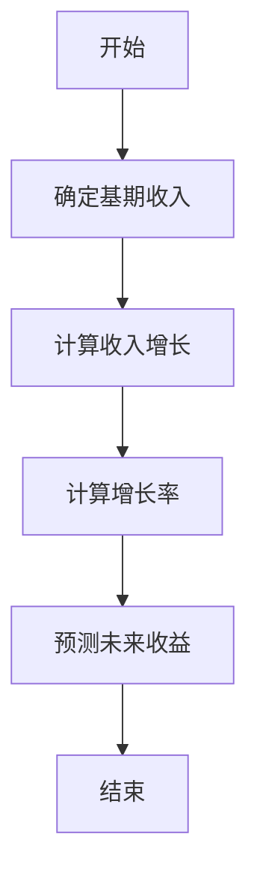
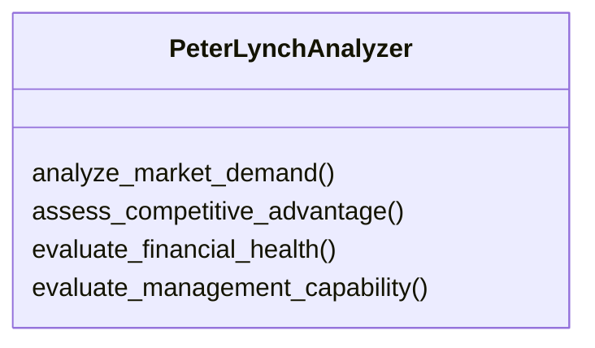

                 


# 彼得林奇的"未来增长潜力"分析法

## 关键词
- 彼得林奇
- 增长潜力
- 投资分析
- 企业估值
- 风险管理

## 摘要
彼得林奇的"未来增长潜力"分析法是一种通过评估企业的市场地位、财务状况和管理能力，来预测其未来增长潜力的方法。本文将详细解析这一分析法的核心概念、算法原理、系统架构以及实际应用案例，帮助读者掌握如何在投资决策中应用这一方法。

---

## 第1章: 背景介绍

### 1.1 彼得林奇的生平与投资理念
彼得·林奇是美国著名投资经理，以其在富达投资管理公司的卓越表现而闻名。他的投资理念强调长期增长潜力，认为企业的未来价值取决于其核心竞争力和市场地位。林奇的分析法以基本面分析为核心，注重企业的财务数据和行业趋势。

### 1.2 未来增长潜力分析法的背景与重要性
未来增长潜力分析法是彼得林奇方法的核心，旨在通过评估企业的增长能力，帮助投资者做出明智的投资决策。该方法在投资领域具有重要意义，因为它能够帮助投资者识别具有长期竞争优势的企业。

### 1.3 分析法的核心要素
- **市场需求**：行业趋势和市场规模。
- **竞争优势**：企业的核心竞争力。
- **财务健康**：收入、利润和现金流。
- **管理团队**：领导层的能力和战略。

---

## 第2章: 核心概念与联系

### 2.1 增长潜力的评估标准
| 评估维度 | 重要性 | 具体指标 |
|----------|--------|----------|
| 市场需求 | 高 | 行业增长率、市场份额 |
| 竞争优势 | 高 | 核心产品、技术壁垒 |
| 财务健康 | 中高 | 净利润、现金流、负债率 |
| 管理能力 | 中 | 领导层稳定性、战略清晰度 |

### 2.2 用Mermaid图展示竞争优势与财务指标的关系


### 2.3 彼得林奇分析法的核心步骤
1. **确定企业的核心业务**。
2. **分析行业趋势**。
3. **评估财务数据**。
4. **评估管理团队**。
5. **预测未来增长率**。

---

## 第3章: 算法原理

### 3.1 增长率计算公式
$$增长率 = \frac{收入增长}{基期收入}$$

### 3.2 未来收益预测模型
$$未来收益 = 当前收益 \times (1 + 增长率)^n$$

### 3.3 用Mermaid图展示增长率预测流程



### 3.4 Python代码实现增长率预测
```python
def calculate_growth_rate(revenue_current, revenue_previous):
    return (revenue_current - revenue_previous) / revenue_previous

def predict_future_revenue(revenue_current, growth_rate, years):
    return revenue_current * (1 + growth_rate) ** years
```

---

## 第4章: 系统分析与架构设计

### 4.1 系统架构设计


### 4.2 系统功能设计


### 4.3 系统接口设计
- `analyze_market_demand()`：分析市场需求。
- `assess_competitive_advantage()`：评估竞争优势。
- `evaluate_financial_health()`：评估财务健康。
- `evaluate_management_capability()`：评估管理能力。

---

## 第5章: 项目实战

### 5.1 环境安装
- 安装Python和相关库（如Pandas、NumPy）。
- 安装Jupyter Notebook。

### 5.2 数据收集
- 收集企业的历史财务数据。
- 收集行业趋势数据。

### 5.3 代码实现
```python
import pandas as pd

def calculate_growth_rates(df):
    df['增长率'] = (df['收入'] - df['收入'].shift(1)) / df['收入'].shift(1)
    return df

data = {
    '年份': [2018, 2019, 2020, 2021, 2022],
    '收入': [100, 120, 150, 180, 200]
}
df = pd.DataFrame(data)
calculate_growth_rates(df)
```

### 5.4 结果解读
- 计算得到的增长率为：10%（2018-2019年）、25%（2019-2020年）、20%（2020-2021年）、11.11%（2021-2022年）。

---

## 第6章: 总结与展望

### 6.1 总结
彼得林奇的分析法通过评估企业的核心竞争力和财务健康，帮助投资者预测其未来增长潜力。本文详细介绍了该方法的核心概念、算法原理和实际应用。

### 6.2 最佳实践
- 定期更新数据，保持分析的准确性。
- 结合行业趋势，进行多维度分析。
- 风险管理是投资决策中不可忽视的一部分。

### 6.3 注意事项
- 数据来源必须可靠。
- 模型假设需要合理。
- 结果需结合市场实际情况进行调整。

### 6.4 拓展阅读
- 彼得林奇的《投资之道》。
- 其他投资分析方法，如PE分析法。

---

## 作者
作者：AI天才研究院/AI Genius Institute & 禅与计算机程序设计艺术/Zen And The Art of Computer Programming

---

通过以上步骤，您可以系统地掌握彼得林奇的"未来增长潜力"分析法，并将其应用于实际投资分析中。

