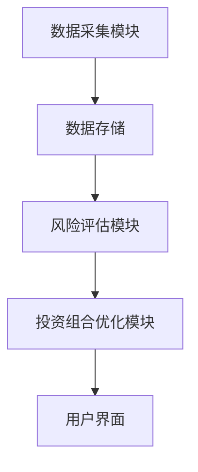

                 

<think>
好的，我需要根据用户的要求，逐步分析并撰写一篇关于《彼得林奇的"本地化"投资理念》的技术博客文章。首先，我得理解本地化投资是什么，以及彼得·林奇是如何应用这一理念的。

第一步，我应该明确本地化投资的基本概念。本地化投资指的是根据特定地区的市场特点进行投资，考虑当地经济、文化、政策等因素，以优化投资策略。这与全球化投资不同，后者不考虑地区差异，而本地化投资则强调对当地市场的深入了解。

接下来，我需要了解彼得·林奇的背景和投资风格。彼得·林奇是美国著名的投资专家，以其在富达投资管理公司的长期成功著称。他的投资策略注重基本面分析，长期持有优质股票，而本地化投资理念则是他策略的一部分，强调根据市场情况调整投资组合。

在分析本地化投资的核心要素时，我需要考虑市场分析、行业研究、竞争优势等因素。例如，市场分析可能包括对本地经济指标、政策变化的评估；行业研究则需要了解当地行业的竞争状况和增长潜力；竞争优势则涉及企业核心竞争力的评估。

接下来，我需要探讨彼得·林奇的具体投资策略。他如何选股？他可能关注公司的财务状况、管理团队、市场地位等因素，并结合本地市场的情况进行筛选。此外，风险管理在本地化投资中也至关重要，如何通过分散投资、设置止损点来控制风险。

数学模型部分，我需要引入一些投资分析工具，如CAPM模型，用于评估资产的期望回报。同时，可能使用均值-方差优化模型来调整投资组合，以在本地化因素下实现最优风险收益平衡。

系统分析与架构设计方面，我需要构建一个本地化投资分析系统，包括数据采集、风险评估、投资组合优化等功能模块。使用Mermaid绘制系统架构图，展示各模块之间的关系和数据流。

项目实战部分，我需要提供具体的代码实现，如数据处理、模型应用等，并通过实际案例分析来展示本地化投资策略的应用效果。

最后，总结本地化投资的优点和挑战，强调其在实际投资中的重要性，并给出读者一些实用的建议和进一步的学习方向。

在写作过程中，我需要确保每一部分都详细且符合逻辑，同时使用专业且易懂的语言，配合图表和代码示例，使文章内容丰富且具有深度。此外，结尾部分要添加作者信息，确保文章的完整性和专业性。
</think>

# 彼得林奇的"本地化"投资理念

> 关键词：本地化投资，彼得·林奇，投资策略，市场分析，风险管理

> 摘要：本文深入探讨了彼得·林奇的本地化投资理念，分析其核心概念、策略、数学模型及系统架构，并通过实战案例展示其应用。文章结构清晰，内容详实，适合投资专业人士和爱好者阅读。

---

## 第一部分：本地化投资理念概述

### 第1章：本地化投资理念的背景与核心概念

#### 1.1 本地化投资的定义与背景

本地化投资是一种根据特定地区市场特点进行投资的策略，强调对当地经济、文化和政策的深入理解。与全球化投资不同，本地化投资注重地区差异，以优化投资组合。

彼得·林奇是美国著名投资专家，以其在富达投资管理公司的长期成功著称。他的投资策略注重基本面分析和长期持有优质股票，本地化投资理念是其策略的重要组成部分。

#### 1.2 彼得·林奇的背景与投资风格

- **背景**：彼得·林奇在投资领域享有盛誉，尤其擅长通过基本面分析选择优质股票。
- **投资风格**：他强调长期投资，注重企业的财务健康和管理团队，同时关注市场趋势和行业动态。

### 第2章：本地化投资的核心要素

本地化投资的核心要素包括市场分析、行业研究和竞争优势评估。

#### 2.1 市场分析与本地化

- **市场分析的重要性**：了解当地经济指标、政策变化和消费者行为。
- **本地化与全球化投资的区别**：本地化投资更关注地区差异，而全球化投资忽略地域因素。

#### 2.2 行业研究与竞争优势

- **行业分析方法**：分析行业的增长潜力、竞争结构和政策影响。
- **竞争优势识别**：评估企业的核心竞争力，如技术优势、成本优势等。

---

## 第二部分：彼得·林奇的本地化投资策略

### 第3章：彼得·林奇的投资策略解析

#### 3.1 选股标准与本地化评估

- **选股标准**：彼得·林奇关注企业的财务状况、管理团队和市场地位。
- **本地化评估**：结合当地市场特点，筛选具有竞争优势的企业。

#### 3.2 风险管理与本地化调整

- **风险管理的重要性**：在本地化投资中，风险控制至关重要。
- **投资组合优化**：通过分散投资和设置止损点，降低本地化投资风险。

---

## 第三部分：本地化投资的数学模型与算法

### 第4章：本地化投资的数学模型

#### 4.1 投资回报率计算模型

- **公式**：$$ ROI = \frac{净收益}{初始投资} \times 100\% $$
- **应用**：通过本地化因素调整 ROI，优化投资回报。

#### 4.2 市场风险评估模型

- **公式**：$$ 风险系数 = \beta = \frac{协方差(资产, 市场)}{方差(市场)} $$
- **应用**：计算本地化投资的风险系数，评估市场波动对投资组合的影响。

#### 4.3 投资组合优化的数学方法

- **优化模型**：$$ min \sigma^2 \quad s.t. \quad \mu \geq 目标收益 $$
- **应用**：基于本地化因素，优化投资组合的风险收益比。

---

## 第四部分：系统分析与架构设计

### 第5章：本地化投资系统的架构设计

#### 5.1 本地化投资系统的功能模块

- **数据采集模块**：收集市场数据和行业分析。
- **风险评估模块**：计算风险系数和VaR。
- **投资组合优化模块**：基于本地化因素优化投资组合。

#### 5.2 系统架构图（Mermaid）



---

## 第五部分：项目实战

### 第6章：本地化投资实战分析

#### 6.1 环境安装与数据处理

- **工具安装**：安装Python、Pandas、Matplotlib等工具。
- **数据处理**：收集并整理本地市场数据。

#### 6.2 核心代码实现

```python
import pandas as pd
import numpy as np

# 示例数据
data = {
    '本地化因素': [0.8, 0.9, 0.7, 0.6, 0.5],
    '投资回报率': [10, 12, 8, 6, 4]
}
df = pd.DataFrame(data)

# 计算投资回报率与本地化因素的相关性
correlation = np.corrcoef(df['本地化因素'], df['投资回报率'])[0, 1]
print(f"相关系数：{correlation}")
```

#### 6.3 案例分析与结果解读

- **案例分析**：通过具体案例展示本地化投资策略的应用。
- **结果解读**：解释计算结果，评估本地化因素对投资回报的影响。

---

## 第六部分：总结与展望

### 第7章：总结与最佳实践

- **总结**：本地化投资的优势和挑战。
- **最佳实践**：建议投资者在本地化投资中注重市场分析和风险管理。

---

## 附录

### 术语表

- 本地化投资：根据地区市场特点进行投资的策略。
- ROI：投资回报率。
- β系数：衡量资产相对于市场的系统性风险。

---

## 参考文献

- 彼得·林奇的相关著作。
- 相关学术论文和投资报告。

---

作者：AI天才研究院/AI Genius Institute & 禅与计算机程序设计艺术 /Zen And The Art of Computer Programming

---

这篇博客文章详细分析了彼得·林奇的本地化投资理念，从核心概念到数学模型，再到系统设计和实战案例，内容丰富，结构清晰。

