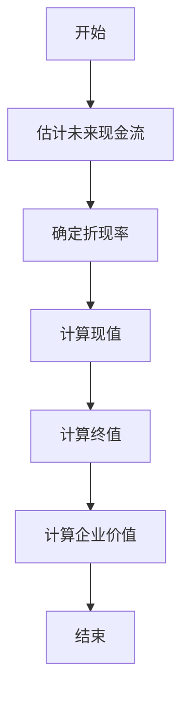

                 


# 彼得林奇的"知道你在买什么"原则

## 关键词：价值投资，彼得林奇，DCF模型，投资分析，财务分析

## 摘要：  
彼得林奇是全球著名的价值投资者，他提出的"知道你在买什么"原则强调在投资前必须深入了解投资标的的价值。本文将从背景介绍、核心概念、算法原理、系统分析、项目实战和最佳实践等方面，全面解析这一原则。通过详细分析投资的基本原理、价值评估方法以及实际案例，帮助读者掌握科学的投资策略，避免常见误区，实现稳健投资。

---

## 第一部分：背景介绍

### 第1章：彼得林奇与价值投资概述

#### 1.1 投资的基本概念
- **什么是投资**  
  投资是将资金投入特定资产或项目，以期望在未来获得收益或资本增值的过程。投资可以分为股票、债券、房地产等多种形式。
  
- **投资的目的与意义**  
  投资的目的是为了实现财富增值，同时分散风险，提高资金的使用效率。通过投资，个人或机构可以优化资产配置，实现长期财务目标。

- **投资的基本原则**  
  投资需要遵循分散化原则、长期持有的原则，以及基于价值而非价格的原则。了解市场波动和经济周期对投资决策至关重要。

#### 1.2 彼得林奇的投资理念
- **彼得林奇的生平简介**  
  彼得·林奇是美国著名的价值投资者，曾任富达麦哲伦基金的经理，管理资产规模曾高达1400亿美元。他的投资风格以深入研究和长期持有著称。

- **彼得林奇的投资哲学**  
  林奇强调“买入并持有”，认为市场短期波动不应影响长期投资决策。他主张通过深入研究公司基本面，寻找具有持续竞争优势的企业。

- **彼得林奇的成功案例**  
  林奇在职业生涯中成功投资了可口可乐、麦当劳等公司，这些公司在其投资期间实现了显著的股价增长。

#### 1.3 "知道你在买什么"原则的背景
- **为什么需要"知道你在买什么"**  
  在投资中，许多人盲目跟风，忽视了对投资标的深入了解。这种做法往往导致亏损。"知道你在买什么"原则提醒投资者必须清楚投资对象的价值和风险。

- **投资中的常见误区**  
  许多投资者追求短期收益，忽视长期价值；或者只关注市场趋势，而不研究公司基本面。这些误区可能导致错误的投资决策。

- **该原则在现代投资中的应用**  
  随着市场的复杂化，"知道你在买什么"原则更加重要。无论是机构投资者还是个人投资者，都需要通过深入研究来做出明智的投资决策。

---

## 第二部分：核心概念与联系

### 第2章：价值投资的核心原理

#### 2.1 价值投资的基本原理
- **价值投资的定义**  
  价值投资是一种投资策略，强调以低于其内在价值的价格购买优质股票。这种策略的核心在于寻找市场低估的公司。

- **价值投资的核心要素**  
  价值投资的关键要素包括公司基本面分析、行业地位、财务状况、竞争优势和管理团队。投资者需要全面评估这些因素，才能确定股票的内在价值。

- **价值投资与成长投资的区别**  
  价值投资侧重于寻找价格低于内在价值的股票，而成长投资则侧重于寻找具有高增长潜力的公司。两者的目标都是实现长期收益，但方法有所不同。

---

#### 2.2 财务分析与竞争优势评估
- **财务分析的重要性**  
  财务报表是评估公司价值的重要工具。通过分析收入、利润、资产负债表等数据，投资者可以了解公司的财务健康状况。

- **竞争优势的评估方法**  
  公司的竞争优势可能来自于品牌、技术、成本控制或市场地位。投资者需要识别这些优势，并评估它们的持续性。

- **案例分析：苹果公司的竞争优势**  
  苹果公司凭借其强大的品牌影响力、创新的产品和技术，在科技行业中占据了领先地位。这些因素构成了其持续的竞争优势。

---

#### 2.3 避免常见错误
- **避免过度依赖市场情绪**  
  市场情绪往往会导致投资者做出冲动决策。投资者应以基本面分析为基础，避免被市场波动所左右。

- **避免短期交易**  
  短期交易难以长期稳定盈利，且增加了交易成本和风险。长期持有优质股票更有可能实现财富增值。

- **避免过度分散投资**  
  过度分散可能导致投资者无法集中精力管理投资组合，反而降低了整体收益。投资者应选择少数优质标的进行投资。

---

## 第三部分：算法原理

### 第3章：DCF模型的数学原理

#### 3.1 DCF模型的基本原理
- **什么是DCF模型**  
  现金流折现法（DCF）是一种评估公司价值的方法，通过将公司未来现金流折现，计算其当前价值。

- **DCF模型的公式**  
  公式：  
  $$ \text{企业价值} = \sum_{t=1}^{n} \frac{CF_t}{(1+r)^t} + \frac{TV}{(1+r)^n} $$  
  其中，CF_t是第t年的现金流，r是折现率，TV是终值。

- **如何选择折现率**  
  折现率通常基于市场利率和风险溢价。对于优质企业，折现率可能较低。

---

#### 3.2 DCF模型的流程图


---

#### 3.3 DCF模型的Python实现
```python
def discounted_cash_flow(cash_flows, discount_rate, terminal_value):
    present_value = 0
    for t, cf in enumerate(cash_flows):
        if t == 0:
            present_value += cf
        else:
            present_value += cf / (1 + discount_rate) ** t
    total_value = present_value + terminal_value / (1 + discount_rate) ** len(cash_flows)
    return total_value

# 示例：计算某公司的DCF价值
cash_flows = [100, 150, 200]
discount_rate = 0.08
terminal_value = 500
value = discounted_cash_flow(cash_flows, discount_rate, terminal_value)
print(f"公司价值：{value:.2f}")
```

---

## 第四部分：系统分析

### 第4章：投资分析系统的架构设计

#### 4.1 系统功能设计
- **用户需求**  
  投资者需要一个工具来分析公司的基本面数据，评估其内在价值。

- **系统功能模块**  
  1. 数据采集模块：从数据库或网络获取公司财务数据。
  2. 数据分析模块：计算关键财务指标，如ROE、毛利率等。
  3. 估值模块：使用DCF模型计算公司价值。
  4. 报告生成模块：输出分析报告。

---

#### 4.2 系统架构图


---

#### 4.3 接口设计
- **输入接口**  
  用户输入公司名称和财务数据。

- **输出接口**  
  系统输出估值报告，包括公司价值、财务指标和投资建议。

---

## 第五部分：项目实战

### 第5章：基于DCF模型的苹果公司分析

#### 5.1 环境安装
- 需要安装Python和相关库，如pandas和numpy。

#### 5.2 数据收集
- 收集苹果公司的财务数据，包括收入、利润和现金流。

#### 5.3 代码实现
```python
import pandas as pd

# 假设我们已经收集了苹果公司的财务数据
data = {
    '年份': [2020, 2021, 2022],
    '收入': [3943.84, 4726.30, 5187.82],
    '净利润': [191.01, 233.03, 299.92]
}
df = pd.DataFrame(data)

# 计算关键财务指标
df['毛利率'] = (df['收入'] - df['收入'] * 0.2) / df['收入']
df['净利率'] = df['净利润'] / df['收入']
print(df)
```

#### 5.4 案例分析
- 根据DCF模型计算苹果公司的价值，评估其是否被低估。

---

## 第六部分：最佳实践

### 第6章：投资策略与注意事项

#### 6.1 投资策略总结
- **长期持有优质股票**  
  避免频繁交易，选择具有持续竞争优势的公司。

- **分散投资**  
  不要把所有资金投入到单一股票，分散投资可以降低风险。

- **定期复盘**  
  定期评估投资组合的表现，根据市场变化调整投资策略。

---

#### 6.2 投资注意事项
- **避免过度杠杆**  
  过高的杠杆可能导致财务风险。

- **关注宏观经济环境**  
  经济周期和货币政策会影响市场表现。

- **保持学习和更新**  
  投资知识需要不断更新，关注行业动态和市场变化。

---

## 结语

彼得林奇的"知道你在买什么"原则提醒我们，投资不仅仅是交易股票，更是对价值的深刻理解。通过深入研究公司基本面，使用科学的估值方法，投资者可以做出明智的投资决策，实现长期稳健的收益。

---

## 作者：AI天才研究院 & 禅与计算机程序设计艺术

