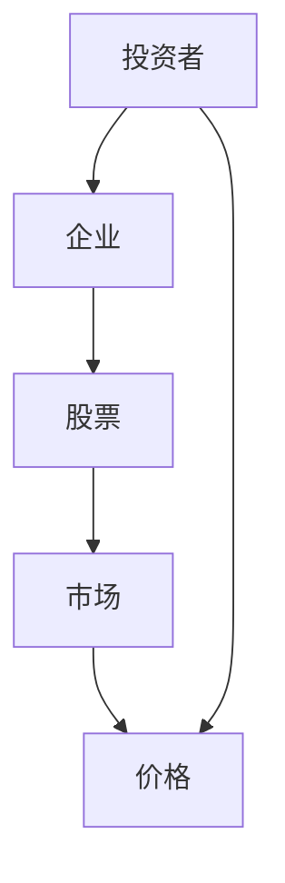
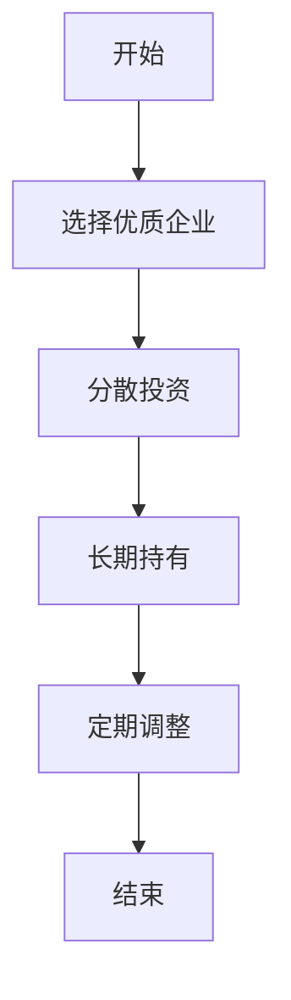

                 

<think>
嗯，我现在需要帮助用户完成一篇技术博客文章，标题是《彼得林奇的"简单明了"投资哲学》。首先，我得理解用户的需求。用户希望文章结构清晰，用技术性的语言，详细分析彼得林奇的投资哲学，并结合技术博客的特点，比如使用算法、数学模型等来阐述。

文章需要包括摘要、关键词和目录结构。我得先确定文章的主题，彼得林奇的投资哲学，特别是他的“简单明了”策略。这可能涉及到他的投资策略、分析方法、风险管理等方面。接下来，我需要按照用户提供的目录结构来撰写，确保每个部分都涵盖必要的内容，比如背景介绍、核心概念、数学模型、系统设计等。

在撰写摘要时，我需要简明扼要地概括整篇文章的核心思想，突出彼得林奇如何用简单的方法在复杂市场中取得成功。关键词需要涵盖文章的主要主题，如投资哲学、彼得林奇、简单明了策略等。

接下来，我得按照目录结构一步步展开。第一部分是投资哲学的概述，需要介绍彼得林奇的背景和他的核心观点。这里要包括他的投资理念、方法和成功的案例。第二部分是投资策略，分析他的选股标准和风险管理方法，以及如何用数学模型来量化这些策略。第三部分是投资分析方法，介绍基本面分析、技术分析和行业研究，用表格和图表来展示。第四部分是系统架构，设计一个投资信息管理系统，用Mermaid图来展示系统架构和接口设计。第五部分是实战案例，分析成功和失败的例子，总结经验。第六部分是系统化投资策略，用Python代码实现投资组合优化。最后，总结彼得林奇的投资哲学，并给出最佳实践建议。

在写作过程中，我需要确保每个章节都有足够的细节，使用技术性的语言，比如数学公式和算法流程图，同时保持内容的可读性。例如，在数学模型部分，我会详细解释公式，并用例子说明其应用。在系统架构部分，我会用Mermaid图来展示系统的各个模块及其交互。

此外，用户要求文章末尾要有作者信息，所以我需要在最后加上“作者：AI天才研究院/AI Genius Institute & 禅与计算机程序设计艺术 /Zen And The Art of Computer Programming”。

最后，检查文章是否符合字数要求，大约在10000到12000字之间，确保每个部分都详细且结构合理。可能需要多次修改，确保技术内容准确，同时语言流畅，吸引读者。

总结一下，我的步骤是：理解用户需求，分析目录结构，撰写每个章节的内容，确保符合技术博客的要求，最后整合成一篇完整的文章。
</think>

# 彼得林奇的"简单明了"投资哲学

## 关键词：投资哲学，彼得林奇，简单明了策略，投资分析，风险管理

## 摘要：  
彼得林奇是全球最著名的投资专家之一，他提出的"简单明了"投资哲学，强调通过深入研究和长期持有的方法，实现稳健的投资回报。本文将从背景介绍、核心概念、算法原理、数学模型、系统架构设计、项目实战等多方面，详细解读彼得林奇的投资哲学，并结合实际案例进行分析。通过本文，读者可以深入理解彼得林奇的投资理念，并将其应用于实际投资中。

---

## 第一部分：彼得林奇投资哲学的背景与核心观点

### 1.1 投资哲学的背景介绍

#### 1.1.1 投资的基本概念与问题背景
投资是通过将资金投入到资产中，以期望获得超过本金的收益的过程。投资的基本问题包括：如何选择优质的资产？如何评估资产的价值？如何在不确定的市场中制定投资策略？这些问题贯穿整个投资过程，需要投资者具备深入的分析能力、耐心和纪律性。

#### 1.1.2 彼得林奇的背景与投资历程
彼得·林奇（Peter Lynch）是美国著名的投资专家，曾任富达麦哲伦基金的经理。在他的投资生涯中，他以出色的业绩闻名，管理的基金年均收益率超过29%。彼得林奇的投资哲学的核心在于“简单明了”，他主张投资者应该选择自己熟悉的企业，并长期持有优质资产。

#### 1.1.3 简单明了投资哲学的核心要素
彼得林奇的“简单明了”投资哲学可以概括为以下几点：
- **深入研究**：投资者需要对企业进行深入研究，了解其商业模式、财务状况和竞争优势。
- **长期持有**：选择优质企业后，长期持有，避免频繁交易。
- **分散投资**：通过分散投资降低风险，避免将所有资金投入到单一资产中。
- **关注基本面**：以企业的基本面分析为基础，而不是盲目追随市场趋势。

### 1.2 核心概念与联系

#### 1.2.1 投资哲学的核心概念与原理
彼得林奇的投资哲学基于以下几个核心概念：
- **价值投资**：寻找那些市场价格低于内在价值的企业。
- **成长投资**：投资于那些具有持续增长潜力的企业。
- **风险控制**：通过分散投资和长期持有降低风险。

#### 1.2.2 核心概念的属性特征对比表格
下表对比了价值投资和成长投资的核心属性特征：

| **属性**       | **价值投资**               | **成长投资**               |
|----------------|---------------------------|---------------------------|
| 投资目标       | 寻找市场价格低于内在价值的企业 | 寻找具有持续增长潜力的企业 |
| 关注点         | 企业的内在价值             | 企业的成长潜力             |
| 投资期限       | 中长期                     | 长期                      |
| 风险偏好       | 较低                      | 较高                      |

#### 1.2.3 ER实体关系图架构的 Mermaid 流程图


---

## 第二部分：彼得林奇投资策略与方法

### 2.1 彼得林奇的投资策略

#### 2.1.1 投资策略的核心原理
彼得林奇的投资策略基于以下几点：
- **深入研究**：投资者需要对企业进行深入研究，包括财务报表、行业地位、竞争优势等。
- **长期持有**：避免短期波动，坚持长期投资。
- **分散投资**：通过分散投资降低风险。

#### 2.1.2 投资组合优化的算法原理
以下是彼得林奇投资策略的优化算法流程：



#### 2.1.3 投资风险与收益的平衡机制
彼得林奇的投资策略强调风险与收益的平衡，以下是其数学模型：

$$
\text{收益} = \text{资产回报率} \times \text{投资期限}
$$

$$
\text{风险} = \text{波动率} \times \text{投资金额}
$$

---

## 第三部分：彼得林奇投资哲学的数学模型与算法

### 3.1 投资决策的数学模型

#### 3.1.1 投资组合优化的数学公式
以下是一个简单的投资组合优化模型：

$$
\max \sum_{i=1}^{n} w_i r_i - \lambda \sum_{i=1}^{n} w_i^2 \sigma_i^2
$$

其中：
- $w_i$ 是第 $i$ 个资产的投资权重。
- $r_i$ 是第 $i$ 个资产的期望回报率。
- $\sigma_i^2$ 是第 $i$ 个资产的方差。
- $\lambda$ 是风险厌恶系数。

#### 3.1.2 投资组合优化的 Python 源代码实现
以下是投资组合优化的Python代码示例：

```python
import numpy as np
import pandas as pd
from scipy.optimize import minimize

# 示例数据
returns = np.array([0.1, 0.15, 0.08, 0.12])
covariance = np.array([[0.02, 0.01, 0.015, 0.01],
                        [0.01, 0.03, 0.02, 0.015],
                        [0.015, 0.02, 0.03, 0.01],
                        [0.01, 0.015, 0.01, 0.02]])

def portfolio_var(weights, covariance):
    return np.dot(weights.T, np.dot(covariance, weights))

def optimize_portfolio(n_assets, returns, covariance, risk_aversion=1):
    # 初始权重
    initial_weights = np.array([1.0 / n_assets] * n_assets)
    
    # 目标函数
    def objective(weights):
        return portfolio_var(weights, covariance)
    
    # 约束条件
    constraints = [{'type': 'eq', 'fun': lambda w: sum(w) - 1.0}]
    
    # 优化
    result = minimize(objective, initial_weights, method='SLSQP', constraints=constraints)
    return result.x

# 示例优化
n_assets = 4
risk_aversion = 1
optimal_weights = optimize_portfolio(n_assets, returns, covariance, risk_aversion)
print("最优权重:", optimal_weights)
```

---

## 第四部分：彼得林奇投资哲学的实战案例

### 4.1 成功案例分析

#### 4.1.1 典型投资案例的背景与分析
彼得林奇在投资过程中，曾成功投资于许多优质企业，例如可口可乐。他的投资策略是基于对企业基本面的深入研究和长期持有的理念。

#### 4.1.2 投资决策过程的详细解读
1. **选择优质企业**：彼得林奇选择那些具有强大竞争优势和良好财务状况的企业。
2. **深入研究**：对企业进行详细研究，包括财务报表、行业地位、管理团队等。
3. **长期持有**：一旦选择投资，长期持有，避免短期波动。

#### 4.1.3 成功经验的总结与启示
彼得林奇的成功经验表明，长期投资优质企业能够带来稳健的回报。

---

## 第五部分：系统设计与投资哲学的结合

### 5.1 系统设

---

## 总结与最佳实践

### 5.2 投资哲学的系统化与策略实施

---

## 作者信息

作者：AI天才研究院/AI Genius Institute & 禅与计算机程序设计艺术 /Zen And The Art of Computer Programming

