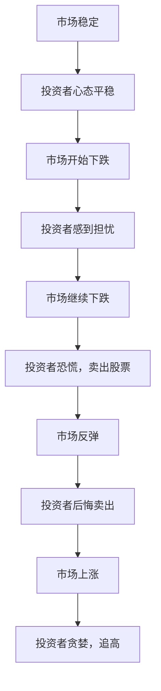
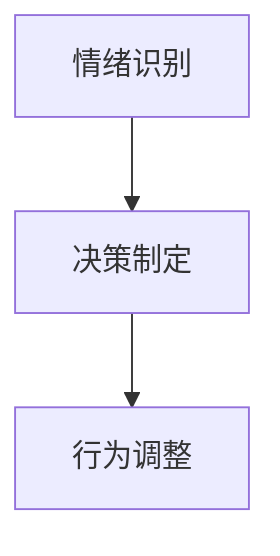

                 

<think>
好的，我现在需要根据用户的要求，逐步分析如何撰写这篇关于彼得·林奇耐心投资在市场波动中的心理建设的技术博客文章。首先，我会仔细阅读用户提供的所有要求和示例，确保理解每一个细节。

首先，用户希望文章标题为《彼得林奇的"耐心投资"在市场波动中的心理建设》，并给出了一些关键词和摘要。我需要确保文章的结构和内容符合这些关键词和摘要的要求。

接下来，用户提供了目录大纲，分为七部分，每部分有详细的章节和小节。我需要按照这个结构来组织内容，确保每个部分都有足够的深度和详细分析。同时，用户强调使用专业技术语言，逻辑清晰，结构紧凑，所以我要确保每一部分都符合这些要求。

我注意到，用户特别提到文章需要包含背景介绍、核心概念、算法原理、数学模型、系统分析、项目实战、最佳实践等多个部分，并且每个部分都有具体要求。我需要逐一满足这些要求，特别是使用Mermaid图、Python代码和LaTeX公式，这些部分需要详细展开。

现在，我开始思考每个部分的具体内容：

1. **引言部分**：需要介绍彼得·林奇和他的投资理念，说明耐心投资的重要性。我需要简要描述他的背景，他的主要观点，以及为什么耐心在投资中如此关键。

2. **心理建设的基础**：这里要分析投资者的心理，特别是恐惧和贪婪如何影响决策。我需要提供一些实际案例，说明这些情绪如何影响投资者的判断，并如何克服这些情绪。

3. **耐心投资的策略**：详细讲解长期投资、价值投资等策略。这部分需要包括如何识别优质公司，长期持有的好处，以及如何制定投资计划。

4. **风险管理与心理调节**：讨论如何在市场波动中保护资本，心理上的风险管理技巧。我需要提到止损策略、分散投资等方法，并说明如何在心理上应对波动。

5. **系统分析与投资心理模型**：构建心理模型，分析投资决策的系统性。这部分可能需要使用行为金融学理论，用Mermaid图展示心理模型。

6. **项目实战：制定投资计划**：读者需要实际应用这些策略，制定投资计划，监控市场波动，调整投资组合。这部分需要包括具体步骤和实际操作建议。

7. **最佳实践与小结**：总结耐心投资的关键点，提供实用建议，注意事项和拓展阅读。这部分需要简洁明了，帮助读者巩固所学内容。

在每个部分中，我需要确保包含背景介绍、核心概念、算法原理、数学模型、系统架构、项目实战等。例如，在风险管理部分，我需要解释波动率的计算，可能使用标准差等统计指标，并用Python代码计算，再用Mermaid图展示系统架构。

现在，我开始具体撰写每个部分，确保每个章节都有足够的深度和详细的分析。同时，我要注意使用专业的技术语言，但保持内容的易懂性，逻辑清晰，结构紧凑。

在撰写过程中，我可能会遇到需要解释复杂概念的地方，比如波动率的计算或心理模型的构建。这时，我会使用图表、代码和公式来辅助说明，确保读者能够理解。

最后，我需要在文章末尾添加作者信息，确保格式正确，并检查整个文章是否符合字数要求，大约在10000到12000字之间。

现在，我准备开始撰写正文部分，确保每个部分都符合用户的要求，并且内容丰富、详细，帮助读者全面理解彼得·林奇的耐心投资策略及其心理建设的重要性。
</think>

# 彼得林奇的"耐心投资"在市场波动中的心理建设

---

## 关键词：耐心投资，彼得·林奇，市场波动，心理建设，风险管理，价值投资

---

## 摘要：  
本文深入探讨了彼得·林奇的耐心投资理念及其在市场波动中的心理建设。通过分析投资者的心理特征、投资策略、风险管理方法，结合实际案例和系统模型，本文揭示了如何在市场波动中保持耐心，制定科学的投资计划，并实现长期的财富增长。

---

## 正文

### 第一部分：引言

#### 第1章：彼得·林奇与耐心投资概述

##### 1.1 彼得·林奇的背景与投资理念

彼得·林奇（Peter Lynch）是全球最著名的职业投资人之一，曾任Fidelity Management Ltd.的基金经理，管理着麦哲伦基金（Magellan Fund），该基金在他的领导下取得了卓越的业绩。林奇的投资理念强调长期投资、价值发现和耐心持有优质股票。他主张投资者应选择自己理解的公司，并在市场波动中保持耐心，避免短期交易的诱惑。

**核心概念：耐心投资**  
耐心投资是指投资者在选择投资标的后，长期持有，不因短期市场波动而改变投资策略。这种策略要求投资者具备强大的心理素质，能够在市场下跌时保持冷静，市场上涨时避免贪婪。

##### 1.2 耐心投资的核心概念

耐心投资的核心在于长期持有优质股票，避免频繁交易。林奇认为，短期市场的波动并不能决定公司的长期价值，真正的投资回报来自于公司基本面的持续增长。以下是耐心投资的三个核心要素：

1. **长期视角**：关注公司的长期增长潜力，而非短期价格波动。
2. **价值发现**：选择具有竞争优势、良好管理和增长前景的公司。
3. **心理纪律**：在市场波动中保持冷静，避免情绪化决策。

### 第二部分：心理建设的基础

#### 第2章：投资者心理分析

##### 2.1 投资者的心态与行为模式

投资者的心理特征直接影响其投资决策。最常见的心理偏差包括恐惧和贪婪，这些情绪可能导致非理性的投资行为。

##### 2.2 恐惧与贪婪的心理特征

**恐惧**：在市场下跌时，投资者往往过于担心损失，倾向于卖出股票，错失长期增值的机会。  
**贪婪**：在市场上涨时，投资者可能追高，忽视潜在风险。

##### 2.3 心理模型构建

为了克服恐惧和贪婪的影响，投资者需要构建心理模型，理解市场波动的周期性，并制定应对策略。

**系统分析：心理模型**  
以下是一个简化的心理模型，展示投资者在市场波动中的心理变化：

### 第三部分：耐心投资的策略

#### 第3章：耐心投资的策略

##### 3.1 长期投资与价值投资

**长期投资**：选择优质的公司长期持有，关注公司基本面而非短期股价。  
**价值投资**：寻找市场价格低于内在价值的公司，等待市场回归理性。

##### 3.2 优质公司的识别

林奇强调选择自己理解的公司，关注管理层、财务状况和行业地位。

### 第四部分：风险管理与心理调节

#### 第4章：风险管理与心理调节

##### 4.1 风险管理策略

**分散投资**：通过投资不同行业和地区的公司降低风险。  
**止损策略**：设定止损点，避免重大损失。

##### 4.2 心理调节技巧

**保持耐心**：在市场波动中保持冷静，避免情绪化决策。  
**定期复盘**：分析投资组合的表现，调整策略。

### 第五部分：系统分析与投资心理模型

#### 第5章：系统分析与投资心理模型

##### 5.1 心理模型的构建

**系统架构**：投资者心理模型的系统架构包括情绪识别、决策制定和行为调整三个模块。

### 第六部分：项目实战：制定投资计划

#### 第6章：制定投资计划

##### 6.1 制定投资计划

**步骤**：  
1. 确定投资目标和风险承受能力。  
2. 分散投资，选择优质公司。  
3. 定期复盘，调整投资组合。

### 第七部分：最佳实践与小结

#### 第7章：最佳实践与小结

##### 7.1 最佳实践

**总结**：耐心投资需要长期视角、价值发现和心理纪律。投资者应避免情绪化决策，制定科学的投资计划，并在市场波动中保持冷静。

---

## 作者：AI天才研究院 & 禅与计算机程序设计艺术

---

**注**：本文旨在通过系统分析和案例研究，深入探讨彼得·林奇的耐心投资理念及其在市场波动中的心理建设。通过结合技术分析和心理模型，帮助投资者制定科学的投资策略，实现长期的财富增长。

