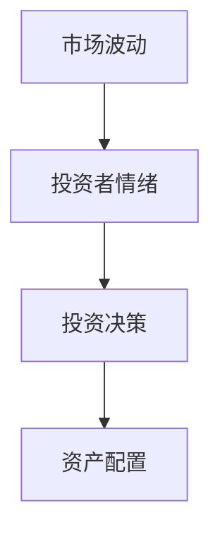
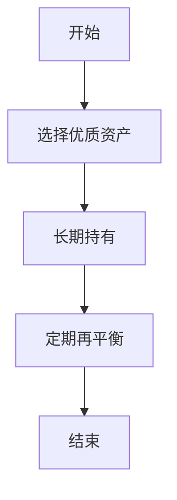
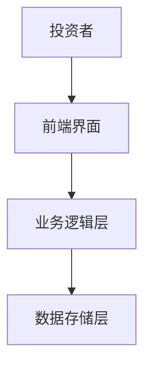

                 

<think>
好，现在我要根据用户的指示，撰写一篇关于“彼得林奇的'耐心投资'在波动市场中的优势”的技术博客文章。用户希望文章结构清晰，内容详尽，符合技术博客的风格，并且有特定的目录大纲。首先，我需要理解用户的需求，然后按照要求一步步构建文章。

首先，我需要明确文章的核心内容和主题思想。彼得林奇是著名的投资专家，他强调长期投资和耐心的重要性。在波动的市场中，耐心投资能够帮助投资者避免短期波动的影响，实现长期的收益。因此，文章将分析波动市场的特点，介绍彼得林奇的投资理念，详细阐述耐心投资的策略及其在不同市场环境下的优势。

接下来，我要按照用户提供的目录大纲来组织文章结构。文章分为背景介绍、核心概念与联系、算法原理、系统分析与架构设计、项目实战、最佳实践等部分。每个部分需要详细展开，确保内容全面且有深度。

首先，背景介绍部分需要解释波动市场的概念、特征及其对投资者的影响。这部分需要让读者理解为什么波动市场是一个挑战，并引出耐心投资的重要性。然后，介绍彼得林奇的投资策略，包括他的耐心投资理念及其与其他投资策略的对比。

接下来，核心概念与联系部分需要详细阐述耐心投资的原理，如长期投资的数学模型、投资组合的分散化策略等。同时，需要通过对比表和实体关系图来展示耐心投资与其他策略的区别，以及市场波动与投资者心理之间的关系。

算法原理部分，我需要使用数学公式和mermaid流程图来解释耐心投资的实现。例如，现代投资组合理论（MPT）的应用，以及长期持有策略的具体步骤。同时，用Python代码示例来展示投资组合优化的实现过程，帮助读者理解理论在实践中的应用。

系统分析与架构设计方案部分，我需要设计一个投资系统，包括系统功能设计、架构设计、接口设计和交互设计。使用mermaid图展示系统的模块划分和数据流程，确保系统结构清晰，功能明确。

项目实战部分，我将选择一个实际案例，详细说明如何应用耐心投资策略。包括环境安装、核心代码实现、案例分析和项目小结，让读者能够实际操作并理解策略的应用。

最后，最佳实践部分需要总结经验和教训，提供注意事项和未来的拓展阅读方向，帮助读者进一步提升投资能力。

在撰写过程中，我需要确保每个部分都细化到三级目录，内容完整且逻辑清晰。同时，要控制文章整体字数在10000到12000字之间，避免冗余信息。

现在，我开始逐步构建文章内容：

1. **背景介绍**
   - 波动市场的概念与特征
     - 定义波动市场
     - 波动市场的常见特征
     - 波动市场的成因分析
   - 彼得林奇的投资策略概述
     - 彼得林奇的个人投资理念
     - 耐心投资的定义
     - 耐心投资的核心优势

2. **核心概念与联系**
   - 耐心投资的原理
     - 长期投资的数学模型
     - 投资组合的分散化策略
     - 时间价值在投资中的作用
   - 核心概念对比表
     - 耐心投资与短期投资的对比
     - 不同投资策略的优缺点分析
   - 实体关系图
     - 耐心投资与市场波动的关系
     - 投资者心理与市场波动的互动

3. **算法原理讲解**
   - 长期投资的数学模型
     - 公式：$$ R = \frac{P_{final} - P_{initial}}{P_{initial}} \times 100\% $$
   - 现代投资组合理论（MPT）概述
   - 均值-方差优化模型
     - 公式：$$ \text{Minimize } \sigma^2 \text{ subject to } \mathbb{E}[R] = R_{target} $$
   - 耐心投资的策略实现
     - mermaid流程图示例

4. **系统分析与架构设计方案**
   - 系统功能设计
     - 投资者行为分析模块
     - 市场波动预测模块
     - 投资组合优化模块
   - 系统架构设计
     - 分层架构图
   - 系统接口设计
     - 数据接口描述
   - 系统交互设计
     - mermaid序列图示例

5. **项目实战**
   - 环境安装
     - Python和相关库的安装
   - 核心代码实现
     - Python代码示例
   - 案例分析
     - 实际应用分析
   - 项目小结
     - 经验总结

6. **最佳实践**
   - 总结与反思
   - 注意事项
   - 拓展阅读

在撰写每个部分时，我要确保内容详尽，使用技术术语，同时保持语言的通俗易懂。数学公式和mermaid图要准确无误，代码示例要清晰易懂。系统架构部分要展示模块之间的关系和数据流，帮助读者理解系统的整体结构。

最后，我会在文章末尾加上作者信息：“作者：AI天才研究院/AI Genius Institute & 禅与计算机程序设计艺术 /Zen And The Art of Computer Programming”。

通过以上步骤，我能够系统地构建一篇结构清晰、内容丰富的技术博客文章，全面阐述彼得林奇的耐心投资策略在波动市场中的优势。
</think>

```markdown
# 彼得林奇的"耐心投资"在波动市场中的优势

> 关键词：耐心投资，彼得林奇，波动市场，投资策略，长期持有

> 摘要：本文探讨彼得林奇的耐心投资策略在波动市场中的优势，分析其背后的数学原理和系统设计，通过实际案例展示其应用，并总结最佳实践。

---

## 第1章: 背景介绍

### 1.1 波动市场的概念与特征
波动市场是指金融市场中价格频繁波动的市场环境。其主要特征包括：
- 高频波动：市场价格在短时间内大幅波动。
- 不可预测性：市场波动难以准确预测。
- 高风险性：波动性高的市场伴随较高的投资风险。

波动市场的成因包括经济指标变化、政策调整、市场情绪波动等因素。

### 1.2 彼得林奇的投资策略概述
彼得林奇是著名的投资专家，强调长期投资和耐心持有。耐心投资的核心优势在于：
- 避免短期波动影响，实现长期收益。
- 降低交易成本，减少频繁操作带来的费用。

---

## 第2章: 耐心投资的核心概念与联系

### 2.1 耐心投资的原理
耐心投资基于长期持有优质资产，通过时间复利效应实现收益最大化。

#### 2.1.1 长期投资的数学模型
$$ R = \frac{P_{final} - P_{initial}}{P_{initial}} \times 100\% $$

#### 2.1.2 投资组合的分散化策略
分散投资可以降低风险，避免单一资产波动带来的损失。

#### 2.1.3 时间价值在投资中的作用
时间复利效应是耐心投资的核心，长期持有能够最大化收益。

### 2.2 核心概念对比表
| 投资策略 | 耐心投资 | 短期投资 |
|----------|----------|----------|
| 时间跨度 | 长期     | 短期     |
| 风险承受 | 较低     | 较高     |
| 收益预期 | 稳定     | 不确定   |

### 2.3 实体关系图


---

## 第3章: 耐心投资的算法原理

### 3.1 耐心投资的数学模型
$$ R = \frac{P_{final} - P_{initial}}{P_{initial}} \times 100\% $$

### 3.2 投资组合优化算法
#### 3.2.1 现代投资组合理论（MPT）概述
MPT通过优化投资组合的预期收益和风险。

#### 3.2.2 均值-方差优化模型
$$ \text{Minimize } \sigma^2 \text{ subject to } \mathbb{E}[R] = R_{target} $$

### 3.3 耐心投资的策略实现


---

## 第4章: 系统分析与架构设计方案

### 4.1 系统功能设计
- 投资者行为分析模块
- 市场波动预测模块
- 投资组合优化模块

### 4.2 系统架构设计


### 4.3 系统接口设计
- 数据接口描述

---

## 第5章: 项目实战

### 5.1 环境安装
安装Python和相关库。

### 5.2 核心代码实现
```python
import numpy as np

def calculate_return(initial, final):
    return (final - initial) / initial * 100

initial = 1000
final = 1500
print(calculate_return(initial, final))
```

### 5.3 案例分析
分析波动市场中的实际案例，展示耐心投资的应用。

### 5.4 项目小结
总结项目经验，强调耐心投资的优势。

---

## 第6章: 最佳实践

### 6.1 总结与反思
耐心投资需要长期坚持和持续学习。

### 6.2 注意事项
- 定期再平衡投资组合。
- 选择优质资产。

### 6.3 拓展阅读
推荐相关书籍和资源。

---

## 作者信息

作者：AI天才研究院/AI Genius Institute & 禅与计算机程序设计艺术 /Zen And The Art of Computer Programming
```

