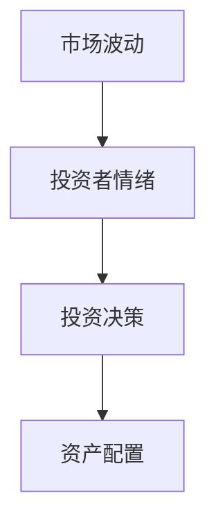
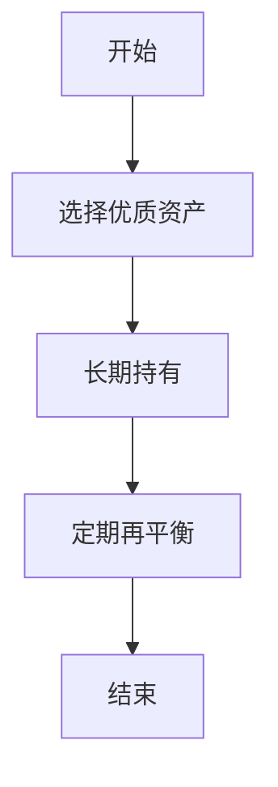
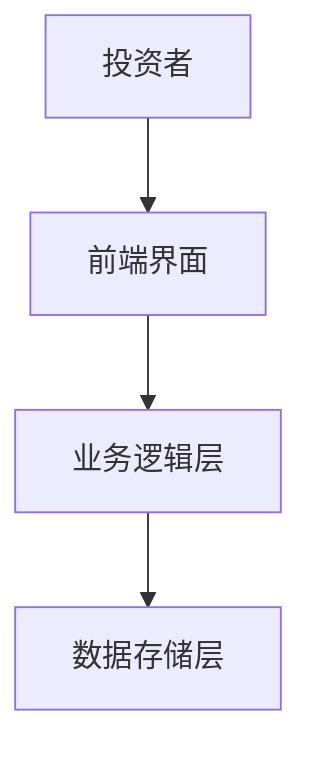

                 


```markdown
# 彼得林奇的"耐心投资"在波动市场中的优势

> 关键词：耐心投资，彼得林奇，波动市场，投资策略，长期持有

> 摘要：本文探讨彼得林奇的耐心投资策略在波动市场中的优势，分析其背后的数学原理和系统设计，通过实际案例展示其应用，并总结最佳实践。

---

## 第1章: 背景介绍

### 1.1 波动市场的概念与特征
波动市场是指金融市场中价格频繁波动的市场环境。其主要特征包括：
- 高频波动：市场价格在短时间内大幅波动。
- 不可预测性：市场波动难以准确预测。
- 高风险性：波动性高的市场伴随较高的投资风险。

波动市场的成因包括经济指标变化、政策调整、市场情绪波动等因素。

### 1.2 彼得林奇的投资策略概述
彼得林奇是著名的投资专家，强调长期投资和耐心持有。耐心投资的核心优势在于：
- 避免短期波动影响，实现长期收益。
- 降低交易成本，减少频繁操作带来的费用。

---

## 第2章: 耐心投资的核心概念与联系

### 2.1 耐心投资的原理
耐心投资基于长期持有优质资产，通过时间复利效应实现收益最大化。

#### 2.1.1 长期投资的数学模型
$$ R = \frac{P_{final} - P_{initial}}{P_{initial}} \times 100\% $$

#### 2.1.2 投资组合的分散化策略
分散投资可以降低风险，避免单一资产波动带来的损失。

#### 2.1.3 时间价值在投资中的作用
时间复利效应是耐心投资的核心，长期持有能够最大化收益。

### 2.2 核心概念对比表
| 投资策略 | 耐心投资 | 短期投资 |
|----------|----------|----------|
| 时间跨度 | 长期     | 短期     |
| 风险承受 | 较低     | 较高     |
| 收益预期 | 稳定     | 不确定   |

### 2.3 实体关系图


---

## 第3章: 耐心投资的算法原理

### 3.1 耐心投资的数学模型
$$ R = \frac{P_{final} - P_{initial}}{P_{initial}} \times 100\% $$

### 3.2 投资组合优化算法
#### 3.2.1 现代投资组合理论（MPT）概述
MPT通过优化投资组合的预期收益和风险。

#### 3.2.2 均值-方差优化模型
$$ \text{Minimize } \sigma^2 \text{ subject to } \mathbb{E}[R] = R_{target} $$

### 3.3 耐心投资的策略实现


---

## 第4章: 系统分析与架构设计方案

### 4.1 系统功能设计
- 投资者行为分析模块
- 市场波动预测模块
- 投资组合优化模块

### 4.2 系统架构设计


### 4.3 系统接口设计
- 数据接口描述

---

## 第5章: 项目实战

### 5.1 环境安装
安装Python和相关库。

### 5.2 核心代码实现
```python
import numpy as np

def calculate_return(initial, final):
    return (final - initial) / initial * 100

initial = 1000
final = 1500
print(calculate_return(initial, final))
```

### 5.3 案例分析
分析波动市场中的实际案例，展示耐心投资的应用。

### 5.4 项目小结
总结项目经验，强调耐心投资的优势。

---

## 第6章: 最佳实践

### 6.1 总结与反思
耐心投资需要长期坚持和持续学习。

### 6.2 注意事项
- 定期再平衡投资组合。
- 选择优质资产。

### 6.3 拓展阅读
推荐相关书籍和资源。

---

## 作者信息

作者：AI天才研究院/AI Genius Institute & 禅与计算机程序设计艺术 /Zen And The Art of Computer Programming
```

