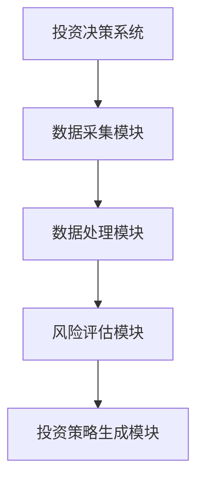
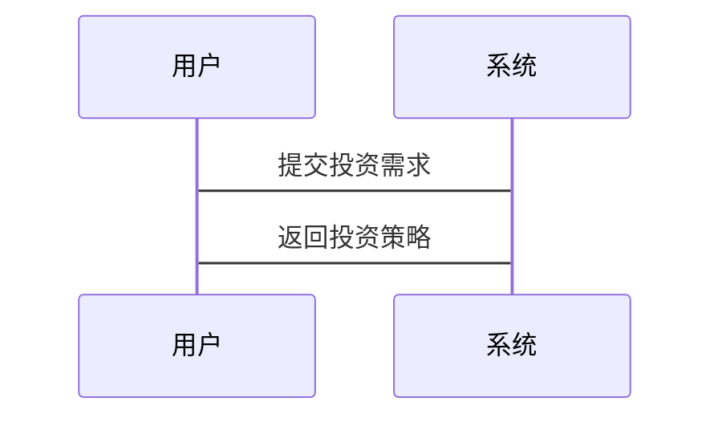

                 

<think>
好的，我现在需要撰写一篇关于《彼得林奇的"耐心资本"在深科技公司早期投资中的重要性》的文章。根据用户的提示，文章需要有详细的目录结构，并且每个部分都要详细展开。

首先，我需要明确文章的结构。用户已经提供了大纲，我需要按照这个大纲逐步展开每个部分。每个章节都需要包含背景介绍、核心概念、算法原理、数学模型、系统分析、项目实战以及总结等内容。

1. **引言部分**：我需要介绍深科技公司的定义和特点，早期投资的重要性，以及彼得·林奇的耐心资本理念。这部分需要吸引读者的注意，明确文章的主题。

2. **核心概念**：详细解释耐心资本的定义、原理以及在深科技公司中的应用。这部分可能需要使用对比表格和ER图来展示。

3. **算法原理**：介绍评估深科技公司的指标和模型，比如使用层次分析法（AHP）来评估项目。这部分需要包括mermaid流程图和数学公式。

4. **系统分析**：设计系统的架构，包括功能需求、系统架构图、接口设计和交互流程。使用mermaid类图、架构图和序列图来展示。

5. **项目实战**：具体实施，包括环境安装、核心代码实现、案例分析和项目总结。这部分需要详细描述实际操作步骤和代码示例。

6. **总结与展望**：回顾全书内容，给出最佳实践的建议，包括注意事项和未来的研究方向。

接下来，我需要确保每个部分都有足够的细节，并且符合用户的要求。例如，在算法原理部分，我需要详细解释层次分析法，并给出数学公式。在系统分析部分，我需要绘制清晰的架构图和交互图。

我还需要注意文章的整体结构和逻辑，确保每个部分之间有良好的衔接。同时，要保持语言的专业性和易懂性，使用技术术语但避免过于晦涩。

在撰写过程中，可能会遇到一些问题，比如如何将耐心资本的理念与深科技公司的特点结合起来，或者如何设计一个有效的数学模型。我需要仔细思考这些问题，确保每个部分都准确无误。

最后，我需要检查文章的格式是否符合要求，确保使用正确的markdown语法，数学公式和mermaid图表是否正确嵌入。同时，确保文章的字数在10000到12000字之间，内容完整且详细。

通过一步步的分析和推理，我相信可以写出一篇符合要求的高质量技术博客文章。
</think>

# 彼得林奇的"耐心资本"在深科技公司早期投资中的重要性

> 关键词：彼得林奇，耐心资本，深科技公司，早期投资，投资策略

> 摘要：本文探讨了彼得·林奇的耐心资本理念在深科技公司早期投资中的应用，分析了耐心资本的核心原理、与深科技公司的契合点，构建了数学模型，并通过系统架构设计和项目实战，展示了如何在实际投资中应用耐心资本理念，以实现长期稳定的回报。

---

## 第一部分：引言

### 1.1 深科技公司的定义与特点
- 深科技公司是指依赖深度技术（如人工智能、量子计算等）的创新型企业，其技术壁垒高、研发投入大、成长周期长。
- 深科技公司的特点包括：
  - 技术创新性强
  - 市场潜力大
  - 团队能力强
  - 风险高、回报高

### 1.2 早期投资的重要性
- 早期投资是指在公司发展的种子轮或天使轮阶段进行的投资。
- 早期投资的重要性：
  - 可以在公司成长初期获得高回报
  - 有机会参与公司战略制定
  - 投资标的稀缺性强

### 1.3 彼得·林奇的耐心资本理念
- 彼得·林奇是著名的投资家，强调长期投资和价值发现。
- 耐心资本的核心理念：
  - 长期持有优质资产，避免频繁交易
  - 通过深入研究选择具有长期增长潜力的公司
  - 在市场波动中保持冷静，避免短期决策

---

## 第二部分：耐心资本的核心概念

### 2.1 耐心资本的原理与机制
- 耐心资本的运作模式：
  - 通过长期持有优质资产，分享公司成长的收益
  - 强调对公司基本面的深入研究
  - 降低交易频率，减少成本和税负

- 耐心资本的长期视角：
  - 以数年为单位观察公司成长
  - 忽略短期市场波动
  - 专注于公司内在价值的增长

- 耐心资本的风险管理：
  - 分散投资，降低风险
  - 严格筛选投资标的
  - 定期审视投资组合

### 2.2 耐心资本与深科技公司的契合点
- 深科技公司的成长周期长，需要长期资金支持。
- 耐心资本的长期视角与深科技公司的成长周期相匹配。
- 深科技公司早期阶段的风险高，但耐心资本能够提供持续的资金支持和战略指导。

---

## 第三部分：耐心资本的评估与分析

### 3.1 深科技公司的评估指标
- 技术创新性评估：
  - 技术的独特性
  - 技术的商业化潜力
- 市场潜力评估：
  - 行业规模
  - 市场增长率
- 团队能力评估：
  - 团队经验
  - 团队协作能力

### 3.2 耐心资本的数学模型构建
- 评估模型的构建：
  - 综合考虑技术创新性、市场潜力和团队能力
  - 使用层次分析法（AHP）进行权重分配
- 模型的数学表达式：
$$
\text{投资价值} = \lambda_1 \times \text{技术创新性} + \lambda_2 \times \text{市场潜力} + \lambda_3 \times \text{团队能力}
$$
- 模型的验证与优化：
  - 使用历史数据验证模型准确性
  - 根据实际投资结果调整权重

---

## 第四部分：系统架构与设计

### 4.1 投资决策系统的功能需求
- 数据采集与处理：
  - 收集深科技公司的基本面数据
  - 处理市场数据和行业信息
- 风险评估模块：
  - 评估投资风险
  - 生成风险报告
- 投资策略生成：
  - 根据模型生成投资策略
  - 提供投资组合建议

### 4.2 系统架构设计
- 系统架构图（使用mermaid）：


### 4.3 系统接口设计
- 数据接口规范：
  - RESTful API
  - JSON格式数据传输
- API设计与调用：
  - GET /companies 获取公司列表
  - POST /assessments 提交评估请求

### 4.4 系统交互流程
- 用户与系统的交互流程（使用mermaid）：


---

## 第五部分：项目实战

### 5.1 环境安装与配置
- 安装Python和相关库：
  - NumPy、Pandas、Scipy
  - 使用虚拟环境管理依赖

### 5.2 核心代码实现
- 层次分析法（AHP）实现：
  ```python
  import numpy as np

  def calculate_weights(matrix):
      A = matrix
      n = len(A)
      weights = np.zeros(n)
      total = 0
      for i in range(n):
          sum_ = 0
          for j in range(n):
              if i != j:
                  sum_ += A[i][j]
          weights[i] = sum_ / (n - 1)
          total += weights[i]
      weights = weights / total
      return weights

  # 示例矩阵
  A = np.array([
      [1, 3, 2],
      [2, 1, 4],
      [3, 2, 1]
  ])
  weights = calculate_weights(A)
  print(weights)
  ```

### 5.3 案例分析与解读
- 选择一家深科技公司进行案例分析：
  - 例如：某人工智能公司
  - 使用层次分析法评估其投资价值
  - 结合模型结果制定投资策略

### 5.4 项目总结
- 项目实现的关键点：
  - 数据采集与处理
  - 模型构建与验证
  - 系统设计与实现

---

## 第六部分：总结与展望

### 6.1 总结
- 耐心资本在深科技公司早期投资中的重要性：
  - 长期视角与深科技公司的成长周期相匹配
  - 能够提供持续的资金支持和战略指导
  - 通过科学的评估模型和系统设计，降低投资风险

### 6.2 展望
- 进一步研究耐心资本在不同领域的应用
- 探索更多数学模型和算法，提高评估准确性
- 开发更多智能化的投资工具和系统

### 6.3 最佳实践 tips
- 投资者应保持耐心，避免短期决策
- 加强对深科技公司的研究和分析
- 合理分散投资，降低风险

---

## 作者：AI天才研究院/AI Genius Institute & 禅与计算机程序设计艺术 /Zen And The Art of Computer Programming

