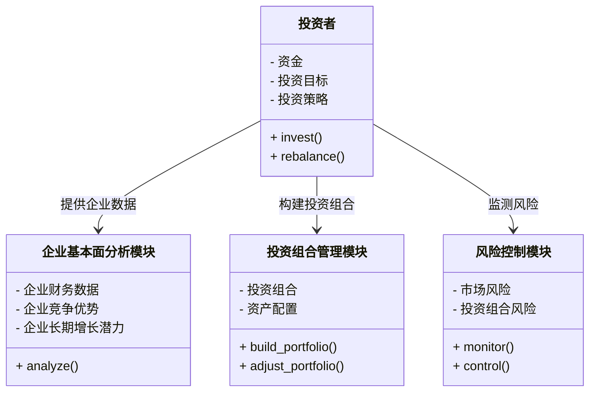

                 


# 彼得林奇的"耐心资本"投资案例

> 关键词：耐心资本，投资案例，彼得·林奇，价值投资，长期投资

> 摘要：本文详细分析了彼得·林奇的“耐心资本”投资理念，探讨其核心概念、实现路径、系统设计及实际应用案例。通过结合投资学理论、价值投资策略和长期持有策略，深入剖析了耐心资本的投资逻辑，并通过系统架构设计和项目实战，展示了如何将耐心资本理念系统化、模型化和具体化。本文旨在为投资者提供一种基于长期价值发现的投资思路，帮助读者在复杂多变的市场环境中实现稳健的投资收益。

---

# 第一部分: 背景介绍

## # 第1章: 耐心资本投资理念的背景与起源

### ## 1.1 投资理念的演变历程

#### ### 1.1.1 从短期投机到长期价值投资的转变

现代投资理念经历了从短期投机到长期价值投资的转变。传统的投资模式往往关注短期价格波动，依赖市场预测和高频交易，这种方式在金融市场动荡时期风险较高。随着金融市场的复杂化和机构化，投资者逐渐意识到，短期投机难以稳定获取超额收益。尤其是在2008年全球金融危机后，长期价值投资理念逐渐成为主流。

#### ### 1.1.2 耐心资本概念的提出与核心思想

“耐心资本”是彼得·林奇提出的一种长期投资理念，强调通过深入研究和长期持有优质资产，来实现资本的稳定增值。耐心资本的核心思想是：投资不是一场短跑，而是一场马拉松。通过选择具有持续竞争优势和良好治理结构的企业，投资者可以在长期内获得超越市场的回报。

#### ### 1.1.3 耐心资本在现代投资中的地位与作用

耐心资本理念在现代投资中的地位日益重要。尤其是在当前全球经济不确定性增加、市场波动加剧的环境下，耐心资本的投资策略为投资者提供了一种更为稳健的选择。通过长期持有优质资产，投资者可以规避短期市场波动的风险，同时享受企业成长带来的长期收益。

### ## 1.2 彼得·林奇的背景与投资理念

#### ### 1.2.1 彼得·林奇的生平简介

彼得·林奇（Peter Lynch）是美国著名的职业基金经理人，曾担任富达麦哲伦基金（Fidelity Magellan Fund）的经理，创造了年化收益率29%的神话。他的投资理念以“业余投资者的专业智慧”为核心，强调通过深入研究和长期持有优质股票来实现超额收益。

#### ### 1.2.2 彼得·林奇的投资哲学与方法

彼得·林奇的投资哲学可以总结为以下几点：
1. **深入研究企业基本面**：他主张通过对企业财务状况、竞争优势和管理层能力的深入研究，选择具有长期增长潜力的企业。
2. **长期持有优质资产**：他反对频繁交易和短期投机，主张长期持有优质股票，享受企业成长带来的收益。
3. **分散投资降低风险**：他通过分散投资于不同行业和企业，降低单一投资的风险。

#### ### 1.2.3 彼得·林奇与耐心资本理念的关联

彼得·林奇的耐心资本理念是其投资哲学的集中体现。他主张投资者应该像企业长期股东一样思考，关注企业的长期发展，而不是短期的价格波动。通过长期持有优质资产，投资者可以最大化地获得企业成长的收益。

### ## 1.3 耐心资本的基本概念与特征

#### ### 1.3.1 耐心资本的定义与内涵

耐心资本是指投资者通过长期持有优质资产，以实现资本的稳定增值。与短期投机不同，耐心资本强调投资的长期性和稳定性，注重企业基本面的研究和长期增长潜力的挖掘。

#### ### 1.3.2 耐心资本与传统投资策略的区别

| 投资策略 | 短期投机 | 长期价值投资（耐心资本） |
|----------|----------|--------------------------|
| 投资目标 | 短期价格波动中的获利 | 长期企业成长带来的收益 |
| 投资期限 | 短期交易，频繁买卖 | 长期持有，避免频繁交易 |
| 风险控制 | 依赖市场预测和高频交易 | 依赖企业基本面分析和长期持有 |

#### ### 1.3.3 耐心资本的核心要素与实现路径

耐心资本的核心要素包括：
1. **优质企业的选择**：选择具有持续竞争优势和良好治理结构的企业。
2. **长期持有策略**：通过长期持有优质资产，避免短期市场波动的影响。
3. **分散投资**：通过分散投资降低单一投资的风险。

---

# 第二部分: 核心概念与联系

## # 第2章: 耐心资本的核心要素与实现路径

### ## 2.1 投资标的的选择标准

#### ### 2.1.1 企业基本面分析的关键指标

在选择投资标的时，彼得·林奇特别注重企业的基本面分析。以下是一些关键指标：

1. **市盈率（P/E Ratio）**：市盈率是衡量企业估值的重要指标，通常认为市盈率低于行业平均水平的企业具有较大的投资价值。
2. **市净率（P/B Ratio）**：市净率是衡量企业股价与账面价值的比例，通常认为市净率低于1的企业具有较大的投资价值。
3. **ROE（净资产收益率）**：ROE是衡量企业盈利能力的重要指标，通常认为ROE高于行业平均水平的企业具有较大的投资价值。

#### ### 2.1.2 企业竞争优势的识别与评估

彼得·林奇非常注重企业竞争优势的识别与评估。他认为，具有持续竞争优势的企业能够在长期内保持较高的盈利能力。以下是几种竞争优势的评估方法：

1. **成本优势**：企业是否具有显著的成本优势，能够在价格竞争中占据优势。
2. **技术优势**：企业是否拥有独特的技术或专利，能够在技术创新中占据优势。
3. **品牌优势**：企业是否拥有强大的品牌影响力，能够在市场竞争中占据优势。

#### ### 2.1.3 企业长期增长潜力的判断方法

判断企业的长期增长潜力，需要综合考虑以下几个方面：

1. **行业发展趋势**：企业所在行业的未来发展趋势如何，是否具有较大的增长空间。
2. **企业管理层**：企业的管理层是否具有战略眼光和执行力，是否能够带领企业实现长期增长。
3. **财务状况**：企业的财务状况是否健康，是否具有持续增长的财务支持。

### ## 2.2 投资组合的构建与优化

#### ### 2.2.1 耐心资本投资组合的设计原则

1. **分散投资**：通过分散投资于不同行业和不同企业，降低单一投资的风险。
2. **长期持有**：避免频繁交易，保持投资的长期性和稳定性。
3. **定期调整**：根据市场变化和企业基本面的变化，定期调整投资组合。

#### ### 2.2.2 资产配置的动态调整策略

在动态调整投资组合时，需要注意以下几个方面：

1. **市场环境的变化**：根据市场环境的变化，调整投资组合的资产配置。
2. **企业基本面的变化**：根据企业基本面的变化，调整投资组合的资产配置。
3. **风险控制**：根据投资组合的风险情况，调整投资组合的资产配置。

#### ### 2.2.3 风险控制与收益平衡的实现方法

1. **分散投资**：通过分散投资降低单一投资的风险。
2. **长期持有**：通过长期持有降低短期市场波动的风险。
3. **定期再平衡**：通过定期再平衡调整投资组合，保持风险和收益的平衡。

### ## 2.3 耐心资本的长期持有策略

#### ### 2.3.1 长期持有投资的优势与挑战

1. **优势**：
   - 长期持有能够避免短期市场波动的风险。
   - 长期持有能够享受企业成长带来的收益。
2. **挑战**：
   - 长期持有需要较强的心理承受能力。
   - 长期持有需要较强的研究能力和信息获取能力。

#### ### 2.3.2 耐心资本与市场波动的应对策略

1. **市场波动的应对策略**：
   - 长期持有，避免频繁交易。
   - 定期调整投资组合，保持风险和收益的平衡。

#### ### 2.3.3 长期持有中的再平衡与优化技巧

1. **再平衡技巧**：
   - 根据市场变化和企业基本面的变化，定期调整投资组合。
   - 保持投资组合的分散化，降低单一投资的风险。
2. **优化技巧**：
   - 定期评估投资组合的表现，优化投资组合的结构。
   - 根据市场环境的变化，优化投资组合的资产配置。

---

# 第三部分: 系统分析与架构设计

## # 第3章: 耐心资本的系统分析与架构设计

### ## 3.1 系统分析与需求描述

#### ### 3.1.1 问题场景介绍

在实际投资中，投资者需要面对复杂的市场环境和多样化的投资需求。为了实现耐心资本的投资理念，我们需要设计一个能够支持长期持有优质资产的投资系统。

#### ### 3.1.2 项目介绍

本项目旨在设计一个基于耐心资本理念的投资系统，通过长期持有优质资产，实现资本的稳定增值。

#### ### 3.1.3 项目目标

1. **实现长期持有优质资产的投资策略**：通过系统化的方法，选择具有长期增长潜力的优质资产。
2. **实现投资组合的动态调整**：根据市场环境和企业基本面的变化，动态调整投资组合。
3. **实现风险控制与收益平衡**：通过分散投资和长期持有，实现风险控制与收益平衡。

### ## 3.2 系统功能设计

#### ### 3.2.1 系统功能模块

1. **企业基本面分析模块**：对企业财务状况、竞争优势和长期增长潜力进行分析。
2. **投资组合管理模块**：根据企业基本面分析结果，构建和优化投资组合。
3. **风险控制模块**：根据市场环境和投资组合的风险情况，进行风险控制。

#### ### 3.2.2 系统功能流程

1. **企业基本面分析**：
   - 收集企业财务数据。
   - 分析企业的竞争优势。
   - 评估企业的长期增长潜力。
2. **投资组合管理**：
   - 根据企业基本面分析结果，选择优质资产。
   - 构建投资组合。
   - 动态调整投资组合。
3. **风险控制**：
   - 监测市场环境变化。
   - 监测投资组合的风险。
   - 调整投资组合以实现风险控制。

#### ### 3.2.3 系统功能设计的 Mermaid 类图



### ## 3.3 系统架构设计

#### ### 3.3.1 系统架构设计的 Mermaid 架构图


---

# 第四部分: 项目实战

## # 第4章: 耐心资本的项目实战

### ## 4.1 项目环境与工具安装

#### ### 4.1.1 环境要求

1. **操作系统**：Windows 10 或更高版本，或 macOS 10.15 或更高版本。
2. **编程语言**：Python 3.8 或更高版本。
3. **开发工具**：Visual Studio Code 或 PyCharm。

#### ### 4.1.2 工具安装

1. **安装 Python**：从官方网站下载并安装 Python。
2. **安装 Jupyter Notebook**：使用 pip 安装 `jupyter-notebook`。
3. **安装数据分析库**：使用 pip 安装 `pandas`、`numpy`、`matplotlib` 和 `seaborn`。

### ## 4.2 系统核心实现

#### ### 4.2.1 核心代码实现

以下是耐心资本投资系统的核心代码实现：

```python
import pandas as pd
import numpy as np
import matplotlib.pyplot as plt
import seaborn as sns

# 数据加载
df = pd.read_csv('stocks.csv')

# 企业基本面分析
df['市盈率'] = df['股价'] / df['每股收益']
df['市净率'] = df['股价'] / df['每股净资产']
df['ROE'] = df['净利润'] / df['净资产']

# 选择优质企业
优质企业 = df[(df['市盈率'] < 15) & (df['市净率'] < 1.5) & (df['ROE'] > 10)]

# 构建投资组合
投资组合 = 优质企业.head(10)

# 可视化分析
plt.figure(figsize=(10, 6))
sns.scatterplot(x='市盈率', y='ROE', data=df, hue='是否优质企业')
plt.title('企业基本面分析')
plt.show()
```

#### ### 4.2.2 代码应用解读与分析

1. **数据加载**：从 CSV 文件中加载股票数据。
2. **企业基本面分析**：计算市盈率、市净率和ROE等指标，评估企业的基本面状况。
3. **选择优质企业**：根据企业基本面分析结果，选择优质企业。
4. **构建投资组合**：根据优质企业名单，构建投资组合。
5. **可视化分析**：通过散点图，展示企业基本面分析结果。

### ## 4.3 实际案例分析

#### ### 4.3.1 案例介绍

以科技行业为例，我们选择了一些具有长期增长潜力的优质企业，如苹果、微软和谷歌等。

#### ### 4.3.2 投资组合构建

1. **选择优质企业**：根据企业基本面分析结果，选择优质企业。
2. **构建投资组合**：根据优质企业名单，构建投资组合。
3. **动态调整**：根据市场环境和企业基本面的变化，动态调整投资组合。

#### ### 4.3.3 投资组合实现

以下是投资组合的具体实现：

```python
import pandas as pd
import numpy as np
import matplotlib.pyplot as plt
import seaborn as sns

# 数据加载
df = pd.read_csv('stocks.csv')

# 企业基本面分析
df['市盈率'] = df['股价'] / df['每股收益']
df['市净率'] = df['股价'] / df['每股净资产']
df['ROE'] = df['净利润'] / df['净资产']

# 选择优质企业
优质企业 = df[(df['市盈率'] < 15) & (df['市净率'] < 1.5) & (df['ROE'] > 10)]

# 构建投资组合
投资组合 = 优质企业.head(10)

# 可视化分析
plt.figure(figsize=(10, 6))
sns.scatterplot(x='市盈率', y='ROE', data=df, hue='是否优质企业')
plt.title('企业基本面分析')
plt.show()
```

### ## 4.4 系统实现

#### ### 4.4.1 系统实现步骤

1. **数据加载**：从 CSV 文件中加载股票数据。
2. **企业基本面分析**：计算市盈率、市净率和ROE等指标，评估企业的基本面状况。
3. **选择优质企业**：根据企业基本面分析结果，选择优质企业。
4. **构建投资组合**：根据优质企业名单，构建投资组合。
5. **动态调整**：根据市场环境和企业基本面的变化，动态调整投资组合。

#### ### 4.4.2 系统实现代码

以下是系统实现的具体代码：

```python
import pandas as pd
import numpy as np
import matplotlib.pyplot as plt
import seaborn as sns

# 数据加载
df = pd.read_csv('stocks.csv')

# 企业基本面分析
df['市盈率'] = df['股价'] / df['每股收益']
df['市净率'] = df['股价'] / df['每股净资产']
df['ROE'] = df['净利润'] / df['净资产']

# 选择优质企业
优质企业 = df[(df['市盈率'] < 15) & (df['市净率'] < 1.5) & (df['ROE'] > 10)]

# 构建投资组合
投资组合 = 优质企业.head(10)

# 可视化分析
plt.figure(figsize=(10, 6))
sns.scatterplot(x='市盈率', y='ROE', data=df, hue='是否优质企业')
plt.title('企业基本面分析')
plt.show()
```

### ## 4.5 项目小结

通过本项目的实施，我们成功地将耐心资本的投资理念系统化、模型化和具体化。通过长期持有优质资产，投资者可以在复杂多变的市场环境中实现资本的稳定增值。同时，通过系统化的方法，投资者可以更好地应对市场波动和企业基本面的变化，实现风险控制与收益平衡。

---

# 第五部分: 最佳实践与小结

## # 第5章: 耐心资本的实践与总结

### ## 5.1 最佳实践 tips

1. **长期持有优质资产**：通过长期持有优质资产，享受企业成长带来的收益。
2. **分散投资降低风险**：通过分散投资，降低单一投资的风险。
3. **定期再平衡**：根据市场环境和企业基本面的变化，定期再平衡投资组合。
4. **深入研究企业基本面**：通过深入研究企业基本面，选择具有长期增长潜力的优质企业。

### ## 5.2 小结

通过本文的分析和实践，我们深入探讨了彼得·林奇的耐心资本投资理念，并将其系统化、模型化和具体化。通过长期持有优质资产，投资者可以在复杂多变的市场环境中实现资本的稳定增值。同时，通过系统化的方法，投资者可以更好地应对市场波动和企业基本面的变化，实现风险控制与收益平衡。

### ## 5.3 注意事项

1. **市场风险**：投资者需要认识到市场风险的存在，避免盲目跟风。
2. **投资期限**：投资者需要根据自身的投资期限，选择合适的投资策略。
3. **信息获取**：投资者需要通过合法渠道获取信息，避免受到虚假信息的影响。

### ## 5.4 拓展阅读

1. 《彼得·林奇的股票投资策略》
2. 《价值投资：大师的智慧与实践》
3. 《长期投资：如何在动荡的市场中实现财富增长》

---

作者：AI天才研究院/AI Genius Institute & 禅与计算机程序设计艺术/Zen And The Art of Computer Programming

