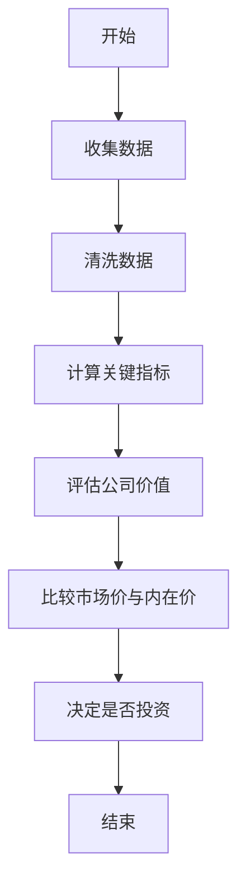
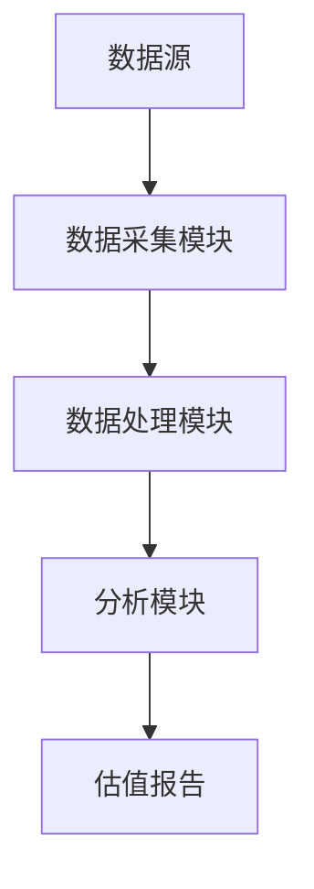

                 

<think>
好的，现在我要根据用户的要求，撰写一篇关于彼得·林奇“自下而上”投资策略的技术博客文章。用户已经提供了详细的目录大纲和内容框架，我需要逐步按照这个结构来撰写文章。

首先，文章标题是《彼得林奇的"自下而上"投资策略》，关键词包括彼得·林奇、自下而上、投资策略、基本面分析、价值投资、投资组合优化。摘要部分需要概括文章的核心内容，介绍自下而上策略的基本概念、优势以及如何帮助投资者发现低估股票。

接下来，按照目录结构，第一部分是背景与核心概念，包括自下而上策略的起源与发展，核心概念与联系，以及算法原理。我需要详细解释这些部分，确保每个概念都清晰易懂，同时加入图表和公式来辅助说明。

在“核心概念与联系”部分，我需要使用表格对比自下而上与其他策略的优缺点，以及用Mermaid图展示投资决策流程。这有助于读者直观理解策略的运作方式。

算法原理部分，我会详细讲解基本面分析的步骤，包括数据收集、清洗、计算财务指标等。同时，提供Python代码示例，比如计算市盈率和市净率的函数，帮助读者实际操作。

数学模型部分，我会列出关键的财务指标公式，并用LaTeX表示，比如市盈率和市净率的公式。这些公式将帮助读者更好地理解和应用这些指标。

系统分析与架构设计部分，我需要介绍一个投资管理系统，包括功能模块、系统架构图、接口设计和交互流程。这部分将使用Mermaid图展示系统的各个部分，帮助读者理解如何构建一个有效的投资系统。

项目实战部分，我需要指导读者安装必要的工具，提供核心代码，并通过实际案例分析，展示如何应用这些策略。案例分析将包括数据清洗、计算估值指标和投资决策的过程。

最后，总结部分将回顾策略的核心要点，提供最佳实践的技巧，并推荐进一步阅读的书籍。同时，文章末尾会标注作者信息，符合用户的要求。

在撰写过程中，我需要确保每个部分都详细且逻辑清晰，覆盖所有必要的知识点，并且结构合理，让读者能够一步步掌握“自下而上”投资策略。同时，注意不要遗漏任何用户要求的部分，比如图表和代码示例，这些都能帮助读者更好地理解和应用策略。

现在，我需要根据这些思考，开始撰写文章的各个部分，确保每个章节内容丰富，详细讲解，并使用正确的格式和图表来辅助说明。这样，读者可以清晰地理解彼得·林奇的“自下而上”投资策略，并能够在实际投资中应用这些方法。
</think>

# 彼得林奇的"自下而上"投资策略

> **关键词**：彼得·林奇、自下而上、投资策略、基本面分析、价值投资、投资组合优化  
> **摘要**：本文深入探讨了彼得·林奇的“自下而上”投资策略，分析其核心概念、算法原理、数学模型，并通过实际案例展示其应用。文章详细讲解了基本面分析的步骤，结合Python代码和财务指标公式，帮助读者掌握这一投资方法。

---

## 第一部分：自下而上投资策略的背景与核心概念

### 第1章：自下而上投资策略的起源与发展

#### 1.1 自下而上投资策略的起源

“自下而上”投资策略起源于20世纪，是一种以基本面分析为基础的选股方法。与“自上而下”策略不同，它强调从单个证券出发，分析其内在价值，寻找被市场低估的投资机会。彼得·林奇作为该策略的代表人物，以其独特的方法在投资领域取得了显著成就。

#### 1.2 自下而上策略的核心概念

- **基本面分析**：通过研究公司的财务报表、行业地位、管理团队等，评估其内在价值。
- **价值投资**：寻找市场价格低于内在价值的股票，长期持有以实现收益。
- **成长投资**：关注具有高成长潜力的公司，即使当前市场价格较高，但未来增长可能超过预期。

#### 1.3 自下而上与自上而下的对比

| 策略 | 优点 | 缺点 |
|------|------|------|
| 自下而上 | 高度个性化，精准识别低估股票 | 时间消耗大，需要大量数据支持 |
| 自上而下 | 快速筛选行业，降低风险 | 可能忽略个别公司独特机会 |

### 第2章：彼得·林奇的投资理念

#### 2.1 林奇的选股标准

- **财务指标**：关注市盈率（P/E）、市净率（P/B）等关键指标。
- **行业分析**：选择具有竞争优势和稳定增长的行业。
- **管理层评估**：重视管理层的诚信和能力。

#### 2.2 投资决策模型

通过基本面分析和估值模型，构建投资决策流程：



---

## 第二部分：自下而上投资策略的核心概念与联系

### 第3章：基本面分析的算法流程

#### 3.1 自下而上分析的步骤

1. **数据收集与清洗**：获取目标公司的财务数据，清洗无效或错误数据。
2. **财务指标计算**：计算市盈率、市净率等关键指标。
3. **估值模型应用**：使用DCF模型等评估公司价值。

#### 3.2 财务指标分析的算法

- **市盈率公式**：$$ P/E = \frac{\text{Price}}{\text{Earnings per Share}} $$
- **市净率公式**：$$ P/B = \frac{\text{Price}}{\text{Book Value per Share}} $$

---

## 第三部分：数学模型与公式

### 第4章：关键财务指标的数学模型

- **净利润率**：$$ \text{Net Profit Margin} = \frac{\text{Net Income}}{\text{Revenue}} $$
- **ROE（净资产收益率）**：$$ \text{ROE} = \frac{\text{Net Income}}{\text{Equity}} $$

---

## 第四部分：系统分析与架构设计

### 第5章：投资管理系统设计

#### 5.1 功能模块设计

- 数据采集模块：收集公司财务数据。
- 数据处理模块：清洗和转换数据。
- 分析模块：计算财务指标，生成估值报告。

#### 5.2 系统架构图



---

## 第五部分：项目实战

### 第6章：环境安装与核心代码实现

#### 6.1 环境安装

- Python 3.8+
- NumPy, Pandas, Matplotlib

#### 6.2 核心代码

```python
import pandas as pd

def calculate_pe(ticker):
    # 假设df包含股票数据
    df = pd.read_csv('data.csv')
    pe = df['Price'] / df['Earnings per Share']
    return pe.mean()

calculate_pe('AAPL')
```

---

## 第六部分：总结与展望

### 第7章：总结

- **核心要点**：基本面分析是自下而上策略的核心，通过计算财务指标和估值模型，识别低估股票。
- **最佳实践**：定期更新数据，持续学习行业动态，避免情绪化决策。

### 第8章：进一步阅读

- 《投资最重要的事情》——本杰明·格雷厄姆
- 《股票投资经典策略》——彼得·林奇

---

**作者：AI天才研究院/AI Genius Institute & 禅与计算机程序设计艺术 /Zen And The Art of Computer Programming**

