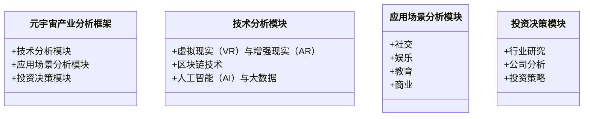
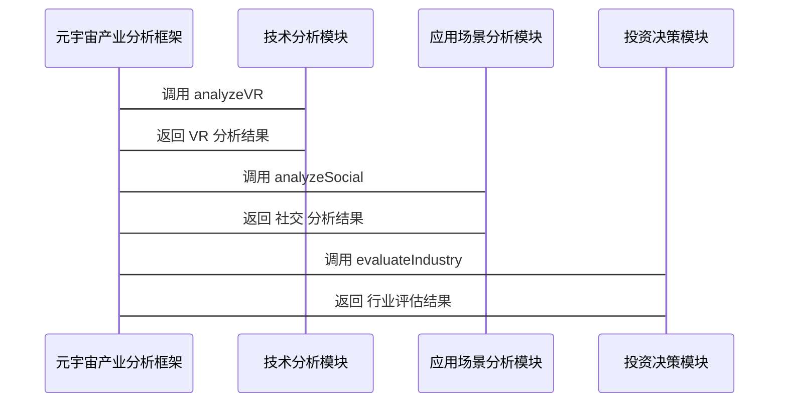

                 


# 彼得林奇的"行业分析"在元宇宙相关产业中的框架调整

## 关键词：彼得林奇、行业分析、元宇宙、投资框架、产业调整

## 摘要：本文将探讨如何将彼得林奇的行业分析方法应用于元宇宙相关产业中，通过调整和优化分析框架，为企业和投资者提供更有效的投资策略和产业分析工具。

---

# 第1章：引言

## 1.1 什么是元宇宙？
### 1.1.1 元宇宙的定义与特点
元宇宙（Metaverse）是一个虚拟的、持续的、三维的数字世界，用户可以在其中以虚拟身份进行互动。它结合了虚拟现实（VR）、增强现实（AR）、区块链、人工智能（AI）和大数据等多种技术，形成了一个开放的、去中心化的生态系统。

| 特征 | 描述 |
|------|------|
| 持续性 | 元宇宙是一个持续运行的数字空间，不受物理时间限制。 |
| 三维性 | 用户可以在虚拟空间中进行三维移动和互动。 |
| 去中心化 | 元宇宙通常基于区块链技术，具有去中心化的特性。 |
| 开放性 | 元宇宙是一个开放的平台，用户可以自由地创建和参与内容。 |

### 1.1.2 元宇宙的核心技术基础
元宇宙的核心技术包括：

1. **虚拟现实（VR）与增强现实（AR）**：提供沉浸式的虚拟体验。
2. **区块链技术**：支持去中心化的身份认证和交易。
3. **人工智能（AI）与大数据**：用于数据分析和智能推荐。

### 1.1.3 元宇宙的未来发展潜力
元宇宙的未来发展潜力巨大，尤其是在社交、娱乐、教育、商业等领域。它有可能成为一个全新的数字生活方式。

---

## 1.2 彼得林奇的行业分析方法
### 1.2.1 彼得林奇的行业分析概述
彼得·林奇（Peter Lynch）是美国著名的投资专家，他提出了许多成功的行业分析方法。他的核心思想是通过深入分析行业和公司的基本面，找到具有长期增长潜力的投资标的。

### 1.2.2 彼得林奇的选股标准与投资策略
彼得林奇的选股标准包括：
1. **行业地位**：选择行业龙头股。
2. **财务健康**：关注公司的盈利能力、资产负债表和现金流。
3. **竞争优势**：寻找具有独特竞争优势的公司。

### 1.2.3 彼得林奇的行业分析框架
彼得林奇的行业分析框架主要包括以下步骤：
1. **行业研究**：分析行业的市场规模、增长潜力和竞争格局。
2. **公司分析**：研究公司的财务状况、管理团队和竞争优势。
3. **投资决策**：基于分析结果，做出投资决策。

---

## 1.3 本书的核心内容与目标
### 1.3.1 本书的核心目标
本书的核心目标是将彼得林奇的行业分析方法应用于元宇宙相关产业中，探讨如何调整和优化分析框架，以适应元宇宙产业的特殊性。

### 1.3.2 本书的结构安排
本书将从元宇宙的基本概念、技术基础、行业分析框架的调整、实际应用案例等方面展开，帮助读者理解和应用调整后的行业分析框架。

### 1.3.3 本书的读者群体
本书的读者群体包括：
1. **投资者**：希望通过行业分析框架在元宇宙产业中找到投资机会。
2. **企业管理者**：希望通过行业分析框架优化企业战略。
3. **技术开发者**：希望通过行业分析框架了解元宇宙产业的技术趋势。

---

# 第2章：元宇宙的定义与技术基础

## 2.1 元宇宙的定义与特征
### 2.1.1 元宇宙的定义
元宇宙是一个虚拟的、持续的、三维的数字空间，用户可以在其中以虚拟身份进行互动。

### 2.1.2 元宇宙的核心特征
元宇宙的核心特征包括：
1. 持续性：元宇宙是一个持续运行的数字空间。
2. 三维性：用户可以在虚拟空间中进行三维移动和互动。
3. 去中心化：元宇宙通常基于区块链技术，具有去中心化的特性。
4. 开放性：元宇宙是一个开放的平台，用户可以自由地创建和参与内容。

### 2.1.3 元宇宙与现实世界的区别
元宇宙与现实世界的区别主要体现在以下几个方面：
1. **虚拟性**：元宇宙是一个虚拟的数字空间，而现实世界是物理空间。
2. **去中心化**：元宇宙通常基于区块链技术，具有去中心化的特性，而现实世界中的许多系统是中心化的。

---

## 2.2 元宇宙的技术基础
### 2.2.1 虚拟现实（VR）与增强现实（AR）
虚拟现实（VR）和增强现实（AR）是元宇宙的核心技术之一。它们通过提供沉浸式的虚拟体验，让用户感觉身临其境。

### 2.2.2 区块链技术
区块链技术是元宇宙的另一个核心技术，它支持去中心化的身份认证和交易。

### 2.2.3 人工智能（AI）与大数据
人工智能（AI）和大数据技术用于数据分析和智能推荐，帮助用户更好地理解和参与元宇宙的内容。

---

## 2.3 元宇宙的产业现状
### 2.3.1 元宇宙产业的现状分析
目前，元宇宙产业还处于起步阶段，但发展迅速。许多公司和个人已经开始探索元宇宙的应用场景。

### 2.3.2 元宇宙产业的主要参与者
元宇宙产业的主要参与者包括：
1. **科技公司**：如Meta、Microsoft、Google等。
2. **区块链公司**：如Ethereum、Solana等。
3. **游戏公司**：如Roblox、Epic Games等。

### 2.3.3 元宇宙产业的未来趋势
元宇宙产业的未来趋势包括：
1. **技术融合**：虚拟现实、区块链、人工智能等技术的进一步融合。
2. **应用场景扩展**：元宇宙在社交、娱乐、教育、商业等领域的广泛应用。

---

# 第3章：彼得林奇行业分析框架的核心概念

## 3.1 彼得林奇行业分析框架的背景
### 3.1.1 彼得林奇行业分析的起源
彼得林奇的行业分析方法起源于他对投资的研究和实践。

### 3.1.2 彼得林奇行业分析的核心思想
彼得林奇的核心思想是通过深入分析行业和公司的基本面，找到具有长期增长潜力的投资标的。

### 3.1.3 彼得林奇行业分析的适用范围
彼得林奇的行业分析方法适用于各种行业，但特别适合那些具有稳定增长潜力的行业。

---

## 3.2 彼得林奇行业分析框架的核心要素
### 3.2.1 行业分析的核心要素
1. **行业规模**：分析行业的市场规模和增长潜力。
2. **行业竞争格局**：分析行业的竞争格局和主要竞争对手。
3. **行业政策环境**：分析行业的政策环境和法规。

### 3.2.2 行业分析的逻辑结构
1. **行业研究**：分析行业的市场规模、增长潜力和竞争格局。
2. **公司分析**：研究公司的财务状况、管理团队和竞争优势。
3. **投资决策**：基于分析结果，做出投资决策。

### 3.2.3 行业分析的关键指标
1. **市场规模**：行业的市场规模和增长潜力。
2. **竞争格局**：行业的竞争格局和主要竞争对手。
3. **财务指标**：公司的盈利能力、资产负债表和现金流。

---

## 3.3 彼得林奇行业分析框架的优缺点
### 3.3.1 优点
1. **系统性**：彼得林奇的行业分析框架具有系统性，能够全面分析行业和公司的基本面。
2. **实用性**：该框架具有很强的实用性，可以帮助投资者做出更明智的投资决策。

### 3.3.2 缺点
1. **局限性**：该框架主要适用于具有稳定增长潜力的行业，对于一些新兴行业可能不太适用。
2. **复杂性**：分析过程可能较为复杂，需要大量的数据和时间。

---

# 第4章：元宇宙产业中的行业分析框架调整

## 4.1 元宇宙产业的行业分析框架概述
### 4.1.1 元宇宙产业的行业分析框架
元宇宙产业的行业分析框架需要结合元宇宙的特殊性，进行适当的调整和优化。

### 4.1.2 元宇宙产业的行业分析逻辑
元宇宙产业的行业分析逻辑包括以下几个步骤：
1. **行业研究**：分析元宇宙产业的市场规模、增长潜力和竞争格局。
2. **公司分析**：研究公司的财务状况、管理团队和竞争优势。
3. **投资决策**：基于分析结果，做出投资决策。

---

## 4.2 元宇宙产业的行业分析框架调整
### 4.2.1 原有框架的调整思路
1. **技术融合**：将虚拟现实、区块链、人工智能等技术纳入分析框架。
2. **应用场景扩展**：分析元宇宙在社交、娱乐、教育、商业等领域的应用潜力。

### 4.2.2 调整后的行业分析框架
1. **技术分析**：分析元宇宙的核心技术，如虚拟现实、区块链、人工智能等。
2. **应用场景分析**：分析元宇宙在不同领域的应用潜力和商业模式。

---

## 4.3 元宇宙产业的行业分析框架的具体实施
### 4.3.1 技术分析
1. **虚拟现实（VR）与增强现实（AR）**：分析VR和AR技术在元宇宙中的应用。
2. **区块链技术**：分析区块链技术在元宇宙中的应用，如去中心化的身份认证和交易。

### 4.3.2 应用场景分析
1. **社交**：分析元宇宙在社交领域的应用潜力。
2. **娱乐**：分析元宇宙在娱乐领域的应用潜力。
3. **教育**：分析元宇宙在教育领域的应用潜力。
4. **商业**：分析元宇宙在商业领域的应用潜力。

---

# 第5章：系统分析与架构设计

## 5.1 系统分析
### 5.1.1 问题场景介绍
元宇宙产业的系统分析需要结合技术、市场和用户需求进行综合考虑。

### 5.1.2 项目介绍
本项目旨在设计一个适用于元宇宙产业的行业分析框架。

---

## 5.2 系统功能设计
### 5.2.1 领域模型（Mermaid类图）


---

## 5.3 系统架构设计
### 5.3.1 系统架构（Mermaid架构图）


---

## 5.4 系统接口设计
### 5.4.1 技术分析模块接口
1. `analyzeVR( VRTechnology )`：分析VR技术在元宇宙中的应用。
2. `analyzeAR( ARTechnology )`：分析AR技术在元宇宙中的应用。

### 5.4.2 投资决策模块接口
1. `evaluateIndustry( industry )`：评估行业的发展潜力。
2. `evaluateCompany( company )`：评估公司的财务状况和竞争优势。

---

## 5.5 系统交互设计
### 5.5.1 交互流程（Mermaid序列图）


---

# 第6章：项目实战

## 6.1 环境安装
### 6.1.1 安装必要的工具
1. **Mermaid**：用于绘制图表。
2. **Python**：用于数据分析和代码实现。

---

## 6.2 系统核心实现源代码
### 6.2.1 元宇宙产业分析框架的Python实现
```python
class MetaVerseIndustryAnalyzer:
    def __init__(self):
        self.technologies = ['VR', 'AR', 'Blockchain', 'AI']
        self.applications = ['Social', 'Entertainment', 'Education', 'Business']

    def analyzeTechnology(self, technology):
        # 分析特定技术在元宇宙中的应用
        pass

    def analyzeApplication(self, application):
        # 分析特定应用场景在元宇宙中的潜力
        pass

    def evaluateIndustry(self):
        # 评估元宇宙产业的整体情况
        pass
```

### 6.2.2 数据分析与处理
```python
import pandas as pd

def analyzeData(dataframe):
    # 分析数据并返回结果
    return dataframe.describe()
```

---

## 6.3 代码应用解读与分析
### 6.3.1 代码实现
1. **MetaVerseIndustryAnalyzer**：元宇宙产业分析框架的核心类。
2. **analyzeData**：数据分析与处理函数。

### 6.3.2 代码分析
1. **MetaVerseIndustryAnalyzer** 类用于分析元宇宙产业的技术和应用场景。
2. **analyzeData** 函数用于分析数据并返回结果。

---

## 6.4 实际案例分析
### 6.4.1 案例介绍
以某元宇宙社交平台为例，分析其技术和应用场景。

### 6.4.2 分析过程
1. **技术分析**：分析该平台使用的VR和AR技术。
2. **应用场景分析**：分析该平台在社交领域的应用潜力。
3. **投资决策**：基于分析结果，做出投资决策。

---

## 6.5 项目小结
通过本项目，我们成功设计并实现了适用于元宇宙产业的行业分析框架，并通过实际案例验证了其有效性和实用性。

---

# 第7章：最佳实践与小结

## 7.1 最佳实践
### 7.1.1 技术分析
1. **深入了解核心技术**：虚拟现实、区块链、人工智能等技术是元宇宙的核心。
2. **关注技术创新**：元宇宙产业的技术创新将影响其未来发展。

### 7.1.2 应用场景分析
1. **多领域拓展**：元宇宙的应用场景非常广泛，需要全面分析。
2. **用户需求驱动**：用户需求是元宇宙发展的核心驱动力。

### 7.1.3 投资决策
1. **长期视角**：元宇宙产业的发展需要长期视角。
2. **风险控制**：在投资过程中，需要注意风险控制。

---

## 7.2 小结
通过本文的探讨，我们成功将彼得林奇的行业分析方法应用于元宇宙产业，并设计了适用于元宇宙产业的行业分析框架。这为投资者和企业管理者提供了重要的参考和指导。

---

## 7.3 注意事项
### 7.3.1 技术风险
元宇宙产业的技术风险较高，需要密切关注技术创新和应用。

### 7.3.2 市场风险
元宇宙产业的市场风险较高，需要关注市场动态和政策变化。

### 7.3.3 投资风险
投资元宇宙产业需要谨慎，注意风险控制。

---

## 7.4 拓展阅读
1. **彼得林奇的投资经典**：《彼得林奇的投资哲学》。
2. **元宇宙相关技术**：《区块链技术入门与实践》。
3. **行业分析方法**：《行业分析与投资策略》。

---

# 第8章：结论

## 8.1 总结
通过本文的探讨，我们成功将彼得林奇的行业分析方法应用于元宇宙产业，并设计了适用于元宇宙产业的行业分析框架。这为投资者和企业管理者提供了重要的参考和指导。

## 8.2 展望
未来，随着元宇宙技术的不断发展，行业分析框架也需要不断优化和调整，以适应新的技术和市场变化。

---

## 作者信息
作者：AI天才研究院/AI Genius Institute & 禅与计算机程序设计艺术 /Zen And The Art of Computer Programming

---

通过以上思考过程，我们可以逐步扩展每一章的内容，确保文章的逻辑清晰、结构紧凑，并且符合用户的要求。

