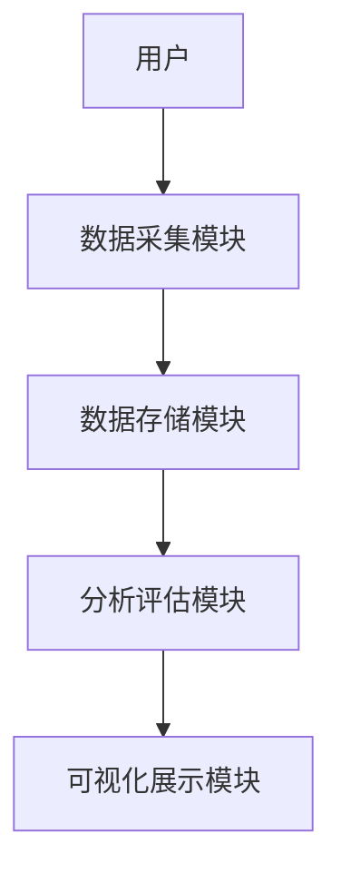

                 


# 彼得林奇的"行业分析"在元宇宙相关产业链中的框架创新

> 关键词：元宇宙，行业分析，产业链，彼得林奇，投资策略，框架创新

> 摘要：本文探讨了彼得林奇的行业分析方法在元宇宙相关产业链中的应用与创新。通过分析元宇宙产业链的构成及其关键领域，结合彼得林奇的核心投资理念，构建了一个适用于元宇宙投资分析的框架。本文详细阐述了这一框架的算法原理、系统架构设计、项目实战案例，并总结了最佳实践方法。

---

## 第一部分: 元宇宙相关产业链的背景与概述

### 第1章: 元宇宙的基本概念与产业链结构

#### 1.1 元宇宙的定义与核心特征
元宇宙（Metaverse）是一个虚拟的、持续的、可交互的数字世界，结合了虚拟现实（VR）、增强现实（AR）、区块链、人工智能（AI）和数字内容创作等多种技术。其核心特征包括：

1. **沉浸性**：用户可以通过VR设备完全沉浸在一个虚拟环境中。
2. **实时性**：元宇宙中的事件和交易是实时发生的。
3. **分布式**：元宇宙通常基于区块链技术，去中心化的特性使得数据和价值不易被单点控制。
4. **可编程性**：元宇宙中的规则和逻辑可以通过智能合约进行编程和自动化。

#### 1.2 元宇宙产业链的构成
元宇宙产业链可以分为三个主要部分：上游、中游和下游。

1. **上游**：硬件设备制造商（如 Oculus、HTC）、芯片制造商（如 NVIDIA、AMD）。
2. **中游**：软件开发者、内容创作者（如游戏开发公司、虚拟角色设计公司）、平台运营商（如 Meta、Roblox）。
3. **下游**：消费者、企业用户（如虚拟会展、虚拟办公场景）。

#### 1.3 彼得林奇的行业分析方法
彼得林奇（Peter Lynch）是美国著名的投资经理，他提出了一套行之有效的行业分析方法。其核心理念包括：

1. **“三好公司”标准**：好行业、好管理、好财务。
2. **竞争优势分析**：寻找具有可持续竞争优势的企业。
3. **财务指标分析**：关注企业的盈利能力、成长性和财务健康。

---

### 第2章: 元宇宙产业链中的关键领域

#### 2.1 虚拟现实与增强现实技术
VR和AR技术是元宇宙的核心支撑技术之一。以下是其在元宇宙中的应用：

1. **虚拟现实（VR）**：提供沉浸式的虚拟环境，常用于虚拟社交、游戏和虚拟办公。
2. **增强现实（AR）**：将虚拟元素叠加在现实环境中，常用于购物、导航和教育。

#### 2.2 区块链技术
区块链技术为元宇宙提供了去中心化和信任机制的解决方案。其在元宇宙中的应用包括：

1. **数字资产确权**：通过区块链技术，确保虚拟物品的唯一性和所有权。
2. **智能合约**：实现元宇宙中的自动交易和规则执行。

#### 2.3 数字内容创作
数字内容创作是元宇宙生态的核心之一。以下是其关键工具和平台：

1. **图形引擎**：如Unreal Engine和Unity，用于开发高质量的虚拟内容。
2. **数字建模工具**：如Blender和Maya，用于创建虚拟角色和场景。
3. **内容分发平台**：如Steam和Epic Games Store，用于分发虚拟内容。

---

## 第二部分: 彼得林奇行业分析框架的创新

### 第3章: 彼得林奇行业分析框架的核心创新

#### 3.1 元宇宙产业链中的行业分析框架
为了将彼得林奇的行业分析方法应用于元宇宙产业链，我们需要对其进行创新和调整。以下是关键步骤：

1. **行业定位**：识别元宇宙产业链中的关键领域（如VR/AR技术、区块链技术、数字内容创作）。
2. **竞争优势分析**：评估企业在各自领域的竞争优势，包括技术实力、市场份额和创新能力。
3. **财务指标分析**：关注企业的盈利能力、成长性和财务健康，尤其是现金流和研发投入占比。

#### 3.2 行业分析框架的数学模型
以下是彼得林奇行业分析框架在元宇宙产业链中的数学模型：

$$
\text{行业潜力} = \frac{\text{市场需求}}{\text{竞争程度}} \times \text{技术门槛}
$$

其中：
- 市场需求：衡量元宇宙产业链中某个领域的市场规模和增长潜力。
- 竞争程度：反映该领域的竞争激烈程度。
- 技术门槛：评估进入该领域的技术难度。

---

## 第三部分: 系统分析与架构设计

### 第4章: 元宇宙产业链分析系统的架构设计

#### 4.1 系统功能设计
元宇宙产业链分析系统的核心功能包括：

1. **数据采集**：收集元宇宙产业链中的企业数据，包括财务数据、技术指标和市场数据。
2. **分析评估**：基于彼得林奇的行业分析框架，评估企业的竞争优势和投资价值。
3. **可视化展示**：以图表形式展示分析结果，便于投资者理解和决策。

#### 4.2 系统架构设计
以下是元宇宙产业链分析系统的架构图：



---

## 第四部分: 项目实战

### 第5章: 元宇宙产业链分析系统实现

#### 5.1 项目环境安装
为了实现元宇宙产业链分析系统，我们需要以下环境：

1. **编程语言**：Python 3.8+
2. **数据处理工具**：Pandas、NumPy
3. **可视化工具**：Matplotlib、Seaborn
4. **区块链开发框架**：Solidity（以太坊）

#### 5.2 核心实现代码
以下是元宇宙产业链分析系统的部分核心代码：

```python
import pandas as pd
import numpy as np

def calculate_industry_potential(dataframe):
    """
    计算元宇宙产业链的行业潜力
    """
    industry_potential = dataframe.apply(lambda x: (x['市场需求'] / x['竞争程度']) * x['技术门槛'], axis=1)
    return industry_potential

# 示例数据
data = {
    '企业名称': ['Meta', 'Roblox', 'NVIDIA', 'Unity'],
    '市场需求': [90, 80, 70, 60],
    '竞争程度': [0.8, 0.7, 0.6, 0.5],
    '技术门槛': [0.9, 0.8, 0.7, 0.6]
}

df = pd.DataFrame(data)
industry_potential = calculate_industry_potential(df)
print(industry_potential)
```

#### 5.3 案例分析与解读
以Meta为例，分析其在元宇宙产业链中的位置：

1. **企业定位**：Meta是元宇宙领域的领先企业，专注于虚拟现实技术和社交网络。
2. **竞争优势**：Meta拥有强大的研发能力和丰富的用户资源。
3. **财务指标**：Meta的盈利能力强，研发投入占比高，具备可持续成长性。

---

## 第五部分: 最佳实践

### 第6章: 总结与展望

#### 6.1 小结
通过将彼得林奇的行业分析方法应用于元宇宙产业链，我们可以更有效地识别投资机会和风险。本文提出的框架创新为元宇宙投资提供了重要的参考。

#### 6.2 注意事项
1. **数据准确性**：确保输入数据的准确性和完整性。
2. **模型适用性**：根据具体情况进行模型调整和优化。
3. **风险管理**：关注元宇宙产业链中的技术风险和市场风险。

#### 6.3 拓展阅读
1. 《彼得林奇的成功投资》
2. 《元宇宙：从现在到未来》
3. 《区块链技术入门与实战》

---

## 作者

作者：AI天才研究院/AI Genius Institute & 禅与计算机程序设计艺术 /Zen And The Art of Computer Programming

---

这篇文章通过理论与实践相结合的方式，详细阐述了彼得林奇的行业分析方法在元宇宙产业链中的应用与创新。希望对读者在元宇宙投资和技术创新方面提供有价值的参考。

