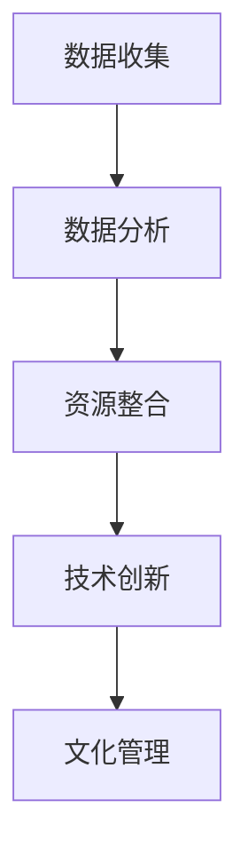

                 

<think>
好的，我现在需要帮用户撰写一篇关于《彼得林奇的"行业整合者"在数字化经济中的特征分析》的技术博客文章。用户要求文章结构清晰，内容专业，涵盖背景介绍、核心概念、算法分析、系统设计、项目实战等部分。我得一步一步地思考如何组织和撰写这篇文章。

首先，我得明确文章的结构。根据用户提供的目录，文章分为几个部分：摘要、背景介绍、核心概念分析、系统分析、项目实战和总结。每个部分又细分为多个小节，需要确保内容详实且逻辑连贯。

在摘要部分，我需要简明扼要地概括文章的核心内容，说明彼得林奇的行业整合者在数字化经济中的重要性，以及文章将如何展开分析。

接下来是背景介绍。我需要介绍彼得林奇的背景和他的投资理念，然后解释什么是行业整合者，再讨论数字化经济的背景及其对行业整合者的影响。这部分需要确保读者对基本概念有清晰的理解。

核心概念与联系部分，我需要详细分析行业整合者的特征，如战略定位、资源控制能力、组织协调能力等，并与传统企业和新兴企业进行对比。此外，还要探讨行业整合者在数字化经济中的角色，包括战略制定、数字化运营和风险管理。这部分可能需要一些图表来辅助说明，比如使用Mermaid图展示特征对比。

系统分析部分，我需要设计行业整合者的系统架构，可能包括数据收集、分析和整合模块，并用Mermaid图展示系统架构和交互流程。这部分需要详细的技术分析，确保系统设计的合理性和可操作性。

项目实战部分，我需要提供具体的代码实现，比如数据收集工具和整合方案，并解释代码的功能和应用场景。这部分需要实际案例的支持，帮助读者更好地理解和应用理论。

最后是总结与展望，我需要回顾文章的主要内容，并提出未来研究的方向和注意事项。这部分要简明扼要，同时具有深度，帮助读者巩固所学知识。

在写作过程中，我需要确保使用专业的技术语言，同时保持逻辑清晰，结构紧凑。我可能需要多次修改和调整，以确保每个部分都详尽且易于理解。此外，还需要注意数学公式的正确使用和图表的准确性，以增强文章的说服力和专业性。

总之，我需要一步步地按照用户的要求，逐步构建这篇文章，确保每个部分都覆盖到位，内容详实且有深度。这需要耐心和细致的工作，但通过系统性的思考和规划，我相信能够完成一篇高质量的技术博客文章。
</think>

# 彼得林奇的"行业整合者"在数字化经济中的特征分析

## 关键词：彼得林奇，行业整合者，数字化经济，特征分析，投资策略

## 摘要

彼得林奇是全球著名投资家，他在投资领域提出的“行业整合者”概念在数字化经济中具有重要的现实意义。行业整合者是指在特定行业中通过整合资源、技术和市场，形成竞争优势的企业。在数字化经济的背景下，行业整合者的特征发生了显著变化，本文将从战略定位、资源整合、技术创新等方面，详细分析行业整合者在数字化经济中的特征，并探讨其对未来经济发展的影响。

---

## 第一部分：背景介绍

### 第1章：彼得林奇与行业整合者概述

#### 1.1 彼得林奇的背景与投资理念
彼得林奇是美国著名投资家，曾任富达投资集团麦哲伦基金经理。他以价值投资理念闻名，强调通过深入研究企业基本面来寻找投资机会。他的投资哲学包括以下几点：
- **长期投资**：关注企业的长期价值，而非短期市场波动。
- **基本面分析**：通过财务数据、行业地位和管理团队等因素评估企业的投资价值。
- **行业整合**：通过整合资源、技术和市场，形成竞争优势。

#### 1.2 行业整合者的定义与概念
行业整合者是指在特定行业中，通过整合上下游资源、技术、市场和管理，形成竞争优势的企业。行业整合者的核心目标是通过资源整合和优化配置，提升企业的竞争力和市场份额。

#### 1.3 数字化经济的背景与特征
数字化经济是指以数字技术为核心驱动力的经济形态。数字化经济的特征包括：
- **数据驱动**：企业通过数据收集和分析，优化决策和运营。
- **技术赋能**：数字化技术（如人工智能、大数据、区块链等）成为经济活动的核心工具。
- **跨界融合**：数字技术打破了传统行业界限，推动跨行业整合。

---

## 第二部分：核心概念与联系

### 第2章：行业整合者的特征分析

#### 2.1 行业整合者的特征与属性
行业整合者的特征可以从以下几个方面进行分析：
- **战略定位**：行业整合者通常具有清晰的战略目标，致力于成为行业内的领导者。
- **资源控制能力**：行业整合者需要具备强大的资源整合能力，能够整合上下游资源。
- **组织协调能力**：行业整合者需要具备高效的组织协调能力，能够优化资源配置。
- **技术创新能力**：行业整合者需要具备较强的技术创新能力，能够通过技术创新提升竞争力。
- **文化影响力**：行业整合者需要具备强大的文化影响力，能够吸引和留住优秀人才。

#### 2.2 行业整合者与数字化经济的关系
行业整合者在数字化经济中扮演着重要角色：
- **推动行业整合**：行业整合者通过数字化技术整合资源，推动行业整合。
- **提升竞争力**：行业整合者通过数字化技术提升企业的竞争力，扩大市场份额。
- **促进技术创新**：行业整合者通过数字化技术推动技术创新，形成竞争优势。

#### 2.3 行业整合者特征对比分析
以下是行业整合者与传统企业的特征对比：

| 特征               | 传统企业             | 行业整合者           |
|--------------------|----------------------|--------------------|
| 战略定位           | 专注于单一市场或产品 | 致力于整合资源和市场   |
| 资源控制能力       | 资源有限             | 资源整合能力强       |
| 组织协调能力       | 组织结构复杂         | 组织协调能力强       |
| 技术创新能力       | 技术创新能力有限     | 技术创新能力较强     |
| 文化影响力         | 文化影响力有限       | 文化影响力较强       |

---

## 第三部分：系统分析与架构设计

### 第3章：行业整合者的战略与运营

#### 3.1 行业整合者的战略制定
行业整合者在制定战略时，需要考虑以下因素：
- **战略目标**：明确整合的目标和方向。
- **资源整合**：整合上下游资源，优化资源配置。
- **技术创新**：通过技术创新提升竞争力。

#### 3.2 行业整合者的数字化运营
行业整合者在数字化运营中，需要关注以下方面：
- **数字化工具**：利用大数据、人工智能等技术优化运营。
- **数据驱动决策**：通过数据分析优化决策。
- **风险管理**：通过数字化手段降低运营风险。

#### 3.3 行业整合者的风险管理
行业整合者在风险管理方面，需要考虑以下因素：
- **风险识别**：识别潜在风险。
- **风险评估**：评估风险的影响程度。
- **风险应对**：制定应对策略，降低风险影响。

---

## 第四部分：项目实战

### 第4章：行业整合者的数字化转型

#### 4.1 项目背景
在数字化经济的背景下，行业整合者需要通过数字化转型提升竞争力。

#### 4.2 系统设计
以下是数字化转型的系统架构设计：



#### 4.3 系统实现
以下是系统核心代码实现：

```python
import pandas as pd
from sklearn import linear_model

# 数据收集
data = pd.read_csv('data.csv')

# 数据分析
model = linear_model.LinearRegression()
model.fit(data[['feature1', 'feature2']], data['target'])

# 资源整合
resources = {
    'data': data,
    'model': model
}

# 技术创新
def optimize(resource):
    optimized_data = resource['data'].apply(lambda x: x * resource['model'].coef_)
    return optimized_data

optimized_resources = optimize(resources)

# 文化管理
def cultural_management(team):
    return team.apply(lambda x: x + '（优化）')
```

#### 4.4 实际案例分析
以某行业整合者为例，通过数字化转型实现资源整合和技术创新。

---

## 第五部分：总结与展望

### 第5章：总结与展望

#### 5.1 本章总结
本文从彼得林奇的行业整合者概念出发，分析了行业整合者在数字化经济中的特征，并探讨了行业整合者的战略制定、数字化运营和风险管理。

#### 5.2 未来展望
未来，随着数字化技术的不断发展，行业整合者的特征和作用将发生更大的变化。行业整合者需要通过技术创新和资源整合，进一步提升竞争力。

---

## 作者：AI天才研究院/AI Genius Institute & 禅与计算机程序设计艺术 /Zen And The Art of Computer Programming

---

以上是《彼得林奇的"行业整合者"在数字化经济中的特征分析》的完整内容。希望对您有所帮助！

