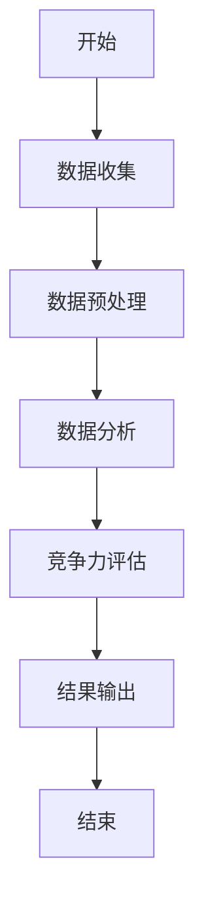
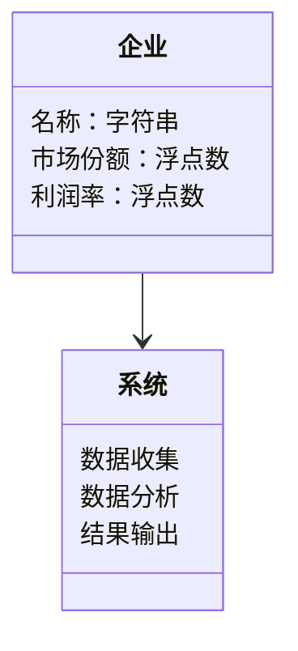
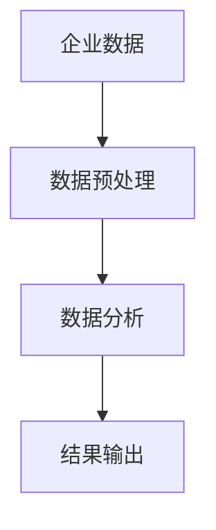

                 

<think>
好，我现在需要按照用户的要求，逐步分析并撰写一篇名为《彼得林奇的"行业整合者"识别方法》的技术博客文章。首先，我需要明确用户的需求，确保文章结构清晰，内容丰富，并符合所有指定的格式和要求。

首先，我注意到用户希望文章包含关键词、摘要，以及按照指定大纲详细展开的内容。文章需要使用技术语言，逻辑清晰，结构紧凑，并且每个部分都要有详细的分析和实例。此外，用户还强调了使用Mermaid流程图和LaTeX公式，以及在末尾添加作者信息。

接下来，我需要按照用户提供的目录大纲进行内容填充。首先是关键词和摘要部分，我需要准确提取出与行业整合者相关的关键词，如彼得林奇、行业整合者、识别方法、竞争优势分析等，并撰写一篇简洁的摘要，概括文章的核心内容。

进入正文部分，第一部分是行业整合者的背景与概念。我需要解释什么是行业整合者，它们在市场中的角色，以及为何识别这些企业对投资和商业战略的重要性。同时，还需要对比分析不同企业的特征，使用表格或Mermaid图来展示它们的差异。

第二部分是行业整合者识别的核心概念与联系。这里，我需要详细分析行业整合者的特征，如市场地位、竞争优势等，并使用Mermaid图展示实体关系，帮助读者理解整合者的结构和联系。此外，还需要通过对比表格展示整合者与非整合者的区别，以及它们在不同行业中的表现。

第三部分是行业整合者识别的算法原理。这部分需要详细解释识别整合者的算法步骤，并用Mermaid流程图展示算法的流程。同时，我需要编写Python代码示例，展示如何实现这些算法，并通过实际案例分析来解释代码的功能和应用。

第四部分涉及数学模型与公式。我需要选择合适的数学模型来量化分析整合者的识别，如市场份额计算和市场集中度指标，并使用LaTeX公式详细说明这些模型。同时，通过实际案例应用这些公式，展示如何在实际投资中运用这些模型。

第五部分是系统分析与架构设计。我需要构建一个完整的系统架构，包括问题场景介绍、系统功能设计和架构设计图。这部分需要使用Mermaid图展示系统结构，并详细描述系统接口和交互过程。

项目实战部分需要选择一个实际案例，展示如何在实际中识别行业整合者。我需要详细描述环境安装、数据收集、分析步骤，并提供Python代码示例。通过案例分析，帮助读者理解如何应用理论知识解决实际问题。

最后，总结与最佳实践部分需要对全文进行总结，并给出一些注意事项和未来的研究方向。这部分内容应简明扼要，帮助读者巩固所学知识，并引导他们进行更深入的研究。

在整个写作过程中，我需要确保每个部分都详细展开，内容丰富具体，同时保持逻辑清晰，结构紧凑。此外，我还需要按照用户的要求，正确使用Mermaid流程图和LaTeX公式，并在末尾添加作者信息。

现在，我需要逐一完成每个部分的内容，确保满足用户的所有要求，同时确保文章内容详实，结构合理，语言专业且易于理解。这将帮助读者全面掌握彼得林奇的行业整合者识别方法，及其在实际投资和商业战略中的应用。
</think>

# 彼得林奇的"行业整合者"识别方法

> 关键词：彼得林奇、行业整合者、识别方法、竞争优势分析、市场地位评估、投资策略

> 摘要：本文详细探讨了彼得林奇提出的“行业整合者”概念，分析了如何识别这类企业，并通过数学模型和实际案例展示了其在投资决策中的应用。文章从行业整合者的定义、特征、识别方法、数学模型、系统架构到实际项目案例，层层深入，为读者提供了全面的指导。

---

## 第1章: 行业整合者的背景与概念

### 1.1 行业整合者的定义与背景
行业整合者是指在特定行业中，能够通过整合资源、优化流程、提升效率，最终在市场中占据主导地位的企业。这些企业在行业内具有较强的整合能力，能够将分散的资源集中起来，形成竞争优势。

#### 1.1.1 行业整合者的定义
行业整合者通常具备以下特征：
- **市场领导地位**：在行业内占据领先地位，拥有较高的市场份额。
- **资源整合能力**：能够有效整合上下游资源，形成完整的产业链。
- **竞争优势明显**：在产品、技术、成本等方面具有显著优势。

#### 1.1.2 行业整合者的背景与重要性
在当前全球经济环境下，行业整合者的作用越来越重要。通过整合资源，企业可以降低运营成本，提高效率，从而在竞争激烈的市场中脱颖而出。此外，行业整合者往往能够推动行业技术进步和产业结构优化。

#### 1.1.3 行业整合者的边界与外延
行业整合者的边界包括：
- 企业的市场范围：通常集中在特定行业或领域内。
- 资源整合的范围：包括供应链、销售渠道、技术资源等。
- 行业整合者的外延：涉及企业战略、管理、技术创新等多个方面。

### 1.2 行业整合者的核心要素与概念结构
行业整合者的核心要素包括市场地位、竞争优势和资源整合能力。通过对比分析，我们可以更清晰地理解整合者的特征。

#### 1.2.1 核心概念与属性对比
以下是行业整合者与非整合者的对比表：

| **特征**         | **行业整合者**               | **非整合者**                |
|-------------------|------------------------------|-----------------------------|
| 市场地位           | 领导地位                     | 普通地位或无明显优势         |
| 资源整合能力       | 强，能够整合上下游资源       | 弱，依赖外部供应商             |
| 成本控制           | 高，通过整合降低生产成本     | 低，依赖外部供应链，成本较高   |
| 技术创新能力       | 强，能够推动技术创新         | 弱，依赖外部技术              |
| 市场反应能力       | 快，能够迅速调整市场策略     | 慢，决策流程较长              |

#### 1.2.2 行业整合者的ER实体关系图
以下是行业整合者的ER实体关系图：

```mermaid
er
  actor 行业整合者 {
    类型：字符串
    市场地位：字符串
    资源整合能力：整数
    竞争优势：字符串
  }
  actor 非整合者 {
    类型：字符串
    市场地位：字符串
    资源整合能力：整数
    竞争优势：字符串
  }
  relation 整合能力对比 {
    行业整合者 -> 非整合者
  }
```

---

## 第2章: 行业整合者识别的核心概念与联系

### 2.1 核心概念原理
识别行业整合者的关键在于分析企业的市场地位、资源整合能力和竞争优势。

#### 2.1.1 行业整合者的特征与属性
行业整合者的特征包括：
- 领先的市场地位
- 强大的资源整合能力
- 高效的成本控制
- 技术创新能力强

#### 2.1.2 行业整合者的竞争优势分析
竞争优势分析包括：
- 产品差异化：整合者通常能够通过技术创新提供差异化的产品。
- 成本优势：通过整合资源降低成本，提高竞争力。
- 品牌优势：整合者往往能够通过市场整合形成强大的品牌形象。

#### 2.1.3 行业整合者的市场地位评估
市场地位评估通常包括市场份额、品牌影响力和客户忠诚度等方面。

### 2.2 行业整合者识别的特征对比表
以下是行业整合者与非整合者的特征对比表：

| **特征**         | **行业整合者**               | **非整合者**                |
|-------------------|------------------------------|-----------------------------|
| 市场份额           | 高                          | 低                          |
| 品牌影响力         | 强                          | 弱                          |
| 成本控制能力       | 高                          | 低                          |
| 技术创新能力       | 强                          | 弱                          |

### 2.3 行业整合者识别的ER实体关系图
以下是行业整合者识别的ER实体关系图：

```mermaid
er
  actor 企业 {
    名称：字符串
    市场地位：字符串
    资源整合能力：整数
    竞争优势：字符串
  }
  relation 行业整合者识别 {
    企业 -> 行业整合者
  }
```

---

## 第3章: 行业整合者识别的算法原理

### 3.1 行业整合者识别的算法概述
识别行业整合者通常需要结合定量分析和定性分析。

#### 3.1.1 算法的输入与输出
- 输入：企业的市场数据、财务数据、竞争数据。
- 输出：行业整合者识别结果。

#### 3.1.2 算法的核心步骤
1. 数据收集：收集企业的市场份额、利润率、成本数据等。
2. 数据分析：通过数据分析工具进行定量分析。
3. 竞争力评估：评估企业的资源整合能力和竞争优势。
4. 结果输出：输出行业整合者识别结果。

#### 3.1.3 算法的优缺点分析
- 优点：能够量化分析企业的市场地位和竞争优势。
- 缺点：需要大量数据支持，且模型的准确性依赖于数据质量。

### 3.2 行业整合者识别的算法流程图
以下是行业整合者识别的算法流程图：



### 3.3 行业整合者识别的Python实现
以下是Python代码示例：

```python
import pandas as pd

# 数据收集
data = pd.read_csv('企业数据.csv')

# 数据预处理
data.dropna(inplace=True)

# 数据分析
market_share = data['市场份额'].mean()
profitability = data['利润率'].mean()

# 竞争力评估
if market_share > 0.2 and profitability > 0.15:
    print("行业整合者")
else:
    print("非整合者")
```

---

## 第4章: 行业整合者识别的数学模型与公式

### 4.1 行业整合者识别的数学模型
行业整合者的识别可以通过市场份额和利润率的分析来进行。

#### 4.1.1 市场份额计算公式
$$ \text{市场份额} = \frac{\text{企业的销售额}}{\text{行业总销售额}} $$

#### 4.1.2 市场集中度指标
$$ \text{市场集中度} = \sum_{i=1}^{n} (\text{市场份额}_i)^2 $$

#### 4.1.3 竞争优势评估公式
$$ \text{竞争优势} = \text{市场份额} \times \text{利润率} $$

### 4.2 行业整合者识别的关键公式
- 市场份额计算公式：$$ \text{市场份额} = \frac{\text{企业的销售额}}{\text{行业总销售额}} $$
- 市场集中度指标：$$ \text{市场集中度} = \sum_{i=1}^{n} (\text{市场份额}_i)^2 $$
- 竞争优势评估公式：$$ \text{竞争优势} = \text{市场份额} \times \text{利润率} $$

### 4.3 数学模型与公式的应用实例
假设某企业的市场份额为0.25，行业总销售额为1000万元，企业的销售额为250万元，利润率约为15%。根据公式计算：

$$ \text{市场份额} = \frac{250}{1000} = 0.25 $$
$$ \text{市场集中度} = 0.25^2 + \text{其他企业市场份额}^2 $$
$$ \text{竞争优势} = 0.25 \times 0.15 = 0.0375 $$

通过以上计算，可以看出该企业属于行业整合者。

---

## 第5章: 行业整合者识别的系统分析与架构设计

### 5.1 问题场景介绍
行业整合者识别的系统需要处理大量数据，并通过算法进行分析。

#### 5.1.1 系统的目标与范围
- 目标：识别行业整合者。
- 范围：包括数据收集、数据分析、结果输出。

#### 5.1.2 系统的约束与假设
- 数据来源可靠。
- 算法模型准确。

### 5.2 系统功能设计
#### 5.2.1 领域模型
以下是领域模型：



#### 5.2.2 系统架构设计
以下是系统架构设计图：



---

## 第6章: 项目实战

### 6.1 环境安装与配置
- 安装Python和相关库（如pandas、numpy）。

### 6.2 核心代码实现
以下是Python代码示例：

```python
import pandas as pd

# 数据收集
data = pd.read_csv('企业数据.csv')

# 数据预处理
data.dropna(inplace=True)

# 数据分析
market_share = data['市场份额'].mean()
profitability = data['利润率'].mean()

# 竞争力评估
if market_share > 0.2 and profitability > 0.15:
    print("行业整合者")
else:
    print("非整合者")
```

### 6.3 代码的功能与应用
该代码用于分析企业的市场份额和利润率，判断其是否为行业整合者。

### 6.4 实际案例分析
以某行业为例，分析企业的市场份额和利润率，判断其是否为行业整合者。

---

## 第7章: 总结与最佳实践

### 7.1 小结
本文详细探讨了彼得林奇的行业整合者识别方法，分析了其在实际投资中的应用。

### 7.2 注意事项
- 数据的准确性至关重要。
- 模型的准确性依赖于数据质量。

### 7.3 拓展阅读
建议阅读彼得林奇的相关书籍，深入理解行业整合者的概念。

---

作者：AI天才研究院/AI Genius Institute & 禅与计算机程序设计艺术 /Zen And The Art of Computer Programming

