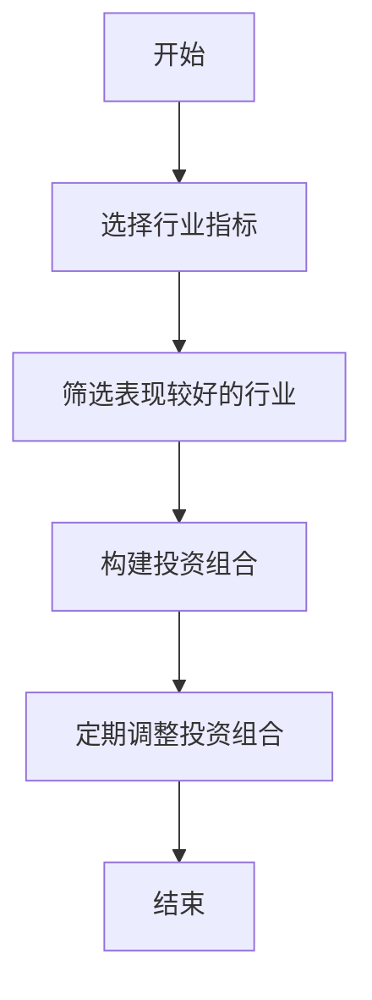
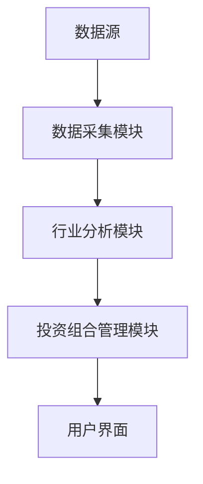

                 


# 彼得林奇的"行业轮动"投资策略

## 关键词：彼得林奇，行业轮动，投资策略，量化分析，经济周期

## 摘要：  
彼得·林奇是全球著名的投资专家，他提出的行业轮动投资策略是一种基于经济周期变化的投资方法。本文将详细介绍行业轮动的核心概念、数学模型、算法原理以及系统架构，通过实际案例分析和代码实现，帮助读者全面理解这一策略。文章还探讨了行业轮动与经济周期的关系，以及其他投资策略的对比，最后提供了一些建议和注意事项。

---

## 第一部分: 行业轮动的定义与背景

### 第1章: 行业轮动的定义与背景

#### 1.1 行业轮动的定义
行业轮动是一种投资策略，旨在通过识别不同行业在经济周期中的表现，选择当前表现较好或未来有望表现较好的行业进行投资。这种策略的核心在于利用行业的周期性波动，捕捉市场机会。

- **行业轮动的定义**：行业轮动是指根据经济周期的变化，定期调整投资组合中各行业权重的策略。其核心在于通过分析行业表现，选择具有较高收益潜力的行业进行投资。
- **行业轮动的背景**：经济周期的波动导致不同行业表现不一，行业轮动策略通过动态调整投资组合，降低风险并提高收益。

#### 1.2 彼得·林奇的投资理念
彼得·林奇以其独特的选股方法和长期投资理念闻名。他的行业轮动策略强调对行业趋势的分析和对经济周期的把握，主张根据市场变化调整投资组合。

- **林奇的投资风格**：注重基本面分析，寻找具有成长潜力的公司。
- **选股方法**：关注公司的财务状况、管理层能力和行业地位。
- **对行业轮动的贡献**：林奇通过长期观察发现，不同行业在不同经济周期中的表现差异显著，因此提出了行业轮动策略。

#### 1.3 行业轮动的理论基础
行业轮动的理论基础主要来源于经济周期理论和行业分析。

- **经济周期理论**：经济周期分为衰退、复苏、过热和滞胀四个阶段，不同阶段中不同行业的表现不同。
- **行业分析方法**：通过对行业财务数据、市场趋势和宏观经济指标的分析，识别出具有投资价值的行业。

---

## 第2章: 行业轮动的核心概念与联系

### 2.1 行业轮动的核心原理
行业轮动的核心在于分析行业表现，选择具有较高收益潜力的行业进行投资。

- **行业表现的量化指标**：包括行业市盈率、行业平均收益率、行业波动率等。
- **行业轮动的内在逻辑**：经济周期的变化导致不同行业的需求和盈利能力发生变化，行业轮动策略通过识别这些变化，动态调整投资组合。

### 2.2 行业轮动与经济周期的关系
经济周期的变化直接影响行业轮动策略的实施。

- **经济周期对行业轮动的影响**：在经济衰退期，防御性行业（如公用事业、医疗保健）表现较好；在经济复苏期，周期性行业（如制造业、房地产）表现较好。
- **不同经济周期下的行业表现**：衰退期：防御性行业；复苏期：周期性行业；过热期：资源类行业；滞胀期：抗通胀行业。

### 2.3 行业轮动与其他投资策略的对比
行业轮动与其他投资策略相比，具有独特的优势。

- **与个股选择的对比**：行业轮动注重行业层面的选择，而个股选择注重公司层面。
- **与资产配置的对比**：行业轮动属于资产配置的一种，但更注重行业间的动态调整。
- **与市场时机选择的对比**：行业轮动结合了市场时机选择，但更注重行业层面的时机把握。

---

## 第3章: 行业轮动的算法原理与数学模型

### 3.1 行业轮动的算法原理
行业轮动的算法主要涉及行业筛选和投资组合构建。

- **行业筛选**：根据行业量化指标，筛选出表现较好的行业。
- **投资组合构建**：根据筛选出的行业权重，构建投资组合。

#### 3.1.1 行业筛选
行业筛选的关键在于选择具有较高收益潜力的行业。常用的指标包括行业市盈率、行业平均收益率、行业波动率等。

- **行业市盈率**：市盈率较低的行业通常具有较高的投资价值。
- **行业平均收益率**：收益率较高的行业通常具有较高的投资潜力。
- **行业波动率**：波动率较低的行业风险较小。

#### 3.1.2 投资组合构建
投资组合构建的关键在于根据行业筛选结果，动态调整投资组合的权重。

- **权重分配**：根据行业表现，动态调整各行业的权重。
- **定期调整**：根据市场变化，定期调整投资组合。

#### 3.1.3 算法流程图


### 3.2 行业轮动的数学模型
行业轮动的数学模型主要涉及行业表现的量化和投资组合的优化。

#### 3.2.1 行业表现的量化
行业表现的量化可以通过以下指标进行：

- **行业市盈率（P/E）**：市盈率 = 股价 / 每股收益。
- **行业平均收益率（ROE）**：平均收益率 = 净利润 / 平均股东权益。
- **行业波动率（Volatility）**：波动率 = 标准差（收益率）。

#### 3.2.2 投资组合的优化
投资组合的优化可以通过以下步骤进行：

1. **计算各行业的风险和收益**：计算各行业的期望收益率和波动率。
2. **计算投资组合的期望收益率和波动率**：根据各行业的权重，计算投资组合的期望收益率和波动率。
3. **优化投资组合**：根据投资者的风险偏好，优化投资组合的权重，使其在期望收益和风险之间达到最佳平衡。

#### 3.2.3 数学公式
- **期望收益率**：
  $$ E(R_p) = \sum_{i=1}^n w_i E(R_i) $$
  
  其中，\( w_i \) 是第 \( i \) 个行业的权重，\( E(R_i) \) 是第 \( i \) 个行业的期望收益率。

- **波动率**：
  $$ \sigma_p = \sqrt{\sum_{i=1}^n \sum_{j=1}^n w_i w_j Cov(R_i, R_j) } $$

  其中，\( Cov(R_i, R_j) \) 是第 \( i \) 个行业和第 \( j \) 个行业的协方差。

### 3.3 行业轮动的流程图


---

## 第4章: 行业轮动的系统分析与架构设计

### 4.1 行业轮动系统的总体架构
行业轮动系统的总体架构包括数据采集、行业分析、投资组合管理等模块。

#### 4.1.1 系统功能模块划分
- **数据采集模块**：负责收集各行业的财务数据和市场数据。
- **行业分析模块**：负责分析各行业的表现，筛选出表现较好的行业。
- **投资组合管理模块**：负责根据筛选出的行业，构建投资组合，并定期调整。

#### 4.1.2 系统架构设计
- **数据层**：存储各行业的财务数据和市场数据。
- **业务逻辑层**：实现行业分析和投资组合管理的逻辑。
- **用户界面层**：提供用户友好的操作界面。

#### 4.1.3 系统接口设计
- **数据接口**：与数据源（如股票数据库）进行数据交互。
- **用户接口**：提供用户输入和输出的界面。

### 4.2 行业轮动系统的功能设计
- **数据采集功能**：从数据库中获取各行业的财务数据和市场数据。
- **行业分析功能**：根据量化指标，筛选出表现较好的行业。
- **投资组合管理功能**：根据筛选出的行业，构建投资组合，并定期调整。

### 4.3 行业轮动系统的架构图


---

## 第5章: 行业轮动的项目实战

### 5.1 环境安装
- **安装Python**：安装Python 3.x及以上版本。
- **安装相关库**：安装pandas、numpy、matplotlib等库。

### 5.2 核心实现代码
```python
import pandas as pd
import numpy as np
import matplotlib.pyplot as plt

# 数据加载
df = pd.read_csv('industry_data.csv')

# 行业筛选
# 计算行业市盈率
df['P/E'] = df['股价'] / df['每股收益']
# 计算行业平均收益率
df['ROE'] = df['净利润'] / df['平均股东权益']
# 计算行业波动率
df['波动率'] = df['收益率'].std()

# 行业筛选条件
selected Industries = df[df['P/E'] < 15]  # 市盈率小于15的行业

# 投资组合构建
weights = selected Industries['权重'].values
```

### 5.3 代码应用解读
- **数据加载**：从CSV文件中加载行业数据。
- **行业筛选**：根据市盈率和平均收益率等指标，筛选出表现较好的行业。
- **投资组合构建**：根据筛选出的行业，构建投资组合。

### 5.4 案例分析
- **环境介绍**：假设当前经济处于复苏期，周期性行业表现较好。
- **数据处理**：加载相关行业数据，计算各行业的市盈率、平均收益率和波动率。
- **策略实施**：根据筛选条件，选择表现较好的行业，构建投资组合。

### 5.5 项目小结
- **小结**：通过实际案例，展示了行业轮动策略的实施过程。
- **注意事项**：在实际操作中，需要根据市场变化及时调整投资组合。
- **拓展阅读**：进一步阅读彼得·林奇的相关书籍，深入理解行业轮动策略。

---

## 第6章: 行业轮动的最佳实践

### 6.1 小结
- **行业轮动的核心思想**：通过分析行业表现，选择具有较高收益潜力的行业进行投资。
- **行业轮动的实施步骤**：数据采集、行业筛选、投资组合构建和定期调整。

### 6.2 注意事项
- **市场风险**：行业轮动策略无法完全规避市场风险。
- **数据质量**：数据的准确性和及时性对行业轮动策略的实施至关重要。
- **定期调整**：需要根据市场变化，定期调整投资组合。

### 6.3 拓展阅读
- **相关书籍**：《彼得·林奇的成功投资》
- **相关论文**：《行业轮动策略在投资中的应用》

---

## 作者：AI天才研究院 & 禅与计算机程序设计艺术

---

通过本文的详细讲解，读者可以全面理解彼得·林奇的行业轮动投资策略，并将其应用于实际投资中。

