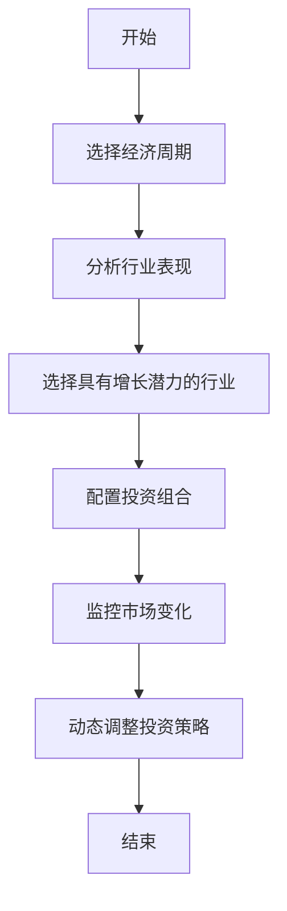
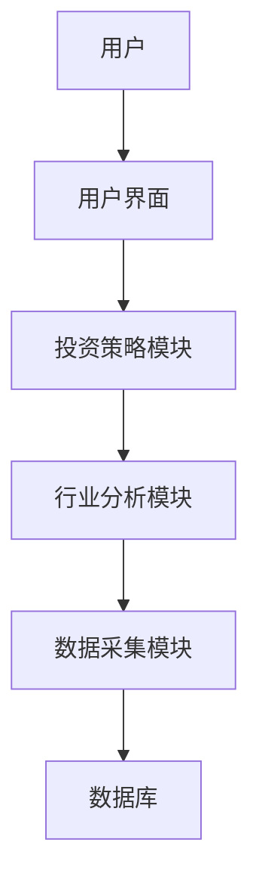
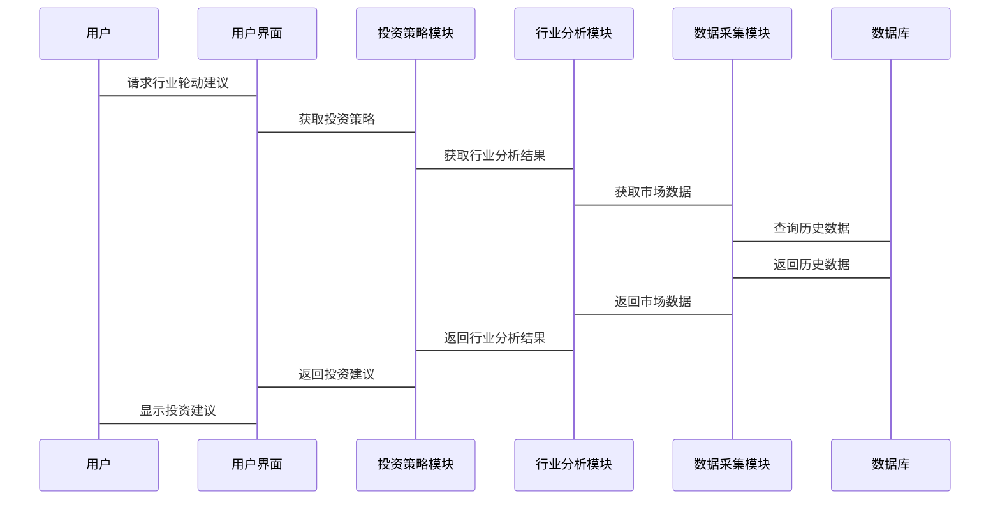

                 


# 彼得林奇的"行业轮动"策略实施步骤

## 关键词：
- 行业轮动
- 彼得林奇
- 投资策略
- 经济周期
- 技术分析

## 摘要：
彼得·林奇的行业轮动策略是一种基于经济周期变化的投资方法，通过分析不同行业的表现和趋势，选择处于上升周期的行业进行投资。本文详细介绍了行业轮动的背景、核心概念、实施步骤，以及如何通过技术分析和数学模型来优化投资决策，为投资者提供系统的实施指南。

---

## 正文：

### 第一部分：行业轮动策略背景与概述

#### 第1章：行业轮动策略的基本概念

##### 1.1 行业轮动的基本概念
- **1.1.1 行业轮动的定义**
  行业轮动是指根据经济周期的变化，投资于表现较好或具有增长潜力的行业，以实现超额收益的投资策略。彼得·林奇在其投资生涯中，成功运用了这一策略，通过不断调整投资组合中的行业配置，捕捉市场的周期性机会。

- **1.1.2 行业轮动的原理**
  行业轮动的原理在于不同行业在经济周期中的表现存在差异。例如，在经济增长阶段，周期性行业（如制造业、建筑业）表现较好；而在经济衰退阶段，防御性行业（如公用事业、医疗保健）可能更具稳定性。通过识别这些行业轮动的规律，投资者可以做出更明智的投资决策。

- **1.1.3 行业轮动与经济周期的关系**
  经济周期对行业轮动有直接影响。在不同的经济阶段，行业的表现会有所不同。例如，在复苏阶段，金融和房地产行业可能表现突出；而在繁荣阶段，科技和消费行业可能更具增长潜力。

- **1.1.4 行业轮动与其他投资策略的对比**
  行业轮动策略与基本面分析、技术分析等策略不同。基本面分析侧重于企业的财务状况，技术分析侧重于价格和成交量的变化，而行业轮动策略则关注行业整体的周期性变化，结合了宏观经济和市场趋势的分析。

#### 第1.2 彼得·林奇的投资理念
- **1.2.1 彼得·林奇的投资者背景**
  彼得·林奇是美国著名的投资经理，曾管理富达麦哲伦基金，取得了长期优异的业绩。他以深入的行业研究和独特的投资理念闻名。

- **1.2.2 林奇的行业轮动策略**
  林奇认为，行业轮动是投资成功的关键之一。他通过分析行业前景、公司基本面以及市场趋势，选择那些处于上升周期的行业进行投资。

- **1.2.3 林奇策略的核心思想**
  林奇强调，投资者应关注行业的增长潜力和公司的竞争优势。他通过分析行业数据、公司财报以及市场趋势，寻找那些具有长期增长潜力的行业，并在行业处于低谷时买入，行业处于高峰时卖出。

#### 第1.3 行业轮动与经济周期
- **1.3.1 经济周期对行业轮动的影响**
  经济周期对行业轮动有直接影响。在不同的经济阶段，行业表现会有显著差异。例如，在衰退阶段，防御性行业可能表现较好，而在复苏阶段，周期性行业可能更具投资价值。

- **1.3.2 不同经济周期下的行业表现**
  - **衰退阶段**：公用事业、医疗保健等防御性行业表现较好。
  - **复苏阶段**：制造业、建筑业等行业可能触底反弹。
  - **繁荣阶段**：科技、消费等行业可能有较高的增长潜力。
  - **衰退阶段**：金融、房地产等行业可能面临调整压力。

- **1.3.3 如何利用经济周期进行投资**
  投资者应根据当前经济周期的阶段，选择具有增长潜力的行业。例如，在经济衰退时，应关注防御性行业；在经济复苏时，应关注周期性行业。

#### 第1.4 行业轮动与其他投资策略的对比
- **1.4.1 基本面分析与行业轮动的异同**
  基本面分析侧重于单个公司的财务状况，而行业轮动则关注整个行业的周期性变化。两者可以结合使用，以提高投资决策的准确性。

- **1.4.2 技术分析与行业轮动的结合**
  技术分析侧重于价格和成交量的变化，而行业轮动则关注行业趋势。两者结合可以提供更全面的市场洞察。

- **1.4.3 行业轮动与趋势投资的区别**
  趋势投资侧重于跟随市场趋势，而行业轮动则更注重行业周期的变化。两者在本质上相似，但行业轮动更具体，侧重于行业层面的分析。

### 第二部分：行业轮动的核心概念与联系

#### 第2章：行业轮动的核心概念

##### 2.1 行业轮动的原理
- **2.1.1 行业轮动的驱动因素**
  行业轮动的驱动因素包括宏观经济环境、政策变化、技术进步、消费者需求变化等。例如，政策放松可能推动房地产行业轮动，而技术进步可能推动科技行业轮动。

- **2.1.2 行业轮动的周期性特征**
  不同行业的轮动周期不同。例如，科技行业的轮动周期较短，而公用事业行业的轮动周期较长。投资者需要根据行业特点，制定相应的投资策略。

- **2.1.3 行业轮动的市场环境分析**
  市场环境对行业轮动有重要影响。例如，在全球经济复苏的环境下，周期性行业可能表现较好；而在局部地区冲突的环境下，防御性行业可能更具稳定性。

##### 2.2 行业轮动的模型与框架
- **2.2.1 行业轮动的基本模型**
  行业轮动的基本模型包括行业选择、行业配置和行业调整三个步骤。投资者需要根据市场变化，动态调整行业配置。

- **2.2.2 林奇行业轮动框架的构建**
  林奇的行业轮动框架包括以下几个步骤：
  1. **行业分析**：研究行业的基本面，包括行业增长率、利润率、市场地位等。
  2. **行业比较**：比较不同行业的表现，选择具有增长潜力的行业。
  3. **行业配置**：根据市场趋势和经济周期，调整行业配置比例。
  4. **动态调整**：定期评估行业表现，及时调整投资策略。

- **2.2.3 框架的优缺点分析**
  优点：
  - 能够捕捉行业轮动带来的超额收益。
  - 灵活性高，可以根据市场变化进行调整。
  缺点：
  - 需要大量研究和分析，对投资者的能力要求较高。
  - 可能面临短期波动风险，需要长期持有。

##### 2.3 行业轮动的属性特征对比
- **2.3.1 行业轮动的属性特征**
  行业轮动的属性特征包括行业增长率、行业利润率、行业波动性、行业市场地位等。投资者需要根据这些特征，选择具有增长潜力和较低风险的行业。

- **2.3.2 不同行业轮动属性的对比**
  以下是不同行业轮动属性的对比：

  | 行业属性 | 增长率 | 利润率 | 波动性 | 市场地位 |
  |----------|--------|--------|--------|----------|
  | 科技     | 高     | 中     | 高     | 领先      |
  | 公用事业 | 低     | 高     | 低     | 稳定      |
  | 制造业   | 中     | 中     | 中     | 一般      |
  | 金融     | 中     | 高     | 高     | 领导      |

- **2.3.3 行业轮动属性对投资决策的影响**
  行业增长率高，可能意味着较高的投资回报，但也可能伴随着较高的风险。行业利润率高，可能意味着行业具有较强的盈利能力，但可能受到政策调控的影响。行业波动性高，可能意味着行业具有较高的短期波动，但长期增长潜力较大。

##### 2.4 行业轮动的ER实体关系图
以下是行业轮动的ER实体关系图：

```mermaid
erd
    顾客(顾客ID, 顾客姓名, 顾客地址, 顾客电话)
    工作人员(工作人员ID, 工作人员姓名, 工作人员职位)
    订单(订单ID, 订单日期, 订单金额)
    产品(产品ID, 产品名称, 产品价格, 产品库存)
    供应商(供应商ID, 供应商名称, 供应商地址)
    项目(项目ID, 项目名称, 项目预算)
    投资(投资ID, 投资金额, 投资日期)
    风险(风险ID, 风险类型, 风险程度)
    机会(机会ID, 机会名称, 机会描述)
    行业(行业ID, 行业名称, 行业指数, 行业增长率)
    经济周期(经济周期ID, 经济阶段, 经济指标)
    政策(政策ID, 政策类型, 政策影响)
    市场趋势(市场趋势ID, 市场指数, 市场变化)
    投资策略(投资策略ID, 策略名称, 策略描述)
    目标(目标ID, 目标名称, 目标描述)
    行动(行动ID, 行动名称, 行动描述)
```

### 第三部分：行业轮动的算法原理讲解

#### 第3章：行业轮动的算法原理

##### 3.1 行业轮动的算法流程
以下是行业轮动的算法流程图：



##### 3.2 行业轮动的Python实现
以下是行业轮动的Python代码示例：

```python
import pandas as pd
import numpy as np

# 数据获取与预处理
def get_industry_data():
    # 获取行业数据，例如通过API或CSV文件
    pass

def preprocess_data(data):
    # 数据清洗和预处理
    pass

# 行业轮动筛选算法
def industry_rotational_screening(data):
    # 筛选具有增长潜力的行业
    growth_industries = data[data['行业增长率'] > data['行业增长率'].mean()]
    return growth_industries

# 投资组合配置
def configure_portfolio(growth_industries):
    # 根据行业表现和经济周期，配置投资组合
    portfolio = {}
    for industry in growth_industries:
        portfolio[industry] = industry['行业指数'] * industry['行业增长率']
    return portfolio

# 动态调整策略
def dynamic_adjustment(portfolio, market_data):
    # 监控市场变化，动态调整投资策略
    adjusted_portfolio = {}
    for industry in portfolio:
        if market_data[industry] > portfolio[industry] * 1.1:
            adjusted_portfolio[industry] = adjusted_portfolio[industry] * 1.05
        elif market_data[industry] < portfolio[industry] * 0.9:
            adjusted_portfolio[industry] = adjusted_portfolio[industry] * 0.95
    return adjusted_portfolio

# 主函数
def main():
    data = get_industry_data()
    processed_data = preprocess_data(data)
    growth_industries = industry_rotational_screening(processed_data)
    portfolio = configure_portfolio(growth_industries)
    adjusted_portfolio = dynamic_adjustment(portfolio, get_market_data())
    print("最终投资组合配置：", adjusted_portfolio)

if __name__ == "__main__":
    main()
```

##### 3.3 行业轮动的数学模型
以下是行业轮动的数学模型：

- **行业指数计算**：
  $$ \text{行业指数} = \frac{\sum_{i=1}^{n} (\text{行业表现}_i \times \text{权重}_i)}{n} $$

- **行业增长率计算**：
  $$ \text{行业增长率} = \frac{\text{行业指数}_t - \text{行业指数}_{t-1}}{\text{行业指数}_{t-1}} \times 100\% $$

- **行业风险评估**：
  $$ \text{行业风险} = \sum_{i=1}^{m} (\text{风险因素}_i \times \text{权重}_i) $$

### 第四部分：行业轮动的系统分析与架构设计方案

#### 第4章：系统分析与架构设计方案

##### 4.1 问题场景介绍
- 投资者需要根据行业轮动的策略，动态调整投资组合。
- 系统需要实时监控市场变化，提供行业轮动的建议。

##### 4.2 系统功能设计
- **数据采集模块**：获取行业数据、市场数据等。
- **行业分析模块**：分析行业表现、计算行业指数、评估行业风险。
- **投资策略模块**：制定投资策略、配置投资组合、动态调整投资策略。
- **用户界面模块**：提供用户友好的界面，展示分析结果和投资建议。

##### 4.3 系统架构设计
以下是系统架构图：



##### 4.4 系统交互设计
以下是系统交互图：



### 第五部分：行业轮动的项目实战

#### 第5章：行业轮动的项目实战

##### 5.1 项目环境与工具安装
- **Python**：安装Python 3.8或更高版本。
- **数据分析库**：安装Pandas、NumPy、Matplotlib等库。
- **可视化工具**：安装Plotly或Seaborn用于数据可视化。

##### 5.2 核心代码实现
以下是核心代码实现：

```python
import pandas as pd
import numpy as np
import matplotlib.pyplot as plt

# 数据获取与预处理
def get_industry_data():
    # 示例数据
    data = {
        '行业': ['科技', '公用事业', '制造业', '金融'],
        '行业指数': [150, 120, 130, 140],
        '行业增长率': [20, 10, 15, 18]
    }
    return pd.DataFrame(data)

# 行业轮动筛选算法
def industry_rotational_screening(data):
    # 筛选具有增长潜力的行业
    growth_industries = data[data['行业增长率'] > data['行业增长率'].mean()]
    return growth_industries

# 投资组合配置
def configure_portfolio(growth_industries):
    # 根据行业表现和经济周期，配置投资组合
    portfolio = {}
    for industry in growth_industries['行业']:
        portfolio[industry] = growth_industries[growth_industries['行业'] == industry]['行业指数'].values[0]
    return portfolio

# 动态调整策略
def dynamic_adjustment(portfolio, market_data):
    # 监控市场变化，动态调整投资策略
    adjusted_portfolio = {}
    for industry in portfolio:
        if market_data.get(industry, 0) > portfolio[industry] * 1.1:
            adjusted_portfolio[industry] = portfolio[industry] * 1.05
        elif market_data.get(industry, 0) < portfolio[industry] * 0.9:
            adjusted_portfolio[industry] = portfolio[industry] * 0.95
        else:
            adjusted_portfolio[industry] = portfolio[industry]
    return adjusted_portfolio

# 主函数
def main():
    data = get_industry_data()
    growth_industries = industry_rotational_screening(data)
    print("具有增长潜力的行业：", growth_industries['行业'].tolist())
    
    portfolio = configure_portfolio(growth_industries)
    print("初始投资组合配置：", portfolio)
    
    # 示例市场数据
    market_data = {
        '科技': 160,
        '公用事业': 110,
        '制造业': 135,
        '金融': 145
    }
    
    adjusted_portfolio = dynamic_adjustment(portfolio, market_data)
    print("动态调整后的投资组合配置：", adjusted_portfolio)

if __name__ == "__main__":
    main()
```

##### 5.3 代码应用解读与分析
- **数据获取与预处理**：获取行业数据，包括行业名称、行业指数和行业增长率。
- **行业轮动筛选**：筛选出具有高于平均增长率的行业。
- **投资组合配置**：根据行业指数，配置初始投资组合。
- **动态调整**：根据市场变化，动态调整投资组合。

##### 5.4 实际案例分析
以2023年经济环境下，假设科技行业增长率为20%，公用事业增长率为10%，制造业增长率为15%，金融行业增长率为18%。根据上述算法，筛选出科技和金融行业作为具有增长潜力的行业，配置初始投资组合。根据市场变化，动态调整投资比例。

##### 5.5 项目小结
通过项目实战，读者可以掌握行业轮动策略的实施步骤，包括数据获取、行业筛选、投资组合配置和动态调整等。

### 第六部分：行业轮动的最佳实践

#### 第6章：行业轮动的最佳实践

##### 6.1 小结
- 行业轮动是一种有效的投资策略，通过分析行业周期和市场趋势，选择具有增长潜力的行业进行投资。

##### 6.2 注意事项
- **风险管理**：投资者需要注重风险控制，避免过度集中投资于单一行业。
- **市场监控**：需要实时监控市场变化，及时调整投资策略。
- **长期投资**：行业轮动需要长期持有，避免短期波动影响投资决策。

##### 6.3 拓展阅读
- 推荐阅读彼得·林奇的《彼得·林奇的选股方法》和《投资最重要的事情》，深入了解行业轮动策略的应用。

---

## 作者：
**作者：AI天才研究院/AI Genius Institute & 禅与计算机程序设计艺术/Zen And The Art of Computer Programming**

