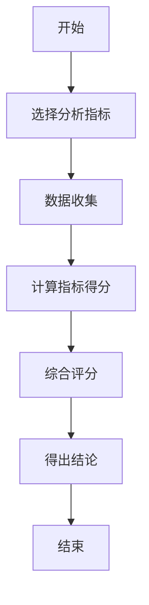
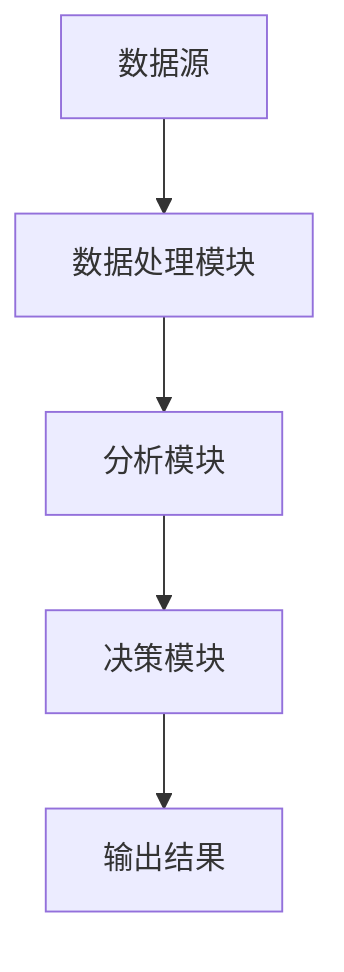

                 


# 彼得林奇的行业选择标准

---

## 关键词
- 彼得林奇
- 行业选择标准
- 投资哲学
- 财务分析
- 竞争优势
- 管理层分析
- 数学模型

---

## 摘要
本文深入探讨了彼得·林奇的行业选择标准，从投资哲学到具体的分析方法，详细讲解了如何通过基本面分析、竞争优势评估、管理层分析等多维度选择优质行业。文章结合数学模型和实际案例，帮助读者掌握彼得林奇的投资策略，并在复杂多变的市场环境中做出明智的投资决策。

---

## 正文

### 第1章: 彼得林奇的背景与投资哲学

#### 1.1 彼得林奇的生平简介
- 彼得·林奇（Peter Lynch）是全球最著名的基金经理之一，以其在富达麦哲伦基金的卓越表现而闻名。
- 他的投资哲学强调长期价值，注重基本面分析和行业选择。

#### 1.2 投资的基本概念
- 投资的本质是通过分析企业的财务状况、行业地位和市场趋势，寻找具有长期增长潜力的公司。
- 投资的核心目标是在风险可控的前提下实现资产增值。

#### 1.3 行业选择的重要性
- 行业选择是投资决策中的关键因素，决定着投资的成败。
- 彼得林奇认为，选择一个具有竞争优势的行业是实现长期收益的基础。

---

### 第2章: 行业分析的核心概念

#### 2.1 行业的定义与分类
- 行业的定义：一组具有相似业务模式和市场特征的企业集合。
- 行业分类：按规模、类型、地理位置等进行分类。

#### 2.2 行业生命周期理论
- 初创期：行业快速增长，企业竞争较少。
- 成长期：行业趋于成熟，竞争加剧。
- 稳定期：行业增长放缓，竞争格局稳定。
- 衰退期：行业需求下降，企业盈利能力减弱。

#### 2.3 行业分析的维度
- 市场需求：行业的增长潜力和市场规模。
- 竞争结构：行业的市场集中度和竞争格局。
- 财务表现：行业的整体盈利能力和发展趋势。

---

### 第3章: 彼得林奇的行业选择标准

#### 3.1 行业的稳定性与成长性
- 稳定性：选择具有稳定收益和较低波动性的行业。
- 成长性：选择具有长期增长潜力的行业。

#### 3.2 行业的竞争优势
- 技术优势：行业内的技术领先地位。
- 成本优势：行业内企业的成本控制能力。
- 市场占有率：企业在行业中的市场份额。

#### 3.3 行业的财务健康指标
- 净利润率：企业的盈利能力。
- 资产负债率：企业的财务风险。
- 现金流：企业的资金流动性。

---

### 第4章: 行业分析的数学模型

#### 4.1 行业选择的指标体系
- 指标权重分配：根据行业特点赋予不同指标不同的权重。
- 指标评分方法：通过量化评分对行业进行综合评估。
- 指标动态调整：根据市场变化调整分析指标。

#### 4.2 行业选择的算法原理
- 算法流程图：


#### 4.3 数学模型与公式
- 净利润率计算公式：
$$ \text{净利润率} = \frac{\text{净利润}}{\text{营业收入}} \times 100\% $$
- 资产回报率计算公式：
$$ \text{资产回报率} = \frac{\text{净利润}}{\text{总资产}} \times 100\% $$

---

### 第5章: 行业分析的系统架构设计

#### 5.1 系统功能设计
- 数据收集模块：收集行业数据，包括财务数据、市场数据等。
- 分析模块：对数据进行处理和分析，生成指标评分。
- 决策模块：根据分析结果，得出行业选择结论。

#### 5.2 系统架构图


#### 5.3 系统接口设计
- 数据接口：与数据源进行数据交互。
- 分析接口：与分析模块进行数据交互。
- 输出接口：将分析结果输出给用户。

---

### 第6章: 项目实战

#### 6.1 环境安装
- 安装Python和相关库（pandas、numpy、scipy）。
- 数据收集工具：使用网络爬虫或API获取行业数据。

#### 6.2 核心代码实现
```python
import pandas as pd
import numpy as np

# 示例数据
data = {
    '行业': ['科技', '金融', '医疗', '能源'],
    '净利润率': [15, 12, 8, 6],
    '资产回报率': [10, 8, 6, 4]
}

df = pd.DataFrame(data)

# 计算综合评分
df['综合评分'] = df['净利润率'] * 0.4 + df['资产回报率'] * 0.6

print(df)
```

#### 6.3 案例分析
- 以科技行业为例，分析其净利润率和资产回报率，计算综合评分。
- 根据评分结果，得出行业选择结论。

---

### 第7章: 最佳实践与小结

#### 7.1 最佳实践
- 定期更新行业数据，保持分析的时效性。
- 结合市场变化，动态调整分析指标。
- 注重行业间的横向对比，找到具有竞争优势的行业。

#### 7.2 小结
- 彼得林奇的行业选择标准为投资者提供了一套系统化的分析框架。
- 通过结合数学模型和实际案例，投资者可以更科学地选择优质行业。

---

## 注意事项
- 本文内容仅供参考，不构成具体的投资建议。
- 投资者在实际操作中应结合市场环境和个人风险承受能力进行决策。

---

## 拓展阅读
- 《彼得·林奇的成功投资》
- 《投资学基础》
- 《行业分析与投资策略》

---

## 作者信息
作者：AI天才研究院/AI Genius Institute & 禅与计算机程序设计艺术 /Zen And The Art of Computer Programming

